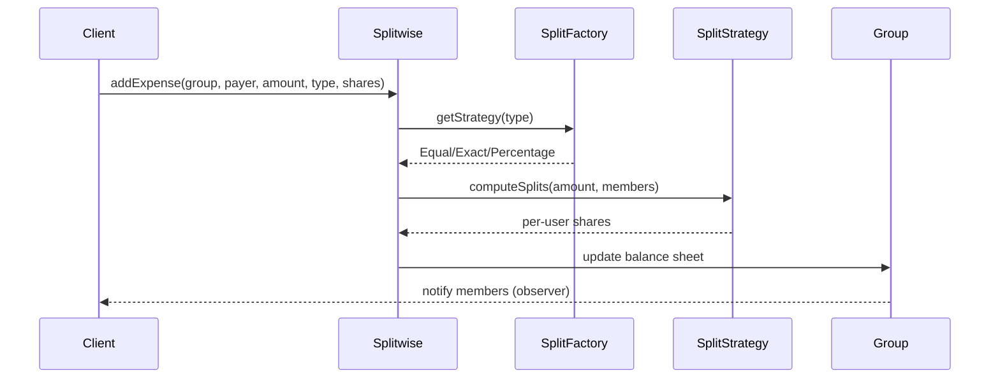

# Splitwise LLD (Expense Sharing)

Interview-grade **Splitwise-style expense sharing** system in C++17 — users, groups, multiple split strategies, balance sheets, group settlements with **debt simplification**, and observer notifications.

> **Pattern map:** [Project → Pattern mapping](../docs/PROJECT_DESIGN_PATTERNS.md)

---

## Folder Structure

```
L31 Splitwise_LLD/
├── core/           # Splitwise — Facade + Singleton orchestrator
├── models/         # User, Group, Expense, Split, BalanceSheet
├── strategies/     # SplitStrategy — Equal, Exact, Percentage
├── factories/      # SplitFactory — selects split strategy
├── observers/      # Group notification observers
├── enums/          # SplitType and friends
├── utils/          # DebtSimplifier — minimize settlement transactions
├── compile.sh
├── main.cpp
├── problem_statement.md
└── requirements.md
```

---

## Design Patterns

| Pattern | Class | Why |
|---------|-------|-----|
| **Facade + Singleton** | `Splitwise` | Single top-level API and shared registry |
| **Strategy** | `SplitStrategy` (Equal / Exact / Percentage) | Split math is swappable without touching `Expense` |
| **Factory** | `SplitFactory` | Picks the right split strategy from a `SplitType` |
| **Observer** | group observers | Push notifications to members on new expense / settlement |

---

## Key Flow — Add Group Expense



---

## Debt Simplification

`DebtSimplifier` nets out who-owes-whom into the **minimum number of transactions** (greedy max-creditor / max-debtor matching) — the headline interview feature of Splitwise.

---

## Build & Run

```bash
cd "L31 Splitwise_LLD"
./compile.sh
./splitwise_app
```

---

## Demo Scenarios (`main.cpp`)

| Demo | What it shows |
|------|----------------|
| **Equal split** | Group dinner split evenly |
| **Exact / Percentage** | Custom shares and percentage shares |
| **Balance matrix** | Per-user summary + group balance view |
| **Settlement** | Settle up within a group |
| **Simplify debts** | Minimized transaction set |

---

## Interview Talking Points

1. **Why Strategy for splits?** — Equal/Exact/Percentage differ only in math; the expense flow stays identical.
2. **Why simplify debts?** — Reduces N×N pairwise debts to the fewest transfers; classic greedy heap question.
3. **Observer vs polling** — Members are pushed updates instead of querying balances.
4. **Extensions** — Recurring expenses, multi-currency, simplify across groups, settlement via payment gateway ([L23](../L23%20Payment_gateway_system_LLD/)).

---

## Related Docs

- [Problem Statement](./problem_statement.md) · [Requirements](./requirements.md)
- [Pattern map](../docs/PROJECT_DESIGN_PATTERNS.md) · [GPay LLD](../GPay_LLD/)
