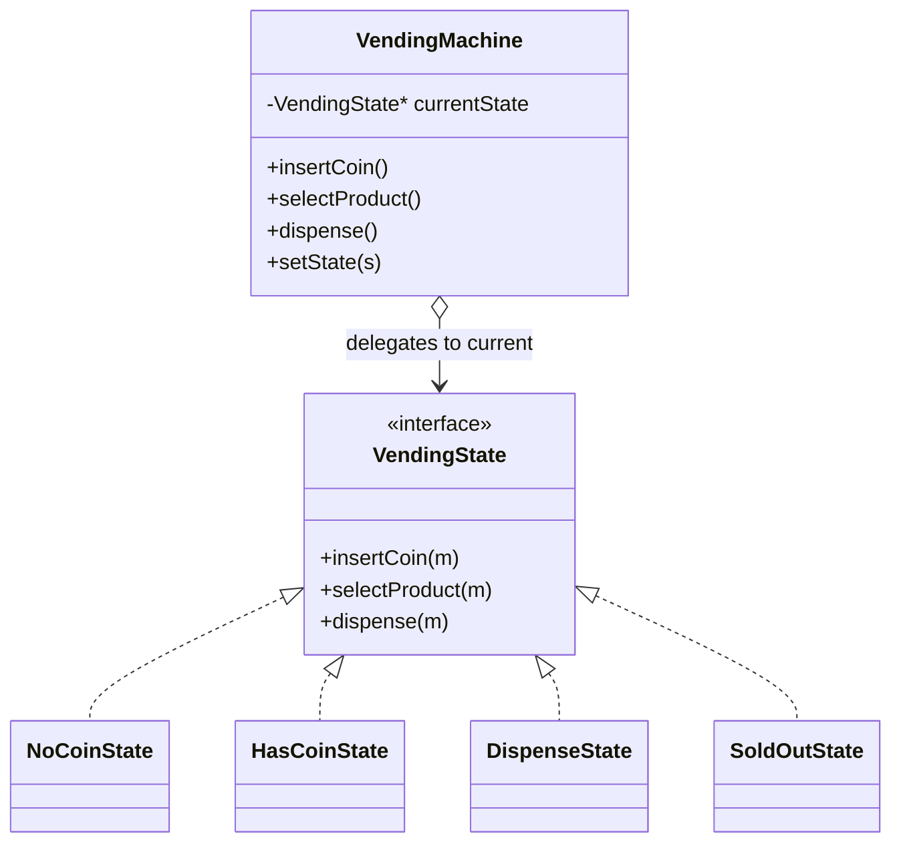

# State Design Pattern — Detailed Guide

> **Behavioral Design Pattern** that lets an object **change its behavior when its internal state changes** — it appears to change class. Instead of a giant `if-else` / `switch` on a state variable, each state is its own object that handles requests and decides the next state.

**Domain example (in this repo):** A **vending machine** moving through `NoCoinState` → `HasCoinState` → `DispenseState` → `SoldOutState`. The `VendingMachine` (context) delegates every action to its current state object.

**Core problem it solves:** State-dependent behavior scattered across big conditional blocks that grow unmanageable and are easy to get into invalid transitions.

---

## Table of Contents

1. [Problem — The Giant State Switch](#1-problem--the-giant-state-switch)
2. [What is the State Pattern?](#2-what-is-the-state-pattern)
3. [State Diagram (This Demo)](#3-state-diagram-this-demo)
4. [Real-World Analogy](#4-real-world-analogy)
5. [Key Participants (UML Roles)](#5-key-participants-uml-roles)
6. [When to Use / When to Avoid](#6-when-to-use--when-to-avoid)
7. [Pros and Cons](#7-pros-and-cons)
8. [SOLID Principles Connection](#8-solid-principles-connection)
9. [Folder Structure](#9-folder-structure)
10. [Code Walkthrough](#10-code-walkthrough)
11. [Execution Flow & Expected Output](#11-execution-flow--expected-output)
12. [Architecture Diagrams](#12-architecture-diagrams)
13. [Build & Run](#13-build--run)
14. [State vs Strategy & Interview Points](#14-state-vs-strategy--interview-points)
15. [Summary](#15-summary)

---

## 1. Problem — The Giant State Switch

Without the pattern, every action checks the current state with conditionals:

```cpp
// ❌ Behavior depends on a state enum checked everywhere
void insertCoin() {
    if (state == NO_COIN)      state = HAS_COIN;
    else if (state == HAS_COIN) cout << "Coin already inserted\n";
    else if (state == SOLD_OUT) cout << "Machine empty\n";
    // ...repeated in selectProduct(), dispense(), refund()...
}
```

| Problem | Detail |
| ------- | ------ |
| **Scattered conditionals** | The same `if-else` ladder is duplicated in every method |
| **Invalid transitions** | Easy to allow "dispense" while no coin is inserted |
| **Hard to extend** | A new state means editing every method |
| **Low cohesion** | Logic for all states is tangled together |

---

## 2. What is the State Pattern?

Encapsulate each state in a class implementing a common interface. The **context** holds a pointer to the current state and **delegates** to it; the state object performs the action and **transitions** the context to the next state.

```cpp
machine->insertCoin();   // delegates to currentState->insertCoin(machine)
                         // the state itself sets machine's next state
```

| Property | Detail |
| -------- | ------ |
| **State objects** | One class per state, each with the full action set |
| **Delegation** | Context forwards requests to its current state |
| **Self-transition** | Each state decides the valid next state |
| **No central switch** | Conditionals disappear into polymorphism |

---

## 3. State Diagram (This Demo)

```
   insertCoin            selectProduct            dispense
NoCoin ─────────► HasCoin ─────────────► Dispense ─────────► NoCoin
   ▲                                                            │
   └──────────────── (stock > 0) ◄──────────────────────────────┘

   (stock == 0) ──► SoldOut   (rejects coins / selection)
```

---

## 4. Real-World Analogy

| Analogy | Mapping |
| ------- | ------- |
| **Traffic light** | Red → Green → Yellow; each light "knows" what comes next |
| **ATM session** | Idle → CardInserted → PinEntered → Transaction; actions valid only in the right state |
| **Media player** | Playing/Paused/Stopped — the "play" button does different things per state |

---

## 5. Key Participants (UML Roles)

| Role | In this demo |
| ---- | ------------ |
| **Context** | `VendingMachine` — holds current `VendingState*`, exposes actions |
| **State** | `VendingState` — interface: `insertCoin()`, `selectProduct()`, `dispense()`, … |
| **Concrete States** | `NoCoinState`, `HasCoinState`, `DispenseState`, `SoldOutState` |
| **Client** | `main()` — drives the machine through a purchase |

---

## 6. When to Use / When to Avoid

### ✅ Use when

| Scenario | Example |
| -------- | ------- |
| Behavior depends heavily on state | Vending machine, ATM, order lifecycle |
| Many state-dependent conditionals | Replace large `switch` ladders |
| Transitions are well-defined | A finite-state machine maps naturally |

### ❌ Avoid when

| Scenario | Reason |
| -------- | ------ |
| Few states, simple behavior | A boolean/enum is enough |
| States rarely change behavior | The extra classes add noise |
| Transitions are trivial | Pattern overhead outweighs benefit |

---

## 7. Pros and Cons

### Pros

| Benefit | Detail |
| ------- | ------ |
| **Eliminates conditionals** | State-specific logic lives in its own class |
| **Explicit transitions** | Valid next-states are encoded, not guessed |
| **OCP-friendly** | Add a state without touching existing ones |
| **High cohesion** | Each state class is focused |

### Cons

| Drawback | Detail |
| -------- | ------ |
| **More classes** | One per state |
| **Transition spread** | Next-state logic is distributed across states |
| **Overkill** | Too heavy for 2–3 trivial states |

---

## 8. SOLID Principles Connection

| Principle | How State applies |
| --------- | ----------------- |
| **SRP** | Each state class handles only its own behavior |
| **OCP** | Add a `MaintenanceState` without modifying existing states |
| **DIP** | `VendingMachine` depends on the `VendingState` interface |

---

## 9. Folder Structure

```
L32 State_design_pattern/
├── README.md                   ← This guide
└── C++ Code/
    └── StatePattern.cpp         ← Vending machine FSM
```

---

## 10. Code Walkthrough

**State interface + context delegation:**

```cpp
class VendingState {
public:
    virtual void insertCoin(VendingMachine* m) = 0;
    virtual void selectProduct(VendingMachine* m) = 0;
    virtual void dispense(VendingMachine* m) = 0;
    virtual ~VendingState() {}
};

class VendingMachine {
    VendingState* currentState;
public:
    void setState(VendingState* s) { currentState = s; }
    void insertCoin()   { currentState->insertCoin(this); }   // delegate
    void selectProduct(){ currentState->selectProduct(this); }
    void dispense()     { currentState->dispense(this); }
};
```

**A concrete state performs the action and transitions:**

```cpp
class NoCoinState : public VendingState {
public:
    void insertCoin(VendingMachine* m) override {
        cout << "Coin inserted.\n";
        m->setState(new HasCoinState());   // ◄── transition
    }
    void selectProduct(VendingMachine* m) override {
        cout << "Insert a coin first.\n";  // invalid action handled cleanly
    }
    void dispense(VendingMachine* m) override {
        cout << "Insert a coin first.\n";
    }
};
```

**Key:** `selectProduct()` is rejected in `NoCoinState` without any external `if` — the state object owns that rule.

---

## 11. Execution Flow & Expected Output

```cpp
VendingMachine* m = new VendingMachine();  // starts in NoCoinState
m->selectProduct();   // rejected: insert a coin first
m->insertCoin();      // → HasCoinState
m->selectProduct();   // → DispenseState
m->dispense();        // dispenses, → NoCoinState
```

```
Insert a coin first.
Coin inserted.
Product selected.
Dispensing product...
```

---

## 12. Architecture Diagrams



---

## 13. Build & Run

```bash
cd "L32 State_design_pattern/C++ Code"
g++ -std=c++17 -o state_demo StatePattern.cpp && ./state_demo
```

---

## 14. State vs Strategy & Interview Points

| Pattern | Intent | Key difference |
| ------- | ------ | -------------- |
| **State** | Behavior changes with internal state; states trigger transitions | The object **transitions itself** between states |
| **Strategy** | Swap an interchangeable algorithm | The client **chooses** the strategy; no self-transition |

> **Structural twin:** State and Strategy have nearly identical class diagrams. The difference is intent — State models a lifecycle with transitions, Strategy models swappable algorithms.

**Talking points:**

1. **One-liner:** "State lets an object alter its behavior when its internal state changes — it looks like it changed class."
2. **Kills the switch:** "Each state is a class, so the big `switch(state)` disappears."
3. **Transitions:** "States decide the next state, so invalid transitions are impossible by construction."
4. **vs Strategy:** "Same shape, different intent — State transitions itself; Strategy is chosen by the client."
5. **Repo note:** "L26 Blinkit uses an order *state enum* — a lighter-weight alternative when behavior doesn't differ much."

---

## 15. Summary

| Aspect | Detail |
| ------ | ------ |
| **Pattern Type** | Behavioral |
| **Core Idea** | Encapsulate each state as a class; delegate and transition |
| **Repo Example** | Vending machine: NoCoin → HasCoin → Dispense → SoldOut |
| **Main Problem Solved** | Scattered state conditionals and invalid transitions |
| **Key File** | [`StatePattern.cpp`](./C%20%2B%2B%20Code/StatePattern.cpp) |

> **Remember:** State is like a **traffic light** — each colour knows exactly which colour comes next, so you never need an external controller asking "what now?" 🚦
