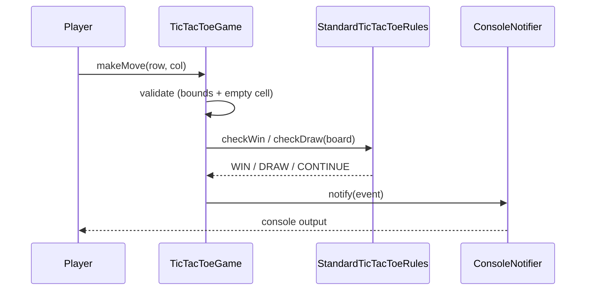

# Tic Tac Toe LLD

Extensible, object-oriented **Tic Tac Toe** in C++17 — configurable `N×N` board, turn-based moves with validation, win/draw detection via a pluggable rules engine, and observer-based game-event notifications.

> **Pattern map:** [Project → Pattern mapping](../docs/PROJECT_DESIGN_PATTERNS.md)

---

## Folder Structure

```
L33 Tic_Tac_Toe_LLD/
├── core/           # TicTacToeGame (engine) + TicTacToeGameFactory
├── models/         # Board, Player, Symbol
├── rules/          # GameRules interface + StandardTicTacToeRules
├── observers/      # GameObserver interface + ConsoleNotifier
├── enums/          # game enums
├── compile.sh
├── main.cpp
├── problem_statement.md
└── requirements.md
```

---

## Design Patterns

| Pattern | Class | Why |
|---------|-------|-----|
| **Strategy** | `GameRules` / `StandardTicTacToeRules` | Win/draw logic is swappable (timed, wildcard variants) |
| **Observer** | `GameObserver` / `ConsoleNotifier` | Game-start / move / win-draw events pushed to listeners |
| **Factory** | `TicTacToeGameFactory` | Centralized game construction |

---

## Key Flow — A Move



---

## Build & Run

```bash
cd "L33 Tic_Tac_Toe_LLD"
./compile.sh
./tic_tac_toe_app
```

---

## Demo Scenarios (`main.cpp`)

| Demo | What it shows |
|------|----------------|
| **Win** | Row / column / diagonal / anti-diagonal detection |
| **Draw** | Board full with no winner |
| **Validation** | Out-of-bounds and occupied-cell rejection |
| **Events** | Notifications on start, each move, and game end |

---

## Interview Talking Points

1. **Why Strategy for rules?** — A new mode (timed, wildcard, `M`-in-a-row) is a new rules class, not an edit to the engine.
2. **Why Observer?** — Decouples the game core from how events are surfaced (console, UI, websocket, file log).
3. **Configurable board** — `N×N` generalizes the win check to all rows/cols/diagonals.
4. **Extensions** — Bot player strategy, replay/undo (Memento), multiplayer over network.

---

## Related Docs

- [Problem Statement](./problem_statement.md) · [Requirements](./requirements.md)
- [Snake & Ladder LLD](../L34%20Snake_ladder_LLD/) · [Chess LLD](../L37%20Chess_LLD/)
- [Pattern map](../docs/PROJECT_DESIGN_PATTERNS.md)
