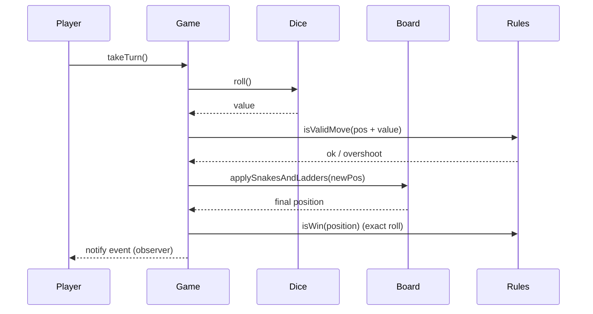

# Snake & Ladder LLD

Configurable **Snake and Ladder** game in C++17 — `N×N` board, multiple board-setup styles (standard / random / custom), turn-based multiplayer, exact-roll win condition, and observer-based event notifications.

> **Pattern map:** [Project → Pattern mapping](../docs/PROJECT_DESIGN_PATTERNS.md)

---

## Folder Structure

```
L34 Snake_ladder_LLD/
├── core/           # Board, Game orchestration
├── models/         # Player, Dice, Snake, Ladder, Cell
├── strategies/     # BoardSetupStrategy — standard / random / custom
├── rules/          # GameRules — move validity + win condition
├── factories/      # Game creation variants
├── observers/      # Game event notifiers
├── enums/          # game enums
├── compile.sh
├── main.cpp
├── problem_statement.md
└── requirements.md
```

---

## Design Patterns

| Pattern | Class | Why |
|---------|-------|-----|
| **Strategy** | `BoardSetupStrategy`, `GameRules` | Board generation and rules are swappable at runtime |
| **Bridge** | `Board::setupBoard(strategy)` | Board abstraction decoupled from the setup implementation |
| **Factory** | game factory | Creates standard / random / custom game variants |
| **Observer** | event notifiers | Push roll / move / win events to listeners |

---

## Key Flow — A Turn



---

## Build & Run

```bash
cd "L34 Snake_ladder_LLD"
./compile.sh
./snake_ladder_app
```

---

## Demo Scenarios (`main.cpp`)

| Demo | What it shows |
|------|----------------|
| **Standard board** | Predefined snakes/ladders |
| **Random board** | Difficulty-based random placement |
| **Custom board** | Setup by counts or exact positions |
| **Exact-roll win** | Overshoot is rejected near the final cell |

---

## Interview Talking Points

1. **Bridge vs Strategy** — Bridge separates `Board` (abstraction) from its setup (implementation); the setup itself is chosen via Strategy.
2. **Why exact-roll?** — Models the classic rule; shows boundary handling at the last cell.
3. **Observer** — Game events surfaced without coupling the engine to output.
4. **Extensions** — Power-ups, multiple dice, networked play, save/restore (Memento).

---

## Related Docs

- [Problem Statement](./problem_statement.md) · [Requirements](./requirements.md)
- [Tic Tac Toe LLD](../L33%20Tic_Tac_Toe_LLD/) · [L25 Bridge pattern](../L25%20Bridge_design_pattern/)
- [Pattern map](../docs/PROJECT_DESIGN_PATTERNS.md)
