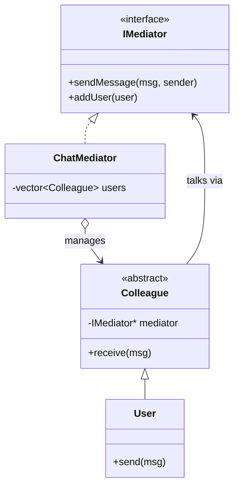

# Mediator Design Pattern — Detailed Guide

> **Behavioral Design Pattern** that removes **direct references between objects** and routes their communication through a **central mediator**. This turns a tangled mesh of **N×(N−1)/2** connections into **N** connections to one hub.

**Domain example (in this repo):** A **chat room** where `User` colleagues never reference each other directly — they send messages through a `ChatMediator` that broadcasts, delivers private messages, and enforces mutes.

**Core problem it solves:** When many objects talk to each other directly, the coupling grows quadratically and the interaction logic is smeared across all of them.

---

## Table of Contents

1. [Problem — Mesh Coupling](#1-problem--mesh-coupling)
2. [What is the Mediator Pattern?](#2-what-is-the-mediator-pattern)
3. [With vs Without Mediator](#3-with-vs-without-mediator)
4. [Real-World Analogy](#4-real-world-analogy)
5. [Key Participants (UML Roles)](#5-key-participants-uml-roles)
6. [When to Use / When to Avoid](#6-when-to-use--when-to-avoid)
7. [Pros and Cons](#7-pros-and-cons)
8. [SOLID Principles Connection](#8-solid-principles-connection)
9. [Folder Structure](#9-folder-structure)
10. [Code Walkthrough](#10-code-walkthrough)
11. [Execution Flow & Expected Output](#11-execution-flow--expected-output)
12. [Architecture Diagrams](#12-architecture-diagrams)
13. [Build & Run](#13-build--run)
14. [Mediator vs Related Patterns](#14-mediator-vs-related-patterns)
15. [Interview Talking Points & Summary](#15-interview-talking-points--summary)

---

## 1. Problem — Mesh Coupling

When colleagues hold references to each other, every new participant multiplies the wiring:

```cpp
// ❌ Each user knows every other user
class User {
    vector<User*> everyoneElse;     // direct references
    void send(const string& msg) {
        for (auto* u : everyoneElse) u->receive(msg);   // tight coupling
    }
};
```

| Problem | Detail |
| ------- | ------ |
| **Quadratic coupling** | N users → up to N×(N−1)/2 links |
| **Hard to add features** | Mute/block/broadcast logic spreads into every `User` |
| **Poor reuse** | A `User` can't be used outside this exact group |
| **Fragile** | Adding/removing a participant touches many objects |

---

## 2. What is the Mediator Pattern?

Introduce a **mediator** that all colleagues talk to. Colleagues know only the mediator, not each other:

```
Without:  A ↔ B ↔ C ↔ D  (everyone wired to everyone)
With:     A → Mediator ← B
              ↑      ↑
              D      C        (each knows only the mediator)
```

| Property | Detail |
| -------- | ------ |
| **Central hub** | The `ChatMediator` owns the interaction rules |
| **Loose coupling** | Colleagues reference only the mediator interface |
| **Centralized logic** | Broadcast, private message, mute live in one place |
| **Easy growth** | Adding a user = registering with the mediator |

---

## 3. With vs Without Mediator

| Aspect | `WithoutMediator.cpp` | `MediatorPattern.cpp` |
| ------ | --------------------- | --------------------- |
| References | Each `User` holds others directly | Each `User` holds the `ChatMediator` |
| Connections | N×(N−1)/2 | N |
| Broadcast/mute logic | Duplicated in users | Centralized in mediator |
| Adding a user | Touches existing users | Register with the mediator |

---

## 4. Real-World Analogy

| Analogy | Mapping |
| ------- | ------- |
| **Air traffic control** | Pilots don't coordinate directly; the tower (mediator) sequences everyone |
| **Group chat server** | Members send to the server, which delivers to others |
| **Auctioneer** | Bidders talk to the auctioneer, not to each other |

---

## 5. Key Participants (UML Roles)

| Role | In this demo |
| ---- | ------------ |
| **Mediator** | `IMediator` — interface (`sendMessage`, `addUser`, …) |
| **Concrete Mediator** | `ChatMediator` — holds users, broadcasts, handles mute/private |
| **Colleague** | `Colleague` — abstract participant holding a mediator reference |
| **Concrete Colleague** | `User` — sends/receives via the mediator |
| **Client** | `main()` — wires users to the mediator and exchanges messages |

---

## 6. When to Use / When to Avoid

### ✅ Use when

| Scenario | Example |
| -------- | ------- |
| Many-to-many object communication | Chat, UI dialogs, multiplayer game lobby |
| Interaction logic should be centralized | Mute/broadcast/routing rules |
| You want reusable, decoupled components | Widgets that don't know each other |

### ❌ Avoid when

| Scenario | Reason |
| -------- | ------ |
| Few objects, simple communication | Direct calls are clearer |
| Interactions are mostly one-to-one | A mediator adds needless indirection |
| The mediator would do everything | Risk of a "god object" — split responsibilities |

---

## 7. Pros and Cons

### Pros

| Benefit | Detail |
| ------- | ------ |
| **Reduced coupling** | Colleagues depend only on the mediator |
| **Centralized control** | All interaction rules in one place |
| **Reusable colleagues** | A `User` works in any mediator setup |
| **Easy to extend** | New interaction features go in the mediator |

### Cons

| Drawback | Detail |
| -------- | ------ |
| **God-object risk** | The mediator can become bloated |
| **Single point of complexity** | All logic concentrates in one class |
| **Indirection** | Messages hop through the hub |

---

## 8. SOLID Principles Connection

| Principle | How Mediator applies |
| --------- | -------------------- |
| **SRP** | Colleagues handle their own behavior; the mediator owns coordination |
| **OCP** | Add interaction rules in the mediator without changing colleagues |
| **DIP** | Colleagues depend on the `IMediator` abstraction |

---

## 9. Folder Structure

```
L35 Mediator_design_pattern/
├── README.md                   ← This guide
└── C++ Code/
    ├── WithoutMediator.cpp      ← Mesh-coupled baseline
    └── MediatorPattern.cpp      ← Chat room via ChatMediator
```

---

## 10. Code Walkthrough

**Mediator interface + colleague base:**

```cpp
class IMediator {
public:
    virtual void sendMessage(const string& msg, Colleague* sender) = 0;
    virtual void addUser(Colleague* user) = 0;
    virtual ~IMediator() {}
};

class Colleague {
protected:
    IMediator* mediator;            // ◄── knows only the mediator
public:
    Colleague(IMediator* m) : mediator(m) {}
    virtual void receive(const string& msg) = 0;
};
```

**Concrete mediator centralizes delivery:**

```cpp
class ChatMediator : public IMediator {
    vector<Colleague*> users;
public:
    void addUser(Colleague* u) override { users.push_back(u); }
    void sendMessage(const string& msg, Colleague* sender) override {
        for (auto* u : users)
            if (u != sender) u->receive(msg);   // broadcast, skip sender
    }
};
```

**Colleague sends through the mediator:**

```cpp
class User : public Colleague {
    string name;
public:
    void send(const string& msg) { mediator->sendMessage(msg, this); }
    void receive(const string& msg) override { cout << name << " got: " << msg << "\n"; }
};
```

**Key:** `User::send` never names another user — the mediator decides who receives.

---

## 11. Execution Flow & Expected Output

```cpp
ChatMediator* room = new ChatMediator();
User* alice = new User(room, "Alice");
User* bob   = new User(room, "Bob");
room->addUser(alice); room->addUser(bob);

alice->send("Hi everyone!");
```

```
Bob got: Hi everyone!
```

(Only Bob receives — the mediator skips the sender.)

---

## 12. Architecture Diagrams



---

## 13. Build & Run

```bash
cd "L35 Mediator_design_pattern/C++ Code"

g++ -std=c++17 -o without_mediator WithoutMediator.cpp && ./without_mediator
g++ -std=c++17 -o mediator_demo MediatorPattern.cpp && ./mediator_demo
```

---

## 14. Mediator vs Related Patterns

| Pattern | Intent | Difference from Mediator |
| ------- | ------ | ------------------------ |
| **Observer** | Publishers notify subscribers | Observer is one-directional broadcast; Mediator does two-way many-to-many coordination |
| **Facade** | Simplify a subsystem | Facade is a one-way entry point; Mediator brokers ongoing peer interaction |
| **Proxy** | Stand-in for one object | Proxy wraps a single subject; Mediator coordinates many |

**Mediator vs Observer:** Both decouple, but Observer pushes events from subject → observers, while Mediator handles **mutual** communication among peers (and is used inside L37 Chess for in-match chat).

---

## 15. Interview Talking Points & Summary

**Talking points:**

1. **One-liner:** "Mediator centralizes communication so objects don't reference each other directly."
2. **The math:** "Turns N×(N−1)/2 connections into N connections to a hub."
3. **vs Observer:** "Observer is broadcast subject→observers; Mediator is many-to-many peer coordination."
4. **God-object caution:** "Keep the mediator focused, or it becomes a dumping ground."
5. **Repo link:** "L37 Chess uses a `ChatMediator` for in-match messaging."

| Aspect | Detail |
| ------ | ------ |
| **Pattern Type** | Behavioral |
| **Core Idea** | Route peer communication through a central mediator |
| **Repo Example** | Chat room with `ChatMediator` + `User` colleagues |
| **Main Problem Solved** | Quadratic mesh coupling among objects |
| **Key Files** | [`MediatorPattern.cpp`](./C%20%2B%2B%20Code/MediatorPattern.cpp), [`WithoutMediator.cpp`](./C%20%2B%2B%20Code/WithoutMediator.cpp) |

> **Remember:** A Mediator is like **air traffic control** — planes never negotiate directly with each other; they all talk to the tower, which keeps the whole sky coordinated and collision-free. 🛫
