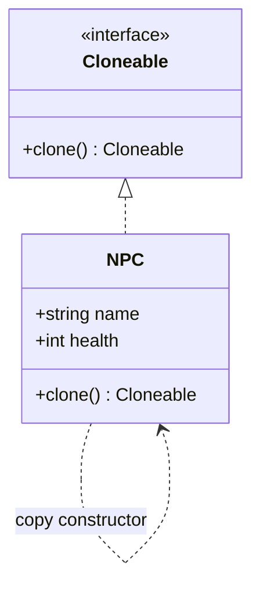
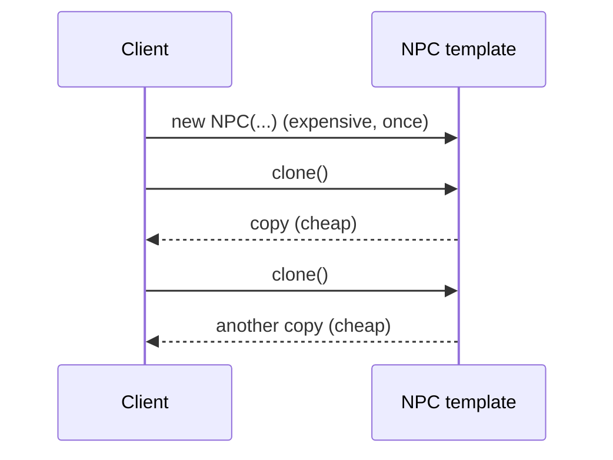

# Prototype Design Pattern — Detailed Guide

> **Creational Design Pattern** that creates new objects by **cloning an existing instance** (the prototype) instead of constructing from scratch. When setup is expensive (DB reads, heavy computation), you pay that cost **once** on a template and then `clone()` cheap copies.

**Domain example (in this repo):** Game **NPCs** — build a fully configured `NPC` template once, then clone it for every enemy on screen. `PrototypePattern.cpp` vs `WithoutPrototype.cpp` show the difference.

**Core problem it solves:** Rebuilding similar objects through a heavy constructor every time is slow and duplicates initialization logic.

---

## Table of Contents

1. [Problem — Rebuilding From Scratch](#1-problem--rebuilding-from-scratch)
2. [What is the Prototype Pattern?](#2-what-is-the-prototype-pattern)
3. [Shallow vs Deep Copy](#3-shallow-vs-deep-copy)
4. [Real-World Analogy](#4-real-world-analogy)
5. [Key Participants (UML Roles)](#5-key-participants-uml-roles)
6. [When to Use / When to Avoid](#6-when-to-use--when-to-avoid)
7. [Pros and Cons](#7-pros-and-cons)
8. [SOLID Principles Connection](#8-solid-principles-connection)
9. [Folder Structure](#9-folder-structure)
10. [Code Walkthrough](#10-code-walkthrough)
11. [Execution Flow & Expected Output](#11-execution-flow--expected-output)
12. [Architecture Diagrams](#12-architecture-diagrams)
13. [Build & Run](#13-build--run)
14. [Prototype vs Related Patterns](#14-prototype-vs-related-patterns)
15. [Interview Talking Points & Summary](#15-interview-talking-points--summary)

---

## 1. Problem — Rebuilding From Scratch

In `WithoutPrototype.cpp`, every NPC re-runs the expensive constructor:

```cpp
// ❌ Heavy constructor runs for every enemy
NPC(const string& name, int health, int attack, int defense) {
    // call database...
    // complex stat calculations...
    this->name = name; this->health = health; /* ... */
}
// spawning 100 similar goblins → 100 DB calls + 100 calculations
```

| Problem | Detail |
| ------- | ------ |
| **Repeated expensive setup** | DB/calc cost paid per object |
| **Duplicated init logic** | The same configuration is re-specified each time |
| **Tight coupling to construction** | Client must know all constructor params |
| **Slow at scale** | Spawning many similar objects is costly |

---

## 2. What is the Prototype Pattern?

Define a `clone()` method on a common interface. Configure one object fully, then copy it:

```cpp
NPC* goblinTemplate = new NPC("Goblin", 100, 20, 5);   // expensive, once
NPC* g1 = goblinTemplate->clone();                     // cheap copy
NPC* g2 = goblinTemplate->clone();                     // cheap copy
```

| Property | Detail |
| -------- | ------ |
| **Cloneable interface** | A virtual `clone()` returns a copy of the concrete type |
| **Copy constructor** | Does the actual field duplication |
| **Skip heavy init** | Cloning copies finished state, not the construction work |
| **Runtime templates** | Prototypes can be configured and registered at runtime |

---

## 3. Shallow vs Deep Copy

| Copy type | Behavior | Risk |
| --------- | -------- | ---- |
| **Shallow** | Copies pointer fields by value (shared targets) | Two clones share/mutate the same sub-object |
| **Deep** | Recursively copies pointed-to objects | Safe independence, slightly more cost |

For objects holding pointers (inventory lists, child nodes), implement `clone()` as a **deep copy** so clones don't accidentally share mutable state.

---

## 4. Real-World Analogy

| Analogy | Mapping |
| ------- | ------- |
| **Photocopying a document** | Fill out the master form once, then copy it many times |
| **Cookie cutter** | Shape the dough template once; stamp out identical cookies |
| **Cell division** | A configured cell duplicates itself rather than being rebuilt |

---

## 5. Key Participants (UML Roles)

| Role | In this demo |
| ---- | ------------ |
| **Prototype** | `Cloneable` — declares `clone()` |
| **Concrete Prototype** | `NPC` — implements `clone()` via its copy constructor |
| **Client** | `main()` — clones templates instead of constructing |

---

## 6. When to Use / When to Avoid

### ✅ Use when

| Scenario | Example |
| -------- | ------- |
| Object creation is expensive | DB-loaded or computed templates |
| Many similar objects are needed | Game enemies, particles, document templates |
| You want runtime-configurable templates | Register prototypes, clone on demand |
| Avoiding subclass-per-config | Clone + tweak instead of new subclasses |

### ❌ Avoid when

| Scenario | Reason |
| -------- | ------ |
| Construction is cheap | A constructor/factory is simpler |
| Objects have complex shared references | Deep copy gets tricky |
| Few objects | No real savings |

---

## 7. Pros and Cons

### Pros

| Benefit | Detail |
| ------- | ------ |
| **Cheap creation** | Skip expensive initialization per object |
| **Runtime flexibility** | Configure and register prototypes dynamically |
| **Fewer subclasses** | Clone + modify instead of new types |
| **Decoupled creation** | Client doesn't need constructor details |

### Cons

| Drawback | Detail |
| -------- | ------ |
| **Deep-copy complexity** | Pointer/graph fields need careful cloning |
| **clone() maintenance** | Every concrete type must implement it correctly |
| **Hidden cost** | A wrong shallow copy causes subtle shared-state bugs |

---

## 8. SOLID Principles Connection

| Principle | How Prototype applies |
| --------- | --------------------- |
| **OCP** | Add a new prototype without changing client creation code |
| **DIP** | Client depends on the `Cloneable` interface, not concrete types |
| **SRP** | Cloning logic is encapsulated in the object itself |

---

## 9. Folder Structure

```
L36 Prototype_design_pattern/
├── README.md                   ← This guide
└── C++ Code/
    ├── WithoutPrototype.cpp     ← Heavy constructor per object
    └── PrototypePattern.cpp     ← clone() based creation
```

---

## 10. Code Walkthrough

**Prototype interface:**

```cpp
class Cloneable {
public:
    virtual Cloneable* clone() const = 0;
    virtual ~Cloneable() {}
};
```

**Concrete prototype implements clone via copy constructor:**

```cpp
class NPC : public Cloneable {
public:
    string name; int health, attack, defense;

    NPC(const string& name, int health, int attack, int defense) {
        // expensive: DB call + complex stat calculation (runs once on template)
        this->name = name; this->health = health;
        this->attack = attack; this->defense = defense;
    }

    Cloneable* clone() const override {
        return new NPC(*this);     // copy constructor — no DB/calc re-run
    }
};
```

**Key:** `clone()` copies the *finished* object, bypassing the heavy constructor work.

---

## 11. Execution Flow & Expected Output

```cpp
NPC* goblin = new NPC("Goblin", 100, 20, 5);   // expensive build (once)
NPC* g1 = static_cast<NPC*>(goblin->clone());  // cheap
NPC* g2 = static_cast<NPC*>(goblin->clone());  // cheap
g2->name = "Goblin Elite";                     // tweak the clone
```

```
Building NPC (DB + calculations): Goblin
Cloned NPC: Goblin
Cloned NPC: Goblin  → renamed to Goblin Elite
```

(The expensive build message prints **once**; clones reuse the finished state.)

---

## 12. Architecture Diagrams





---

## 13. Build & Run

```bash
cd "L36 Prototype_design_pattern/C++ Code"

g++ -std=c++17 -o without_prototype WithoutPrototype.cpp && ./without_prototype
g++ -std=c++17 -o prototype_demo PrototypePattern.cpp && ./prototype_demo
```

---

## 14. Prototype vs Related Patterns

| Pattern | Intent | Difference from Prototype |
| ------- | ------ | ------------------------- |
| **Factory Method** | Create via subclass choice | Factory *constructs*; Prototype *copies* an existing instance |
| **Abstract Factory** | Families of objects | Builds fresh; Prototype clones configured templates |
| **Builder** | Step-by-step assembly | Builder assembles new; Prototype duplicates finished |
| **Flyweight** | Share immutable state | Flyweight *shares* one object; Prototype makes independent *copies* |

---

## 15. Interview Talking Points & Summary

**Talking points:**

1. **One-liner:** "Prototype creates objects by cloning a configured instance instead of constructing anew."
2. **Why:** "It avoids re-running expensive initialization (DB, computation) for each object."
3. **Deep vs shallow:** "Clone must deep-copy pointer fields, or copies share mutable state."
4. **Runtime templates:** "You can register and tweak prototypes at runtime, reducing subclasses."
5. **vs Factory:** "Factory builds from scratch; Prototype copies an existing object."

| Aspect | Detail |
| ------ | ------ |
| **Pattern Type** | Creational |
| **Core Idea** | Clone a configured template instead of rebuilding |
| **Repo Example** | Game NPC templates cloned per enemy |
| **Main Problem Solved** | Expensive, repeated construction of similar objects |
| **Key Files** | [`PrototypePattern.cpp`](./C%20%2B%2B%20Code/PrototypePattern.cpp), [`WithoutPrototype.cpp`](./C%20%2B%2B%20Code/WithoutPrototype.cpp) |

> **Remember:** Prototype is like a **photocopier** — fill out the master form once (expensive), then stamp out as many identical copies as you need (cheap). 📄
