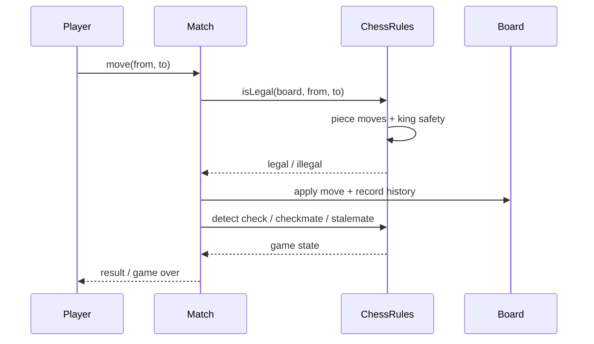

# Chess LLD (Online Chess)

Interview-grade **online chess** system in C++17 — piece-wise legal move generation, check / checkmate / stalemate detection, two-player match lifecycle, in-match chat via a mediator, and score-aware matchmaking for queued users.

> **Pattern map:** [Project → Pattern mapping](../docs/PROJECT_DESIGN_PATTERNS.md)

---

## Folder Structure

```
L37 Chess_LLD/
├── core/           # GameManager (Singleton), Match, Board, ChatMediator
├── pieces/         # Piece base + King, Queen, Rook, Bishop, Knight, Pawn
├── rules/          # ChessRules — move validation, check / checkmate / stalemate
├── strategies/     # MatchingStrategy — score-based opponent pairing
├── factories/      # PieceFactory — piece creation
├── models/         # User, Move, Position
├── enums/          # Color, PieceType, GameState
├── C++ Code/       # alternate single-file reference
├── compile.sh
├── main.cpp
├── problem_statement.md
└── requirements.md
```

---

## Design Patterns

| Pattern | Class | Why |
|---------|-------|-----|
| **Singleton** | `GameManager` | One global queue + match registry |
| **Strategy** | `ChessRules`, `MatchingStrategy` | Pluggable rule engine and opponent pairing |
| **Mediator** | `ChatMediator` (in `Match`) | Players communicate through the match, not directly |
| **Factory** | `PieceFactory` | Centralized piece construction during board setup |

---

## Key Flow — Make a Move



---

## Build & Run

```bash
cd "L37 Chess_LLD"
./compile.sh
./chess_app
```

---

## Demo Scenarios (`main.cpp`)

| Demo | What it shows |
|------|----------------|
| **Matchmaking** | Two queued users paired by score |
| **Legal moves** | Per-piece generation, illegal moves rejected |
| **Check / mate** | Check detection and checkmate end condition |
| **Chat** | In-match messaging via mediator |
| **Score update** | Ratings updated on result / quit |

---

## Interview Talking Points

1. **Why Strategy for rules?** — Variants (Chess960, custom pieces) become new rule classes without touching `Match`.
2. **Why Mediator for chat?** — Players don't hold references to each other; the match brokers messages (mutable to add mute/spectators).
3. **King-safety check** — A move is legal only if it doesn't leave your own king in check; checkmate = no legal move + king in check.
4. **Extensions** — Clocks/timed games, move-history replay (Memento), spectators, persistence.

---

## Related Docs

- [Problem Statement](./problem_statement.md) · [Requirements](./requirements.md)
- [Tic Tac Toe LLD](../L33%20Tic_Tac_Toe_LLD/) · [L35 Mediator pattern](../L35%20Mediator_design_pattern/)
- [Pattern map](../docs/PROJECT_DESIGN_PATTERNS.md)
