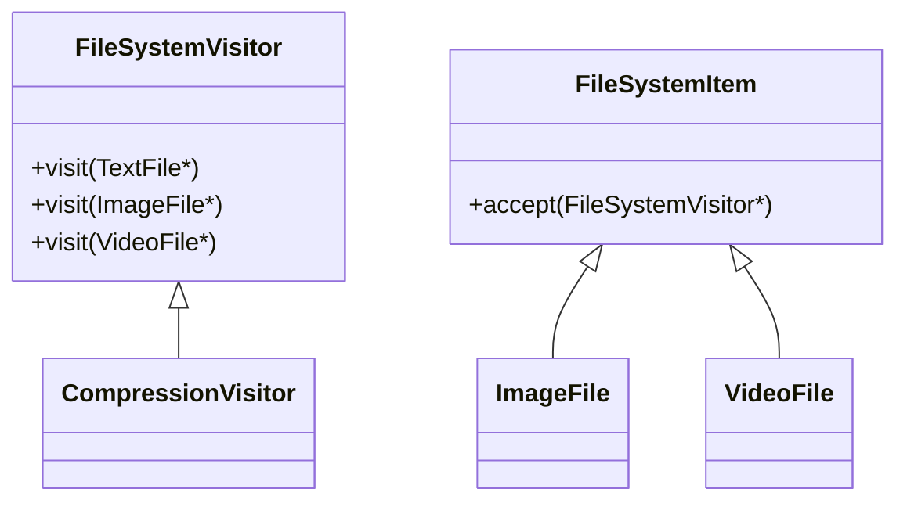

# Visitor Design Pattern — Detailed Guide

> **Behavioral Pattern** jo **naye operations** element classes ko **modify kiye bina** add karta hai — **double dispatch**: `element.accept(visitor)` → `visitor.visit(element)`.

**Domain example (is repo mein):** File system — `TextFile`, `ImageFile`, `VideoFile` + visitors: size, compression, virus scan.

**Trade-off:** Naya file type → **sab visitors** update; naya operation → **sirf naya visitor**.

---

## Table of Contents

1. [Problem — Operations in every class](#1-problem--operations-in-every-class)
2. [Visitor Pattern kya hai?](#2-visitor-pattern-kya-hai)
3. [Double Dispatch](#3-double-dispatch)
4. [Key Participants](#4-key-participants)
5. [Code Walkthrough](#5-code-walkthrough)
6. [Build & Run](#6-build--run)
7. [Trade-offs & Summary](#7-trade-offs--summary)

---

## 1. Problem — Operations in every class

```cpp
// ❌ Har file class mein har operation
class ImageFile {
    void calculateSize();
    void compress();
    void virusScan();
};
// Naya op "encrypt" → TextFile, ImageFile, VideoFile sab edit
```

**Stable element hierarchy, volatile operations** → Visitor fit.

---

## 2. Visitor Pattern kya hai?

```cpp
img1->accept(new SizeCalculationVisitor());
img1->accept(new CompressionVisitor());
```

| Role | Class |
| ---- | ----- |
| **Element** | `FileSystemItem` + `accept(visitor)` |
| **Concrete elements** | `TextFile`, `ImageFile`, `VideoFile` |
| **Visitor** | `FileSystemVisitor` — `visit()` per type |
| **Concrete visitors** | `SizeCalculationVisitor`, `CompressionVisitor`, `VirusScanningVisitor` |

---

## 3. Double Dispatch

```
client → element.accept(visitor)
           → visitor.visit(this)   // correct overload for Text vs Image
```

C++ mein `visit(TextFile*)` vs `visit(ImageFile*)` overload resolution — compile-time type known.

---

## 4. Key Participants



---

## 5. Code Walkthrough

Source: [`C++ Code/VisitorPattern.cpp`](./C%20%2B%2B%20Code/VisitorPattern.cpp)

```cpp
void ImageFile::accept(FileSystemVisitor* visitor) override {
    visitor->visit(this);
}

void CompressionVisitor::visit(ImageFile* file) override {
    cout << "Compressing IMAGE file: " << file->getName() << endl;
}
```

**Main:** Same `ImageFile` — 3 different visitors without changing `ImageFile` class.

---

## 6. Build & Run

```bash
cd "L38 Visitor_design_pattern/C++ Code"
g++ -std=c++17 -o visitor_demo VisitorPattern.cpp && ./visitor_demo
```

**Output:**

```
Calculating size for IMAGE file: sample.jpg
Compressing IMAGE file: sample.jpg
Scanning IMAGE file: sample.jpg
Compressing VIDEO file: test.mp4
```

---

## 7. Trade-offs & Summary

| Pros | Cons |
| ---- | ---- |
| Add operation = new Visitor | Add element = update all visitors |
| Keeps element classes small | Breaks encapsulation (visitor needs internals) |

**vs Strategy:** Visitor = **new op on stable types**; Strategy = **swap algorithm** for one context.

| Pehlu | Detail |
| ----- | ------ |
| **Type** | Behavioral |
| **File** | `VisitorPattern.cpp` |
