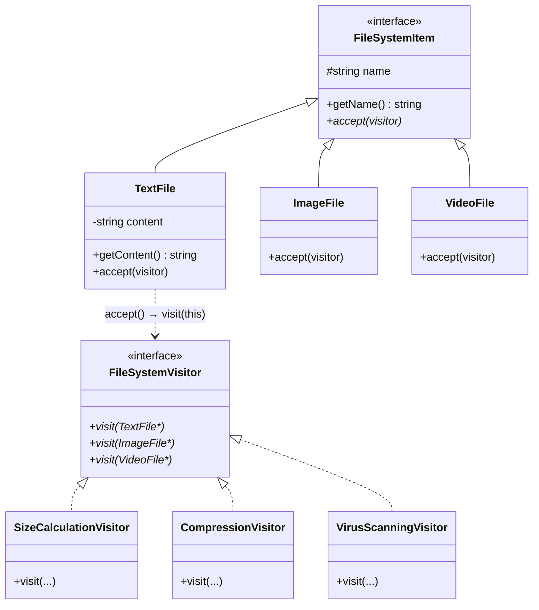
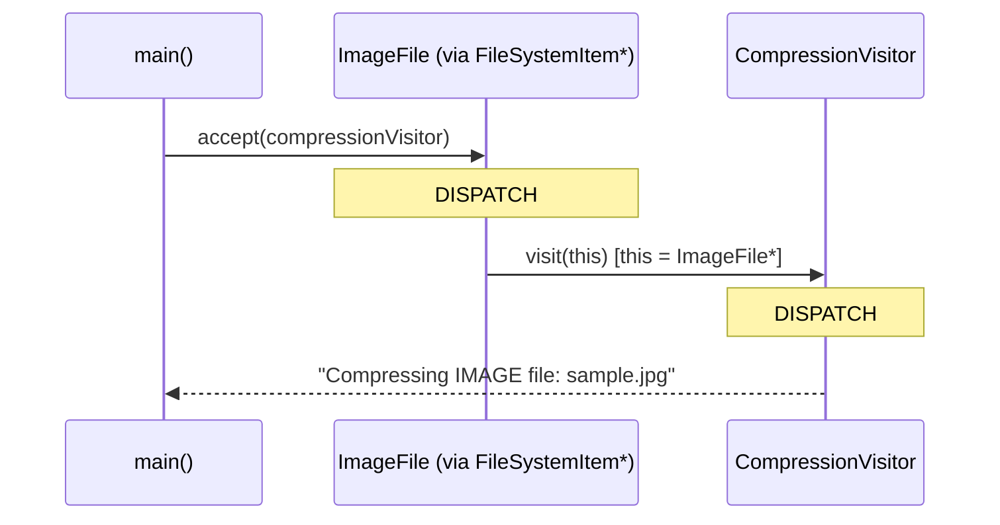

# Visitor Design Pattern — Complete Detailed Guide (Hinglish)

> **Visitor** ek **Behavioral Design Pattern** hai jo kehta hai — *"Element classes ko BINA modify kiye unpe naye operations add karo."* Iska secret weapon hai **double dispatch**: `element->accept(visitor)` andar se `visitor->visit(this)` call karta hai, jisse sahi element type ke liye sahi operation apne aap chun liya jaata hai.

**Is repo ka domain example:** File system — `TextFile`, `ImageFile`, `VideoFile` elements hain, aur unpe operations visitors ke roop me aate hain: `SizeCalculationVisitor`, `CompressionVisitor`, `VirusScanningVisitor`. Naya operation = naya visitor — file classes untouched.

**Core problem jo solve hota hai:** Har naya operation (size, compress, scan, encrypt...) normally **har element class me method** add karwata hai — teeno file classes baar-baar edit hoti hain (OCP violation) aur operations ka logic pura codebase me bikhar jaata hai.

**Mantra:** _"Elements stable rakho, operations ko visitor bana ke bahar nikaalo."_

---

## Table of Contents

1. [Problem kya hai? (Bina Visitor)](#1-problem-kya-hai-bina-visitor)
2. [Visitor Pattern kya hai?](#2-visitor-pattern-kya-hai)
3. [Double Dispatch — Pattern ka Dil](#3-double-dispatch--pattern-ka-dil)
4. [Real-World Analogies](#4-real-world-analogies)
5. [Key Participants (UML Roles)](#5-key-participants-uml-roles)
6. [Kab use karein / Kab na karein](#6-kab-use-karein--kab-na-karein)
7. [Fayde aur Nuksan](#7-fayde-aur-nuksan)
8. [SOLID Principles se Connection](#8-solid-principles-se-connection)
9. [Folder Structure](#9-folder-structure)
10. [Code Implementation — Detailed Walkthrough](#10-code-implementation--detailed-walkthrough)
11. [Execution Flow & Expected Output](#11-execution-flow--expected-output)
12. [Architecture Diagrams](#12-architecture-diagrams)
13. [Build & Run](#13-build--run)
14. [Visitor vs Related Patterns](#14-visitor-vs-related-patterns)
15. [Interview Talking Points](#15-interview-talking-points)
16. [Summary](#16-summary)

---

## 1. Problem kya hai? (Bina Visitor)

Socho file system hai — 3 file types, aur unpe operations chahiye: size calculate, compress, virus scan. Seedha tareeka: har operation ka method har class me daal do:

```cpp
// ❌ Har naya operation = har element class me edit
class TextFile  { int getSize(); void compress(); void scan(); };
class ImageFile { int getSize(); void compress(); void scan(); };
class VideoFile { int getSize(); void compress(); void scan(); };

// Kal ko "encrypt" aaya → TEENO classes phir kholo, phir edit karo
// Parso "backup" aaya → phir teeno... aur ye kabhi rukta nahi!
```

| Problem | Detail |
| ------- | ------ |
| **OCP violation** | Har naya operation **har element class** me edit karwata hai — tested code baar-baar chheda jaata hai |
| **Scattered logic** | "Compression" ka logic 3 alag files me bikhra hai — ek operation samajhne ke liye teeno classes padho |
| **Bloated elements** | File classes me size + compression + scanning + encryption... sab kachra jama hota jaata hai — unka asli kaam (file represent karna) kho jaata hai |
| **Team conflicts** | Compression team aur scanning team dono `TextFile.cpp` edit kar rahi hain — merge conflicts! |
| **Cross-cutting operations** | "Sab files ka total size" jaisa operation — state kahan accumulate karoge? Har class me thoda-thoda? |

**Root cause:** Operations aur elements **ek hi class me chipke hue** hain, jabki wo alag speed se badalte hain — elements stable hain, operations badhte rehte hain.

---

## 2. Visitor Pattern kya hai?

**Idea:** Har operation ko apni **Visitor class** me nikaal do. Element classes me sirf **ek** method rahe — `accept(visitor)`:

1. **Visitor interface** — `FileSystemVisitor` jisme **har element type ke liye ek `visit()` overload** hai
2. **Concrete visitors** — `SizeCalculationVisitor`, `CompressionVisitor`, `VirusScanningVisitor` — har ek **ek operation** ka specialist
3. **Element base** — `FileSystemItem` sirf `accept(visitor)` declare karta hai
4. **Concrete elements** — `TextFile`, `ImageFile`, `VideoFile` — har ek apne `accept()` me `visitor->visit(this)` karta hai

```cpp
// ✅ Naya operation = naya visitor — file classes ko haath bhi nahi lagaya!
FileSystemItem* img = new ImageFile("sample.jpg");
img->accept(new SizeCalculationVisitor());  // size ka logic visitor me
img->accept(new CompressionVisitor());      // compression ka logic visitor me
```

| Property | Detail |
| -------- | ------ |
| **Operations as classes** | Ek visitor class = ek operation (saare element types ke liye) |
| **Elements stay closed** | Naye operations ke liye elements kabhi edit nahi hote |
| **Centralized logic** | Saara "size" logic ek jagah — `SizeCalculationVisitor` me |
| **Type-specific handling** | Har file type ke liye alag implementation — text ka size character se, video ka duration se |

---

## 3. Double Dispatch — Pattern ka Dil

**Ye samajh liya to Visitor samajh liya.** Interview me sabse zyada isi pe sawal aata hai.

### Problem: normal virtual call sirf EK type pe dispatch karta hai

`img->accept(...)` me virtual dispatch **receiver** (img) ke type se method chunta hai. Par humein **DO** cheezon ke basis pe sahi code chalana hai:
1. Element ka type (Text? Image? Video?)
2. Operation ka type (Size? Compress? Scan?)

C++ me built-in "do types pe dispatch" nahi hota — isliye Visitor ye **do steps** me karta hai:

```
STEP 1 (dispatch #1 — VIRTUAL DISPATCH):
    item->accept(visitor)
    → item ka runtime type dekha gaya → ImageFile::accept() chala
      (element ka type YAHAN pick hua)

STEP 2 (dispatch #2 — OVERLOAD RESOLUTION):
    ImageFile::accept() ke andar:  visitor->visit(this)
    → yahan `this` ka type ImageFile* hai (concrete!)
    → compiler ne visit(ImageFile*) overload chuna
      (operation ka sahi version YAHAN pick hua)
```

### Ek tricky sawal: teeno `accept()` same dikhte hain — copy-paste kyun?

```cpp
void accept(FileSystemVisitor* visitor) override {
    visitor->visit(this);   // ye line har element class me likhni HI padti hai
}
```

Kyunki **har class me `this` ka type alag hai!** `TextFile::accept` me `this` = `TextFile*` → `visit(TextFile*)` chunta hai. Agar ye method base class me hota to `this` = `FileSystemItem*` hota — jiska koi `visit()` overload exist hi nahi karta. **Ye ek line hi pura double dispatch hai.**

### Bina Visitor ke ye kaam kaise hota? (aur kyun ganda hota)

```cpp
// ❌ Visitor ke bina — type-check ladder
void calculateSize(FileSystemItem* item) {
    if (auto* t = dynamic_cast<TextFile*>(item))       { /* text size */ }
    else if (auto* i = dynamic_cast<ImageFile*>(item)) { /* image size */ }
    else if (auto* v = dynamic_cast<VideoFile*>(item)) { /* video size */ }
    // naya type aaya aur yahan bhool gaye? — silent bug, compiler chup!
}
```

Visitor me naya element type aaye to **compiler zabardasti har visitor me visit() implement karwata hai** — pure virtual hai, bhool hi nahi sakte. dynamic_cast ladder me bhoolna aasaan hai. (dynamic_cast ki detail: L36 ka `dynamic_cast.cpp` dekho!)

---

## 4. Real-World Analogies

### A. Tax Auditor 🧾 (sabse classic)

Auditor (visitor) alag-alag businesses (elements) ke paas jaata hai. Har business bas darwaza kholta hai — "accept" karta hai. Auditor **khud jaanta hai** ki kirana store pe kya rules lagane hain aur factory pe kya. Naya audit type aaya (GST audit)? Naya auditor aayega — **businesses ko khud ko badalna nahi padta.**

### B. Insurance Inspector 🏠🚗

Inspector ghar, gaadi, factory — sabka inspection karta hai, har type ke liye alag checklist. Property ko inspection karna nahi aata — inspector ko aata hai.

### C. Museum Guide 🏛️

Ek hi guide har exhibit ko alag tarah se explain karta hai — painting ke liye art history, mummy ke liye archaeology. Naya guide (hindi-speaking) aaye to exhibits nahi badalte!

### D. Compiler ka AST (asli engineering use case)

Compiler ke syntax tree nodes (`IfNode`, `LoopNode`, `AssignNode`) **stable** hain, par operations badhte rehte hain — type-check, optimize, code-generate, pretty-print. Har ek ek visitor hai. Clang/LLVM me literally `ASTVisitor` classes hain!

---

## 5. Key Participants (UML Roles)

| UML Role | Is Code Me | Responsibility |
| ---- | ------------ | -------------- |
| **Visitor (interface)** | `FileSystemVisitor` | Har element type ke liye ek `visit()` overload declare karna |
| **Concrete Visitors** | `SizeCalculationVisitor`, `CompressionVisitor`, `VirusScanningVisitor` | Ek operation ka poora logic (har element type ke liye) |
| **Element (interface)** | `FileSystemItem` | `accept(visitor)` declare karna |
| **Concrete Elements** | `TextFile`, `ImageFile`, `VideoFile` | `accept()` me `visitor->visit(this)` — apna type reveal karna |
| **Client** | `main()` | Elements banana aur unpe visitors chalana |

```
Client
  │  item->accept(visitor)
  ▼
FileSystemItem (Element) ◄─implements─ TextFile / ImageFile / VideoFile
  │                                          │
  │ accept() andar:                          │ visitor->visit(this)
  ▼                                          ▼
FileSystemVisitor ◄─implements─ SizeCalculation / Compression / VirusScanning
```

---

## 6. Kab use karein / Kab na karein

### ✅ Kab use karein

| Scenario | Example |
| -------- | ------- |
| **Element set STABLE, operations badhte hain** | Compiler AST nodes, file types, shapes |
| **Cross-cutting operations** | Export, validate, render, audit — jo har type pe chalti hain |
| **Ek operation ka logic ek jagah chahiye** | Saara compression logic `CompressionVisitor` me |
| **Operation ko state accumulate karni hai** | `TotalSizeVisitor` sab files ka size jama kare — member variable me |
| **dynamic_cast/if-else ladders hata rahe ho** | Type-safe dispatch chahiye compiler ke enforcement ke saath |

### ❌ Kab NA karein

| Scenario | Reason |
| -------- | ------ |
| **Element types frequently badalte hain** | Har naya element = **har visitor** me naya `visit()` — poori visitor hierarchy tooti |
| **Operations kam hain (1-2), kabhi badhenge nahi** | Seedha element me method likho — Visitor overkill hai |
| **Elements apna data expose nahi karte** | Visitor ko getters chahiye — encapsulation kholni padegi, socho worth hai ya nahi |
| **Simple hierarchy, simple needs** | Double dispatch ki complexity tabhi justify hoti jab operations sach me badhte ho |

**Thumb rule:** Elements aur operations me se **jo zyada badalta hai** wo dekhho — operations badhte hain → Visitor. Elements badhte hain → Visitor MAT lo, seedha virtual methods rakho.

---

## 7. Fayde aur Nuksan

### Fayde (Pros) 👍

| Fayda | Detail |
| ----- | ------ |
| **Naya operation = ek nayi class** | Elements untouched — OCP for operations |
| **Cohesive logic** | Ek operation ka saara code ek jagah — samajhna/test karna easy |
| **Type-safety** | Naya element aaya to compiler HAR visitor me implement karwayega — bhoolna impossible |
| **State accumulation** | Visitor object traversal ke dauraan data jama kar sakta hai (total size, report...) |
| **Clean elements** | File classes sirf file ka kaam karti hain — operations ka bojh nahi |

### Nuksan (Cons) 👎

| Nuksan | Detail |
| ------ | ------ |
| **Naya ELEMENT mehnga** | `AudioFile` aaya → interface + HAR concrete visitor me naya `visit()` — bade codebase me dozens of classes |
| **Encapsulation weak hoti hai** | Visitors ko element ka data chahiye → public getters badhte hain |
| **Indirection** | `accept` → `visit` do-step flow naye developer ko confuse karta hai |
| **Circular dependency feel** | Elements visitors ko jaante hain, visitors elements ko — forward declarations chahiye |

---

## 8. SOLID Principles se Connection

### Open/Closed Principle (OCP) — asymmetric!

- **Operations ke liye ✅:** Naya operation (`EncryptionVisitor`) = nayi class — elements closed for modification
- **Elements ke liye ❌:** Naya element type = visitor interface + saare visitors edit

**Ye asymmetry hi Visitor ka defining trade-off hai** — interview me ye bolna senior-level samajh dikhata hai.

### Single Responsibility Principle (SRP)

| Class | Ek hi Responsibility |
| ----- | -------------------- |
| `TextFile` | File represent karna (naam, content) |
| `SizeCalculationVisitor` | Sirf size ka logic — teeno types ka |
| `CompressionVisitor` | Sirf compression ka logic |

### Dependency Inversion Principle (DIP)

Client (`main`) sirf abstractions use karta hai — `FileSystemItem*` aur visitor base — operations kaise implement hain, usse matlab nahi.

### Liskov Substitution Principle (LSP)

Koi bhi concrete visitor `FileSystemVisitor*` ki jagah fit; koi bhi file `FileSystemItem*` ki jagah — dono taraf substitutability.

---

## 9. Folder Structure

```
L38 Visitor_design_pattern/
├── README.md                    ← Ye file — complete Hinglish guide
├── Standard UML.jpeg            ← Classic Visitor UML
├── Example UML.jpeg             ← Is example ka UML
└── C++ Code/
    └── VisitorPattern.cpp       ← File system + size/compress/scan visitors
                                   (detailed Hinglish comments ke saath)
```

---

## 10. Code Implementation — Detailed Walkthrough

Source: [`C++ Code/VisitorPattern.cpp`](./C++%20Code/VisitorPattern.cpp)

### 10.1 Forward declarations — kyun chahiye?

```cpp
class TextFile;
class ImageFile;
class VideoFile;
```

Visitor interface ko in types ke naam chahiye (parameters me), par ye classes visitor ke **baad** define hoti hain. Forward declaration compiler se keh deti hai — "ye exist karti hain, definition aage milegi." Visitor pattern me elements ↔ visitors ek-dusre ko jaante hain, isliye ye almost hamesha lagti hain.

### 10.2 Visitor interface — har type ka ek overload

```cpp
class FileSystemVisitor {
public:
    virtual ~FileSystemVisitor() = default;
    virtual void visit(TextFile* file) = 0;    // TextFile ke liye
    virtual void visit(ImageFile* file) = 0;   // ImageFile ke liye
    virtual void visit(VideoFile* file) = 0;   // VideoFile ke liye
};
```

**Ye interface hi contract hai:** "Jo bhi operation banega, use HAR file type handle karna padega." Isi se type-safety milti hai — aur isi se naya element add karna mehnga hota hai (har visitor me naya overload).

### 10.3 Element base — sirf accept()

```cpp
class FileSystemItem {
protected:
    string name;
public:
    FileSystemItem(const string& itemName) { name = itemName; }
    virtual ~FileSystemItem() = default;
    string getName() const { return name; }

    virtual void accept(FileSystemVisitor* visitor) = 0;   // dispatch #1 yahan se
};
```

Dekho — **koi getSize/compress/scan nahi!** Operations bahar visitors me hain. Element ke paas sirf apna data (name) aur ek `accept()` hai.

### 10.4 Concrete elements — the magic one-liner

```cpp
class TextFile : public FileSystemItem {
    string content;
public:
    TextFile(const string& fileName, const string& fileContent)
        : FileSystemItem(fileName) { content = fileContent; }
    string getContent() const { return content; }

    void accept(FileSystemVisitor* visitor) override {
        visitor->visit(this);    // ← this = TextFile* → visit(TextFile*) chuna gaya!
    }
};
// ImageFile, VideoFile — same ek line, par unke `this` ka type alag
```

**Sabse important line:** `visitor->visit(this)`. Har class me `this` ka concrete type alag hai, isliye compiler har jagah **alag overload** chunta hai. Yahi dispatch #2 hai.

### 10.5 Concrete visitors — ek operation, ek class

```cpp
class SizeCalculationVisitor : public FileSystemVisitor {
public:
    void visit(TextFile* file) override  { cout << "Calculating size for TEXT file: "  << file->getName() << endl; }
    void visit(ImageFile* file) override { cout << "Calculating size for IMAGE file: " << file->getName() << endl; }
    void visit(VideoFile* file) override { cout << "Calculating size for VIDEO file: " << file->getName() << endl; }
};
// CompressionVisitor, VirusScanningVisitor — same structure, alag operation
```

Real system me har `visit()` me **type-specific logic** hota — text ka size character count se, image ka resolution se, video ka duration × bitrate se. Saara "size" ka gyaan **ek class me** — bikhra nahi.

### 10.6 Client — main()

```cpp
FileSystemItem* img1 = new ImageFile("sample.jpg");
img1->accept(new SizeCalculationVisitor());   // size operation
img1->accept(new CompressionVisitor());       // compress operation
img1->accept(new VirusScanningVisitor());     // scan operation

FileSystemItem* vid1 = new VideoFile("test.mp4");
vid1->accept(new CompressionVisitor());
```

`img1` ka static type `FileSystemItem*` (base) hai — client ko concrete type ka pata bhi nahi, phir bhi har baar **IMAGE wale** operations chalte hain. Double dispatch apna kaam kar raha hai!

---

## 11. Execution Flow & Expected Output

### Ek call ka poora safar

```
img1->accept(new CompressionVisitor())
  │
  ├─ DISPATCH #1 (virtual): img1 runtime me ImageFile hai
  │    → ImageFile::accept(visitor) chala
  │
  └─ DISPATCH #2 (overload): accept ke andar visitor->visit(this)
       `this` = ImageFile*
       → CompressionVisitor::visit(ImageFile*) chala
       → "Compressing IMAGE file: sample.jpg"
```

### Expected Output

```
Calculating size for IMAGE file: sample.jpg
Compressing IMAGE file: sample.jpg
Scanning IMAGE file: sample.jpg
Compressing VIDEO file: test.mp4
```

| Call | Dispatch #1 (element) | Dispatch #2 (overload) | Output |
| ---- | --------------------- | ---------------------- | ------ |
| `img1->accept(size)` | `ImageFile::accept` | `visit(ImageFile*)` | Calculating size for IMAGE file |
| `img1->accept(compress)` | `ImageFile::accept` | `visit(ImageFile*)` | Compressing IMAGE file |
| `img1->accept(scan)` | `ImageFile::accept` | `visit(ImageFile*)` | Scanning IMAGE file |
| `vid1->accept(compress)` | `VideoFile::accept` | `visit(VideoFile*)` | Compressing VIDEO file |

---

## 12. Architecture Diagrams

### Class Diagram



### Sequence Diagram — double dispatch in action



### Extension Matrix — trade-off ek nazar me

```
                     │ SizeCalc │ Compress │ VirusScan │ Encrypt(NEW) │
        ─────────────┼──────────┼──────────┼───────────┼──────────────┤
        TextFile     │  visit   │  visit   │   visit   │  visit  ← naya operation:
        ImageFile    │  visit   │  visit   │   visit   │  visit    NAYA COLUMN
        VideoFile    │  visit   │  visit   │   visit   │  visit    (sirf 1 nayi class ✅)
        AudioFile(NEW)│  visit  │  visit   │   visit   │  visit
              ↑ naya element: NAYI ROW — har visitor me change ❌
```

---

## 13. Build & Run

```bash
cd "L38 Visitor_design_pattern/C++ Code"
g++ -std=c++17 -o visitor_demo VisitorPattern.cpp && ./visitor_demo
```

---

## 14. Visitor vs Related Patterns

| Pattern | Focus | Visitor se Farq |
| ------- | ----- | ----------------------- |
| **Strategy** | EK algorithm ko swap karna | Strategy ek behavior badalta hai; Visitor **har element type ke liye alag** behavior chalata hai (type-aware) |
| **Iterator** | Collection traverse karna | Iterator elements deta hai; Visitor unpe **typed operations** lagata hai — dono aksar saath chalte hain |
| **Composite** | Part-whole tree banana | Visitor aksar Composite tree pe **chalaya** jaata hai — folder/file tree pe SizeVisitor perfect combo hai |
| **Decorator** | Object pe behavior **wrap** karna | Decorator ek object ko layer karta hai; Visitor poori hierarchy pe operations bahar se lagata hai |
| **Command** | Request ko object banana | Command "kya karna hai" pack karta hai; Visitor "har type pe kaise karna hai" pack karta hai |

### Combo alert 🔗: Composite + Visitor

File system ka asli roop — folders ke andar files (Composite tree), aur uspe `SizeCalculationVisitor` chala do → poore tree ka total size. L19 Composite ke saath compare karke dekho!

---

## 15. Interview Talking Points

1. **One-liner:** *"Visitor lets you add new operations to a class hierarchy without modifying the classes — via double dispatch."*

2. **Double dispatch (guaranteed question):** *"Ek virtual call sirf receiver ke type pe dispatch karta hai. Visitor do-step me do types pe dispatch karta hai — `accept()` virtual dispatch se element type chunta hai, phir `visit(this)` overload resolution se operation ka sahi version. Isliye 'double' dispatch."*

3. **THE trade-off:** *"Naya operation easy (nayi visitor class), naya element mushkil (har visitor me naya visit). Isliye stable elements + growing operations wale systems me hi use karo."*

4. **`accept()` har class me copy kyun:** *"Kyunki har class me `this` ka static type alag hai — wahi to overload chunta hai. Base me daal do to `this` base type ka ho jaata aur pattern hi toot jaata."*

5. **vs dynamic_cast ladder:** *"Visitor compile-time type-safety deta hai — naya element aane pe compiler har visitor ko force karta hai. dynamic_cast if-else me case bhoolna silent bug hai."*

6. **Real usage:** *"Compiler AST traversal (Clang ka ASTVisitor), document exporters (PDF/HTML visitors), UI rendering."*

7. **Kab NA lena:** *"Agar element types zyada badalte hain to Visitor ulta padega — tab plain virtual methods hi better."*

---

## 16. Summary

| Pehlu | Detail |
| ------ | ------ |
| **Pattern Type** | Behavioral (GoF) |
| **Core Idea** | Operations ko visitor classes me nikaalo; double dispatch (`accept` → `visit`) se sahi type ka sahi operation chale |
| **Is Repo ka Example** | File system — Text/Image/Video files + Size/Compression/VirusScan visitors |
| **Main Problem Solved** | Naye operations ke liye element classes ko baar-baar edit karna |
| **Key Mechanism** | Dispatch #1: virtual `accept()` (element type) + Dispatch #2: `visit(this)` overload (operation version) |
| **Main Fayda** | Operations add karna trivially easy; logic centralized; compile-time type-safety |
| **Main Trade-off** | Naya element type = har visitor me change |
| **Key File** | [`C++ Code/VisitorPattern.cpp`](./C++%20Code/VisitorPattern.cpp) |

> **Yaad rakhne ka formula:** Visitor **tax auditor** 🧾 jaisa hai — business (element) bas darwaza kholta hai (`accept`), auditor (visitor) khud jaanta hai har business type pe kaunse rules lagane hain (`visit` overloads). Naya audit type aaye to naya auditor aata hai — **businesses ko khud ko badalna nahi padta!**
>
> Aur **golden rule:** Operations badhte hain → Visitor lo. Elements badhte hain → Visitor MAT lo.
