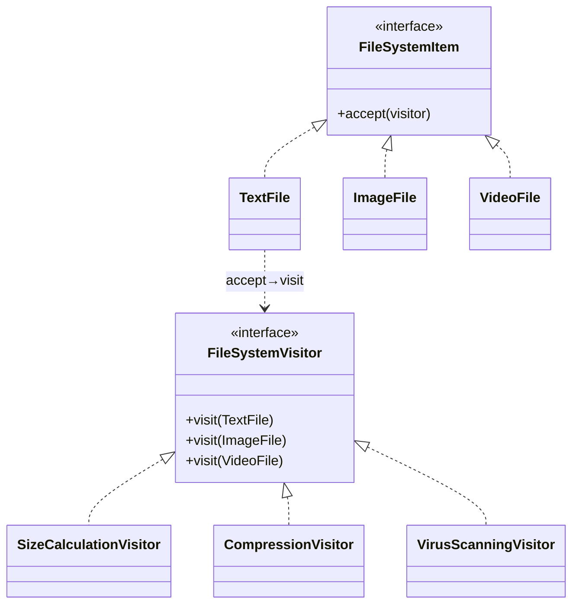

# Visitor Design Pattern — Detailed Guide

> **Behavioral Design Pattern** that lets you add **new operations** to a set of element classes **without modifying them**. It uses **double dispatch**: `element.accept(visitor)` calls back `visitor.visit(element)`, so the right operation runs for the right element type.

**Domain example (in this repo):** A file system of `TextFile`, `ImageFile`, and `VideoFile` elements, with visitors for size calculation, compression, and virus scanning — new operations are added as new visitors.

**Core problem it solves:** Adding an operation that varies per element type normally means editing every element class, which violates the Open/Closed Principle.

---

## Table of Contents

1. [Problem — An Operation in Every Class](#1-problem--an-operation-in-every-class)
2. [What is the Visitor Pattern?](#2-what-is-the-visitor-pattern)
3. [Double Dispatch Explained](#3-double-dispatch-explained)
4. [Real-World Analogy](#4-real-world-analogy)
5. [Key Participants (UML Roles)](#5-key-participants-uml-roles)
6. [When to Use / When to Avoid](#6-when-to-use--when-to-avoid)
7. [Pros and Cons](#7-pros-and-cons)
8. [SOLID Principles Connection](#8-solid-principles-connection)
9. [Folder Structure](#9-folder-structure)
10. [Code Walkthrough](#10-code-walkthrough)
11. [Execution Flow & Expected Output](#11-execution-flow--expected-output)
12. [Architecture Diagrams](#12-architecture-diagrams)
13. [Build & Run](#13-build--run)
14. [Visitor vs Related Patterns](#14-visitor-vs-related-patterns)
15. [Interview Talking Points & Summary](#15-interview-talking-points--summary)

---

## 1. Problem — An Operation in Every Class

To add "calculate size", "compress", and "scan", you'd normally add a method to every element class:

```cpp
// ❌ Each new operation edits every element
class TextFile  { int getSize(); void compress(); void scan(); };
class ImageFile { int getSize(); void compress(); void scan(); };
class VideoFile { int getSize(); void compress(); void scan(); };
// add "encrypt" → edit all three classes again
```

| Problem | Detail |
| ------- | ------ |
| **OCP violation** | A new operation forces edits to every element class |
| **Scattered logic** | One operation's code is spread across many files |
| **Bloated elements** | Element classes accumulate unrelated behavior |
| **Hard to maintain** | Cross-cutting operations are hard to keep consistent |

---

## 2. What is the Visitor Pattern?

Move each operation into a **Visitor** object. Elements expose a single `accept(visitor)` method; the visitor holds a `visit(...)` overload per element type:

```cpp
SizeCalculationVisitor sizeVisitor;
textFile->accept(&sizeVisitor);    // runs visit(TextFile&)
imageFile->accept(&sizeVisitor);   // runs visit(ImageFile&)
```

| Property | Detail |
| -------- | ------ |
| **Operations as visitors** | One visitor class per operation |
| **Elements stay closed** | Add operations without touching elements |
| **Double dispatch** | The element + visitor pair selects the method |
| **Centralized op logic** | All "size" logic lives in `SizeCalculationVisitor` |

---

## 3. Double Dispatch Explained

A normal virtual call dispatches on **one** type (the receiver). Visitor needs **two**: the element type *and* the operation. It achieves this in two hops:

```
1) element->accept(visitor)   // dispatch #1: picks the element type
2)   visitor->visit(*this)    // dispatch #2: picks the visit overload for that type
```

Because `accept` is overridden per element, `*this` is the concrete type, so the correct `visit(ConcreteElement&)` is chosen.

---

## 4. Real-World Analogy

| Analogy | Mapping |
| ------- | ------- |
| **Tax auditor visiting businesses** | Each business "accepts" the auditor; the auditor applies the right rules per business type |
| **Insurance inspector** | Visits houses/cars/factories, applying type-specific checks |
| **Museum guide** | The same guide explains each exhibit differently |

---

## 5. Key Participants (UML Roles)

| Role | In this demo |
| ---- | ------------ |
| **Visitor** | `FileSystemVisitor` — declares `visit(TextFile&)`, `visit(ImageFile&)`, `visit(VideoFile&)` |
| **Concrete Visitors** | `SizeCalculationVisitor`, `CompressionVisitor`, `VirusScanningVisitor` |
| **Element** | `FileSystemItem` — declares `accept(visitor)` |
| **Concrete Elements** | `TextFile`, `ImageFile`, `VideoFile` |
| **Client** | `main()` — runs visitors over a set of files |

---

## 6. When to Use / When to Avoid

### ✅ Use when

| Scenario | Example |
| -------- | ------- |
| Stable element set, many operations | AST nodes, file types, shapes |
| Operations are cross-cutting | Size, export, validation, scanning |
| You want operations grouped together | All "compress" logic in one class |

### ❌ Avoid when

| Scenario | Reason |
| -------- | ------ |
| Element types change often | Every new element edits *every* visitor |
| Few operations | A simple method per element is fine |
| Elements expose little public state | Visitors need access to element internals |

---

## 7. Pros and Cons

### Pros

| Benefit | Detail |
| ------- | ------ |
| **Easy to add operations** | New operation = new visitor, elements untouched |
| **Cohesive operations** | All logic for one operation in one class |
| **Open/Closed for ops** | Elements stay closed to modification |
| **Accumulate state** | A visitor can total results across elements |

### Cons

| Drawback | Detail |
| -------- | ------ |
| **Hard to add elements** | Each new element forces a new `visit` in every visitor |
| **Breaks encapsulation** | Visitors often need element internals |
| **Two-step indirection** | Double dispatch is less obvious to read |

---

## 8. SOLID Principles Connection

| Principle | How Visitor applies |
| --------- | ------------------- |
| **OCP** | Open to new **operations** (visitors), closed to element modification |
| **SRP** | Each visitor encapsulates one operation across all element types |
| **Trade-off** | OCP holds for operations but **not** for adding new element types |

---

## 9. Folder Structure

```
L38 Visitor_design_pattern/
├── README.md                   ← This guide
└── C++ Code/
    └── VisitorPattern.cpp       ← File system + size/compress/scan visitors
```

---

## 10. Code Walkthrough

**Visitor interface (one overload per element):**

```cpp
class FileSystemVisitor {
public:
    virtual void visit(TextFile& f)  = 0;
    virtual void visit(ImageFile& f) = 0;
    virtual void visit(VideoFile& f) = 0;
    virtual ~FileSystemVisitor() {}
};
```

**Elements expose `accept` (enabling dispatch #2):**

```cpp
class FileSystemItem {
public:
    virtual void accept(FileSystemVisitor& v) = 0;
};

class TextFile : public FileSystemItem {
public:
    void accept(FileSystemVisitor& v) override { v.visit(*this); } // *this is TextFile
};
```

**A concrete visitor implements the operation per type:**

```cpp
class SizeCalculationVisitor : public FileSystemVisitor {
public:
    void visit(TextFile& f)  override { /* size by character count */ }
    void visit(ImageFile& f) override { /* size by resolution */ }
    void visit(VideoFile& f) override { /* size by duration × bitrate */ }
};
```

**Key:** Add `EncryptionVisitor` later — no element class changes.

---

## 11. Execution Flow & Expected Output

```cpp
TextFile  t; ImageFile i; VideoFile v;
SizeCalculationVisitor size;
CompressionVisitor     compress;

t.accept(size);   i.accept(size);   v.accept(size);
t.accept(compress);
```

```
[Size] Text file size calculated
[Size] Image file size calculated
[Size] Video file size calculated
[Compress] Compressing text file
```

---

## 12. Architecture Diagrams



---

## 13. Build & Run

```bash
cd "L38 Visitor_design_pattern/C++ Code"
g++ -std=c++17 -o visitor_demo VisitorPattern.cpp && ./visitor_demo
```

---

## 14. Visitor vs Related Patterns

| Pattern | Intent | Difference from Visitor |
| ------- | ------ | ----------------------- |
| **Strategy** | Swap one algorithm | Strategy varies one behavior; Visitor varies behavior **per element type** |
| **Iterator** | Traverse a collection | Iterator yields elements; Visitor applies typed operations to them |
| **Composite** | Part-whole tree | Visitor commonly traverses a Composite tree of elements |
| **Decorator** | Add behavior to one object | Decorator wraps; Visitor externalizes operations across many types |

---

## 15. Interview Talking Points & Summary

**Talking points:**

1. **One-liner:** "Visitor adds new operations to a class hierarchy without modifying the classes."
2. **Double dispatch:** "`accept` dispatches on element type, then `visit` dispatches on operation."
3. **The trade-off:** "Great for adding operations; painful for adding new element types."
4. **When to pick it:** "Stable elements, lots of operations — e.g. AST nodes in a compiler."
5. **Repo link:** "Compare with L19 Composite — Visitor often walks a Composite structure."

| Aspect | Detail |
| ------ | ------ |
| **Pattern Type** | Behavioral |
| **Core Idea** | Externalize operations via double dispatch (`accept`/`visit`) |
| **Repo Example** | File system: size / compression / virus-scan visitors |
| **Main Problem Solved** | Adding operations without editing element classes |
| **Key File** | [`VisitorPattern.cpp`](./C%20%2B%2B%20Code/VisitorPattern.cpp) |

> **Remember:** A Visitor is like a **tax auditor** — each business simply "accepts" the auditor, who then applies the right set of rules for that business type, without the businesses ever rewriting themselves. 🧾
