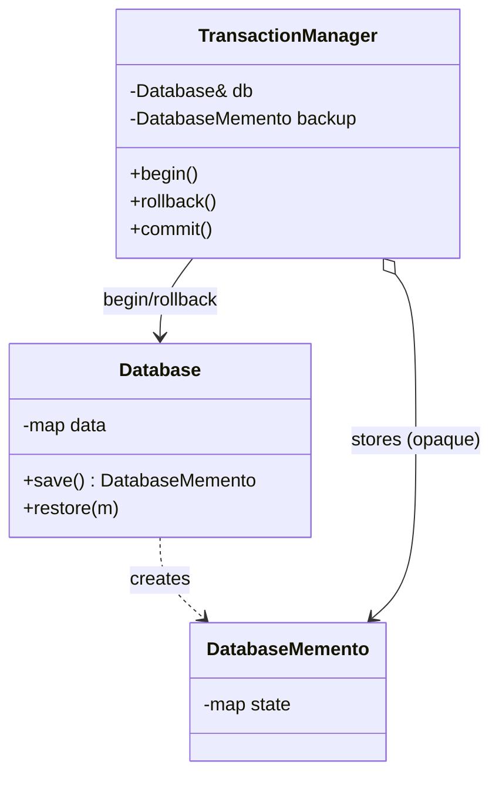
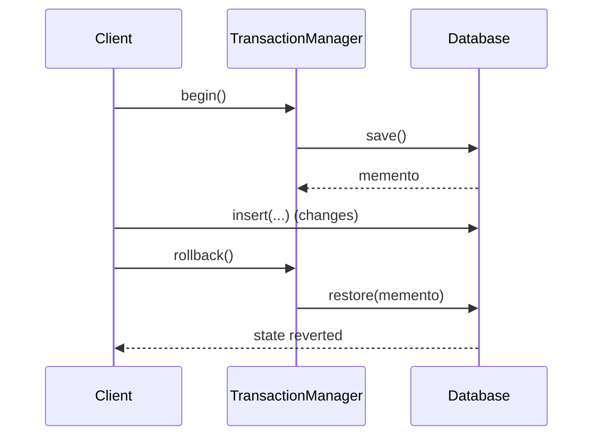

# Memento Design Pattern — Detailed Guide

> **Behavioral Design Pattern** that captures and restores an object's **internal state** **without exposing its internals**. An **Originator** creates a memento snapshot, a **Caretaker** stores it, and the originator can later restore — enabling **undo / rollback**.

**Domain example (in this repo):** A **database transaction** metaphor — `Database` (originator) snapshots into a `DatabaseMemento`, and a `TransactionManager` (caretaker) commits or rolls back.

**Core problem it solves:** Implementing undo/rollback while keeping an object's encapsulation intact — you don't want callers reaching into private fields to save/restore them.

---

## Table of Contents

1. [Problem — No Undo Without Breaking Encapsulation](#1-problem--no-undo-without-breaking-encapsulation)
2. [What is the Memento Pattern?](#2-what-is-the-memento-pattern)
3. [The Three Roles](#3-the-three-roles)
4. [Real-World Analogy](#4-real-world-analogy)
5. [Key Participants (UML Roles)](#5-key-participants-uml-roles)
6. [When to Use / When to Avoid](#6-when-to-use--when-to-avoid)
7. [Pros and Cons](#7-pros-and-cons)
8. [SOLID Principles Connection](#8-solid-principles-connection)
9. [Folder Structure](#9-folder-structure)
10. [Code Walkthrough](#10-code-walkthrough)
11. [Execution Flow & Expected Output](#11-execution-flow--expected-output)
12. [Architecture Diagrams](#12-architecture-diagrams)
13. [Build & Run](#13-build--run)
14. [Memento vs Related Patterns](#14-memento-vs-related-patterns)
15. [Interview Talking Points & Summary](#15-interview-talking-points--summary)

---

## 1. Problem — No Undo Without Breaking Encapsulation

A naive undo forces callers to read and write the object's private state:

```cpp
// ❌ Caller reaches into internals to save/restore
auto savedRows = db.rows;        // exposes private data
auto savedIndex = db.index;      // tight coupling to internal layout
// ...later...
db.rows = savedRows;             // restore by poking internals
db.index = savedIndex;
```

| Problem | Detail |
| ------- | ------ |
| **Broken encapsulation** | Callers depend on private field layout |
| **Fragile** | Internal changes break every save/restore site |
| **Scattered logic** | Snapshot/restore code spread across callers |
| **No clean rollback** | Hard to revert atomically on failure |

---

## 2. What is the Memento Pattern?

The originator produces an opaque **memento** holding its state. A caretaker keeps mementos but can't read inside them; only the originator can restore from one:

```cpp
DatabaseMemento snapshot = db.save();   // originator creates memento
// ...mutate db...
db.restore(snapshot);                   // originator restores its own state
```

| Property | Detail |
| -------- | ------ |
| **Encapsulated snapshot** | State copied into the memento, internals stay private |
| **Opaque to caretaker** | The caretaker stores but never inspects the memento |
| **Originator-only restore** | Only the originator interprets its memento |
| **Undo/rollback** | Restore returns to a prior snapshot |

---

## 3. The Three Roles

| Role | Responsibility | In this demo |
| ---- | -------------- | ------------ |
| **Originator** | Creates and restores from mementos | `Database` |
| **Memento** | Immutable snapshot of state | `DatabaseMemento` |
| **Caretaker** | Stores mementos, triggers undo; never reads them | `TransactionManager` |

---

## 4. Real-World Analogy

| Analogy | Mapping |
| ------- | ------- |
| **Game save point** | Save state, play on, reload if you die |
| **Ctrl+Z in an editor** | Each edit pushes a snapshot; undo pops one |
| **Database transaction** | `BEGIN` snapshots, `ROLLBACK` restores, `COMMIT` discards |

---

## 5. Key Participants (UML Roles)

| Role | In this demo |
| ---- | ------------ |
| **Originator** | `Database` — `save()` returns a memento, `restore(m)` reverts |
| **Memento** | `DatabaseMemento` — holds a private copy of the state |
| **Caretaker** | `TransactionManager` — keeps the memento, drives commit/rollback |
| **Client** | `main()` — runs a transaction with a rollback |

---

## 6. When to Use / When to Avoid

### ✅ Use when

| Scenario | Example |
| -------- | ------- |
| You need undo/redo | Text editors, drawing apps |
| You need transactional rollback | DB transactions, multi-step forms |
| Snapshots must stay encapsulated | Save without exposing internals |
| Checkpointing | Game saves, workflow steps |

### ❌ Avoid when

| Scenario | Reason |
| -------- | ------ |
| State is huge | Snapshots cost lots of memory |
| Frequent snapshots | Memory/perf overhead piles up |
| State is trivial | A simple copy is enough |

---

## 7. Pros and Cons

### Pros

| Benefit | Detail |
| ------- | ------ |
| **Preserves encapsulation** | Internals never leak to the caretaker |
| **Clean undo/rollback** | Restore to any saved snapshot |
| **Separation of concerns** | Caretaker manages history, not state |
| **Atomic revert** | Roll back to a known-good point on failure |

### Cons

| Drawback | Detail |
| -------- | ------ |
| **Memory cost** | Each memento stores a full state copy |
| **Lifecycle management** | Caretaker must prune old mementos |
| **Deep-copy care** | Snapshots of pointer/graph state need deep copies |

---

## 8. SOLID Principles Connection

| Principle | How Memento applies |
| --------- | ------------------- |
| **SRP** | Originator owns state; caretaker owns history; memento owns the snapshot |
| **Encapsulation** | State stays private; the memento is opaque to outsiders |
| **OCP** | Add new caretaker policies (undo stack, redo) without changing the originator |

---

## 9. Folder Structure

```
L39 Memento_design_pattern/
├── README.md                   ← This guide
└── C++ Code/
    └── MementoPattern.cpp       ← Database transaction commit/rollback
```

---

## 10. Code Walkthrough

**Memento — opaque snapshot:**

```cpp
class DatabaseMemento {
    // private state copy; only Database (friend) can read it
    map<string,string> state;
    friend class Database;
public:
    DatabaseMemento(map<string,string> s) : state(move(s)) {}
};
```

**Originator — creates & restores:**

```cpp
class Database {
    map<string,string> data;
public:
    void insert(const string& k, const string& v) { data[k] = v; }

    DatabaseMemento save() { return DatabaseMemento(data); }   // snapshot
    void restore(const DatabaseMemento& m) { data = m.state; } // revert
};
```

**Caretaker — stores the memento, drives rollback:**

```cpp
class TransactionManager {
    Database& db;
    DatabaseMemento backup;   // never inspected, only held
public:
    void begin()    { backup = db.save(); }
    void rollback() { db.restore(backup); }   // undo all changes since begin
    void commit()   { /* discard backup */ }
};
```

**Key:** `TransactionManager` holds the snapshot but never reads its fields — encapsulation preserved.

---

## 11. Execution Flow & Expected Output

```cpp
Database db;
TransactionManager tx(db);

db.insert("user", "alice");
tx.begin();                 // snapshot
db.insert("user", "bob");   // change within transaction
tx.rollback();              // revert to snapshot
// db["user"] == "alice" again
```

```
Inserted user = alice
Transaction begin (snapshot saved)
Inserted user = bob
Rollback → user restored to alice
```

---

## 12. Architecture Diagrams





---

## 13. Build & Run

```bash
cd "L39 Memento_design_pattern/C++ Code"
g++ -std=c++17 -o memento_demo MementoPattern.cpp && ./memento_demo
```

---

## 14. Memento vs Related Patterns

| Pattern | Intent | Difference from Memento |
| ------- | ------ | ----------------------- |
| **Command** | Encapsulate a request, support undo via inverse ops | Command undoes by *reverse action*; Memento undoes by *state restore* |
| **Prototype** | Clone objects | Prototype copies to create new; Memento copies to restore later |
| **State** | Behavior per internal state | State changes behavior; Memento saves/restores a snapshot |

**Command + Memento** are often combined for robust undo/redo: Command for the action log, Memento for state snapshots.

---

## 15. Interview Talking Points & Summary

**Talking points:**

1. **One-liner:** "Memento captures and restores an object's state without breaking encapsulation."
2. **Three roles:** "Originator creates/restores, Memento holds the snapshot, Caretaker stores it opaquely."
3. **Encapsulation:** "The caretaker never reads the memento — only the originator can interpret it."
4. **vs Command:** "Command undoes via inverse operations; Memento undoes via saved state."
5. **Repo link:** "Extendable to a chess move-history / undo stack (see L37 Chess)."

| Aspect | Detail |
| ------ | ------ |
| **Pattern Type** | Behavioral |
| **Core Idea** | Snapshot and restore state while preserving encapsulation |
| **Repo Example** | Database transaction commit/rollback |
| **Main Problem Solved** | Undo/rollback without exposing internals |
| **Key File** | [`MementoPattern.cpp`](./C%20%2B%2B%20Code/MementoPattern.cpp) |

> **Remember:** A Memento is like a **video-game save point** — you snapshot your progress, keep playing, and if things go wrong you reload exactly where you saved, without ever needing to know how the game stores its state internally. 🎮
