# Inheritance & Composition — Complete Guide (Is-A vs Has-A)

<p align="center">
  
  
</p>

> **EN:** When to inherit vs compose; UML arrows; all 5 inheritance types; strong vs weak Has-A.  
> **HI:** **Is-A** = inheritance (child parent ki tarah treat ho); **Has-A** = doosri class andar / member — ownership decide karta hai kaun sa arrow.

**Related:**

| Doc | Link |
| --- | ---- |
| UML symbols, class + sequence | [`UML_DIAGRAMS_AND_NOTATION.md`](./UML_DIAGRAMS_AND_NOTATION.md) |
| 4 Has-A types (full demos) | [`L1 Composition`](../%20L1%20Composition/) |
| Inheritance depth (virtual, diamond) | [`L3 OOPS_2`](../L3%20OOPS_2/) |
| Runnable L4 code | [`C++ Code/`](./C%20%2B%2B%20Code/) · `./compile.sh` |

---

## Table of Contents

1. [Core idea — Is-A vs Has-A](#1-core-idea--is-a-vs-has-a)
2. [Decision tree — inheritance ya composition?](#2-decision-tree--inheritance-ya-composition)
3. [Has-A family — 4 relationships](#3-has-a-family--4-relationships)
4. [Inheritance (Is-A) — 5 types (detail)](#4-inheritance-is-a--5-types-detail)
5. [Inheritance access modes (public / protected / private)](#5-inheritance-access-modes-public--protected--private)
6. [Composition in C++ — L4 code walkthrough](#6-composition-in-c--l4-code-walkthrough)
7. [Composition vs inheritance — LLD examples](#7-composition-vs-inheritance--lld-examples)
8. [UML arrows — master reference](#8-uml-arrows--master-reference)
9. [Common mistakes](#9-common-mistakes)
10. [Interview Q&A](#10-interview-qa)
11. [Code map & build](#11-code-map--build)
12. [Summary](#12-summary)

---

## 1. Core idea — Is-A vs Has-A

### 1.1 One-line definitions

| Phrase | Matlab | UML | C++ keyword |
| ------ | ------ | --- | ----------- |
| **Is-A** | Child **is a kind of** parent — substitute parent ki jagah use ho sake | Hollow triangle `△` on parent | `: public Base` |
| **Has-A** | Whole **has a** part — part whole ka hissa hai ya use karta hai | Line + diamond (`◆` or `◇`) | Member variable, pointer, `unique_ptr` |

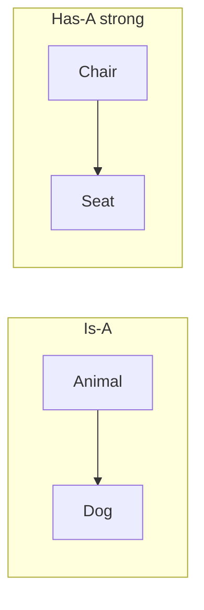

### 1.2 Hindi intuition

| | Is-A (inheritance) | Has-A (composition / aggregation) |
| --- | --- | --- |
| **Rishta** | "Dog **bhi ek** Animal hai" | "Chair **ke paas** Seat hai" |
| **Substitute?** | `Animal* a = &dog;` — polymorphism | `Chair` ko `Seat` ke bina meaningful nahi (strong composition) |
| **Design risk** | Deep trees, fragile base class | Safer for LLD — behaviour inject karo |

### 1.3 Class notes se (lesson)

> *Inheritance me **is a** relation hota hai.*  
> *Composition me **has a** relation hota hai — independently exist nahi kar sakte (strong case).*

**Important:** Notebook me "has a" often **composition** ke liye likha hai. UML me **aggregation** bhi Has-A family hai, lekin **weak** — part alag zindagi jeet sakta hai. Dono alag arrows hain — [§3](#3-has-a-family--4-relationships).

---

## 2. Decision tree — inheritance ya composition?

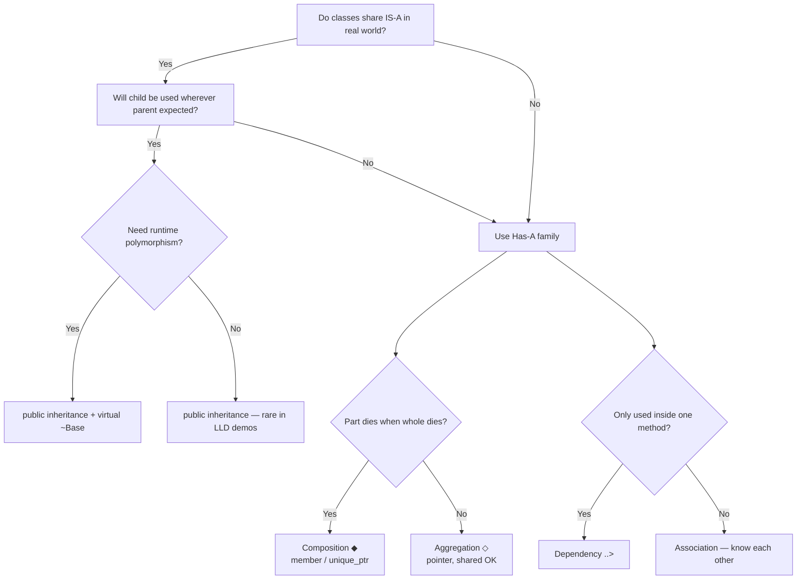

### 2.1 When to use **inheritance**

| ✅ Use | Example |
| ----- | ------- |
| True subtype, LSP holds | `ManualCar : Car` — parking slot me `Car*` |
| Shared interface, polymorphic calls | `Shape*` → `Circle`, `Rectangle` |
| Framework extension point | `LogHandler` → `InfoHandler` (CoR / Logger) |

| ❌ Avoid | Kyon |
| ------- | ---- |
| Sirf code reuse ke liye | Inheritance = contract + coupling |
| "Has behaviour X" ke liye subclass | Use **Strategy** (composition) |
| Deep hierarchy (>2–3 levels) | Hard to change base |

### 2.2 When to use **composition**

| ✅ Use | Example |
| ----- | ------- |
| Part lifetime = owner lifetime | `House` ◆ `Room` |
| Swap behaviour at runtime | `ParkingLot` has `PricingStrategy*` |
| Multiple capabilities mix | `AllInOne` printer + scanner (multiple inheritance — use carefully) |

**Golden LLD line:** *"Favour composition over inheritance"* — jab **Has-A** natural ho aur **Is-A** force na karna pade.

---

## 3. Has-A family — 4 relationships

Strength badhti hai: **Dependency → Association → Aggregation → Composition**

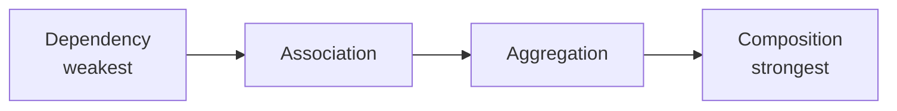

### 3.1 Comparison table (yaad rakhne wala)

| Relationship | Ownership | Lifetime | UML | C++ typical | Example |
| ------------ | --------- | -------- | --- | ----------- | ------- |
| **Dependency** | ❌ None | Method / param scope | `..>` dashed | Parameter, local var | `OrderService` uses `Logger` in one method |
| **Association** | ❌ None | Independent | `—` solid line | Reference, non-owning ptr | `Teacher` knows `Student` |
| **Aggregation** | Weak ◇ | Part **may** outlive whole | `◇` hollow diamond | `Engine*` in `Car`, engine swap | Department has employees |
| **Composition** | Strong ◆ | Part **dies with** whole | `◆` filled diamond | Member object, `unique_ptr` | `Chair` has `Seat` |

### 3.2 Lesson notes — line by line

| Note (class) | Expanded meaning | Demo |
| ------------ | ---------------- | ---- |
| *Simple Association — no ownership* | Dono alag entities; link use ke liye | [`L1 01_Association`](../%20L1%20Composition/C%20%2B%2B%20Code/01_Association.cpp) |
| *Aggregation — independently exist* | Whole destroy ho, part reh sakta | [`L1 02_Aggregation`](../%20L1%20Composition/C%20%2B%2B%20Code/02_Aggregation.cpp) |
| *Composition — independently exist nahi* | Part without whole meaningless | [`L1 03_Composition`](../%20L1%20Composition/C%20%2B%2B%20Code/03_Composition.cpp) |
| *Composition — object andar* | Value member ya ctor me `unique_ptr` | [`02_Composition_UniquePtr.cpp`](./C%20%2B%2B%20Code/02_Composition_UniquePtr.cpp) |

### 3.3 Composition vs aggregation — interview example

```cpp
// Composition (strong): Room cannot exist without House in this model
class House {
    Room livingRoom;  // or unique_ptr<Room>
};

// Aggregation (weak): Engine can be removed / reused
class Car {
    Engine* engine;  // Car does not necessarily create Engine
};
```

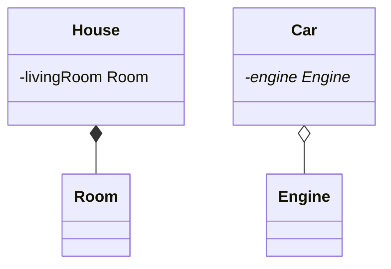

---

## 4. Inheritance (Is-A) — 5 types (detail)

**Runnable:** [`C++ Code/01_Inheritance_Five_Types.cpp`](./C%20%2B%2B%20Code/01_Inheritance_Five_Types.cpp)  
**Also:** [`L3 00_Five_Types_Of_Inheritance.cpp`](../L3%20OOPS_2/C++%20Code/00_Five_Types_Of_Inheritance.cpp)

```bash
./bin/01_Inheritance_Five_Types
```

---

### 4.1 Single inheritance

> **Hindi:** Ek parent, ek child.

```cpp
class Dog : public Animal {
public:
    void bark();
};
```

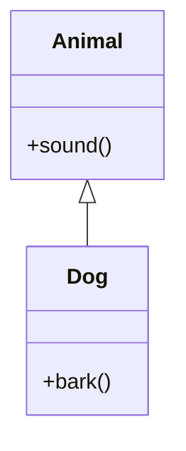

| Point | Detail |
| ----- | ------ |
| **UML** | Single hollow triangle to one base |
| **`public`** | `Animal::sound()` stays public on `Dog` |
| **Output** | `Animal makes sound` → `Dog barks` |
| **LLD** | Most common — `ElectricCar : Car` |

---

### 4.2 Multilevel inheritance

> **Chain:** Grandparent → parent → child.

```cpp
class Alphonso : public Mango {};  // Mango : Fruit
```

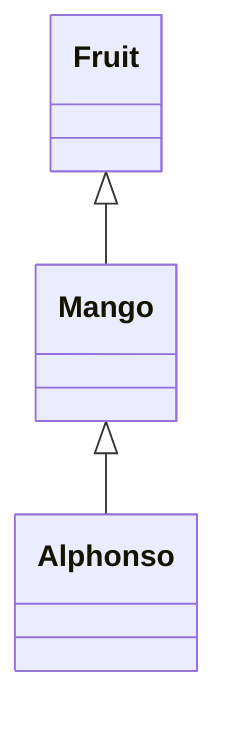

| Point | Detail |
| ----- | ------ |
| **Access** | `Alphonso` gets `name`, `weight`, `sugarLevel` |
| **Risk** | Deep chain — change in `Fruit` affects everyone |
| **Output** | `Alphonso Mango 300g 90%` |
| **Ctor chain** | [`L3 Constructor Chaining`](../L3%20OOPS_2/C++%20Code/11_Constructor_Chaining.cpp) |

---

### 4.3 Multiple inheritance

> **Do (ya zyada) parents, ek child.**

```cpp
class C : public A, public B {
public:
    int maths = 95;
};
```

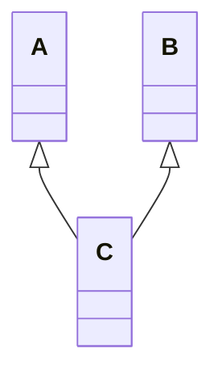

| Point | Detail |
| ----- | ------ |
| **Matlab** | `C` has `physics`, `chemistry`, `maths` |
| **Ambiguity** | Same method name in A and B → explicit scope `A::foo()` |
| **Diamond** | Agar A,B same grandparent se → **virtual inheritance** — [`L3 08_Diamond_Problem`](../L3%20OOPS_2/C++%20Code/08_Diamond_Problem.cpp) |
| **Java** | No multiple class inheritance — C++ allows; use sparingly in LLD |

**Output:** `85 90 95`

---

### 4.4 Hierarchical inheritance

> **Ek parent, kai children — siblings inherit from same base.**

```cpp
class Child1 : public Parent {};
class Child2 : public Parent {};
```

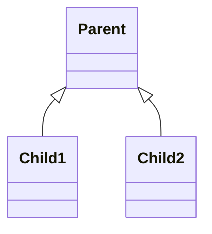

| Point | Detail |
| ----- | ------ |
| **Not** | Child1 does **not** inherit from Child2 |
| **LLD** | `EmailNotification`, `SMSNotification` : `Notification` |
| **Output** | `show()` twice — alag objects |

---

### 4.5 Hybrid inheritance

> **Label:** 2+ inheritance **patterns ka mix** — whiteboard par clearly likho kaun sa mix.

Is demo me: **multiple** (`Result : Student, Marks`) — hierarchical feel alag examples me.

```cpp
class Result : public Student, public Marks {
    void display();  // uses name + score from both bases
};
```

**Hybrid example (multilevel + multiple):**

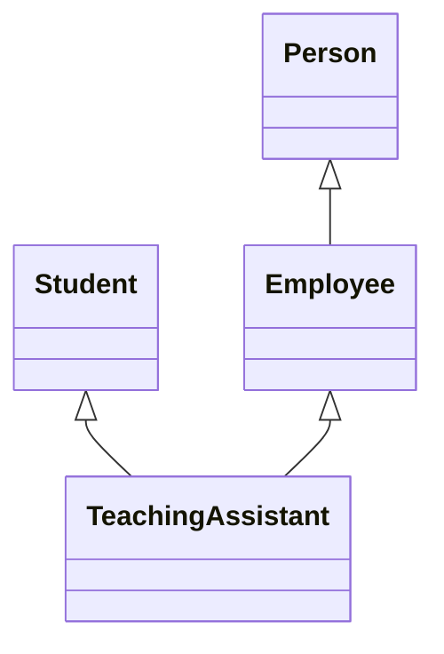

See [`L3 00_Five_Types`](../L3%20OOPS_2/C++%20Code/00_Five_Types_Of_Inheritance.cpp) — `TeachingAssistant : Employee, Student`.

### 4.6 Five types — revision table

| # | Type | Structure | Repo demo class |
| - | ---- | --------- | --------------- |
| 1 | Single | A → B | `Dog : Animal` |
| 2 | Multilevel | A → B → C | `Alphonso : Mango : Fruit` |
| 3 | Multiple | A,B → C | `C : A, B` |
| 4 | Hierarchical | A → B, A → C | `Child1`, `Child2 : Parent` |
| 5 | Hybrid | Mix | `Result : Student, Marks` / TA example in L3 |

---

## 5. Inheritance access modes (public / protected / private)

Child me base members ka **effective access** inheritance type se change hota hai.

| Base member | `public` inheritance | `protected` inheritance | `private` inheritance |
| ----------- | -------------------- | ----------------------- | --------------------- |
| **public** | public | protected | private |
| **protected** | protected | protected | private |
| **private** | NA (not accessible in child) | NA | NA |

**Default for IS-A in interviews:** `class Child : public Base`

Full table + code: [`L3 notes — access modes`](../L3%20OOPS_2/notes/06_access_and_chaining.md#2-inheritance-modes-access-table) · [`10_Access_Specifiers_Inheritance.cpp`](../L3%20OOPS_2/C++%20Code/10_Access_Specifiers_Inheritance.cpp)

---

## 6. Composition in C++ — L4 code walkthrough

### 6.1 `02_Composition_UniquePtr.cpp` — recommended

**Idea:** Class **`B` owns `A`**. Lifetime bind — `B` destroy → `A` destroy.

```cpp
class B {
    unique_ptr<A> a;
public:
    B() { a = make_unique<A>(); }
    void call_A_method() { a->method1(); }
};
```

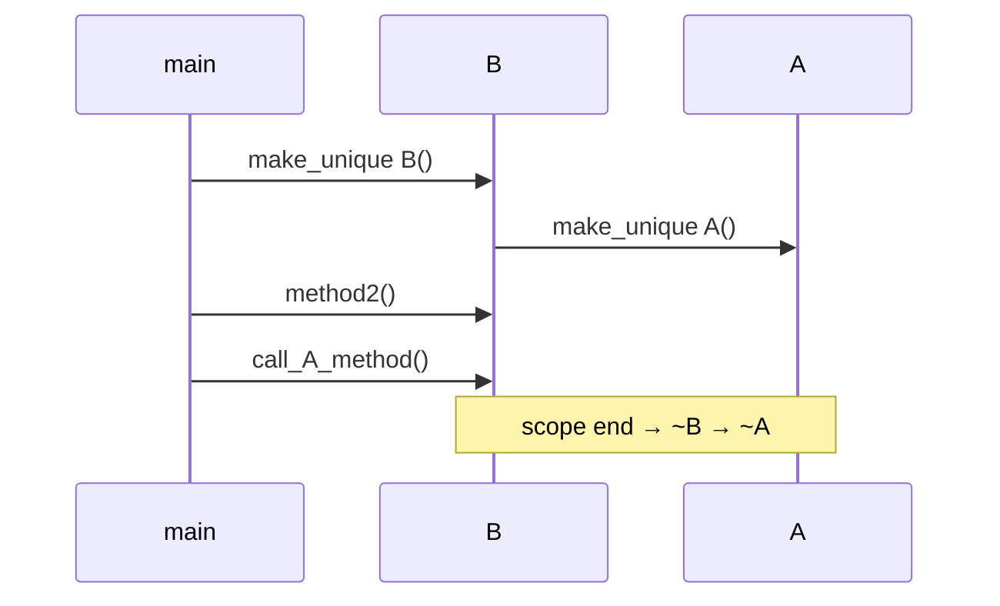

| Topic | Detail |
| ----- | ------ |
| **Ownership** | Exactly one owner — `unique_ptr` |
| **`getA()`** | Raw pointer — **do not delete**; prefer `call_A_method()` |
| **Exception safety** | `make_unique` — ctor fail pe leak nahi |
| **Output order** | `Method2...` then `Method1...` (twice) |

#### Classic vs modern (summary table)

| Old (risky) | Modern (RAII) |
| ----------- | ------------- |
| `A* a = new A();` | `unique_ptr<A> a = make_unique<A>();` |
| `~B() { delete a; }` | destructor default — auto cleanup |
| `B* b = new B(); delete b;` | `unique_ptr<B> b = make_unique<B>();` |

---

### 6.2 `03_Composition_OldStyle_Ptr.cpp` — interview only

Same B–A model with `A* a = new A()` and `~B() { delete a; }`.

| Show interviewer | Production |
| ---------------- | ---------- |
| You understand ownership | Use `unique_ptr` |
| Why `~B` must delete | Rule of thumb: who `new`, who `delete` |

**Output includes:** `A destroyed`, `B destroyed and A memory freed`

---

### 6.3 `04_Composition_Chair_Example.cpp` — real-world multi-part

```cpp
class Chair {
    unique_ptr<Seat> seat;
    unique_ptr<Arms> arms;
    unique_ptr<Wheels> wheels;
    unique_ptr<Cover> cover;
public:
    Chair() {
        seat = make_unique<Seat>();
        // ... all parts born with chair
    }
};
```

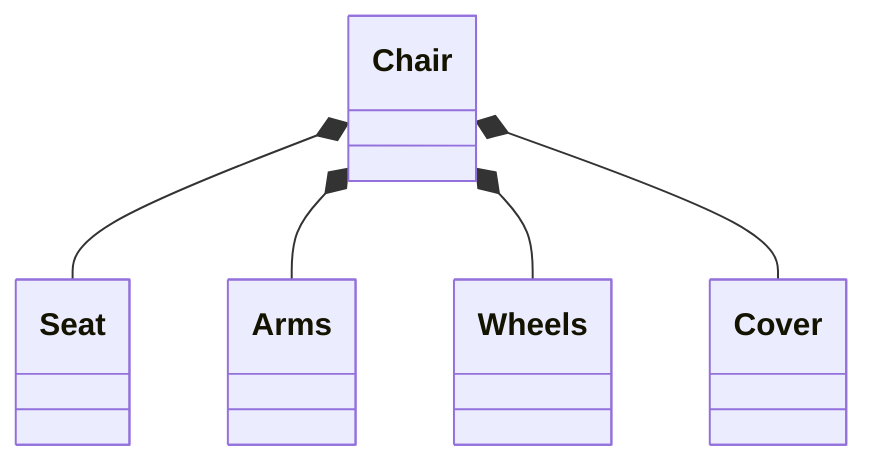

| Point | Detail |
| ----- | ------ |
| **UML** | Chair side par **filled diamond** ◆ |
| **Encapsulation** | `getWheels()` exposes part — comment in code: weakens encapsulation |
| **vs inheritance** | `Chair : Seat` ❌ — Chair is not a Seat |

---

## 7. Composition vs inheritance — LLD examples

| Problem | ❌ Inheritance mistake | ✅ Composition |
| ------- | --------------------- | -------------- |
| Parking pricing | `ParkingLot : HourlyPricing` | `ParkingLot` has `PricingStrategy` |
| Notifications | `EmailService : Logger` | `EmailService` uses `Logger` (dependency / member) |
| ATM dispense | Monolithic `dispense()` | Handler **chain** (CoR) — [`L22`](../L22%20Chain_of_responsiblity_patten%28ATM_Cash_Dispenser%20LLD/)) |
| Food payment | Subclass per payment type | `PaymentStrategy` interface + compose |

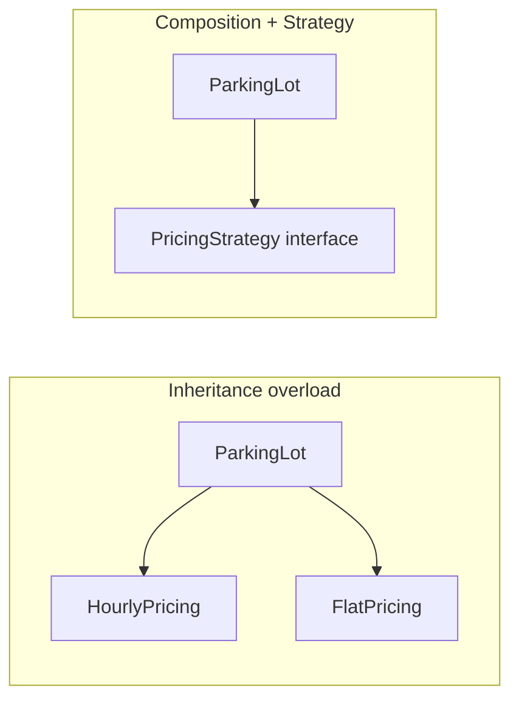

**Rule:** Agar reason **"is a"** nahi hai, inheritance mat lagao — **member + interface** use karo (L8 Strategy).

---

## 8. UML arrows — master reference

| # | Relationship | Arrow (hand-draw) | Mermaid (approx) | C++ |
| - | ------------ | ----------------- | ---------------- | --- |
| 1 | Inheritance | `△` on base | `<\|--` | `: public Base` |
| 2 | Composition | `◆` on whole | `*--` | member / `unique_ptr` |
| 3 | Aggregation | `◇` on whole | `o--` | non-owning / shared ptr |
| 4 | Association | plain line | `--` | reference |
| 5 | Dependency | dashed `..>` | `..>` | parameter, local |

### 8.1 Side-by-side: inheritance vs composition arrow

```
Is-A:     [Child] ──△──> [Parent]     (triangle on parent side)

Has-A:    [Whole] ◆──── [Part]       (filled diamond on whole)
```

### 8.2 Class diagram visibility (quick)

| Symbol | Access |
| ------ | ------ |
| `+` | public |
| `#` | protected |
| `-` | private |

Full: [`UML_DIAGRAMS_AND_NOTATION.md` §4](./UML_DIAGRAMS_AND_NOTATION.md#4-visibility--modifiers)

---

## 9. Common mistakes

| Mistake | Fix |
| ------- | --- |
| `Chair : Seat` (Is-A galat) | `Chair` **has** `Seat` (composition) |
| Deep inheritance for code reuse | Extract helper / composition |
| `getA()` return + caller `delete` | Keep ownership inside `B`; delegate methods |
| Confuse aggregation vs composition | Lifetime: part dies with whole? → composition |
| Multiple inheritance without reason | Composition + interfaces; watch diamond |
| No `virtual ~Base()` with polymorphic delete | Always virtual destructor when base ptr delete |
| `protected` inheritance for IS-A | Use `public` for substitutability |

---

## 10. Interview Q&A

<details>
<summary><strong>Is-A vs Has-A ek line me?</strong></summary>

**Is-A:** inheritance — child parent ki jagah use ho sake (`Dog` is `Animal`).  
**Has-A:** whole contains part — composition/aggregation/association by strength.

</details>

<details>
<summary><strong>Composition vs aggregation?</strong></summary>

| | Composition ◆ | Aggregation ◇ |
| --- | --- | --- |
| Lifetime | Part dies with whole | Part may survive |
| Ownership | Strong | Weak / shared |
| Example | House–Room | Car–Engine (swappable) |

</details>

<details>
<summary><strong>5 inheritance types + example?</strong></summary>

1. Single — `Dog : Animal`  
2. Multilevel — `Alphonso : Mango : Fruit`  
3. Multiple — `C : A, B`  
4. Hierarchical — `Child1`, `Child2 : Parent`  
5. Hybrid — mix (e.g. TA: Employee + Student)

Run: `./bin/01_Inheritance_Five_Types`

</details>

<details>
<summary><strong>Why unique_ptr for composition?</strong></summary>

Single owner, automatic destroy, exception safe, no manual `delete`.  
`B` owns `A` — when `B` goes, `A` goes.

</details>

<details>
<summary><strong>Composition over inheritance — example?</strong></summary>

`ParkingLot` **has-a** `PricingStrategy`, not `ParkingLot : HourlyStrategy`.  
Runtime pe strategy swap — OCP friendly (L8).

</details>

<details>
<summary><strong>Diamond problem kab aata hai?</strong></summary>

Multiple inheritance jab do parents same grandparent se inherit karein — duplicate base subobject.  
Fix: `virtual` base class — [`L3 08_Diamond_Problem`](../L3%20OOPS_2/C++%20Code/08_Diamond_Problem.cpp).

</details>

---

## 11. Code map & build

| File | Topic | Run |
| ---- | ----- | --- |
| [`01_Inheritance_Five_Types.cpp`](./C%20%2B%2B%20Code/01_Inheritance_Five_Types.cpp) | 5 inheritance types | `./bin/01_Inheritance_Five_Types` |
| [`02_Composition_UniquePtr.cpp`](./C%20%2B%2B%20Code/02_Composition_UniquePtr.cpp) | RAII composition | `./bin/02_Composition_UniquePtr` |
| [`03_Composition_OldStyle_Ptr.cpp`](./C%20%2B%2B%20Code/03_Composition_OldStyle_Ptr.cpp) | Manual new/delete | `./bin/03_Composition_OldStyle_Ptr` |
| [`04_Composition_Chair_Example.cpp`](./C%20%2B%2B%20Code/04_Composition_Chair_Example.cpp) | Multi-part Chair | `./bin/04_Composition_Chair_Example` |

```bash
cd "L4 UML_Diagrams"
chmod +x compile.sh && ./compile.sh
```

| L1 (4 Has-A types) | Link |
| ------------------ | ---- |
| Association | [`L1 01_Association`](../%20L1%20Composition/C%20%2B%2B%20Code/01_Association.cpp) |
| Aggregation | `02_Aggregation` |
| Composition | `03_Composition` |
| Dependency | `04_Dependency` |

---

## 12. Summary

| Pehlu | Detail |
| ----- | ------ |
| **Is-A** | Inheritance `△` — subtype, LSP, `public` inherit |
| **Has-A** | Dependency → Association → Aggregation → Composition |
| **Strongest Has-A** | Composition ◆ — part dies with whole; `unique_ptr` in C++ |
| **5 inheritance types** | Single, Multilevel, Multiple, Hierarchical, Hybrid |
| **LLD default** | Composition + Strategy over inheritance hierarchy |
| **L4 run** | `./compile.sh` then `01` … `04` |
| **Next read** | [`UML_DIAGRAMS_AND_NOTATION.md`](./UML_DIAGRAMS_AND_NOTATION.md) — class + sequence diagrams |

> **Yaad rakho:** Pehle relationship type choose karo (arrow), phir C++ mapping — `public Base` ya `unique_ptr<Part>`. Whiteboard par arrow galat = design galat. 🎯
