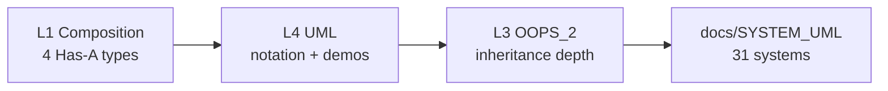

# L4 — UML Diagrams & Notation

<p align="center">
  
  
  
</p>

> **Lesson L4** — UML class & sequence notation, **Is-A** (inheritance) vs **Has-A** (composition), runnable C++ demos.  
> **Prerequisites:** [`L1 Composition`](../%20L1%20Composition/) (Has-A types) · [`L3 OOPS_2`](../L3%20OOPS_2/) (inheritance in depth)

---

## Start here

| Document | Content |
| -------- | ------- |
| **[`UML_DIAGRAMS_AND_NOTATION.md`](./UML_DIAGRAMS_AND_NOTATION.md)** | **Master guide** — 14 diagram types, `+` `#` `-`, class & sequence notation |
| **[`INHERITANCE_AND_COMPOSITION.md`](./INHERITANCE_AND_COMPOSITION.md)** | **Full guide** — Is-A vs Has-A, 5 inheritance types, 4 Has-A, code walkthrough, interview Q&A |
| **[`notes/01_lesson_quick_notes.md`](./notes/01_lesson_quick_notes.md)** | Short class notes (Hindi/English) |
| **`notes.pdf`** | Original PDF notes (if present in folder) |

---

## Folder structure

```
L4 UML_Diagrams/
├── README.md                          ← You are here
├── UML_DIAGRAMS_AND_NOTATION.md       ← Full UML theory
├── INHERITANCE_AND_COMPOSITION.md     ← Is-A / Has-A + links to L1 & L3
├── notes.pdf                          ← Optional PDF
├── compile.sh
├── notes/
│   └── 01_lesson_quick_notes.md
├── C++ Code/
│   ├── 01_Inheritance_Five_Types.cpp  ← 5 inheritance types (Is-A)
│   ├── 02_Composition_UniquePtr.cpp   ← B owns A (unique_ptr)
│   ├── 03_Composition_OldStyle_Ptr.cpp
│   └── 04_Composition_Chair_Example.cpp
└── bin/                               ← built binaries (after compile.sh)
```

---

## Build & run

```bash
cd "L4 UML_Diagrams"
chmod +x compile.sh
./compile.sh

./bin/01_Inheritance_Five_Types    # 5 inheritance sections
./bin/02_Composition_UniquePtr     # RAII composition
./bin/03_Composition_OldStyle_Ptr  # new/delete style
./bin/04_Composition_Chair_Example # Chair + parts
```

---

## Code summary

| File | UML / concept | One line |
| ---- | ------------- | -------- |
| [`01_Inheritance_Five_Types.cpp`](./C%20%2B%2B%20Code/01_Inheritance_Five_Types.cpp) | Inheritance `△` | Single → Multilevel → Multiple → Hierarchical → Hybrid |
| [`02_Composition_UniquePtr.cpp`](./C%20%2B%2B%20Code/02_Composition_UniquePtr.cpp) | Composition `◆` | `B` owns `A` — `make_unique`, no manual delete |
| [`03_Composition_OldStyle_Ptr.cpp`](./C%20%2B%2B%20Code/03_Composition_OldStyle_Ptr.cpp) | Composition (legacy) | Same idea with `new` / `delete` |
| [`04_Composition_Chair_Example.cpp`](./C%20%2B%2B%20Code/04_Composition_Chair_Example.cpp) | Multi-part composition | `Chair` has `Seat`, `Arms`, `Wheels`, `Cover` |

---

## Learning path



| Step | Action |
| ---- | ------ |
| 1 | Read [`UML_DIAGRAMS_AND_NOTATION.md`](./UML_DIAGRAMS_AND_NOTATION.md) §0–§8 (class + sequence) |
| 2 | Run `./bin/01_Inheritance_Five_Types` — match output to [`INHERITANCE_AND_COMPOSITION.md`](./INHERITANCE_AND_COMPOSITION.md) |
| 3 | Run `./bin/02_Composition_UniquePtr` — compare with `03` old style |
| 4 | Practice: [`docs/SYSTEM_CLASS_AND_SEQUENCE_DIAGRAMS.md`](../docs/SYSTEM_CLASS_AND_SEQUENCE_DIAGRAMS.md) |

---

## Related lessons

| Lesson | Link |
| ------ | ---- |
| L1 Composition | [`../%20L1%20Composition/`](../%20L1%20Composition/) |
| L3 OOPS_2 — 5 inheritance types | [`00_Five_Types_Of_Inheritance.cpp`](../L3%20OOPS_2/C++%20Code/00_Five_Types_Of_Inheritance.cpp) |
| L5 SOLID | [`../L5 SOLID_1/`](../L5%20SOLID_1/) |

---

## Interview one-liners

- **Class diagram:** static structure — classes, fields, methods, relations.
- **Sequence diagram:** dynamic — who calls whom, in time order.
- **Is-A:** inheritance; **Has-A strong:** composition (`unique_ptr` / part inside owner).
- **Composition > inheritance** when behaviour swap chahiye without subclass explosion (Strategy).

<p align="center">
  <b>Draw class diagram → trace sequence → then code.</b>
</p>
