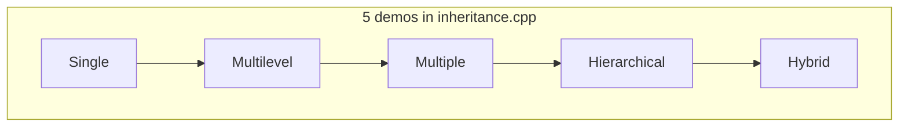
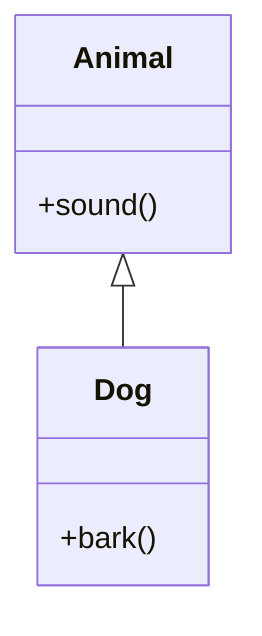
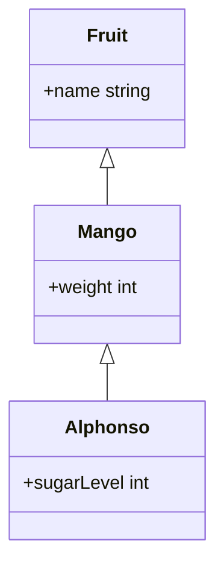
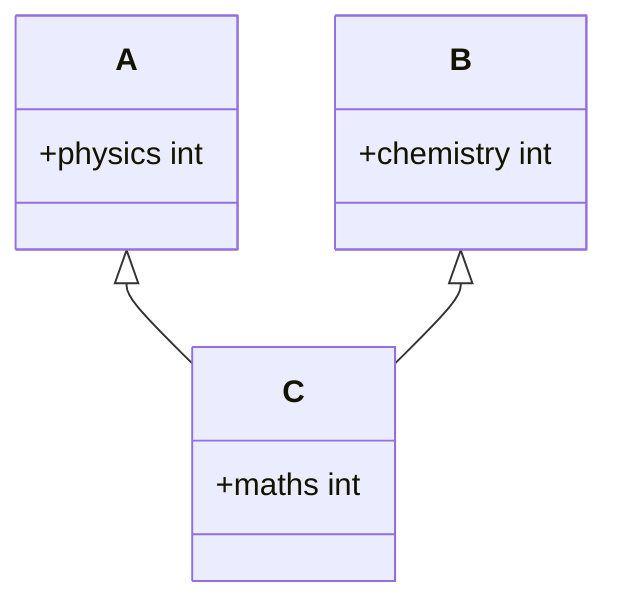
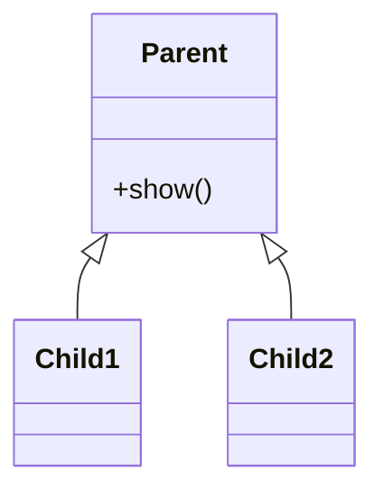
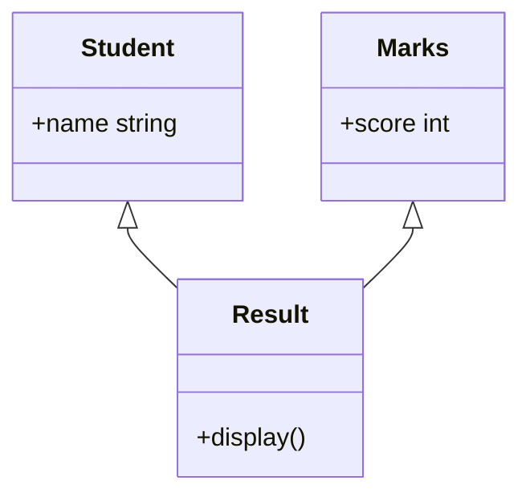
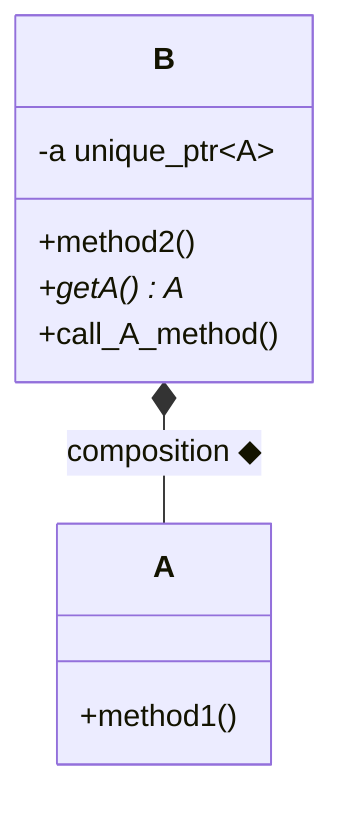
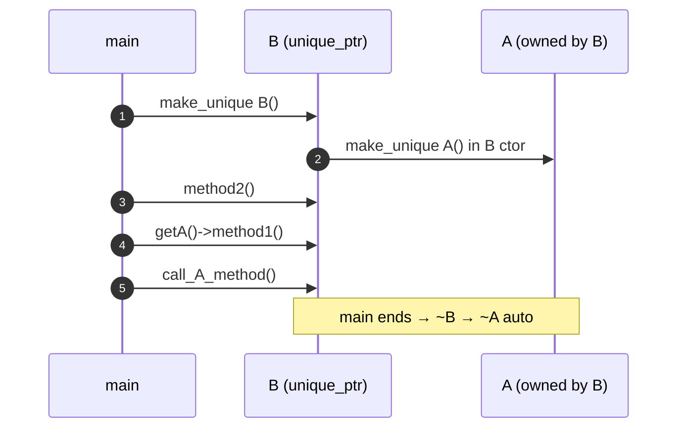
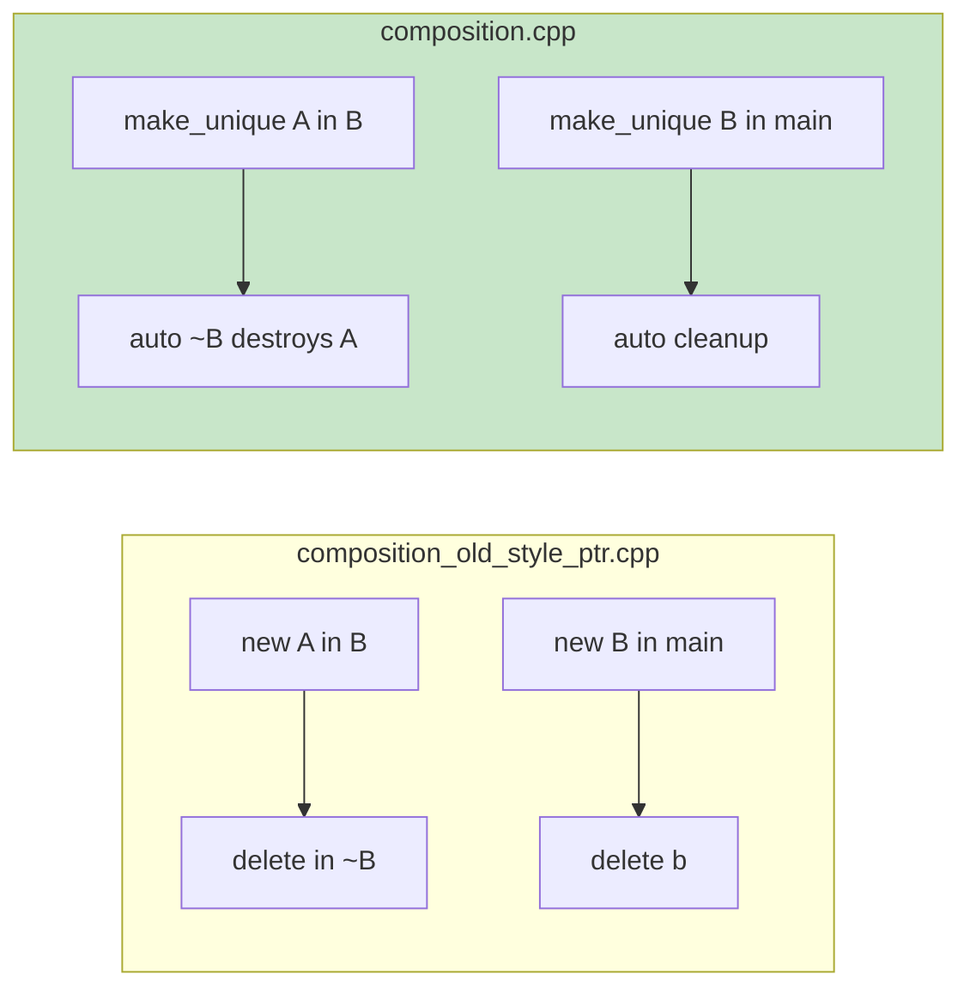
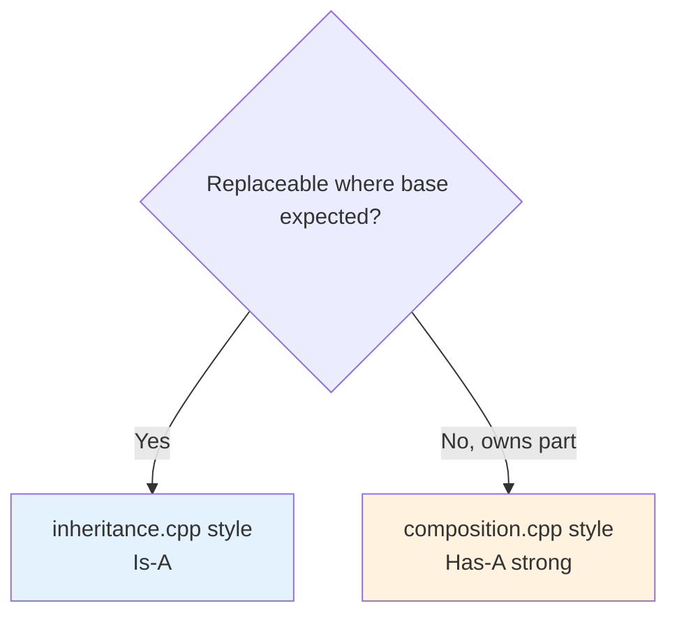

# L4 — `composition.cpp` & `inheritance.cpp` — Detailed README

<p align="center">
  
  
  
</p>

> **Ye README** sirf in do runnable demos ka deep dive hai:  
> [`inheritance.cpp`](./inheritance.cpp) · [`composition.cpp`](./composition.cpp)  
>  
> **Theory / UML notation:** [`INHERITANCE_AND_COMPOSITION.md`](./INHERITANCE_AND_COMPOSITION.md) · [`UML_DIAGRAMS_AND_NOTATION.md`](./UML_DIAGRAMS_AND_NOTATION.md) · [`4.txt`](./4.txt)

---

## Table of Contents

1. [Quick Start — Compile & Run](#1-quick-start--compile--run)
2. [`inheritance.cpp` — Is-A (5 Types)](#2-inheritancecpp--is-a-5-types)
3. [`composition.cpp` — Has-A (B owns A)](#3-compositioncpp--has-a-b-owns-a)
4. [Dono Files Ka Comparison](#4-dono-files-ka-comparison)
5. [Related Files in L4](#5-related-files-in-l4)
6. [Interview One-Liners](#6-interview-one-liners)

---

## 1. Quick Start — Compile & Run

```bash
cd "L4 UML_Diagrams"

# Inheritance demo (5 types in one program)
g++ -std=c++17 inheritance.cpp -o inheritance && ./inheritance

# Composition demo (unique_ptr ownership)
g++ -std=c++17 composition.cpp -o composition && ./composition
```

| File | Compiler | Output |
|------|----------|--------|
| `inheritance.cpp` | C++17 (`string` in `Fruit` chain) | 5 sections printed — Single, Multilevel, Multiple, Hierarchical, Hybrid |
| `composition.cpp` | C++17 + `<memory>` | `Method2...`, `Method1...` (twice via different paths) |

**Clangd / IDE:** Repo root ya is folder me `-std=c++17` — `bits/stdc++.h` Linux/macOS par usually OK; macOS par agar header missing ho to `g++` se compile verify karo.

---

## 2. `inheritance.cpp` — Is-A (5 Types)

### 2.1 File ka purpose

Ek hi `main()` me **5 inheritance patterns** run hote hain — interview revision ke liye.  
Relation: **`4.txt`** — *inheritance me is a relation hota h*.



> **Naming note:** Is file me multiple inheritance ke liye classes **`A`**, **`B`**, **`C`** hain — ye **`composition.cpp`** wale `A`/`B` se **alag** demo hain. Confuse mat ho.

---

### 2.2 Single inheritance

**Code:**

```cpp
class Dog : public Animal {
public:
    void bark();
};
```

**UML:**



| Point | Detail |
|-------|--------|
| **Relation** | `Dog` **IS-A** `Animal` |
| **`public` inheritance** | `Animal::sound()` Dog par **public** rehta hai |
| **Runtime** | `Dog d; d.sound(); d.bark();` |

**Expected output:**

```text
--- Single Inheritance ---
Animal makes sound
Dog barks
```

**Interview:** Sabse common — base interface + child extra behaviour (`Vehicle` → `Car`).

---

### 2.3 Multilevel inheritance

**Chain:** `Fruit` → `Mango` → `Alphonso`



| Point | Detail |
|-------|--------|
| **Access** | `Alphonso` ko `name`, `weight`, `sugarLevel` sab inherit |
| **main** | `a.name = "Alphonso Mango";` — grandparent field child se set |

**Expected output:**

```text
--- Multilevel Inheritance ---
Alphonso Mango 300g 90%
```

**Interview:** Depth zyada ho to beech me abstract layer — shallow hierarchy prefer.

---

### 2.4 Multiple inheritance

**Code:**

```cpp
class C : public A, public B {
public:
    int maths = 95;
};
```



| Point | Detail |
|-------|--------|
| **Matlab** | `C` ke paas **dono parents** ke public members |
| **main** | `obj.physics`, `obj.chemistry`, `obj.maths` — ek object |

**Expected output:**

```text
--- Multiple Inheritance ---
85 90 95
```

**Caution:** Agar `A` aur `B` me same-named member ho → ambiguity. **Diamond problem** jab dono parents same grandparent se aaye — is demo me nahi hai.

**LLD tip:** Java style multiple class inheritance nahi — C++ me ho sakta hai; prefer **interface + composition**.

---

### 2.5 Hierarchical inheritance

**Ek parent, do (ya zyada) children** — siblings **ek doosre se inherit nahi**.



| Point | Detail |
|-------|--------|
| **Child1 / Child2** | Empty class — sirf `Parent::show()` inherit |
| **main** | Alag objects `c1`, `c2` |

**Expected output:**

```text
--- Hierarchical Inheritance ---
This is parent class
This is parent class
```

**Real LLD:** `Notification` base → `EmailNotification`, `SMSNotification`.

---

### 2.6 Hybrid inheritance

**Definition:** Do ya zyada inheritance **types ka mix** (yahan **multiple** + hierarchical jaisa feel).

```cpp
class Result : public Student, public Marks {
    void display();  // name + score dono parents se
};
```



**Expected output:**

```text
--- Hybrid Inheritance ---
Name: Rahul
Score: 88
```

**Interview line:** “Hybrid = combination label; whiteboard par clearly batao kaun sa pattern mix hai.”

---

### 2.7 `inheritance.cpp` — revision table

| # | Type | Classes | `main` me kya hota hai |
|---|------|---------|------------------------|
| 1 | Single | `Dog` : `Animal` | `sound()` + `bark()` |
| 2 | Multilevel | `Alphonso` : `Mango` : `Fruit` | Fields set + print |
| 3 | Multiple | `C` : `A`, `B` | 3 marks print |
| 4 | Hierarchical | `Child1`, `Child2` : `Parent` | `show()` dono se |
| 5 | Hybrid | `Result` : `Student`, `Marks` | `display()` |

---

## 3. `composition.cpp` — Has-A (B owns A)

### 3.1 File ka purpose

**Composition (strong has-a):** class **`B`** class **`A`** ko **own** karti hai — `std::unique_ptr<A>`.  
Jab `B` destroy → **`A` automatically** destroy.

Relation: **`4.txt`** — *composition me has a relation; independently exist nhi kr skte; class ke andar object/pointer*.



---

### 3.2 Class breakdown

#### Class `A`

| Member | Role |
|--------|------|
| `method1()` | Simple behaviour — prove karna ki `B` andar se call kar sakti hai |

#### Class `B`

| Member | Role |
|--------|------|
| `unique_ptr<A> a` | **Owner** — heap pe `A`; sirf ek owner |
| `B()` | `a = make_unique<A>();` — **composition**: `A` `B` ke saath born |
| `method2()` | `B` ka apna kaam |
| `getA()` | `a.get()` — **non-owning** raw pointer; delete caller ki responsibility **nahi** |
| `call_A_method()` | Encapsulated way — `a->method1()` |

---

### 3.3 `main()` flow (step-by-step)



| Step | Line (approx) | Kya hota hai |
|------|---------------|--------------|
| 1 | `unique_ptr<B> b = make_unique<B>();` | `B` heap pe; ctor me `A` banta hai |
| 2 | `b->method2()` | B ka method |
| 3 | `b->getA()->method1()` | Raw pointer se A call — **ownership B ke paas** |
| 4 | `b->call_A_method()` | Same call, better encapsulation |
| 5 | `return 0` | Scope end → `b` destroy → `A` destroy — **no manual `delete`** |

**Expected output (order):**

```text
Method2 of Class B called
Method1 of Class A called
Method1 of Class A called
```

---

### 3.4 Kyun `new` / raw owning pointer avoid?

File ke comments ka summary:

| `new A()` problem | `make_unique<A>()` benefit |
|-------------------|----------------------------|
| Manual `delete` — bhoolne par leak | RAII — destructor auto cleanup |
| Constructor me exception → leak | Exception-safe ownership |
| Ownership unclear | `unique_ptr` = exactly one owner |

**Old style same idea:** [`composition_old_style_ptr.cpp`](./composition_old_style_ptr.cpp) — `A* a = new A();` + `~B() { delete a; }` + `delete b` in `main`.



---

### 3.5 `getA()` vs `call_A_method()` — design note

| API | Ownership | Encapsulation |
|-----|-----------|---------------|
| `getA()` → raw `A*` | Still **B** owns; caller **must not** `delete` | Weak — bahar se `A` poke ho sakta hai |
| `call_A_method()` | B andar delegate | **Better** — LLD me prefer |

**Interview:** “Composition + smart pointer; bahar ko sirf behaviour do, raw pointer last resort.”

---

### 3.6 Code ↔ `4.txt` mapping

| `4.txt` | `composition.cpp` me kaise dikhega |
|---------|-------------------------------------|
| *composition — object andar* | `unique_ptr<A> a` member; ctor me create |
| *independently exist nhi* | `A` ka meaningful life `B` ke bina nahi (demo scope) |
| *has a* | `B` has `A` — UML filled diamond `◆` on `B` |

---

### 3.7 Classic vs Modern (file ke end table)

| Old style | Modern (`composition.cpp`) |
|-----------|----------------------------|
| `A* a` | `unique_ptr<A> a` |
| `a = new A();` | `a = make_unique<A>();` |
| `~B() { delete a; }` | Destructor default — `unique_ptr` deletes `A` |
| `B* b = new B(); delete b;` | `unique_ptr<B> b = make_unique<B>();` |

---

## 4. Dono Files Ka Comparison

| | `inheritance.cpp` | `composition.cpp` |
|---|-------------------|-------------------|
| **Relation** | **Is-A** (`: public Base`) | **Has-A** (member / `unique_ptr`) |
| **`4.txt` phrase** | is a | has a (composition) |
| **UML arrow** | Hollow triangle `△` | Filled diamond `◆` |
| **Lifetime** | Child is subtype of parent | Part dies with whole (`B` → `A`) |
| **Goal of demo** | 5 inheritance shapes | RAII + ownership |
| **Best paired with** | Theory § inheritance types | [`example_of_composition.cpp`](./example_of_composition.cpp) (Chair) |



---

## 5. Related Files in L4

| File | Kya seekhega |
|------|----------------|
| [`inheritance.cpp`](./inheritance.cpp) | 5 inheritance types — **ye README §2** |
| [`composition.cpp`](./composition.cpp) | `unique_ptr` composition — **ye README §3** |
| [`composition_old_style_ptr.cpp`](./composition_old_style_ptr.cpp) | Same B–A, manual `new`/`delete` |
| [`example_of_composition.cpp`](./example_of_composition.cpp) | Real-world `Chair` + `Seat`/`Arms`/… |
| [`4.txt`](./4.txt) | Short Hindi notes |
| [`INHERITANCE_AND_COMPOSITION.md`](./INHERITANCE_AND_COMPOSITION.md) | Full theory + all L4 cpp |
| [`UML_DIAGRAMS_AND_NOTATION.md`](./UML_DIAGRAMS_AND_NOTATION.md) | Symbols `+` `#` `-`, arrows |
| [`../SYSTEM_CLASS_AND_SEQUENCE_DIAGRAMS.md`](../SYSTEM_CLASS_AND_SEQUENCE_DIAGRAMS.md) | 21 system UML practice |

---

## 6. Interview One-Liners

<details>
<summary><strong><code>inheritance.cpp</code> — 5 types ek line me</strong></summary>

1. **Single:** ek parent, ek child (`Dog : Animal`).  
2. **Multilevel:** chain (`Alphonso : Mango : Fruit`).  
3. **Multiple:** do parents, ek child (`C : A, B`).  
4. **Hierarchical:** ek parent, kai children (`Child1`, `Child2 : Parent`).  
5. **Hybrid:** patterns ka mix (`Result : Student, Marks`).

</details>

<details>
<summary><strong><code>composition.cpp</code> — kya bolna hai</strong></summary>

“`B` **owns** `A` via `unique_ptr`. Composition — part ka lifetime owner ke saath. No manual delete; exception safe. Prefer `call_A_method()` over exposing `getA()` for encapsulation.”

</details>

<details>
<summary><strong>Composition vs inheritance — is repo se example</strong></summary>

- **Inheritance:** `Dog` is `Animal` — substitute where `Animal` expected.  
- **Composition:** `B` has `A` — not “`B` is an `A`”.  
- Parking LLD: `ParkingLot` **has** `PricingStrategy`, not `ParkingLot : HourlyPricing`.

</details>

---

<p align="center">
  <b>Run both demos → match output → draw UML from §2 & §3</b><br/>
  <sub>L4 UML_Diagrams — <code>inheritance.cpp</code> + <code>composition.cpp</code></sub>
</p>
