# UML Diagrams & Notation — Complete Guide (L4)

<p align="center">
  
</p>

<p align="center">
  
  
  
</p>

> **Folder:** [`L4 UML_Diagrams/`](./)  
> **Relations deep dive:** [`INHERITANCE_AND_COMPOSITION.md`](./INHERITANCE_AND_COMPOSITION.md)  
> **21 systems (practice):** [`SYSTEM_CLASS_AND_SEQUENCE_DIAGRAMS.md`](../docs/SYSTEM_CLASS_AND_SEQUENCE_DIAGRAMS.md)  
> **Short notes:** [`notes/01_lesson_quick_notes.md`](./notes/01_lesson_quick_notes.md)

---

## Table of Contents

0. [Visual Map — Kaunsa Diagram Kab](#0-visual-map--kaunsa-diagram-kab)
1. [UML Do Parivar — Structural vs Behavioral](#1-uml-do-parivar--structural-vs-behavioral)
1.5. [Lesson quick notes (expanded)](#15-lesson-quick-notes-expanded)
2. [14 Diagram Types (Overview)](#2-14-diagram-types-overview)
3. [Class Diagram — Box & Members](#3-class-diagram--box--members)
4. [Visibility & Modifiers (`+` `#` `-`)](#4-visibility--modifiers)
5. [Abstract vs Concrete Class](#5-abstract-vs-concrete-class)
6. [Relationships & Arrows — Master Table](#6-relationships--arrows--master-table)
7. [Multiplicity & Role Names](#7-multiplicity--role-names)
8. [Sequence Diagram — Poori Notation](#8-sequence-diagram--poori-notation)
9. [Mermaid vs Hand-Drawn UML](#9-mermaid-vs-hand-drawn-uml)
10. [Repo Me Diagrams Kahan Hain](#10-repo-me-diagrams-kahan-hain)
11. [Whiteboard Template — Class + Sequence](#11-whiteboard-template--class--sequence)
12. [Interview Cheat Sheet](#12-interview-cheat-sheet)

---

## 0. Visual Map — Kaunsa Diagram Kab

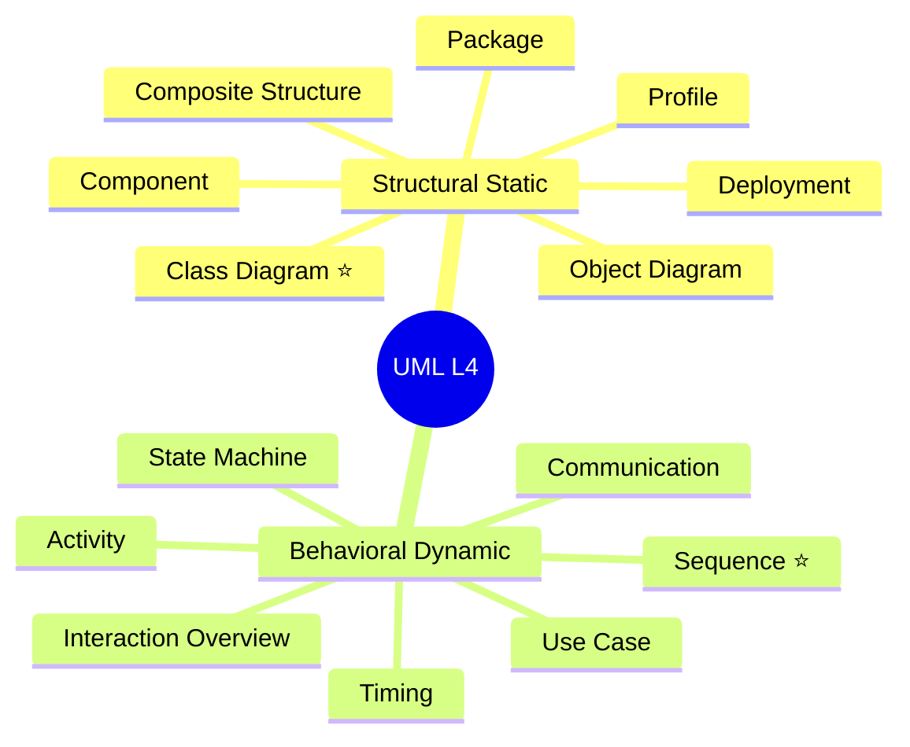

**Lesson notes rule for this repo:**

| Type | Padhna hai? | Kyun |
|------|-------------|------|
| **Class Diagram** | ✅ **Must** | Classes, fields, methods, relations — LLD design |
| **Sequence Diagram** | ✅ **Must** | Object A object B se kaise baat karta hai — flows |
| Baaki 12 | 📖 Awareness | Interview me kabhi-kabhi name puchte hain |

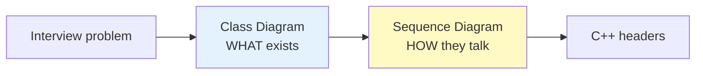

---

## 1. UML Do Parivar — Structural vs Behavioral

| Parivar | Hindi | Kya dikhata hai | Time |
|---------|-------|-----------------|------|
| **Structural** (Static) | *Cheezein kaun kaun hain* | Classes, parts, ports, deployment nodes | Ek snapshot |
| **Behavioral** (Dynamic) | *Cheezein kaise behave karti hain* | Messages, states, activities over time | Flow / timeline |

**Analogy:**

- **Class diagram** = building ka **blueprint** (kaun si room kahan)
- **Sequence diagram** = **CCTV timeline** — kis order me kis room me kaun gaya

---

## 1.5 Lesson quick notes (expanded)

<a id="15-lesson-quick-notes-expanded"></a>

Tumhari original file [`notes/01_lesson_quick_notes.md`](./notes/01_lesson_quick_notes.md) — poori + har line ka **detail explanation** isi guide me. (Relations + code examples: [`INHERITANCE_AND_COMPOSITION.md`](./INHERITANCE_AND_COMPOSITION.md))

<details>
<summary><strong>📄 Poora raw text — <code>4.txt</code> (click to expand)</strong></summary>

```
UML diagrams 2 type ke hote hai Structural (Static)  and Behavioral (Dynammic)
ye donio hote h 7 7 type k total 14 lekin bum ebas 2 padhne h 1 static se (class Diagram) bohot imporant 
hai Dynamic se Sequence Diagram (ye btata hai ki ek object dusre object k sath interact kse krega ya communication kse krega)

public k liye + 
protected k liye #
private k liye - 

2 types ki class hoti hai abstract class or ek concrete class 
abstract class wo class hoti h jisme atlest ek virtual method hota hai jiski hum definane nhi dete bas use child class me define krte hai 

simple - Simple Association: Jab do classes ek-doosre ko jaanti hain aur use karti hain, par unke beech koi 'Ownership' (maalik-naukar) ka rishta nahi hota.

aggrigaton - independent exist kr skte hai (Class ke andar doosri class ka pointer hota hai)
composition - independently exist nhi kr skte hai (Class ke andar doosri class ka object hota hai)

inheritance me is a realtion hota h 
composition me has a realtion hota h 
```

</details>

### Line-by-line map — `4.txt` → is file me kahan detail hai

| `4.txt` line / topic | Expanded in this guide | Extra depth |
|----------------------|------------------------|-------------|
| Structural vs Behavioral (L1–2) | [§1](#1-uml-do-parivar--structural-vs-behavioral), [§0](#0-visual-map--kaunsa-diagram-kab) | 14 types table [§2](#2-14-diagram-types-overview) |
| 7+7 = 14, sirf 2 padhne (L2–4) | [§0 table](#0-visual-map--kaunsa-diagram-kab), [§2](#2-14-diagram-types-overview) | Class ⭐ + Sequence ⭐ |
| Class Diagram important (L3) | [§3](#3-class-diagram--box--members) | Repo: 21 systems class boxes |
| Sequence = interaction (L4) | [§8](#8-sequence-diagram--poori-notation) | `autonumber`, `alt`, returns |
| `+` `#` `-` (L6–8) | [§4](#4-visibility--modifiers) | C++ `public` / `protected` / `private` |
| Abstract vs concrete (L10–11) | [§5](#5-abstract-vs-concrete-class) | `virtual ... = 0`, `<<abstract>>` |
| Simple Association (L14) | [§6.0](#60-from-4txt--simple-association-aggregation-composition) | Ownership nahi |
| Aggregation (L16) | [§6.0](#60-from-4txt--simple-association-aggregation-composition) | Pointer, independent life |
| Composition (L17) | [§6.0](#60-from-4txt--simple-association-aggregation-composition) | Object / `unique_ptr`, tied life |
| Inheritance = is-a (L19) | [§6.0](#60-from-4txt--simple-association-aggregation-composition), [§6.1](#61-summary-table) | Full types: `01_Inheritance_Five_Types.cpp` |
| Composition = has-a (L20) | [§6.0](#60-from-4txt--simple-association-aggregation-composition) | Chair example in other MD |

---

## 2. 14 Diagram Types (Overview)

| # | Diagram | Type | Ek line |
|---|---------|------|---------|
| 1 | **Class** | Structural | Classes + inheritance + associations |
| 2 | **Object** | Structural | Class ka runtime snapshot (instances) |
| 3 | **Component** | Structural | Modules / `.so` / packages |
| 4 | **Deployment** | Structural | Servers, nodes, hardware |
| 5 | **Package** | Structural | Namespace grouping |
| 6 | **Composite Structure** | Structural | Internal parts of a class |
| 7 | **Profile** | Structural | Stereotypes extension |
| 8 | **Sequence** | Behavioral | Time-ordered messages |
| 9 | **Communication** | Behavioral | Messages + numbering (collaboration) |
| 10 | **Activity** | Behavioral | Workflow / parallel branches |
| 11 | **State Machine** | Behavioral | States + transitions |
| 12 | **Use Case** | Behavioral | Actor ↔ system goals |
| 13 | **Interaction Overview** | Behavioral | Sequence ka high-level view |
| 14 | **Timing** | Behavioral | Time constraints on messages |

**LLD focus:** Row **1** + **8** — baaki names yaad, detail optional.

---

## 3. Class Diagram — Box & Members

Har class = **3 compartments** (top se bottom):

```
┌─────────────────────┐
│     ClassName       │  ← 1. Name (bold). Abstract → italic / <<abstract>>
├─────────────────────┤
│ - id: int           │  ← 2. Attributes (fields)
│ # balance: double   │
├─────────────────────┤
│ + deposit(amount)   │  ← 3. Operations (methods)
│ + getBalance(): double
└─────────────────────┘
```

### 3.1 Attribute syntax

```
visibility name : type [multiplicity] [= default]
```

| Example | Matlab |
|---------|--------|
| `- ticketId: string` | Private field |
| `+ spots: Map~string, Spot~` | Public collection (Mermaid style `~` for generics) |
| `spots: Spot[0..*]` | Zero or many spots |

### 3.2 Operation (method) syntax

```
visibility name(parameters): returnType
```

| Example | Matlab |
|---------|--------|
| `+ parkVehicle(car: Car): Ticket` | Public method |
| `+ calculateFee(): double` | Return type |
| `+ withdraw(amount: double)` | No return = void |

### 3.3 Static / underline (standard UML)

| Notation | Meaning |
|----------|---------|
| **Underlined** name | `static` member |
| `$` prefix (kuch tools) | static — Mermaid me kabhi `<<static>>` |

Repo class diagrams: [`SYSTEM_CLASS_AND_SEQUENCE_DIAGRAMS.md`](../docs/SYSTEM_CLASS_AND_SEQUENCE_DIAGRAMS.md) — har system ke section me same 3-box style.

---

## 4. Visibility & Modifiers (`+` `#` `-`)

Source: [`notes/01_lesson_quick_notes.md`](./notes/01_lesson_quick_notes.md)

| Symbol | Keyword | Kaun access kare |
|--------|---------|------------------|
| **`+`** | `public` | Sab — class ke bahar se bhi |
| **`#`** | `protected` | Class + child classes |
| **`-`** | `private` | Sirf apni class |

**Extra (full UML — interview bonus):**

| Symbol | Keyword | Use |
|--------|---------|-----|
| `~` | `package` / `internal` | Same package — Java style |
| `{readonly}` | `const` field | Attribute change nahi |
| `{ordered}` | Collection order matters | List sequence important |

**C++ mapping:**

```cpp
class Account {
public:    //    +
    void deposit();
protected: //    #
    double balance;
private:   //    -
    string id;
};
```

---

## 5. Abstract vs Concrete Class

From [`notes/01_lesson_quick_notes.md`](./notes/01_lesson_quick_notes.md):

> *abstract class — jisme at least ek virtual method jiski definition nahi; child define kare*

| | Abstract | Concrete |
|---|----------|----------|
| **Instantiate** | ❌ `new Abstract()` nahi | ✅ |
| **C++** | `virtual void f() = 0;` | Sab methods defined |
| **UML** | *Italic* name ya `<<abstract>>` | Normal box |
| **Purpose** | Contract / interface | Full implementation |

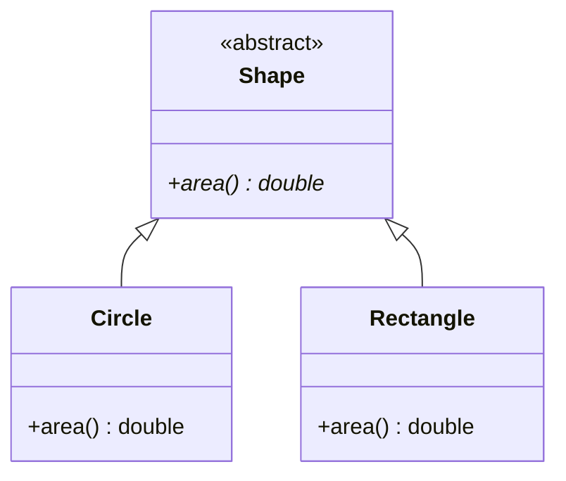

**Interface (UML):** `<<interface>>` — sab methods public abstract; C++ me pure abstract class ya virtual interface.

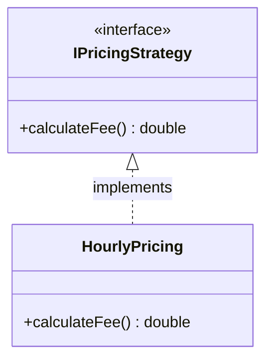

| Arrow | Meaning |
|-------|---------|
| `<|--` | Inheritance (extends) |
| `<|..` | Implementation (implements interface) — **dashed** triangle in strict UML |

---

## 6. Relationships & Arrows — Master Table

**Ye section sabse important hai** — whiteboard par galat arrow = interviewer notice karta hai.

### 6.0 From lesson notes — Simple Association, Aggregation, Composition

Neeche **class notes ki exact baat** + detail. (Typo in notes: *aggrigaton* → **aggregation**.)

---

#### Simple Association (`4.txt` L14)

> *Jab do classes ek-doosre ko jaanti hain aur use karti hain, par unke beech koi **Ownership** (maalik-naukar) ka rishta nahi hota.*

| Detail | Explanation |
|--------|-------------|
| **Matlab** | “Uses” / “knows” — temporary ya loose link |
| **Ownership** | ❌ Koi maalik-naukar nahi |
| **UML** | Simple line `──` ya arrow `→` (kabhi label: `uses`) |
| **Mermaid** | `A --> B` |
| **C++** | Method parameter: `void treat(Patient& p)` — Doctor Patient ka malik nahi |
| **Interview** | Association ≠ composition; ownership check karo |

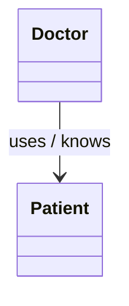

---

#### Aggregation (`4.txt` L16)

> *Independent exist kr skte hai — **Class ke andar doosri class ka pointer hota hai***

| Detail | Explanation |
|--------|-------------|
| **Matlab** | Weak **has-a** — part container ke bina bhi zinda |
| **`4.txt` pointer wali baat** | `Department*` → `Employee*` — Employee dusri department me bhi ho sakta |
| **Lifetime** | Part owner se **pehle ya baad** create/destroy ho sakta |
| **UML** | Hollow diamond **◇** container side |
| **Mermaid** | `o--` |
| **C++** | `vector<Employee*>`, `shared_ptr` jab shared ownership ho |

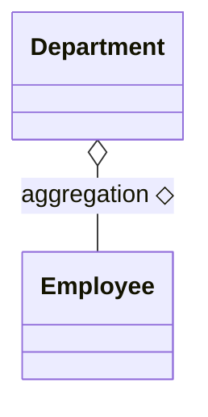

---

#### Composition (`4.txt` L17)

> *Independently exist **nhi** kr skte — **Class ke andar doosri class ka object hota hai***

| Detail | Explanation |
|--------|-------------|
| **Matlab** | Strong **has-a** — part = whole ka hissa |
| **`4.txt` object wali baat** | Member **object** (value) ya ctor me banaya `unique_ptr` — Chair ke andar Seat |
| **Lifetime** | Owner destroy → parts **automatic** destroy |
| **UML** | Filled diamond **◆** owner side |
| **Mermaid** | `*--` |
| **C++** | `Seat seat;` ya `unique_ptr<Seat> seat = make_unique<Seat>();` in `Chair()` |
| **Repo code** | [`04_Composition_Chair_Example.cpp`](./C%20%2B%2B%20Code/04_Composition_Chair_Example.cpp), [`02_Composition_UniquePtr.cpp`](./C%20%2B%2B%20Code/02_Composition_UniquePtr.cpp) |

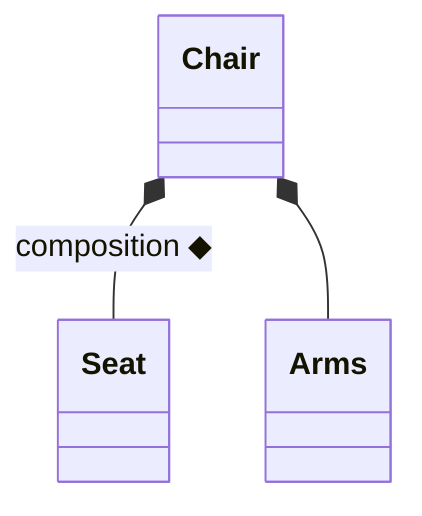

---

#### Inheritance = **Is-A** · Composition = **Has-A** (`4.txt` L19–20)

| `4.txt` line | Relation | UML | C++ | Yaad rakho |
|--------------|----------|-----|-----|------------|
| *inheritance me is a relation* | **Is-A** | Hollow △ → parent | `class Dog : public Animal` | Subtype — polymorphism |
| *composition me has a relation* | **Has-A** (strong) | Filled ◆ on whole | Member / `unique_ptr` in owner | Lifetime bound to owner |

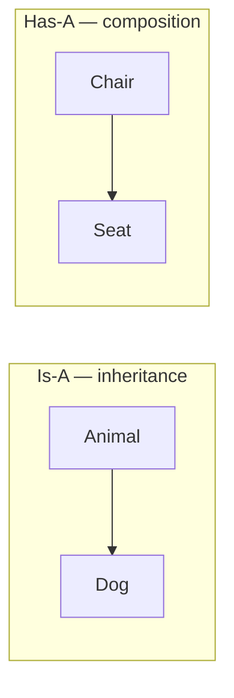

> **Note:** `4.txt` me sirf **composition** ke liye “has-a” likha hai; **aggregation** bhi has-a family hai lekin **weak**. Teeno compare: [`L1 Composition`](../%20L1%20Composition/) · [`INHERITANCE_AND_COMPOSITION.md`](./INHERITANCE_AND_COMPOSITION.md).

---

### 6.1 Summary table

| # | Relation | Hindi | UML symbol | Mermaid | C++ hint |
|---|----------|-------|------------|---------|----------|
| 1 | **Association** | Jaanta / use karta | `──` or `→` | `-->` | Parameter, field use, no ownership |
| 2 | **Directed association** | A uses B | `A → B` | `-->` | Method arg `B&` |
| 3 | **Aggregation** | Weak has-a | `◇──` | `o--` | `T*` shared, outlives container |
| 4 | **Composition** | Strong has-a | `◆──` | `*--` | Member / `unique_ptr` in ctor |
| 5 | **Inheritance** | Is-a | `△──` hollow | `<|--` | `: public Base` |
| 6 | **Implementation** | Implements interface | `△··` dashed | `<|..` | `: public IInterface` |
| 7 | **Dependency** | Temporary use | `··>` dashed | `..>` | Local var, param type only |
| 8 | **Realization** | Same as implementation | dashed triangle | `<|..` | Abstract interface |

Detail + examples: [`INHERITANCE_AND_COMPOSITION.md`](./INHERITANCE_AND_COMPOSITION.md)

### 6.2 Visual — arrows ek saath

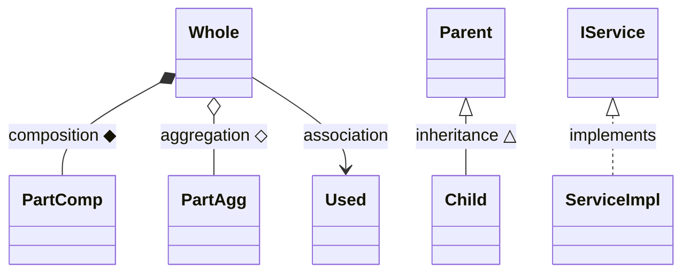

### 6.3 Arrow direction — kaise yaad karein

| Relation | Diamond / triangle kis side? |
|----------|------------------------------|
| **Composition ◆** | Diamond **owner (whole)** par — `Chair ◆── Seat` |
| **Aggregation ◇** | Diamond **container** par |
| **Inheritance △** | Triangle **parent / base** par — arrow **child → parent** |

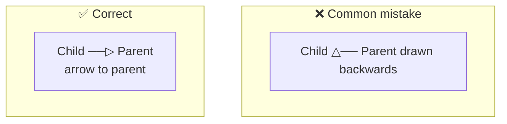

### 6.4 Association vs Dependency

| | Association | Dependency |
|---|-------------|------------|
| **Strength** | Stronger, lasting link | Weak, temporary |
| **Field** | Often as member | Rarely member; local/param |
| **Line** | Solid | **Dashed** |
| **Example** | `Order` has `Customer*` | `printReport()` creates `Formatter` locally |

---

## 7. Multiplicity & Role Names

**Multiplicity** = “kitne” — line ke end par:

| Notation | Meaning |
|----------|---------|
| `1` | Exactly one |
| `0..1` | Zero or one |
| `*` or `0..*` | Zero or many |
| `1..*` | One or many |
| `n..m` | n to m |

**Example:** `ParkingLot` ── `1..*` ── `ParkingSpot`

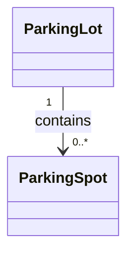

**Role name** = line par label — `contains`, `owns`, `uses`.

---

## 8. Sequence Diagram — Poori Notation

**Purpose (`4.txt`):** *ek object dusre object ke sath interact kaise karega — communication order*

### 8.1 Building blocks

| Element | Dikhta kaisa | Matlab |
|---------|--------------|--------|
| **Actor** | Stick figure | User / external system |
| **Lifeline** | Box + dashed vertical line | Object instance over time |
| **Activation bar** | Thin rectangle on lifeline | Method **executing** (stack frame) |
| **Message** | Horizontal arrow | Call / signal |
| **Return** | Dashed arrow back | Optional reply value |
| **Frame** | `alt` / `loop` / `opt` | if / while / optional block |
| **Note** | Yellow sticky | Comment |

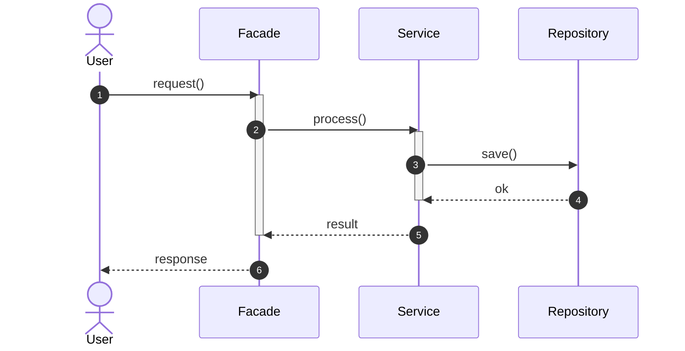

### 8.2 Message arrow types

| Arrow | Name | Use |
|-------|------|-----|
| `→` solid | **Synchronous call** | Caller **wait** karta hai |
| `-->>` dashed | **Return** | Value / ack wapas |
| `->>` open arrow | **Async** | Fire-and-forget (rare in LLD) |
| `-x` lost message | Advanced | Rare |

**Mermaid mapping:**

| UML idea | Mermaid |
|----------|---------|
| Sync call | `A->>B: msg()` |
| Return | `B-->>A: value` |
| Self call | `A->>A: validate()` |

### 8.3 Fragment boxes (control flow)

| Frame | Keyword | Example |
|-------|---------|---------|
| **alt** | if / else | Payment success vs fail |
| **loop** | while / for | Har test case run |
| **opt** | optional | Coupon apply if valid |
| **par** | parallel | Notify + email together |

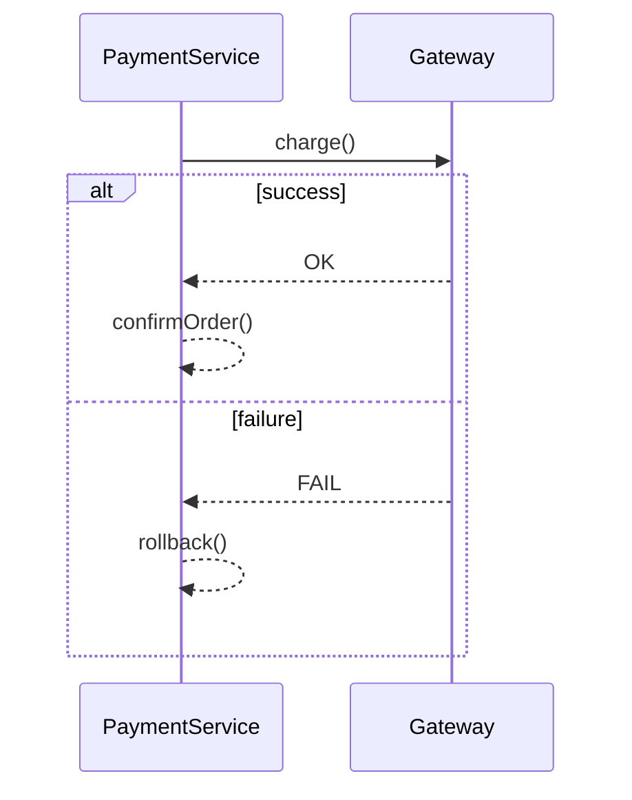

### 8.4 `autonumber`

Steps **1, 2, 3…** — interview me “step 4 par rollback” bolna easy.

Repo me har system 2–3 sequences: [`SYSTEM_CLASS_AND_SEQUENCE_DIAGRAMS.md`](../docs/SYSTEM_CLASS_AND_SEQUENCE_DIAGRAMS.md)

### 8.5 Sequence vs Class — kya alag hai

| Question | Class Diagram | Sequence Diagram |
|----------|---------------|------------------|
| Classes dikhti hain? | ✅ boxes | ✅ lifelines (instances) |
| **Order of calls** | ❌ | ✅ time top → bottom |
| **Relations** | ✅ inheritance, composition | ❌ (sirf messages) |
| **Fields / methods list** | ✅ full | ❌ usually sirf name |

---

## 9. Mermaid vs Hand-Drawn UML

| Feature | Hand UML | Mermaid (repo) |
|---------|----------|----------------|
| Composition | Filled diamond ◆ | `*--` |
| Aggregation | Hollow ◇ | `o--` |
| Inheritance | Hollow △ | `<|--` |
| Interface | Dashed △ | `<|..` |
| Preview | Paper / Excalidraw | `Cmd+Shift+V` in Cursor |

**Tip:** Interview me pehle **boxes + relations** (class), phir **1 main flow** (sequence) — repo [`SYSTEM_CLASS_AND_SEQUENCE_DIAGRAMS.md`](../docs/SYSTEM_CLASS_AND_SEQUENCE_DIAGRAMS.md) ka pattern copy karo.

---

## 10. Repo Me Diagrams Kahan Hain

| Resource | Kya milega |
|----------|------------|
| [`SYSTEM_CLASS_AND_SEQUENCE_DIAGRAMS.md`](../docs/SYSTEM_CLASS_AND_SEQUENCE_DIAGRAMS.md) | 21 systems × class + 2–3 sequences |
| [`INHERITANCE_AND_COMPOSITION.md`](./INHERITANCE_AND_COMPOSITION.md) | Is-a / has-a + L4 `.cpp` |
| [`SOLID.md`](../docs/SOLID.md) | LSP, ISP — class diagrams |
| [`PROJECT_DESIGN_PATTERNS.md`](../docs/PROJECT_DESIGN_PATTERNS.md) | Pattern → project map |
| `L4 UML_Diagrams/*.cpp` | Runnable small examples |

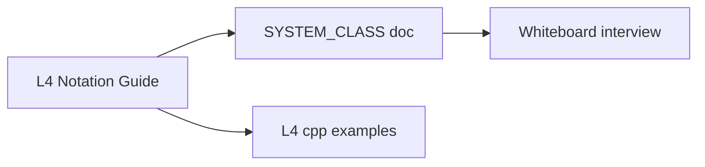

---

## 11. Whiteboard Template — Class + Sequence

### Step 1 — Class diagram (2–3 min)

1. **Noun** → classes (`User`, `Order`, `PaymentService`)
2. **Facade** ek entry (`ATMSystem`, `ParkingLot`)
3. Relations label karo: `◆` composition, `△` inheritance, `-->` uses
4. Visibility: services `+`, fields mostly `-`

### Step 2 — Sequence (3–5 min)

1. Actor → Facade → Service → Model/DB
2. Number steps 1…n
3. Ek **alt** block (error path)
4. Return dashed arrows jahan result chahiye

Template (copy mental model):

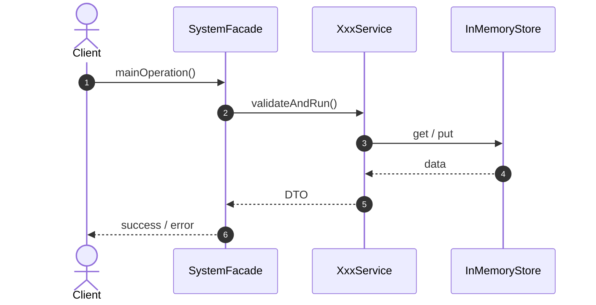

---

## 12. Interview Cheat Sheet

### Class diagram symbols

| Symbol | Name |
|--------|------|
| `+` | public |
| `#` | protected |
| `-` | private |
| `◆──` | composition |
| `◇──` | aggregation |
| `──>` | association (directed) |
| `△──` | inheritance |
| `△··` | implements interface |
| `··>` | dependency |

### Sequence diagram symbols

| Symbol | Name |
|--------|------|
| `→` | sync message |
| `-->>` | return |
| Activation bar | method running |
| `alt` | if/else |
| `loop` | repeat |

### One-liners

| Question | Answer |
|----------|--------|
| Structural vs behavioral? | Static structure vs runtime behaviour |
| Class vs sequence? | What exists vs how they communicate in order |
| Most important diagrams for LLD? | **Class + Sequence** |
| Abstract class UML? | Italic / `<<abstract>>`, pure virtual in C++ |

---

## Related Files in `L4 UML_Diagrams/`

| File | Role |
|------|------|
| [`notes/01_lesson_quick_notes.md`](./notes/01_lesson_quick_notes.md) | Short Hindi notes |
| [`01_Inheritance_Five_Types.cpp`](./C%20%2B%2B%20Code/01_Inheritance_Five_Types.cpp) | 5 inheritance types demo |
| [`04_Composition_Chair_Example.cpp`](./C%20%2B%2B%20Code/04_Composition_Chair_Example.cpp) | Chair–parts composition |
| [`02_Composition_UniquePtr.cpp`](./C%20%2B%2B%20Code/02_Composition_UniquePtr.cpp) | `unique_ptr` ownership |
| [`03_Composition_OldStyle_Ptr.cpp`](./C%20%2B%2B%20Code/03_Composition_OldStyle_Ptr.cpp) | Raw pointer + manual delete |
| [`INHERITANCE_AND_COMPOSITION.md`](./INHERITANCE_AND_COMPOSITION.md) | Is-a / has-a deep dive |

---

<p align="center">
  
</p>

<p align="center">
  <b>L4 — UML Notation + Class & Sequence Focus</b><br/>
  <sub>Mermaid renders on GitHub · VS Code · Cursor Markdown Preview</sub>
</p>
