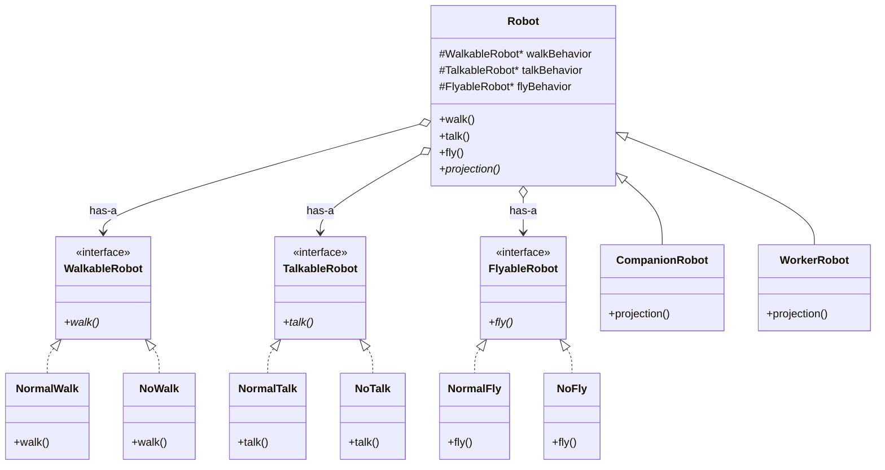
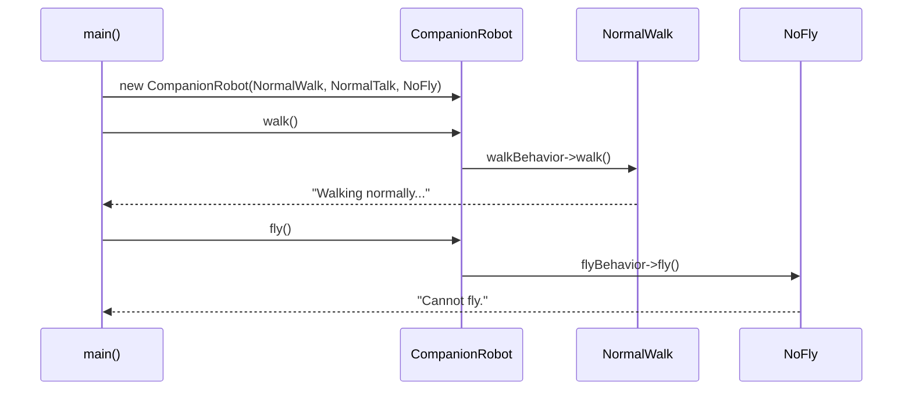

# Strategy Design Pattern — Complete Detailed Guide (Hinglish)

> **Strategy** ek **Behavioral Design Pattern** hai jo kehta hai — *"Family of algorithms ko encapsulate karo, alag-alag classes me nikaalo, aur unhe runtime pe interchangeable banao."* Context class (yahan `Robot`) algorithm **inherit nahi karta** — usse **compose** karta hai (Has-A relation) aur kaam **delegate** kar deta hai.

**Is repo ka domain example:** Robot system — `walk`, `talk`, `fly` behaviors plug-in ki tarah inject hote hain; `CompanionRobot` vs `WorkerRobot` same base class se alag-alag strategy combinations ke saath bante hain.

**Core problem jo ye solve karta hai:** **Inheritance explosion** — har behavior combination ke liye nayi subclass banani padti hai (`FlyingWorkerRobot`, `NonFlyingCompanion`, ...) aur code **rigid** ho jaata hai — runtime pe behavior badalna namumkin.

**Mantra (GoF book se):** _"Identify the parts that vary and separate them from those that stay the same."_ — jo cheez badalti hai use alag karo, jo fixed hai use rehne do.

---

## Table of Contents

1. [Problem kya hai? (Bina Strategy — Inheritance ka dard)](#1-problem-kya-hai-bina-strategy--inheritance-ka-dard)
2. [Strategy Pattern kya hai?](#2-strategy-pattern-kya-hai)
3. [Real-World Analogies](#3-real-world-analogies)
4. [Key Participants (UML Roles)](#4-key-participants-uml-roles)
5. [Composition vs Inheritance — Core Logic](#5-composition-vs-inheritance--core-logic)
6. [Step-by-Step: Strategy Pattern kaise banate hain](#6-step-by-step-strategy-pattern-kaise-banate-hain)
7. [Kab use karein / Kab na karein](#7-kab-use-karein--kab-na-karein)
8. [Fayde aur Nuksan](#8-fayde-aur-nuksan)
9. [SOLID Principles se Connection](#9-solid-principles-se-connection)
10. [Folder Structure](#10-folder-structure)
11. [Code Implementation — Detailed Walkthrough](#11-code-implementation--detailed-walkthrough)
12. [Execution Flow — Two Robots](#12-execution-flow--two-robots)
13. [Architecture Diagrams](#13-architecture-diagrams)
14. [Runtime Behavior Swap — Extension Idea](#14-runtime-behavior-swap--extension-idea)
15. [Modern C++ Improvements](#15-modern-c-improvements)
16. [Build & Run](#16-build--run)
17. [Strategy vs Related Patterns](#17-strategy-vs-related-patterns)
18. [Interview Talking Points](#18-interview-talking-points)
19. [Summary](#19-summary)

---

## 1. Problem kya hai? (Bina Strategy — Inheritance ka dard)

Socho tumhe ek Robot system banana hai jisme robots **chal** sakte hain, **bol** sakte hain, aur **ud** sakte hain — par har robot me har ability nahi hoti. Pehla instinct hota hai inheritance:

```
Robot (base: walk + talk + fly sab yahan)
├── CompanionRobot     → walk + talk chahiye, fly NAHI — par fly() inherit ho gaya!
├── WorkerRobot        → sirf fly chahiye — par walk/talk bhi zabardasti aa gaye!
├── FlyingCompanion    → naya combination = NAYI class
├── TalkingWorker      → aur ek nayi class...
└── ...                → 3 behaviors × 2 options each = 8 combinations = class EXPLOSION 💥
```

### Inheritance approach ki problems — detail me:

| Problem | Detail |
| ------- | ------ |
| **"Flying Duck" problem** | Ye famous Head First Design Patterns wala example hai — `Duck` base class me `fly()` daal do, to `RubberDuck` (rubber wali batakh) bhi udne lagti hai! Yahan `WorkerRobot` ko `fly()` nahi chahiye par inherit ho jaata hai. Subclass ko **unwanted behavior zabardasti milta hai**. |
| **Code duplication** | 10 alag robot types me same "normal walk" logic chahiye — har subclass me copy-paste. Ek bug fix karo to 10 jagah karo. |
| **No runtime swap** | Inheritance compile-time pe fix ho jaata hai. Robot ka software upgrade hua aur ab wo ud sakta hai? Nayi class banao, purana object phenko. |
| **OCP violation** | Naya behavior (jaise `SlowWalk`) add karna hai? Puri existing hierarchy kholo aur edit karo — risky! |
| **Combinatorial explosion** | n behaviors × m options = exponential subclasses. 4 behaviors, 3 options each = 81 possible classes! |

```cpp
// ❌ Inheritance approach — har combination ke liye nayi class
class WorkerRobot : public Robot {
    void fly() override  { /* actual flying logic */ }
    void walk() override { /* cannot walk — override karna PADEGA, warna galat behavior */ }
    void talk() override { /* cannot talk — ye bhi zabardasti */ }
};
// Kal ko "TalkingWorkerRobot" chahiye? Ek aur class. Aur ek. Aur ek...
```

**Root cause:** Humne **behavior ko identity ke saath chipka diya**. Robot kya *hai* (identity) aur robot kya *kar sakta hai* (behavior) — ye do alag cheezein hain, par inheritance dono ko ek hi hierarchy me thoos deta hai.

---

## 2. Strategy Pattern kya hai?

**Strategy** = algorithms ko alag-alag classes me nikaalo + **Context** class unhe pointer se **hold** kare aur kaam **delegate** kare.

Pattern ke 4 building blocks:

1. **Strategy Interface** — algorithm ka contract. Yahan: `WalkableRobot` jisme pure virtual `walk()` hai. Ye kehta hai "jo bhi walk strategy banega, use `walk()` dena padega."
2. **Concrete Strategies** — actual algorithms. Yahan: `NormalWalk`, `NoWalk`, `NormalTalk`, `NoTalk`, `NormalFly`, `NoFly`. Har class ka **sirf ek kaam**.
3. **Context** — `Robot` class jo strategy **pointers hold** karti hai (`WalkableRobot*`), khud algorithm implement **nahi** karti.
4. **Delegation** — `robot->walk()` internally `walkBehavior->walk()` call karta hai. Robot bas forward karta hai — "bhai tu kar de."

```cpp
// ✅ Strategy approach — behaviors inject karo, compose karo, swap karo
Robot* robot1 = new CompanionRobot(
    new NormalWalk(),   // walk strategy inject
    new NormalTalk(),   // talk strategy inject
    new NoFly()         // fly strategy inject — ye robot ud nahi sakta
);
robot1->walk();   // delegate → NormalWalk::walk() → "Walking normally..."
robot1->fly();    // delegate → NoFly::fly()       → "Cannot fly."
```

> **Sabse important line:** Context (`Robot`) ko pata hi nahi ki algorithm andar se kaise kaam karta hai — wo sirf Strategy **interface** se baat karta hai. Concrete class kaunsi hai, ye client (`main`) decide karta hai. Isi ko **loose coupling** kehte hain.

**Ek line me:** Inheritance kehta hai "main ye HOON" (rigid), Strategy kehta hai "mere paas ye HAI" (flexible).

---

## 3. Real-World Analogies

### A. Navigation App (Google Maps) 🗺️

Tum destination daalte ho, aur route algorithm choose karte ho — **fastest**, **shortest**, **avoid tolls**, **walking**, **cycling**. App (context) same rehta hai, sirf routing **strategy** swap hoti hai. Naya mode add karna ho (jaise "EV charging route") to app ka core code nahi badalta — bas nayi strategy plug hoti hai.

### B. Payment at Checkout 💳

E-commerce checkout me `PaymentStrategy` — **UPI**, **Card**, **Wallet**, **COD**. `Checkout` context bas `paymentStrategy->pay(amount)` call karta hai. Kal ko "Crypto" payment aaye to sirf nayi class banegi — checkout flow untouched.

### C. SIM Card 📱 (sabse yaad rehne wali)

Phone (Robot/Context) same rehta hai — SIM card (Strategy) badlo to network badal jaata hai. **Naya phone khareedne ki zaroorat nahi.** Agar network phone me solder hota (inheritance), to network badalne ke liye naya phone lena padta!

### D. Game Character Abilities 🎮

RPG games me character ka **skill loadout** — melee, ranged, stealth, magic. Runtime pe player skills swap karta hai; character class same rehti hai.

### E. `std::sort` with Comparator

C++ standard library khud Strategy use karti hai — `std::sort(v.begin(), v.end(), myComparator)`. Sorting ka skeleton fixed, **comparison strategy** tum inject karte ho.

### F. Document Editor (Is repo — L7)

Persistence strategy — same document, save as **PDF / Word / Markdown**. Editor change nahi hota, save algorithm swap hota hai.

---

## 4. Key Participants (UML Roles)

| UML Role | Is Code Me | Responsibility |
| -------- | ---------- | -------------- |
| **Strategy (interface)** | `WalkableRobot`, `TalkableRobot`, `FlyableRobot` | Algorithm ka contract define karna — `walk()`, `talk()`, `fly()` pure virtual |
| **Concrete Strategy** | `NormalWalk`, `NoWalk`, `NormalTalk`, `NoTalk`, `NormalFly`, `NoFly` | Actual behavior/algorithm implement karna |
| **Context** | `Robot` (abstract) | Strategy pointers hold karna + delegation; `projection()` abstract rakhna |
| **Concrete Context** | `CompanionRobot`, `WorkerRobot` | Robot type-specific identity (`projection()`) |
| **Client** | `main()` | Concrete strategies choose karke robots me inject karna |

```
Client (main)
  │  creates & injects
  ▼
Robot (Context) ──has-a──► WalkableRobot*  ◄─implements─ NormalWalk / NoWalk
      │          ──has-a──► TalkableRobot* ◄─implements─ NormalTalk / NoTalk
      │          ──has-a──► FlyableRobot*  ◄─implements─ NormalFly / NoFly
      ▼ is-a
CompanionRobot / WorkerRobot   (sirf identity/projection ke liye)
```

**Note:** Is example me **teen alag strategy families** hain (walk, talk, fly) — kyunki ye teen **independent dimensions** hain. Classic Strategy me ek hi family hoti hai; multiple families use karna pattern ka natural extension hai.

---

## 5. Composition vs Inheritance — Core Logic

Ye Strategy pattern ka **dil** hai. Do relations samjho:

### Has-A (Composition) — behaviors ke liye ✅

```cpp
class Robot {
protected:
    WalkableRobot* walkBehavior;   // Robot ke PAAS walk behavior HAI
    TalkableRobot* talkBehavior;   // inherit nahi kiya — hold kiya
    FlyableRobot*  flyBehavior;

public:
    void walk() { walkBehavior->walk(); }  // khud nahi karta — DELEGATE karta hai
};
```

### Is-A (Inheritance) — sirf robot **type/identity** ke liye

```cpp
class CompanionRobot : public Robot { ... };  // "friendly" identity
class WorkerRobot    : public Robot { ... };  // "worker" identity
```

### Decision rule (interview gold ✨)

| Cheez | Relation | Kyun |
| ----- | -------- | ---- |
| Jo **vary** karta hai (walk/talk/fly) | **Has-A** (Strategy compose karo) | Runtime flexibility, no explosion |
| Jo **identity** hai (Companion vs Worker) | **Is-A** (inheritance thik hai) | Type fixed hota hai, badalta nahi |

> **"Favor composition over inheritance"** — iska matlab ye NAHI ki inheritance kabhi use mat karo. Matlab ye hai ki **badalne wale behavior ke liye** inheritance mat use karo. Identity ke liye inheritance bilkul sahi tool hai — jaise yahan `projection()` inheritance se aata hai.

---

## 6. Step-by-Step: Strategy Pattern kaise banate hain

Kisi bhi problem me Strategy apply karne ka recipe:

| Step | Kya karna hai | Is example me |
| ---- | ------------- | ------------- |
| **1. Vary hone wala part identify karo** | Kaunsa behavior alag-alag hota hai? | walk, talk, fly — har robot me alag |
| **2. Har varying dimension ka interface banao** | Pure virtual method wali abstract class | `WalkableRobot { virtual void walk() = 0; }` |
| **3. Concrete strategies likho** | Har variation = ek class | `NormalWalk`, `NoWalk` |
| **4. Context me strategy pointers rakho** | Base-class pointers (polymorphism ke liye) | `WalkableRobot* walkBehavior;` |
| **5. Constructor/setter se inject karo** | Client decide kare kaunsi strategy | `Robot(w, t, f)` constructor injection |
| **6. Delegate karo** | Context method → strategy method | `void walk() { walkBehavior->walk(); }` |

Bas! Ab naya behavior chahiye to **sirf step 3 repeat karo** — baaki sab untouched. Yahi Open/Closed Principle hai.

---

## 7. Kab use karein / Kab na karein

### ✅ Kab use karein

| Scenario | Example |
| -------- | ------- |
| **Multiple interchangeable algorithms** ek hi kaam ke liye | Payment methods, sorting, routing |
| **Runtime pe algorithm change** karna hai | User settings, A/B testing, feature flags |
| **Inheritance se class explosion** ho raha hai | Walk × Talk × Fly combinations |
| **Context me giant if-else / switch** hai algorithm choose karne ke liye | `if (type == "UPI") {...} else if (type == "Card") {...}` — har branch ek strategy ban sakti hai |
| **Algorithm ka complex code context se chhupana** hai | Tax calculation, pricing rules |
| **Testing me mock inject** karna hai | Fake `PaymentStrategy` se checkout test karo — real payment gateway ke bina |

### ❌ Kab NA karein

| Scenario | Reason |
| -------- | ------ |
| **Sirf ek algorithm hai, kabhi change nahi hoga** | Direct method call kaafi hai — pattern overkill |
| **Sirf 2 simple options, kabhi badhenge nahi** | Ek chhota if-else zyada readable hai |
| **Strategies ko context ka bahut saara internal state chahiye** | Context ↔ strategy communication messy ho jaata hai — pehle design socho |
| **Client ke liye strategy choose karna hi complex hai** | Factory + Strategy combine karo — factory decide kare, strategy execute kare |

**Thumb rule:** Jab tumhe lage "yahan future me aur variations aayengi" — tab Strategy socho. Jab lage "ye kabhi nahi badlega" — simple raho.

---

## 8. Fayde aur Nuksan

### Fayde (Pros) 👍

| Fayda | Detail |
| ----- | ------ |
| **Composition over inheritance** | Behaviors freely mix-and-match — 2×2×2 = 8 combos bina ek bhi extra subclass ke |
| **Runtime interchangeable** | Setter bana ke behavior on-the-fly swap (`setFlyBehavior()`) |
| **Open/Closed Principle** | Naya `EcoWalk` add karo — `Robot` class ko haath tak nahi lagana |
| **Single Responsibility** | Har strategy class me sirf ek algorithm — chhoti, focused, samajhne me aasan |
| **Eliminates conditionals** | Context ke andar ka giant `if-else`/`switch` khatam — polymorphism handle karta hai |
| **Reusability** | `NormalWalk` ko `CompanionRobot` aur `WorkerRobot` dono use karte hain — zero duplication |
| **Testability** | Mock/fake strategy inject karke context ko isolation me test karo |

### Nuksan (Cons) 👎

| Nuksan | Detail |
| ------ | ------ |
| **Class count badhta hai** | Har algorithm = ek class. Chhote projects me clutter lag sakta hai |
| **Client ko strategies pata honi chahiye** | `main()` ko `NormalWalk` vs `NoWalk` ka difference samajhna padta hai (Factory se mitigate hota hai) |
| **Manual memory management** (is code me) | `new`/`delete` chain — bhool gaye to leak. Modern C++ me `unique_ptr` se solve (Section 15) |
| **Indirection overhead** | Har call virtual dispatch se jaati hai — practically negligible, par hot loops me measure karo |
| **Object count badhta hai** | Har robot ke saath 3 behavior objects — sharing/flyweight se optimize kar sakte ho agar strategies stateless hain |

---

## 9. SOLID Principles se Connection

Strategy pattern SOLID ka poster-child hai — 4 principles directly dikhte hain:

### Open/Closed Principle (OCP) — sabse bada connection

- `Robot` class **closed for modification** — walk/talk/fly ka koi logic isme hai hi nahi, to badalne ki zaroorat hi nahi.
- System **open for extension** — `EcoWalk`, `FastFly` jaisi nayi strategy classes add karo, purana code 100% safe.

### Single Responsibility Principle (SRP)

| Class | Ek hi Responsibility |
| ----- | -------------------- |
| `NormalWalk` | Sirf walk algorithm |
| `Robot` | Sirf coordinate + delegate |
| `CompanionRobot` | Sirf companion-specific projection |
| `main()` | Sirf object creation + wiring |

### Dependency Inversion Principle (DIP)

`Robot` concrete `NormalWalk` pe depend **nahi** karta — abstraction `WalkableRobot*` pe depend karta hai. High-level module (Robot) aur low-level module (NormalWalk) dono abstraction se jude hain.

### Liskov Substitution Principle (LSP)

Jahan bhi `WalkableRobot*` expected hai, wahan `NormalWalk` ya `NoWalk` — **koi bhi** — rakh do, code sahi chalega. Har concrete strategy `walk()` ka contract nibhati hai.

---

## 10. Folder Structure

```
L8 Strategy_Design_Patterns/
├── README.md                          ← Ye file — complete Hinglish guide
├── Standard UML.png                   ← Classic Strategy UML diagram
└── C++ Code/
    ├── StrategyDesignPattern.cpp      ← Robot walk/talk/fly demo (detailed Hinglish comments ke saath)
    ├── Strategy_Design_Pattern.png    ← Is example ka UML diagram
    └── problem.md                     ← Problem statement + workflow notes
```

---

## 11. Code Implementation — Detailed Walkthrough

Source: [`C++ Code/StrategyDesignPattern.cpp`](./C++%20Code/StrategyDesignPattern.cpp)

### 11.1 Strategy Interfaces — contract define karna

```cpp
class WalkableRobot {
public:
    virtual void walk() = 0;        // pure virtual → abstract class → C++ ka "interface"
    virtual ~WalkableRobot() {}     // virtual destructor — base pointer se delete safe
};
// Same pattern: TalkableRobot::talk(), FlyableRobot::fly()
```

**Kya ho raha hai:**
- `= 0` matlab **pure virtual** — is class ka object directly nahi ban sakta; child ko `walk()` dena **hi** padega.
- **Virtual destructor kyun zaroori:** hum `WalkableRobot*` (base pointer) se `NormalWalk` (derived object) delete karenge. Agar destructor virtual nahi hai to derived ka destructor call **nahi hota** — undefined behavior/leak. Ye interview ka favourite question hai!
- **Teen alag interfaces kyun?** Kyunki walk/talk/fly **independent dimensions** hain. Ek interface me hote to "chal sakta hai par bol nahi sakta" wala combo impossible ho jaata.

### 11.2 Concrete Strategies — actual algorithms

```cpp
class NormalWalk : public WalkableRobot {
public:
    void walk() override { cout << "Walking normally..." << endl; }
};

class NoWalk : public WalkableRobot {
public:
    void walk() override { cout << "Cannot walk." << endl; }
};
// NormalTalk/NoTalk, NormalFly/NoFly — bilkul same pattern
```

**Points:**
- `override` keyword compiler se check karwata hai ki hum sach me base ka virtual function override kar rahe hain — signature me typo ho to compile error (silent bug se bachaata hai).
- `NoWalk` jaisi **"no-op" strategy** bhi valid strategy hai — "kuch mat karo" bhi ek behavior hai. Isse context me `if (walkBehavior != nullptr)` jaise null-checks ki zaroorat nahi padti. Ye **Null Object Pattern** ka flavour hai.
- Ye classes robot type se **independent** hain — `NormalWalk` ko Companion aur Worker dono use kar sakte hain. **Reuse!**

### 11.3 Context — `Robot` (pattern ka dil)

```cpp
class Robot {
protected:
    WalkableRobot* walkBehavior;    // HAS-A — yahi composition hai
    TalkableRobot* talkBehavior;
    FlyableRobot*  flyBehavior;

public:
    Robot(WalkableRobot* w, TalkableRobot* t, FlyableRobot* f) {
        walkBehavior = w; talkBehavior = t; flyBehavior = f;
    }

    virtual ~Robot() {              // virtual + cleanup dono
        delete walkBehavior;
        delete talkBehavior;
        delete flyBehavior;
    }

    void walk() { walkBehavior->walk(); }   // DELEGATION — khud nahi, behavior kare
    void talk() { talkBehavior->talk(); }
    void fly()  { flyBehavior->fly(); }

    virtual void projection() = 0;  // identity — ye strategy NAHI hai
};
```

| Point | Detail |
| ----- | ------ |
| **Constructor injection** | Client decide karta hai kaunse behaviors milenge — Robot khud kuch decide nahi karta. Dependency Injection ka simplest roop. |
| **Base-class pointers** | `WalkableRobot*` me koi bhi concrete strategy fit — yahi polymorphism ka fayda |
| **Delegation** | `robot->walk()` → `walkBehavior->walk()` — Robot ko algorithm ka andar ka logic pata hi nahi |
| **Ownership** | Robot behaviors ka **maalik** hai — isliye destructor me delete karna uski zimmedari |
| **`projection()` pure virtual** | Ye behavior **vary nahi** karta per-object — ye robot **type ki identity** hai, isliye inheritance se aata hai. Strategy vs identity ka difference yahi hai! |

### 11.4 Concrete Contexts — robot types

```cpp
class CompanionRobot : public Robot {
public:
    CompanionRobot(WalkableRobot* w, TalkableRobot* t, FlyableRobot* f)
        : Robot(w, t, f) {}         // behaviors base ko forward
    void projection() override {
        cout << "Displaying friendly companion features..." << endl;
    }
};

class WorkerRobot : public Robot {  // same — bas projection alag
    void projection() override {
        cout << "Displaying worker efficiency stats..." << endl;
    }
};
```

Dekho kitni **chhoti** classes hain — kyunki behaviors inme hain hi nahi! Sirf identity (`projection()`) define karti hain. Behaviors constructor se aate hain aur base class handle karta hai.

### 11.5 Client — `main()`

```cpp
// Robot 1: chal + bol sakta hai, ud NAHI sakta
Robot* robot1 = new CompanionRobot(new NormalWalk(), new NormalTalk(), new NoFly());
robot1->walk(); robot1->talk(); robot1->fly(); robot1->projection();

// Robot 2: bilkul ulta — sirf ud sakta hai
Robot* robot2 = new WorkerRobot(new NoWalk(), new NoTalk(), new NormalFly());
robot2->walk(); robot2->talk(); robot2->fly(); robot2->projection();

delete robot1;   // ~Robot() chain me behaviors bhi delete honge
delete robot2;
```

| Robot | Walk | Talk | Fly | Projection |
| ----- | ---- | ---- | --- | ---------- |
| **CompanionRobot** | ✅ Normal | ✅ Normal | ❌ No | Friendly features |
| **WorkerRobot** | ❌ No | ❌ No | ✅ Normal | Efficiency stats |

**Same classes, alag strategies** — ek bhi nayi subclass banaye bina do bilkul alag robots. Yahi pattern ka power hai.

---

## 12. Execution Flow — Two Robots

### CompanionRobot flow

| Step | Call | Delegates to | Output |
| ---- | ---- | ------------ | ------ |
| 1 | `robot1->walk()` | `NormalWalk::walk()` | `Walking normally...` |
| 2 | `robot1->talk()` | `NormalTalk::talk()` | `Talking normally...` |
| 3 | `robot1->fly()` | `NoFly::fly()` | `Cannot fly.` |
| 4 | `robot1->projection()` | `CompanionRobot::projection()` (virtual dispatch) | `Displaying friendly companion features...` |

### WorkerRobot flow

| Step | Call | Delegates to | Output |
| ---- | ---- | ------------ | ------ |
| 1 | `robot2->walk()` | `NoWalk::walk()` | `Cannot walk.` |
| 2 | `robot2->talk()` | `NoTalk::talk()` | `Cannot talk.` |
| 3 | `robot2->fly()` | `NormalFly::fly()` | `Flying normally...` |
| 4 | `robot2->projection()` | `WorkerRobot::projection()` | `Displaying worker efficiency stats...` |

### Complete Expected Output

```
Walking normally...
Talking normally...
Cannot fly.
Displaying friendly companion features...
--------------------
Cannot walk.
Cannot talk.
Flying normally...
Displaying worker efficiency stats...
```

### Destruction flow (memory cleanup)

```
delete robot1
  → ~CompanionRobot()          (virtual dispatch — isliye ~Robot() virtual hai)
    → ~Robot()
      → delete walkBehavior    → ~NormalWalk() → ~WalkableRobot()
      → delete talkBehavior    → ~NormalTalk() → ~TalkableRobot()
      → delete flyBehavior     → ~NoFly()      → ~FlyableRobot()
```

---

## 13. Architecture Diagrams

### Class Diagram



### Delegation Flow (ek call ka safar)

```
Client: robot1->walk()
    → Robot::walk()                    (context — khud kuch nahi karta)
        → walkBehavior->walk()         (delegation — base pointer se call)
            → NormalWalk::walk()       (virtual dispatch — actual algorithm)
                → "Walking normally..."
```

### Sequence Diagram



---

## 14. Runtime Behavior Swap — Extension Idea

Abhi code me behaviors sirf constructor me set hote hain. Strategy ka **real power** runtime swap hai — setter add karo:

```cpp
class Robot {
    // ... existing code ...
public:
    void setFlyBehavior(FlyableRobot* f) {
        delete flyBehavior;    // purani strategy ki memory free karo
        flyBehavior = f;       // nayi strategy plug karo
    }
};

// Usage: robot ka "software upgrade" — ab ye ud sakta hai!
robot2->setFlyBehavior(new NormalFly());
robot2->fly();   // "Flying normally..." — SAME object, NAYA behavior!
```

**Inheritance me ye impossible tha** — behavior compile-time pe class me baked hota. Strategy me object zinda rehte hue apna behavior badal sakta hai. Ye hi wo cheez hai jo game characters (skill swap), navigation apps (route mode change), aur A/B testing me use hoti hai.

---

## 15. Modern C++ Improvements

Ye code seekhne ke liye raw pointers use karta hai, par production me ye improvements karo:

### 15.1 `unique_ptr` — manual delete khatam

```cpp
#include <memory>

class Robot {
protected:
    unique_ptr<WalkableRobot> walkBehavior;   // ownership clear + auto cleanup
    unique_ptr<TalkableRobot> talkBehavior;
    unique_ptr<FlyableRobot>  flyBehavior;

public:
    Robot(unique_ptr<WalkableRobot> w, unique_ptr<TalkableRobot> t, unique_ptr<FlyableRobot> f)
        : walkBehavior(move(w)), talkBehavior(move(t)), flyBehavior(move(f)) {}

    virtual ~Robot() = default;   // delete chain ki zaroorat hi nahi!

    void walk() { walkBehavior->walk(); }
};

// Client:
auto robot1 = make_unique<CompanionRobot>(
    make_unique<NormalWalk>(), make_unique<NormalTalk>(), make_unique<NoFly>());
```

**Fayde:** exception-safe, leak impossible, ownership code me hi document ho jaati hai. (Is repo ke VendingMachine LLD me yahi refactor already kiya gaya hai.)

### 15.2 `std::function` — lightweight strategy (classes ke bina)

Agar strategy me state nahi hai, to poora class hierarchy banane ki zaroorat nahi:

```cpp
class Robot {
    function<void()> walkBehavior;
public:
    Robot(function<void()> w) : walkBehavior(move(w)) {}
    void walk() { walkBehavior(); }
};

Robot r([]{ cout << "Walking normally..." << endl; });   // lambda = strategy!
```

**Kab kaunsa:** Strategy me **state/multiple methods** chahiye → class hierarchy. Sirf **ek stateless function** hai → `std::function`/lambda kaafi.

### 15.3 `#include <bits/stdc++.h>` se bacho

Ye GCC-only header hai (MSVC/Clang+libc++ pe fail) aur compile slow karta hai. Production me specific headers likho: `<iostream>`, `<memory>`, `<functional>`.

---

## 16. Build & Run

```bash
cd "L8 Strategy_Design_Patterns/C++ Code"
g++ -std=c++17 -o strategy_demo StrategyDesignPattern.cpp
./strategy_demo
```

Expected output [Section 12](#12-execution-flow--two-robots) me diya hai.

---

## 17. Strategy vs Related Patterns

Interview me confusion in patterns se hota hai — differences yaad rakho:

| Pattern | Focus | Strategy se Farq |
| ------- | ----- | ---------------- |
| **State** | Object ke **internal state** ke hisaab se behavior badalna | Structure lagbhag same! Farq **intent** ka hai — Strategy me **client** algorithm choose karta hai aur strategies ek-dusre ko nahi jaanti; State me object **khud transitions** karta hai aur states ek-dusre ko jaanti hain |
| **Template Method** | Inheritance based — algorithm ka skeleton base me fixed, steps subclass override kare | Template Method = **compile-time** (inheritance); Strategy = **runtime** (composition). Strategy zyada flexible |
| **Command** | Request/action ko object banana — undo, queue, log ke liye | Strategy = "**kaise** karna hai" (algorithm); Command = "**kya** karna hai" (action encapsulation) |
| **Factory** | **Object creation** encapsulate karna | Strategy = **behavior selection**. Dono aksar saath use hote hain (niche dekho) |
| **Decorator** | Behavior **add/wrap** karna layers me | Decorator behavior **stack** karta hai; Strategy behavior **replace** karta hai |
| **Bridge** | Abstraction aur implementation ko alag hierarchies me **decouple** karna | Structure similar; Bridge ka intent architectural separation, Strategy ka intent interchangeable algorithms |

### Strategy + Factory (bahut common combo)

```cpp
// Factory decide karta hai KAUNSI strategy, Strategy karta hai KAAM
PaymentStrategy* p = PaymentFactory::create("UPI");
checkout.setPaymentStrategy(p);
checkout.pay();
```

Isse client ko concrete strategy classes jaanne ki zaroorat nahi — Strategy ka ek bada con mitigate ho jaata hai.

### Is Repo Me Strategy Kahan-Kahan Use Hua Hai

| Project | Strategy Example |
| ------- | ---------------- |
| **L8 (ye folder)** | Robot walk/talk/fly behaviors |
| **L7 Document Editor** | Persistence strategies (save to file/DB) |
| **L11 Food Delivery** | `PaymentStrategy` (UPI, Card) |
| **L14 Notification System** | Channel/delivery strategies |
| **Ecommerce Checkout** | Payment strategies |
| **GPay LLD** | UPI payment rail selection |
| **Job Scheduler** | Scheduling algorithm strategies |

---

## 18. Interview Talking Points

1. **One-liner definition:** *"Strategy pattern encapsulates a family of algorithms, makes them interchangeable, and lets the algorithm vary independently from the clients that use it — context delegates instead of inheriting behavior."*

2. **Problem it solves:** *"Flying Duck / inheritance explosion — behavior ko identity se alag karta hai. n dimensions × m variations = n×m chhoti classes, not m^n subclasses."*

3. **Strategy vs State (guaranteed question):** *"Structure same, intent alag. Strategy — client picks the algorithm, strategies independent. State — object transitions itself, states know each other."*

4. **Composition over inheritance:** *"Inheritance is-a compile-time pe lock kar deta hai; composition has-a runtime pe swap allow karta hai. Behavior varies → compose; identity fixed → inherit."*

5. **OCP demo:** *"Naya `EcoWalk` add karna hai? Ek nayi class — `Robot`, existing strategies, `main` sab untouched."*

6. **Virtual destructor:** *"Base pointer se derived delete hota hai — `~WalkableRobot()` aur `~Robot()` virtual na ho to derived destructor skip → UB/leak."*

7. **Runtime swap:** *"`setFlyBehavior(new NormalFly())` — robot ka software upgrade, object recreate kiye bina."*

8. **Multiple strategy families:** *"Is example me 3 independent dimensions (walk/talk/fly) — classic single-strategy ka natural extension."*

9. **Modern C++:** *"Production me `unique_ptr` for ownership; stateless single-method strategies ke liye `std::function` + lambda — pura hierarchy overkill hai."*

10. **Real usage:** *"`std::sort` comparator, Java `Comparator`, payment gateways, compression algorithms (zip/rar/7z) — sab Strategy hain."*

---

## 19. Summary

| Pehlu | Detail |
| ----- | ------ |
| **Pattern Type** | Behavioral (GoF) |
| **Core Idea** | Varying behavior ko alag strategy classes me encapsulate karo; context compose + delegate kare |
| **Is Repo ka Example** | `CompanionRobot`/`WorkerRobot` + walk/talk/fly strategy families |
| **Main Problem Solved** | Inheritance explosion, code duplication, no runtime swap |
| **Key Relationship** | Context **Has-A** Strategy (behavior ke liye Is-A nahi) |
| **SOLID Coverage** | OCP, SRP, DIP, LSP — charo dikhte hain |
| **Main Fayda** | Runtime flexibility + naya behavior bina purana code chhede |
| **Main Trade-off** | Zyada classes + client ko strategies pata honi chahiye (Factory se fix) |
| **Key File** | [`C++ Code/StrategyDesignPattern.cpp`](./C++%20Code/StrategyDesignPattern.cpp) |

> **Yaad rakhne ka formula:** Strategy **SIM card** jaisa hai — phone (Context/Robot) same rehta hai, SIM (Strategy) badlo to network (behavior) badal jaata hai. Naya phone khareedne ki zaroorat nahi! 📱
>
> Aur **golden rule:** _"Jo badalta hai use nikaalo, jo nahi badalta use rehne do."_

---

## Further Reading (Is Folder Me)

| File | Content |
| ---- | ------- |
| [`C++ Code/problem.md`](./C++%20Code/problem.md) | Flying Duck problem, workflow, virtual destructor tips |
| [`Standard UML.png`](./Standard%20UML.png) | Classic Strategy pattern ka UML |
| [`C++ Code/Strategy_Design_Pattern.png`](./C++%20Code/Strategy_Design_Pattern.png) | Is Robot example ka UML |
