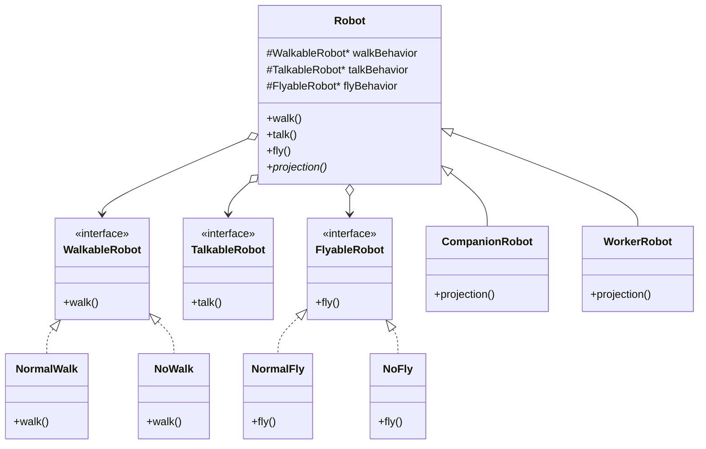

# Strategy Design Pattern — Detailed Guide

> **Behavioral Design Pattern** jo **family of algorithms** ko alag classes mein encapsulate karta hai aur unhe **runtime pe interchangeable** banata hai. Context (Robot) algorithms inherit nahi karta — **compose** karta hai (Has-A).

**Domain example (is repo mein):** Robot system — walk, talk, fly behaviors plug-in ki tarah; `CompanionRobot` vs `WorkerRobot` alag strategy combinations.

**Core problem jo solve hota hai:** **Inheritance explosion** — har behavior combination ke liye subclass (`FlyingWorkerRobot`, `NonFlyingCompanion`, …) aur **rigid code** — runtime pe behavior swap mushkil.

**Mantra:** _"Identify the parts that vary and separate them from those that stay the same."_

---

## Table of Contents

1. [Problem kya hai? (Inheritance / Bina Strategy)](#1-problem-kya-hai-inheritance--bina-strategy)
2. [Strategy Pattern kya hai?](#2-strategy-pattern-kya-hai)
3. [Real-World Analogy](#3-real-world-analogy)
4. [Key Participants (UML Roles)](#4-key-participants-uml-roles)
5. [Composition vs Inheritance — Core Logic](#5-composition-vs-inheritance--core-logic)
6. [Kab use karein / Kab na karein](#6-kab-use-karein--kab-na-karein)
7. [Fayde aur Nuksan](#7-fayde-aur-nuksan)
8. [SOLID Principles se Connection](#8-solid-principles-se-connection)
9. [Folder Structure](#9-folder-structure)
10. [Code Implementation — Detailed Walkthrough](#10-code-implementation--detailed-walkthrough)
11. [Execution Flow — Two Robots](#11-execution-flow--two-robots)
12. [Architecture Diagrams](#12-architecture-diagrams)
13. [Build & Run](#13-build--run)
14. [Strategy vs Related Patterns](#14-strategy-vs-related-patterns)
15. [Interview Talking Points](#15-interview-talking-points)
16. [Summary](#16-summary)

---

## 1. Problem kya hai? (Inheritance / Bina Strategy)

Agar `Robot` base class mein `walk()`, `talk()`, `fly()` **sab inherit** ho:

```
Robot
├── CompanionRobot   (walk + talk, NO fly — lekin fly() inherit ho gaya!)
├── WorkerRobot      (fly only — lekin walk/talk bhi aa gaye!)
├── FlyingCompanion  (naya combination = nayi class)
└── ... combinatorial explosion
```

| Problem | Detail |
| ------- | ------ |
| **"Flying Duck" problem** | Subclass ko unwanted methods inherit — `WorkerRobot` ko `fly()` nahi chahiye par milta hai |
| **Rigid code** | 10 robots same walk logic — duplicate |
| **No runtime swap** | Behavior compile-time fixed — upgrade ke baad udna mushkil |
| **OCP break** | Naya behavior = purani hierarchy edit |
| **Poor reuse** | `NormalWalk` logic har subclass mein copy |

```cpp
// ❌ Inheritance — har combination = nayi class
class WorkerRobot : public Robot {
    void fly() override { ... }
    void walk() override { /* cannot walk — forced to override */ }
    void talk() override { /* cannot talk — forced to override */ }
};
```

---

## 2. Strategy Pattern kya hai?

**Strategy** = alag algorithm classes + **Context** unhe hold karke **delegate** kare.

1. **Strategy interface** — `WalkableRobot::walk()` (algorithm contract)
2. **Concrete strategies** — `NormalWalk`, `NoWalk`, `NormalFly`, `NoFly`, …
3. **Context** — `Robot` class **pointers** hold karti hai, khud implement nahi karti
4. **Delegation** — `robot->walk()` → `walkBehavior->walk()`

```cpp
// ✅ Strategy — behaviors inject, compose, swap
Robot* robot1 = new CompanionRobot(
    new NormalWalk(), new NormalTalk(), new NoFly()
);
robot1->walk();   // delegates to NormalWalk
robot1->fly();    // delegates to NoFly → "Cannot fly."
```

> **Context ko algorithm kaise karna hai nahi pata — sirf Strategy interface se delegate karta hai.**

---

## 3. Real-World Analogy

### A. Navigation App (Google Maps)

Route algorithm interchangeable — **fastest**, **shortest**, **avoid tolls**. App (context) strategy swap karta hai; UI same rehta hai.

### B. Payment at Checkout

`PaymentStrategy` — UPI, Card, Wallet. `Checkout` context strategy call karta hai — nayi payment = nayi class, checkout change nahi.

### C. Game Character Abilities

Character **skills plug-in** — melee, ranged, stealth. Runtime pe skill loadout change (RPG games).

### D. Sorting in Library

`std::sort` with custom comparator — algorithm family, client chooses strategy.

### E. Document Editor (Is repo — L7)

Persistence **Strategy** — save as PDF, Word, Markdown — same editor, different save algorithm.

---

## 4. Key Participants (UML Roles)

| Role | Is Code Mein | Responsibility |
| ---- | ------------ | -------------- |
| **Strategy (interface)** | `WalkableRobot`, `TalkableRobot`, `FlyableRobot` | Algorithm contract — `walk()`, `talk()`, `fly()` |
| **Concrete Strategy** | `NormalWalk`, `NoWalk`, `NormalTalk`, `NoFly`, … | Actual behavior implementation |
| **Context** | `Robot` | Strategies hold karna + delegate; `projection()` abstract |
| **Concrete Context** | `CompanionRobot`, `WorkerRobot` | Robot type-specific display |
| **Client** | `main()` | Strategies inject karke robots banata hai |

```
Client
  │
  ▼
Robot (Context) ──has──► WalkableRobot*  ◄── NormalWalk / NoWalk
         │                 TalkableRobot* ◄── NormalTalk / NoTalk
         │                 FlyableRobot*  ◄── NormalFly / NoFly
         ▼
CompanionRobot / WorkerRobot
```

---

## 5. Composition vs Inheritance — Core Logic

### Has-A (Composition) — Strategy ka core

```cpp
class Robot {
protected:
    WalkableRobot* walkBehavior;
    TalkableRobot* talkBehavior;
    FlyableRobot*  flyBehavior;

public:
    void walk() { walkBehavior->walk(); }  // delegate
};
```

### Is-A (Inheritance) — sirf robot **type** ke liye

```cpp
class CompanionRobot : public Robot { ... };  // friendly projection
class WorkerRobot    : public Robot { ... };  // efficiency stats
```

**Rule:** Behaviors **vary** → Strategy (compose). Robot **identity/type** → inheritance optional.

### Runtime Swap (extension idea)

```cpp
void setFlyBehavior(FlyableRobot* f) {
    delete flyBehavior;
    flyBehavior = f;
}
// Upgrade: NoFly → NormalFly without new Robot subclass
```

---

## 6. Kab use karein / Kab na karein

### ✅ Kab use karein

| Scenario | Example |
| -------- | ------- |
| **Multiple interchangeable algorithms** | Payment, sorting, routing |
| **Runtime pe algorithm change** | User settings, A/B test |
| **Inheritance se class explosion** | Walk × Talk × Fly combinations |
| **Hide complex algorithm code** from context | Tax calculation strategies |
| **Open/Closed** — naya behavior = nayi strategy class | `EcoWalk` add — `Robot` touch nahi |

### ❌ Kab na karein

| Scenario | Reason |
| -------- | ------ |
| **Sirf ek algorithm, kabhi change nahi** | Direct method call kaafi |
| **Strategies ko state share chahiye** | Context + strategy communication design karo — warna confusing |
| **Bahut simple if-else** | 2 options — strategy overkill |
| **Client ko strategy choose karna complex** | Factory + Strategy combine socho |

---

## 7. Fayde aur Nuksan

### Fayde (Pros)

| Fayda | Detail |
| ----- | ------ |
| **Composition over inheritance** | Flexible behavior mix |
| **Runtime interchangeable** | `setFlyBehavior()` possible |
| **OCP** | Naya `NormalWalk` — existing `Robot` closed |
| **SRP** | Har strategy ek algorithm |
| **Eliminates conditionals** | Giant `if-else` in context kam |
| **Testability** | Mock strategy inject |

### Nuksan (Cons)

| Nuksan | Detail |
| ------ | ------ |
| **More classes** | Har algorithm = ek class |
| **Client must know strategies** | Constructor mein 3 pointers pass |
| **Memory management** | `new` + `delete` in destructor — smart pointers better |
| **Indirection overhead** | Virtual call — negligible mostly |

---

## 8. SOLID Principles se Connection

### Open/Closed Principle (OCP)

- `Robot` **closed** — walk/talk/fly logic change nahi
- `EcoWalk` **open** — nayi strategy class, purana code safe

### Single Responsibility Principle (SRP)

| Class | Responsibility |
| ----- | -------------- |
| `NormalWalk` | Walk algorithm only |
| `Robot` | Coordinate + delegate |
| `CompanionRobot` | Companion-specific projection |

### Dependency Inversion Principle (DIP)

`Robot` concrete `NormalWalk` par nahi — `WalkableRobot*` abstraction par depend.

### Liskov Substitution

`NoWalk` kahin bhi `WalkableRobot*` ki jagah — `walk()` contract satisfy.

---

## 9. Folder Structure

```
L8 Strategy_Design_Patterns/
├── README.md                              ← Ye file — complete guide
└── C++ Code/
    ├── StrategyDesignPattern.cpp          ← Robot walk/talk/fly demo
    └── problem.md                           ← Problem + workflow (Hindi/English)
```

---

## 10. Code Implementation — Detailed Walkthrough

Source: [`C++ Code/StrategyDesignPattern.cpp`](./C%20%2B%2B%20Code/StrategyDesignPattern.cpp)

### 10.1 Strategy Interfaces

```cpp
class WalkableRobot {
public:
    virtual void walk() = 0;
    virtual ~WalkableRobot() {}
};
// Same for TalkableRobot::talk(), FlyableRobot::fly()
```

**Kya hai:** Har varying dimension ka **apna interface** — is example mein 3 independent strategy families.

---

### 10.2 Concrete Strategies

```cpp
class NormalWalk : public WalkableRobot {
    void walk() override { cout << "Walking normally..." << endl; }
};

class NoWalk : public WalkableRobot {
    void walk() override { cout << "Cannot walk." << endl; }
};
// NormalTalk / NoTalk, NormalFly / NoFly — same pattern
```

**Plug-in classes** — robot type se independent, reuse across `CompanionRobot` aur `WorkerRobot`.

---

### 10.3 Context — `Robot`

```cpp
class Robot {
protected:
    WalkableRobot* walkBehavior;
    TalkableRobot* talkBehavior;
    FlyableRobot*  flyBehavior;

public:
    Robot(WalkableRobot* w, TalkableRobot* t, FlyableRobot* f) { ... }

    virtual ~Robot() {
        delete walkBehavior;
        delete talkBehavior;
        delete flyBehavior;
    }

    void walk() { walkBehavior->walk(); }
    void talk() { talkBehavior->talk(); }
    void fly()  { flyBehavior->fly(); }

    virtual void projection() = 0;
};
```

| Point | Detail |
| ----- | ------ |
| **Delegation** | Context algorithm implement nahi karta |
| **Virtual destructor** | Derived + strategy objects sahi delete |
| **Constructor injection** | Strategies compile/run time pe set |

---

### 10.4 Concrete Contexts

```cpp
class CompanionRobot : public Robot {
    void projection() override {
        cout << "Displaying friendly companion features..." << endl;
    }
};

class WorkerRobot : public Robot {
    void projection() override {
        cout << "Displaying worker efficiency stats..." << endl;
    }
};
```

**Robot type** = alag projection; **behaviors** = injected strategies.

---

### 10.5 Client — `main()`

```cpp
Robot* robot1 = new CompanionRobot(new NormalWalk(), new NormalTalk(), new NoFly());
robot1->walk(); robot1->talk(); robot1->fly(); robot1->projection();

Robot* robot2 = new WorkerRobot(new NoWalk(), new NoTalk(), new NormalFly());
robot2->walk(); robot2->talk(); robot2->fly(); robot2->projection();
```

| Robot | Walk | Talk | Fly |
| ----- | ---- | ---- | --- |
| **Companion** | Normal | Normal | No |
| **Worker** | No | No | Normal |

---

## 11. Execution Flow — Two Robots

### CompanionRobot flow

| Step | Call | Delegates to | Output |
| ---- | ---- | ------------ | ------ |
| 1 | `walk()` | `NormalWalk` | Walking normally... |
| 2 | `talk()` | `NormalTalk` | Talking normally... |
| 3 | `fly()` | `NoFly` | Cannot fly. |
| 4 | `projection()` | `CompanionRobot` | friendly companion features |

### WorkerRobot flow

| Step | Call | Delegates to | Output |
| ---- | ---- | ------------ | ------ |
| 1 | `walk()` | `NoWalk` | Cannot walk. |
| 2 | `talk()` | `NoTalk` | Cannot talk. |
| 3 | `fly()` | `NormalFly` | Flying normally... |
| 4 | `projection()` | `WorkerRobot` | worker efficiency stats |

### Expected Output

```
Walking normally...
Talking normally...
Cannot fly.
Displaying friendly companion features...
--------------------
Cannot walk.
Cannot talk.
Flying normally...
Displaying worker efficiency stats...
```

---

## 12. Architecture Diagrams

### Class Diagram



### Delegation Flow

```
Client: robot1->walk()
    → Robot::walk()
        → walkBehavior->walk()
            → NormalWalk::walk()
                → "Walking normally..."
```

---

## 13. Build & Run

```bash
cd "L8 Strategy_Design_Patterns/C++ Code"
g++ -std=c++17 -o strategy_demo StrategyDesignPattern.cpp
./strategy_demo
```

> `#include <bits/stdc++.h>` — portable builds ke liye `<iostream>` prefer karo.

---

## 14. Strategy vs Related Patterns

| Pattern | Focus | Strategy se Farq |
| ------- | ----- | ---------------- |
| **State** | Object **internal state** change → behavior change | Strategy usually **client-injected**; State transitions automatic |
| **Template Method** | Inheritance — skeleton fixed, steps override | Strategy **composition** — runtime swap |
| **Command** | Request ko object banana — undo, queue | Strategy = **algorithm**; Command = **action/request** |
| **Factory** | **Object creation** | Strategy = **behavior selection** — often used together |
| **Bridge** | Abstraction + implementation **decouple** | Strategy = interchangeable algorithms for same context |

### Strategy + Factory (common combo)

Client: `PaymentFactory::create("UPI")` → `Checkout` uses `PaymentStrategy*`.

### Is Repo Mein Strategy Kahan Use Hota Hai

| Project | Example |
| ------- | ------- |
| **L8 (ye folder)** | Robot walk/talk/fly |
| **L7 Document Editor** | Persistence strategies |
| **L11 Food Delivery** | `PaymentStrategy` (UPI, Card) |
| **L14 Notification** | Channel / delivery strategies |
| **Ecommerce Checkout** | Payment `Strategy` |
| **GPay LLD** | UPI payment rail |
| **Banking / Job Scheduler** | Backend / scheduling strategies |

---

## 15. Interview Talking Points

1. **One-liner:** "Strategy encapsulates algorithms, makes them interchangeable — context delegates, doesn't inherit behavior."

2. **vs State:** "Strategy = client picks algorithm; State = object transitions itself."

3. **Composition > Inheritance:** "Flying Duck problem — inheritance forces unwanted methods."

4. **OCP:** "New `EcoWalk` class — Robot unchanged."

5. **Runtime swap:** "setFlyBehavior() — upgrade without new subclass."

6. **Virtual destructor:** "Context deletes strategies — must be virtual ~Robot()."

7. **Multiple strategy interfaces:** "Walk, Talk, Fly — three independent dimensions."

8. **Smart pointers:** "C++11: unique_ptr — no manual delete chain."

---

## 16. Summary

| Pehlu | Detail |
| ----- | ------ |
| **Pattern Type** | Behavioral |
| **Core Idea** | Vary behavior via composed strategy objects + delegation |
| **Is Repo ka Example** | `CompanionRobot` / `WorkerRobot` + walk/talk/fly strategies |
| **Main Problem Solved** | Inheritance explosion, rigid behavior, no runtime swap |
| **Key Relationship** | Context **Has-A** Strategy (not Is-A behavior) |
| **Main Fayda** | OCP, runtime flexibility, algorithm reuse |
| **Key File** | [`C++ Code/StrategyDesignPattern.cpp`](./C%20%2B%2B%20Code/StrategyDesignPattern.cpp) |

> **Yaad rakho:** Strategy **SIM card** jaisa hai — phone (Robot) same, card badlo to network (behavior) badal jaye — naya phone khareedne ki zaroorat nahi. 📱

---

## Further Reading (Is Folder Mein)

| File | Content |
| ---- | ------- |
| [`C++ Code/problem.md`](./C%20%2B%2B%20Code/problem.md) | Flying Duck problem, workflow, virtual destructor tips |
