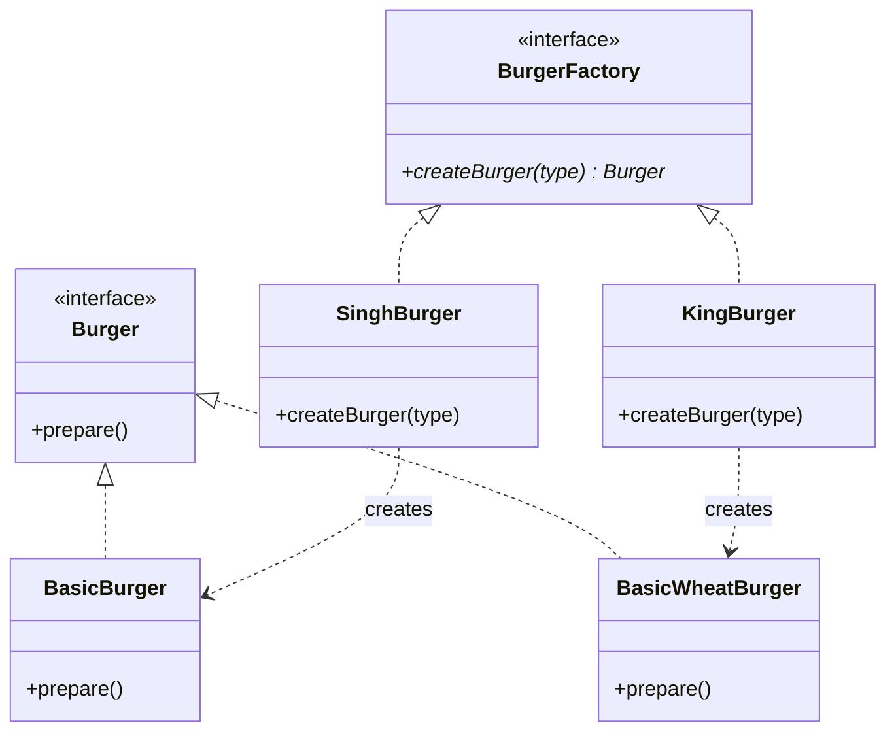
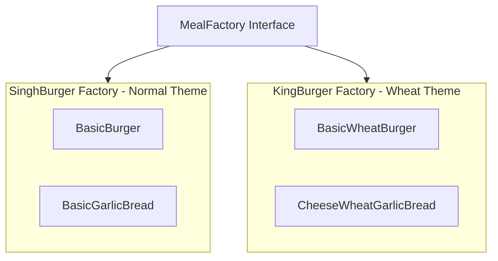

# Factory Design Pattern — Detailed Guide

> **Creational Design Pattern family** jo **object creation** ko encapsulate karti hai — client ko concrete classes (`BasicBurger`, `PremiumWheatBurger`) ka direct `new` nahi karna padta. Is repo mein **teen levels**: Simple Factory → Factory Method → Abstract Factory.

**Domain example (is repo mein):** Burger shop — `SinghBurger` (normal bun) vs `KingBurger` (wheat bun); Abstract Factory mein **Burger + GarlicBread** coordinated families.

**Core problem jo solve hota hai:** Client mein **tight coupling** — har naye product ke liye `main()` aur `if-else` edit; **OCP violation**.

---

## Table of Contents

1. [Problem kya hai? (Direct `new` / Bina Factory)](#1-problem-kya-hai-direct-new--bina-factory)
2. [Factory Pattern Family — Overview](#2-factory-pattern-family--overview)
3. [Real-World Analogy](#3-real-world-analogy)
4. [Key Participants (Per Variant)](#4-key-participants-per-variant)
5. [Simple vs Factory Method vs Abstract Factory](#5-simple-vs-factory-method-vs-abstract-factory)
6. [SOLID Analysis](#6-solid-analysis)
7. [Kab use karein / Kab na karein](#7-kab-use-karein--kab-na-karein)
8. [Fayde aur Nuksan](#8-fayde-aur-nuksan)
9. [Folder Structure](#9-folder-structure)
10. [Code Implementation — File-by-File Walkthrough](#10-code-implementation--file-by-file-walkthrough)
11. [Execution Flow & Expected Output](#11-execution-flow--expected-output)
12. [Architecture Diagrams](#12-architecture-diagrams)
13. [Build & Run](#13-build--run)
14. [Factory vs Related Patterns](#14-factory-vs-related-patterns)
15. [Interview Talking Points](#15-interview-talking-points)
16. [Summary](#16-summary)

---

## 1. Problem kya hai? (Direct `new` / Bina Factory)

Client (`main`) directly concrete classes banata hai:

```cpp
// ❌ Client har concrete class jaanta hai
if (type == "basic")       burger = new BasicBurger();
else if (type == "standard") burger = new StandardBurger();
else if (type == "premium")  burger = new PremiumBurger();
// Naya burger → yahi if-else har jagah edit
```

| Problem | Detail |
| ------- | ------ |
| **Tight coupling** | `main` → `BasicBurger`, `PremiumBurger`, … |
| **OCP violation** | Naya product = existing code modify |
| **DIP break** | High-level `main` low-level concretions par depend |
| **Creation logic scattered** | Duplicate `new` + validation har client mein |
| **Family inconsistency** | Wheat burger + normal garlic bread mix ho sakta hai |

**Factory** creation **ek jagah** (ya ek hierarchy) mein lock karta hai — client sirf interface use karta hai.

---

## 2. Factory Pattern Family — Overview

```
Problem: Client directly new ConcreteProduct()
                    │
        ┌───────────┼───────────┐
        ▼           ▼           ▼
  Simple Factory  Factory Method  Abstract Factory
  (central if-else) (subclass decides) (product families)
        │           │           │
        ▼           ▼           ▼
  BurgerFactory   SinghBurger /  MealFactory → Burger + GarlicBread
                  KingBurger
```

| Variant | File | Creation decides | Products |
| ------- | ---- | ---------------- | -------- |
| **Simple Factory** | `SimpleFactory.cpp` | Ek class, `if-else` on string | Burgers only |
| **Factory Method** | `FactoryMethod.cpp` | **Subclass** (`SinghBurger` vs `KingBurger`) | Burgers (brand-specific) |
| **Abstract Factory** | `AbstractFactory.cpp` | **Factory family** | Burger **+** GarlicBread (coordinated) |

---

## 3. Real-World Analogy

### A. Simple Factory — Fast Food Counter

Ek counter — "basic / standard / premium" bolo, kitchen andar decide kare. Sab orders **ek window** se.

### B. Factory Method — Franchise Brands

**Singh Burger** outlet alag recipes; **King Burger** outlet wheat recipes. Same menu API (`createBurger`), alag brand implementation.

### C. Abstract Factory — Meal Combo / Theme

"Wheat theme meal" — burger **aur** garlic bread dono wheat family ke. "Normal theme" — dono normal. Mix-match nahi.

### D. UI Toolkit (Classic)

`WinFactory` → Windows button + checkbox; `MacFactory` → Mac button + checkbox — consistent OS family.

### E. Cross-repo

L11 `NowOrderFactory` / `ScheduledOrderFactory`; Spotify `DeviceFactory` — creation centralized.

---

## 4. Key Participants (Per Variant)

### Simple Factory

| Role | Class |
| ---- | ----- |
| **Product** | `Burger` (interface) |
| **Concrete Products** | `BasicBurger`, `StandardBurger`, `PremiumBurger` |
| **Factory** | `BurgerFactory::createBurger(type)` |

### Factory Method

| Role | Class |
| ---- | ----- |
| **Product** | `Burger` |
| **Creator (interface)** | `BurgerFactory` — `virtual createBurger()` |
| **Concrete Creators** | `SinghBurger`, `KingBurger` |
| **Concrete Products** | Normal vs Wheat burger classes |

### Abstract Factory

| Role | Class |
| ---- | ----- |
| **Abstract Factory** | `MealFactory` — `createBurger()` + `createGarlicBread()` |
| **Concrete Factories** | `SinghBurger`, `KingBurger` |
| **Product families** | Normal burgers + normal bread; Wheat burgers + wheat bread |

---

## 5. Simple vs Factory Method vs Abstract Factory

| Feature | **Simple Factory** | **Factory Method** | **Abstract Factory** |
| ------- | ------------------ | ------------------ | -------------------- |
| **Intent** | Creation logic centralize | **Subclass** chooses product | **Related product family** |
| **Mechanism** | `if-else` in one class | Virtual `createBurger()` override | Multiple `create*()` per factory |
| **OCP** | ❌ Weak — naya type = factory edit | ✅ Strong — naya product = nayi class | ✅ Strong — nayi family = nayi factory |
| **Client knows** | `BurgerFactory` | `BurgerFactory*` (brand) | `MealFactory*` (theme) |
| **Products** | Usually one kind | One product line | **Multiple coordinated** types |
| **Interview line** | Not official GoF pattern | GoF creational | "Factory of factories" for families |

### Evolution in this repo

```
SimpleFactory     →  "standard" string → BurgerFactory if-else → StandardBurger
FactoryMethod     →  SinghBurger factory → BasicBurger (normal bun)
AbstractFactory   →  KingBurger factory → BasicWheatBurger + CheeseWheatGarlicBread
```

---

## 6. SOLID Analysis

### Open/Closed Principle (OCP)

| Variant | Naya `VeggieBurger` add |
| ------- | ---------------------- |
| **Simple** | `BurgerFactory::createBurger` mein naya `else if` — **modify** |
| **Factory Method** | Nayi `VeggieBurger` class + factory override — **extend** |
| **Abstract Factory** | Nayi product + factory methods — often **extend** without touching other brands |

### Dependency Inversion Principle (DIP)

```cpp
// ✅ Client depends on abstraction
BurgerFactory* myFactory = new SinghBurger();
Burger* burger = myFactory->createBurger(type);
burger->prepare();
```

`main` → `BurgerFactory` / `MealFactory` interface, not `PremiumWheatBurger` directly.

### Single Responsibility Principle (SRP)

Creation logic `main` se hata kar **Factory** class — `main` sirf use/orchestrate.

---

## 7. Kab use karein / Kab na karein

### ✅ Simple Factory

| When | Example |
| ---- | ------- |
| Kam products, rarely change | Simple calculator ops |
| Prototype / small app | Quick central creation |
| Team junior, need simplicity | Internal tools |

### ✅ Factory Method

| When | Example |
| ---- | ------- |
| Brand/vendor-specific creation | `SinghBurger` vs `KingBurger` |
| Framework — users extend factory | Game engine custom monsters |
| OCP important for products | Plugin ecosystems |

### ✅ Abstract Factory

| When | Example |
| ---- | ------- |
| **Coordinated families** | UI Dark/Light full theme |
| Products must not mix | Wheat burger + wheat bread only |
| Cross-platform kits | Windows vs Mac widget sets |

### ❌ Kab na karein

| Scenario | Reason |
| -------- | ------ |
| **Sirf ek concrete class** | Direct `new` or DI container |
| **Object creation trivial** | Factory overkill |
| **Products unrelated** | Abstract Factory force-fit mat karo |
| **Already have DI framework** | Container often replaces manual factories |

---

## 8. Fayde aur Nuksan

### Fayde (Pros)

| Fayda | Detail |
| ----- | ------ |
| **Decoupling** | Client ↔ concrete product loose |
| **Single creation point** | Change `new` logic ek jagah |
| **Polymorphism** | `Burger*` — `prepare()` runtime dispatch |
| **Family consistency** | Abstract Factory — matching combos |
| **Testability** | Mock factory inject |

### Nuksan (Cons)

| Nuksan | Detail |
| ------ | ------ |
| **More classes** | Factory hierarchy + products |
| **Simple Factory OCP** | Central if-else grows |
| **Indirection** | Debug — kaunsa factory banaya |
| **Wrong factory choice** | Abstract Factory — client must pick right family |

---

## 9. Folder Structure

```
L9 Factory_Design_Pattern/
├── README.md                              ← Ye file — complete guide
└── C++ Code/
    ├── SimpleFactory.cpp                  ← Central if-else creation
    ├── FactoryMethod.cpp                  ← SinghBurger vs KingBurger
    ├── AbstractFactory.cpp                ← Burger + GarlicBread families
    └── Markdown.md                        ← Comparison + SOLID (Hindi/English)
```

---

## 10. Code Implementation — File-by-File Walkthrough

### 10.1 `SimpleFactory.cpp`

Source: [`C++ Code/SimpleFactory.cpp`](./C%20%2B%2B%20Code/SimpleFactory.cpp)

```cpp
class Burger {
public:
    virtual void prepare() = 0;
    virtual ~Burger() {}
};

class BurgerFactory {
public:
    Burger* createBurger(string& type) {
        if (type == "basic")       return new BasicBurger();
        else if (type == "standard") return new StandardBurger();
        else if (type == "premium")  return new PremiumBurger();
        else { cout << "Invalid burger type! "; return nullptr; }
    }
};
```

**Client:**

```cpp
BurgerFactory* factory = new BurgerFactory();
Burger* burger = factory->createBurger(type);  // type = "standard"
burger->prepare();
```

| Point | Detail |
| ----- | ------ |
| **Not GoF official** | Often called "Static/Simple Factory" — pedagogically useful |
| **OCP weak** | Naya burger → `createBurger` edit |

---

### 10.2 `FactoryMethod.cpp`

Source: [`C++ Code/FactoryMethod.cpp`](./C%20%2B%2B%20Code/FactoryMethod.cpp)

```cpp
class BurgerFactory {
public:
    virtual Burger* createBurger(string& type) = 0;
    virtual ~BurgerFactory() {}
};

class SinghBurger : public BurgerFactory {
    Burger* createBurger(string& type) override {
        // BasicBurger, StandardBurger, PremiumBurger (normal bun)
    }
};

class KingBurger : public BurgerFactory {
    Burger* createBurger(string& type) override {
        // BasicWheatBurger, StandardWheatBurger, PremiumWheatBurger
    }
};
```

**Client:**

```cpp
BurgerFactory* myFactory = new SinghBurger();  // brand choose
Burger* burger = myFactory->createBurger(type);
burger->prepare();
```

**Key shift:** Creation logic **subclasses** mein — `main` sirf kaunsi factory use karni hai choose karta hai.

---

### 10.3 `AbstractFactory.cpp`

Source: [`C++ Code/AbstractFactory.cpp`](./C%20%2B%2B%20Code/AbstractFactory.cpp)

```cpp
class MealFactory {
public:
    virtual Burger* createBurger(string& type) = 0;
    virtual GarlicBread* createGarlicBread(string& type) = 0;
    virtual ~MealFactory() {}
};

class KingBurger : public MealFactory {
    Burger* createBurger(string& type) override { /* wheat burgers */ }
    GarlicBread* createGarlicBread(string& type) override { /* wheat bread */ }
};
```

**Client:**

```cpp
MealFactory* mealFactory = new KingBurger();
Burger* burger = mealFactory->createBurger("basic");
GarlicBread* bread = mealFactory->createGarlicBread("cheese");
burger->prepare();
bread->prepare();
```

**Guarantee:** `KingBurger` factory se **dono** products wheat family ke — consistent meal theme.

---

## 11. Execution Flow & Expected Output

### SimpleFactory (`type = "standard"`)

```
Preparing Standard Burger with bun, patty, cheese, and lettuce!
```

### FactoryMethod (`SinghBurger`, `type = "basic"`)

```
Preparing Basic Burger with bun, patty, and ketchup!
```

### AbstractFactory (`KingBurger`, burger=`basic`, bread=`cheese`)

```
Preparing Basic Wheat Burger with bun, patty, and ketchup!
Preparing Cheese Wheat Garlic Bread with extra cheese and butter!
```

### Decision flow (Abstract Factory)

```
main
  ├─ new KingBurger()          → wheat theme factory
  ├─ createBurger("basic")     → BasicWheatBurger
  ├─ createGarlicBread("cheese") → CheeseWheatGarlicBread
  └─ prepare() on both
```

---

## 12. Architecture Diagrams

### Factory Method — Class Diagram



### Abstract Factory — Family View



### Client Dependency

```
┌──────────┐
│  main    │
└────┬─────┘
     │ uses
     ▼
┌─────────────┐     creates      ┌──────────────┐
│ BurgerFactory│ ───────────────► │ Burger*      │
│ (abstract)   │                  │ prepare()    │
└─────────────┘                  └──────────────┘
     ▲
     │ implements
SinghBurger / KingBurger
```

---

## 13. Build & Run

Har file alag compile karo (duplicate class names — ek saath link mat karo):

```bash
cd "L9 Factory_Design_Pattern/C++ Code"

g++ -std=c++17 -o simple_factory_demo SimpleFactory.cpp && ./simple_factory_demo
g++ -std=c++17 -o factory_method_demo FactoryMethod.cpp && ./factory_method_demo
g++ -std=c++17 -o abstract_factory_demo AbstractFactory.cpp && ./abstract_factory_demo
```

---

## 14. Factory vs Related Patterns

| Pattern | Focus | Factory se Farq |
| ------- | ----- | --------------- |
| **Builder** | Complex object **step-by-step** | Factory = **single shot** create |
| **Prototype** | **Clone** existing object | Factory = **new** from scratch |
| **Abstract Factory vs Factory Method** | **Families** vs **one product** | AF = multiple `create*`; FM = one `createBurger` |
| **Strategy** | **Behavior** algorithm | Factory = **object creation** |
| **Simple Factory vs static method** | Class-based central creation | Similar intent; not GoF catalog name |

### Is Repo Mein Factory Kahan Use Hota Hai

| Project | Example |
| ------- | ------- |
| **L9 (ye folder)** | Burger shop — 3 variants |
| **L11 Food Delivery** | `NowOrderFactory`, `ScheduledOrderFactory` |
| **L18 Spotify** | `DeviceFactory` |
| **Ecommerce / Banking** | Product/gateway factories |
| **Game LLD** | Monster / match factories |

---

## 15. Interview Talking Points

1. **One-liner:** "Factory encapsulates object creation — client uses interface, not `new Concrete`."

2. **Simple vs Method vs Abstract:** "Central if-else → subclass decides → coordinated product families."

3. **OCP:** "Simple Factory breaks OCP; Factory Method/Abstract Factory extend via new classes."

4. **DIP:** "main depends on `BurgerFactory*`, not `PremiumBurger`."

5. **Abstract Factory classic Q:** "FM = one product line; AF = multiple **related** products per family."

6. **Not GoF:** "Simple Factory is idiom, not catalog pattern — still asked in interviews."

7. **When Simple is OK:** "Few stable types, internal tool — don't over-engineer."

8. **Combo with Strategy:** "Factory creates strategy; context uses it."

---

## 16. Summary

| Pehlu | Detail |
| ----- | ------ |
| **Pattern Type** | Creational (family of 3 approaches) |
| **Core Idea** | Hide `new` — creation centralized / subclassed / themed |
| **Is Repo ka Example** | Singh vs King burger; meal = burger + garlic bread |
| **Main Problem Solved** | Tight coupling, OCP on products, family consistency |
| **Best OCP** | Factory Method & Abstract Factory |
| **Key Files** | [`SimpleFactory.cpp`](./C%20%2B%2B%20Code/SimpleFactory.cpp), [`FactoryMethod.cpp`](./C%20%2B%2B%20Code/FactoryMethod.cpp), [`AbstractFactory.cpp`](./C%20%2B%2B%20Code/AbstractFactory.cpp) |

> **Yaad rakho:** Factory **restaurant ka kitchen** hai — customer menu se order karta hai (`createBurger`); andar kaun kaunsa burger banega wo kitchen decide karti hai, customer ko recipe classes yaad rakhne ki zaroorat nahi. 🍔

---

## Further Reading (Is Folder Mein)

| File | Content |
| ---- | ------- |
| [`C++ Code/Markdown.md`](./C%20%2B%2B%20Code/Markdown.md) | SOLID analysis, workflow, interview Q&A — Hindi/English |
