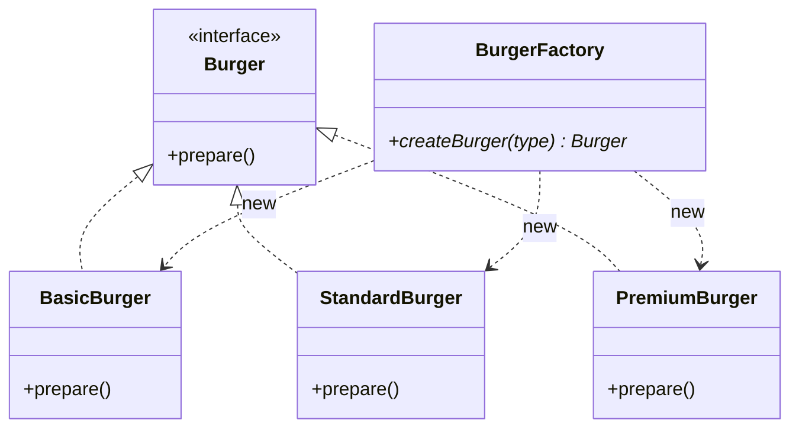
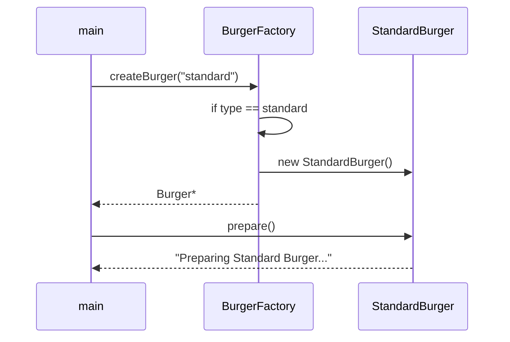

# Simple Factory — Detailed Notes

> **Intent:** Object creation logic ko **ek jagah** centralize karo — client `new BasicBurger()` na kare.  
> **Code:** [`SimpleFactory.cpp`](../C++%20Code/SimpleFactory.cpp)

---

## 1. Problem (Bina Factory)

```cpp
// Client har concrete class jaanta hai
if (type == "basic")    burger = new BasicBurger();
else if (type == "standard") burger = new StandardBurger();
// Naya burger → har client file edit
```

| Issue | Kyun problem |
|-------|----------------|
| Tight coupling | `main` → `BasicBurger`, `StandardBurger`, … |
| Duplicate logic | Har jagah same if-else |
| OCP weak | Naya type = purani factory **modify** |

---

## 2. Simple Factory kya hai?

Ek **concrete helper class** (`BurgerFactory`) jo string/type le kar sahi `Burger*` return karti hai.

```
Client  →  BurgerFactory::createBurger("standard")  →  StandardBurger*
         (client ko StandardBurger class ka naam nahi chahiye)
```

**Note:** GoF book me "Simple Factory" official pattern nahi — lekin interviews aur industry me bahut common **idiom** hai.

---

## 3. Class structure



| Role | Class |
|------|-------|
| Product interface | `Burger` — `virtual void prepare() = 0` |
| Concrete products | `BasicBurger`, `StandardBurger`, `PremiumBurger` |
| Factory | `BurgerFactory` — **non-virtual** `createBurger()` |

---

## 4. Code walkthrough

### Product hierarchy

```cpp
class Burger {
public:
    virtual void prepare() = 0;
    virtual ~Burger() {}
};
```

Har burger apna `prepare()` implement karta hai — **polymorphism** client side par.

### Factory — central if-else

```cpp
class BurgerFactory {
public:
    Burger* createBurger(string& type) {
        if (type == "basic")       return new BasicBurger();
        else if (type == "standard") return new StandardBurger();
        else if (type == "premium")  return new PremiumBurger();
        else { cout << "Invalid burger type! "; return nullptr; }
    }
};
```

**Creation decision** sirf yahan — client ko if-else nahi.

### Client

```cpp
string type = "standard";
BurgerFactory* myBurgerFactory = new BurgerFactory();
Burger* burger = myBurgerFactory->createBurger(type);
burger->prepare();
delete burger;
delete myBurgerFactory;
```

Client sirf **interface** (`Burger`) use karta hai execution ke liye.

---

## 5. Execution flow



**Expected output:**

```
Preparing Standard Burger with bun, patty, cheese, and lettuce!
```

---

## 6. SOLID lens

| Principle | Simple Factory |
|-----------|----------------|
| **SRP** | ✅ Creation alag class mein |
| **OCP** | ❌ Naya burger → `createBurger` mein naya `else if` |
| **DIP** | ⚠️ Partial — client `Burger*` use karta hai, lekin factory concrete `BurgerFactory` hai |
| **LSP** | ✅ Sab burgers `prepare()` honor karte hain |
| **ISP** | ✅ Thin `Burger` interface |

---

## 7. Kab use karein

| ✅ Use | ❌ Avoid |
|--------|----------|
| Kam product types, stable | Products bar-bar badalte hain |
| Internal tools, prototypes | Plugin system chahiye (Factory Method better) |
| Team ko simple chahiye | Family consistency (Abstract Factory) |

---

## 8. Fayde / Nuksan

**Fayde**

- Client simple — ek method call
- Creation ek file mein
- Polymorphism se clean `prepare()`

**Nuksan**

- Factory class **god object** ban sakti hai (bahut saare if-else)
- OCP weak — har naya product = factory edit
- Testing mein mock factory easy, lekin interface nahi (virtual nahi)

---

## 9. Build & run

```bash
cd "L9 Factory_Design_Pattern/C++ Code"
g++ -std=c++17 -o simple_factory_demo SimpleFactory.cpp && ./simple_factory_demo
```

---

## 10. Interview Q&A

**Q: Simple Factory GoF pattern hai?**  
A: Catalog me officially nahi — **programming idiom** hai. Phir bhi interviews me puchte hain.

**Q: Simple Factory vs static factory method?**  
A: Intent same — creation centralize. Static method bina object ke; yahan `BurgerFactory` instance.

**Q: Next step kya hai?**  
A: Jab brands / subclasses alag creation chahiye → **Factory Method** ([02_Factory_Method.md](./02_Factory_Method.md)).

---

## 11. Real-world examples

| Domain | Simple Factory jaisa |
|--------|------------------------|
| JDBC | `DriverManager.getConnection(url)` — type string se driver |
| Logging | `Logger.getLogger(name)` |
| JSON parse | `parse(type)` → object |

---

**Next:** [02 Factory Method](./02_Factory_Method.md) — creation ko subclasses mein distribute karo.
