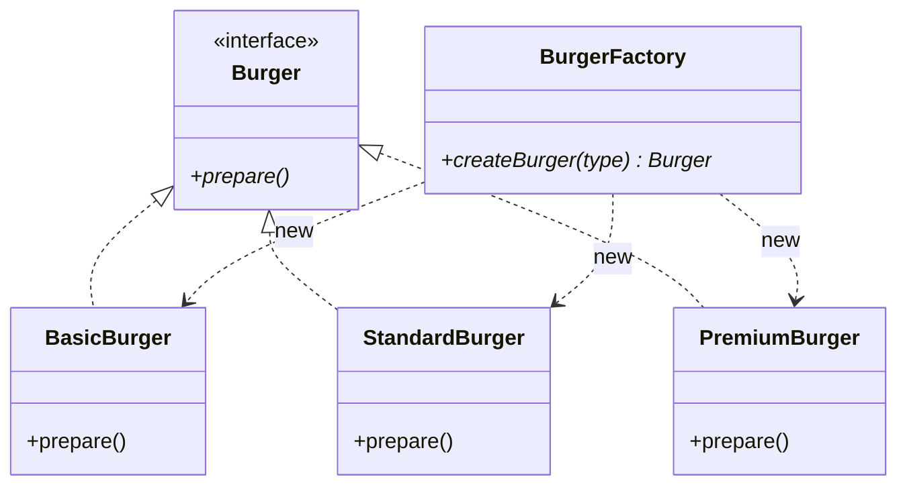
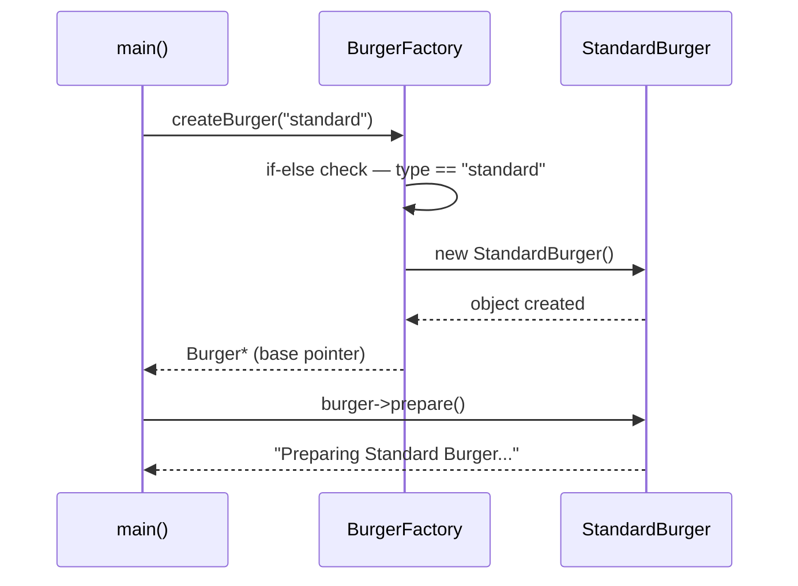

# Simple Factory — Detailed Notes (Hinglish)

> **Intent:** Object creation ka saara logic **ek jagah** (factory class me) centralize karo — client kabhi `new BasicBurger()` na kare, bas type bataye aur ready object le.
> **Code:** [`SimpleFactory.cpp`](../C++%20Code/SimpleFactory.cpp)

---

## 1. Problem — Bina Factory kya dikkat hai?

Socho client (`main`) khud objects banata hai:

```cpp
// ❌ Client har concrete class ko jaanta hai
Burger* burger;
if (type == "basic")         burger = new BasicBurger();
else if (type == "standard") burger = new StandardBurger();
else if (type == "premium")  burger = new PremiumBurger();
```

Ab imagine karo ye if-else **10 alag files** me copy-paste hua hai (order flow, admin panel, testing...). Naya `VeggieBurger` aaya to?

| Issue | Kyun problem hai — detail me |
|-------|------------------------------|
| **Tight coupling** | `main` directly `BasicBurger`, `StandardBurger` — har concrete class ko jaanta hai. Kisi class ka naam ya constructor badla to har client file tootegi. |
| **Duplicate logic** | Same if-else har jagah. Ek jagah bug fix kiya, baaki 9 jagah bhool gaye — inconsistency. |
| **OCP weak** | Naya type = **har client file modify**. "Closed for modification" ka namo-nishan nahi. |
| **Creation + business logic mixed** | `main` ka kaam orchestration hai, par wo object banane ke details me phasa hua hai — SRP violation. |

**Root cause:** Creation ka *decision* (kaunsi class instantiate karni hai) client ke paas hai, jabki client ko sirf *use* karna hai.

---

## 2. Simple Factory kya hai?

Ek **helper class** (`BurgerFactory`) jo type string leti hai aur sahi `Burger*` bana ke deti hai. Saari `new` calls ab **sirf factory ke andar** hain.

```
Client  →  BurgerFactory::createBurger("standard")  →  StandardBurger*
           (client ko StandardBurger ka NAAM tak nahi chahiye)
```

**Analogy:** Fast food counter 🍔 — tum counter pe bas "ek standard burger" bolte ho. Kitchen (factory) andar decide karti hai recipe, ingredients, process. Tumhe sirf ready burger milta hai. Tum kitchen ke andar ja ke khud nahi banate!

> **Important note:** Simple Factory **GoF book ka official pattern NAHI hai** — ye ek common **idiom** hai. Interviews me phir bhi poocha jaata hai, aur ye Factory Method samajhne ki foundation hai.

---

## 3. Class structure



| Role | Class | Kaam |
|------|-------|------|
| **Product interface** | `Burger` — `virtual void prepare() = 0` | Sab products ka common contract |
| **Concrete products** | `BasicBurger`, `StandardBurger`, `PremiumBurger` | Actual objects jo bante hain |
| **Factory** | `BurgerFactory` — **non-virtual** `createBurger()` | Creation decision ka ekmatra maalik |
| **Client** | `main()` | Sirf type deta hai, object use karta hai |

**Dhyan do:** Factory yahan **concrete class** hai (abstract nahi) — yahi Simple Factory ki pehchaan hai. Factory Method me yahi abstract ho jayegi.

---

## 4. Code walkthrough — line by line samjho

### 4.1 Product interface

```cpp
class Burger {
public:
    virtual void prepare() = 0;   // pure virtual — Burger abstract hai
    virtual ~Burger() {}          // virtual destructor — CRITICAL!
};
```

**Virtual destructor kyun critical:** Client `Burger*` (base pointer) se object delete karega — `delete burger;`. Agar destructor virtual nahi hai to `StandardBurger` ka destructor **call hi nahi hoga** → undefined behavior/leak. Ye interview ka guaranteed question hai.

### 4.2 Concrete products

```cpp
class StandardBurger : public Burger {
public:
    void prepare() override {   // override — compiler signature check karega
        cout << "Preparing Standard Burger with bun, patty, cheese, and lettuce!" << endl;
    }
};
```

Har product apna `prepare()` deta hai. Client `Burger*` pe call karta hai, **virtual dispatch** sahi wala chala deta hai — client ko concrete type se koi matlab nahi.

### 4.3 Factory — creation ka ekmatra darwaza

```cpp
class BurgerFactory {
public:
    Burger* createBurger(string& type) {
        if (type == "basic")         return new BasicBurger();
        else if (type == "standard") return new StandardBurger();
        else if (type == "premium")  return new PremiumBurger();
        else { cout << "Invalid burger type! "; return nullptr; }
    }
};
```

**Key points:**
- Return type `Burger*` hai — **concrete nahi**. Yahi abstraction client ko decouple karti hai.
- Ye if-else ladder hi Simple Factory ka **weak point** hai — naya type = ye method edit (OCP break). Par kam se kam ab edit **sirf ek jagah** hota hai, har client me nahi. Ye bhi improvement hai!
- Invalid type pe `nullptr` — production me exception ya `std::optional` better hai; caller ko null-check karna padega warna crash.

### 4.4 Client

```cpp
string type = "standard";                              // runtime input ho sakta hai
BurgerFactory* myBurgerFactory = new BurgerFactory();
Burger* burger = myBurgerFactory->createBurger(type);  // magic line!
burger->prepare();                                     // polymorphic call
delete burger;                                         // virtual dtor → safe
delete myBurgerFactory;
```

Client kitna **saaf** ho gaya — na if-else, na concrete class ka naam. Type string user input/config/API se aa sakti hai — **runtime pe decide** hota hai kaunsa object banega.

---

## 5. Execution flow



**Expected output:**

```
Preparing Standard Burger with bun, patty, cheese, and lettuce!
```

---

## 6. SOLID lens — kya milta hai, kya nahi

| Principle | Simple Factory | Detail |
|-----------|----------------|--------|
| **SRP** | ✅ | Creation factory me, behavior products me, orchestration main me — sabka apna kaam |
| **OCP** | ❌ | Naya burger → `createBurger` me naya `else if` — factory **modify** karni padti hai |
| **DIP** | ⚠️ Partial | Client products ko abstraction (`Burger*`) se use karta hai ✅, par factory khud **concrete** hai — `BurgerFactory` pe direct depend ❌ |
| **LSP** | ✅ | Koi bhi concrete burger `Burger*` ki jagah chalega — sab `prepare()` contract nibhate hain |
| **ISP** | ✅ | `Burger` interface thin hai — sirf ek method |

**OCP wala ❌ hi Factory Method ka janm-kaaran hai** — agla note isi se shuru hota hai.

---

## 7. Kab use karein / Kab avoid karein

| ✅ Use karo jab | ❌ Avoid karo jab |
|-----------------|-------------------|
| Product types kam hain aur stable hain (2-5 types) | Products bar-bar add/change hote hain (OCP pain) |
| Internal tool / prototype / MVP — simplicity chahiye | Multiple brands/vendors ki apni creation logic chahiye → **Factory Method** |
| Team ko ek central creation point chahiye | Related products ki family consistency chahiye → **Abstract Factory** |
| Over-engineering se bachna hai | Framework bana rahe ho jahan users extend karenge |

**Thumb rule:** Simple Factory se **shuru karo** — jab if-else bada hone lage ya brands aane lagen, tab Factory Method pe refactor karo. Pehle din se Abstract Factory mat thoso!

---

## 8. Fayde / Nuksan

**Fayde 👍**
- Client ekdum simple — ek method call, zero creation knowledge
- Saari `new` calls ek file me — change ka blast radius chhota
- Naya validation/logging/caching creation pe lagana ho to ek hi jagah
- Polymorphism se client code type-agnostic

**Nuksan 👎**
- **OCP weak** — har naya product factory edit maangta hai
- Factory **god object** ban sakti hai (50 types = 50 if-else 💀)
- `createBurger` virtual nahi — test me factory mock karna mushkil (interface nahi hai)
- String-based type error-prone — typo compile time pe nahi pakda jaata (enum better)

---

## 9. Production-style improvements

```cpp
// 1. Smart pointer — manual delete ki tension khatam
unique_ptr<Burger> createBurger(const string& type);

// 2. Enum — string typos compile-time pe pakde jaayein
enum class BurgerType { Basic, Standard, Premium };

// 3. Registry-based factory — if-else ki jagah map (OCP improve!)
map<string, function<unique_ptr<Burger>()>> registry = {
    {"basic",    []{ return make_unique<BasicBurger>(); }},
    {"standard", []{ return make_unique<StandardBurger>(); }},
};
// Naya type = registry me ek entry — code modify nahi!
```

---

## 10. Interview Q&A

**Q: Simple Factory GoF pattern hai?**
A: Nahi — catalog me officially nahi hai, ye **programming idiom** hai. GoF me Factory Method aur Abstract Factory hain. Par interviews me Simple Factory se hi shuruaat hoti hai.

**Q: Simple Factory vs static factory method?**
A: Intent same — creation centralize. Static version me `BurgerFactory::create()` bina object ke call hota; yahan instance method hai. Java me `Integer.valueOf()` static factory ka example hai.

**Q: Simple Factory OCP kyun todta hai?**
A: Naya product type aane pe `createBurger` ka if-else **edit** karna padta hai — matlab class modification ke liye open hai. Factory Method isse subclassing se solve karta hai.

**Q: Phir bhi Simple Factory kyun use karein?**
A: Kyunki **kam se kam client to decouple ho gaya**. Edit ab ek jagah hota hai, har client me nahi. Chhote stable systems me ye kaafi hai — YAGNI.

**Q: Next step kya hai?**
A: Jab brands/subclasses ko apni-apni creation chahiye → **Factory Method** ([02_Factory_Method.md](./02_Factory_Method.md)).

---

## 11. Real-world examples

| Domain | Simple Factory jaisa |
|--------|------------------------|
| JDBC | `DriverManager.getConnection(url)` — URL string se sahi driver |
| Logging | `Logger.getLogger(name)` — central creation point |
| JSON libraries | `JsonValue::parse(text)` — text se sahi node type |
| C++ streams | Stream factory functions jo mode ke hisaab se object dein |

---

## 12. Build & run

```bash
cd "L9 Factory_Design_Pattern/C++ Code"
g++ -std=c++17 -o simple_factory_demo SimpleFactory.cpp && ./simple_factory_demo
```

---

**Next:** [02 Factory Method](./02_Factory_Method.md) — factory ko abstract karke creation subclasses me distribute karo (OCP fix!)
