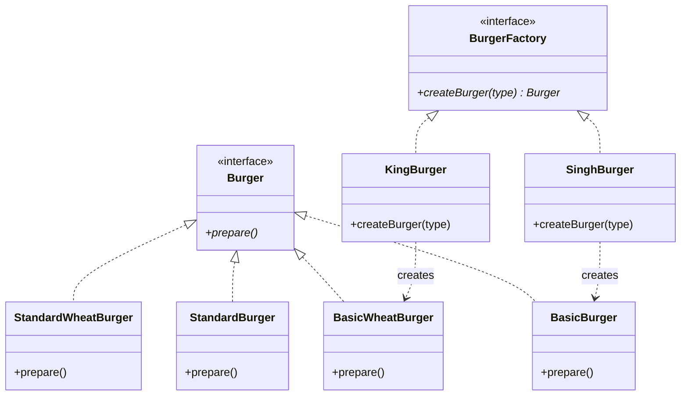
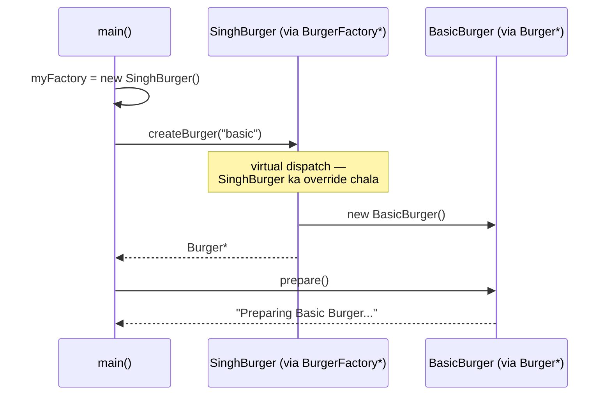

# Factory Method — Detailed Notes (Hinglish)

> **Intent (GoF):** *"Define an interface for creating an object, but let **subclasses** decide which class to instantiate."* — Object banane ka faisla **subclass** pe chhod do. Base factory sirf contract de, har brand apni concrete factory se apne products banaye.
> **Code:** [`FactoryMethod.cpp`](../C++%20Code/FactoryMethod.cpp)

---

## 1. Simple Factory se upgrade kyun karna pada?

Simple Factory me **ek concrete class** me saare brands ka if-else thusa hua tha:

```cpp
// ❌ Simple Factory — sab kuch ek jagah
class BurgerFactory {
    Burger* createBurger(string& type) {
        // Singh ke burgers... King ke burgers... McD ke burgers...
        // Naya brand aaya? ISI class ko kholo aur edit karo — OCP break!
    }
};
```

**Problems jo Simple Factory me reh gayi thi:**

| Problem | Detail |
|---------|--------|
| **OCP break** | Naya brand/variant = central factory **edit** — existing tested code chhedna padta hai |
| **God class risk** | 5 brands × 3 types = 15 branches ek hi method me — unmaintainable |
| **No brand abstraction** | Client concrete `BurgerFactory` pe depend — factory swap nahi kar sakta |
| **Framework extension impossible** | Library user apna brand add karna chahe to library ka source edit kare?! |

**Factory Method ka fix:** Factory ko hi **abstract** bana do. Har brand apni factory class banaye:

- **Interface:** `BurgerFactory` with `virtual createBurger() = 0`
- **`SinghBurger`** → normal bun burgers banata hai
- **`KingBurger`** → wheat bun burgers banata hai

**Naya brand = nayi factory class — purana code ZERO edit.** ✅ OCP satisfied!

---

## 2. Factory Method kya hai — concept

Wo `virtual createBurger()` method jo subclass override karti hai — **usi ko "Factory Method" kehte hain**. Pattern ka naam is method se aaya hai.

```
                    BurgerFactory (Abstract Creator)
                    virtual createBurger() = 0
                           △
              ┌────────────┴────────────┐
        SinghBurger                  KingBurger
        (normal bun)                 (wheat bun)
              │                            │
              ▼ creates                    ▼ creates
    BasicBurger, StandardBurger,   BasicWheatBurger, StandardWheatBurger,
    PremiumBurger                  PremiumWheatBurger
```

**Analogy:** Franchise model 🏪 — "Singh Burger" aur "King Burger" dono franchises ka **menu API same** hai (`createBurger("basic")`), par har outlet **apni recipe** se banata hai. Naya franchise kholna ho to purane outlets ki rasoi nahi badalti — bas naya outlet khul jaata hai!

**Do parallel hierarchies bante hain:**
1. **Product hierarchy** — `Burger` → normal + wheat variants
2. **Creator hierarchy** — `BurgerFactory` → `SinghBurger`, `KingBurger`

Aur inka connection: har concrete creator apni product line se juda hai.

---

## 3. Participants (GoF roles)

| GoF Role | Is repo me | Kaam |
|----------|--------------|------|
| **Product** | `Burger` (abstract) | Sab products ka common interface |
| **ConcreteProduct** | `BasicBurger`, `BasicWheatBurger`, ... | Actual objects |
| **Creator** | `BurgerFactory` (abstract) | Factory method declare karta hai |
| **ConcreteCreator** | `SinghBurger`, `KingBurger` | Factory method override karke apne products banata hai |
| **Client** | `main()` | Kaunsi factory use karni hai — bas ye choose karta hai |

---

## 4. Class diagram



---

## 5. Code walkthrough — detail me

### 5.1 Abstract Creator — pattern ka core

```cpp
class BurgerFactory {
public:
    virtual Burger* createBurger(string& type) = 0;  // YE hai Factory Method
    virtual ~BurgerFactory() {}                      // virtual dtor — zaroori!
};
```

**Kya ho raha hai:**
- `createBurger` ab **pure virtual** hai — base class kehti hai "banana subclass ka kaam hai, main sirf contract deti hu."
- **Virtual destructor kyun:** client `BurgerFactory*` se `SinghBurger` delete karega (`delete myFactory`) — virtual na ho to `SinghBurger` ka destructor skip → UB. Products (`Burger`) me bhi same reason se virtual dtor hai.

### 5.2 Concrete Creator #1 — SinghBurger (normal bun)

```cpp
class SinghBurger : public BurgerFactory {
public:
    Burger* createBurger(string& type) override {
        if (type == "basic")         return new BasicBurger();
        else if (type == "standard") return new StandardBurger();
        else if (type == "premium")  return new PremiumBurger();
        else { cout << "Invalid burger type! "; return nullptr; }
    }
};
```

**Dhyan do:** if-else **abhi bhi hai** — par ab ye sirf **is brand ke variants** ke liye hai. Pattern ka point if-else khatam karna nahi tha, **brands ko alag karna** tha. Naya brand aane pe ye class touch nahi hoti.

### 5.3 Concrete Creator #2 — KingBurger (wheat bun)

```cpp
class KingBurger : public BurgerFactory {
public:
    Burger* createBurger(string& type) override {
        if (type == "basic")         return new BasicWheatBurger();
        else if (type == "standard") return new StandardWheatBurger();
        else if (type == "premium")  return new PremiumWheatBurger();
        else { cout << "Invalid burger type! "; return nullptr; }
    }
};
```

**Same type strings, alag products!** Client "basic" bolta hai — Singh se `BasicBurger` milta, King se `BasicWheatBurger`. Client ko farq pata bhi nahi chalta — dono `Burger*` hain.

### 5.4 Client — sirf brand choose karta hai

```cpp
string type = "basic";
BurgerFactory* myFactory = new SinghBurger();   // ← BAS YE LINE badlo brand switch ke liye
Burger* burger = myFactory->createBurger(type); // virtual dispatch → SinghBurger::createBurger
burger->prepare();                              // virtual dispatch → BasicBurger::prepare
delete burger;
delete myFactory;
```

**Double polymorphism chal raha hai:**
1. `myFactory->createBurger()` — kaunsi **factory** ka method chale (Singh ya King)
2. `burger->prepare()` — kaunsa **product** ka method chale (normal ya wheat)

Client dono jagah sirf **abstract pointers** use karta hai — `BurgerFactory*` aur `Burger*`. Yahi DIP hai.

---

## 6. Execution flow



| Factory choice | Output (type = "basic") |
|----------------|-------------------------|
| `new SinghBurger()` | `Preparing Basic Burger with bun, patty, and ketchup!` |
| `new KingBurger()` | `Preparing Basic Wheat Burger with bun, patty, and ketchup!` |

**Ek word ka change (`SinghBurger` → `KingBurger`) = poora product line switch.** Baaki code untouched.

---

## 7. SOLID analysis

| Principle | Factory Method | Kaise |
|-----------|----------------|-------|
| **OCP** | ✅ Strong | Naya brand = nayi factory subclass; naya product = nayi product class — **existing code modify nahi** |
| **DIP** | ✅ Strong | Client `BurgerFactory*` + `Burger*` (dono abstractions) pe depend — kisi concrete pe nahi |
| **SRP** | ✅ | Singh factory sirf Singh ke burgers jaanti hai; King sirf King ke |
| **LSP** | ✅ | Koi bhi `BurgerFactory` subclass client me substitute ho sakti hai — contract same |
| **ISP** | ✅ | Ek-method thin interfaces |

**Simple Factory ke dono ❌ (OCP, DIP) yahan ✅ ho gaye** — yahi upgrade ka poora point tha.

---

## 8. Simple Factory vs Factory Method — side by side

| | **Simple Factory** | **Factory Method** |
|---|--------|----------------|
| Factory class | Concrete (ek hi) | **Abstract** + concrete subclasses |
| Creation decision | Central if-else | **Har subclass** apna |
| Naya brand | Central factory **edit** ❌ | Nayi factory class **add** ✅ |
| Client depend karta hai | Concrete `BurgerFactory` | Abstract `BurgerFactory*` |
| GoF official | ❌ Idiom | ✅ Catalog pattern |
| Complexity | Low | Medium (do hierarchies) |
| Kab sahi | Kam, stable types | Multiple brands / extensible frameworks |

---

## 9. Kab use karein

| Scenario | Example |
|----------|---------|
| **Multiple vendors/brands** — har ek ki apni creation | Singh vs King outlets; Paytm vs Razorpay gateway |
| **Framework extension points** — users apne types plug karein | Game engine: user-defined `MonsterFactory` |
| **Deployment-specific products** | Cloud: AWS vs GCP resource factory |
| **Testing** | `MockBurgerFactory` inject karke client ko fake products do |

**Kab NA karein:** sirf ek brand hai aur kabhi doosra aayega hi nahi — Simple Factory ya direct creation kaafi. Hierarchy ka overhead tabhi justify hota hai jab variation real ho.

---

## 10. Production-style improvements

```cpp
// 1. Smart pointers — ownership clear, leak impossible
virtual unique_ptr<Burger> createBurger(const string& type) = 0;

// 2. Enum class — string typos compile-time pe pakdo
enum class BurgerType { Basic, Standard, Premium };

// 3. Factory registry — brands ko naam se lookup karo
map<string, unique_ptr<BurgerFactory>> brands;
brands["singh"] = make_unique<SinghBurger>();
brands["king"]  = make_unique<KingBurger>();
```

Interview me bolo: *"Demo raw pointers + strings for simplicity — production me unique_ptr aur enums use karunga."*

---

## 11. Repo me aur kahan yahi pattern?

| Project | Factory Method style |
|---------|---------------------|
| L11 Food Delivery | `NowOrderFactory`, `ScheduledOrderFactory` |
| L18 Spotify | Device factories per output type |
| L23 Payment | Gateway factories (`PaytmFactory` vs `RazorpayFactory` style) |

---

## 12. Build & run

```bash
cd "L9 Factory_Design_Pattern/C++ Code"
g++ -std=c++17 -o factory_method_demo FactoryMethod.cpp && ./factory_method_demo
```

---

## 13. Interview gold lines 🥇

1. *"Factory Method defers instantiation to subclasses — client codes against the abstract creator."*
2. *"Simple Factory centralizes creation; Factory Method **distributes** it across subclasses for OCP."*
3. *"Same `createBurger` API, different products — `SinghBurger` vs `KingBurger` decide karte hain."*
4. *"Pattern ka naam us **virtual create method** se hai jo subclass override karti hai — wahi 'factory method' hai."*
5. *"Do parallel hierarchies — products aur creators — aur har concrete creator apni product line se bonded."*

---

**Prev:** [01 Simple Factory](./01_Simple_Factory.md)
**Next:** [03 Abstract Factory](./03_Abstract_Factory.md) — jab ek product nahi, **poori family** chahiye (burger + garlic bread, same theme)
