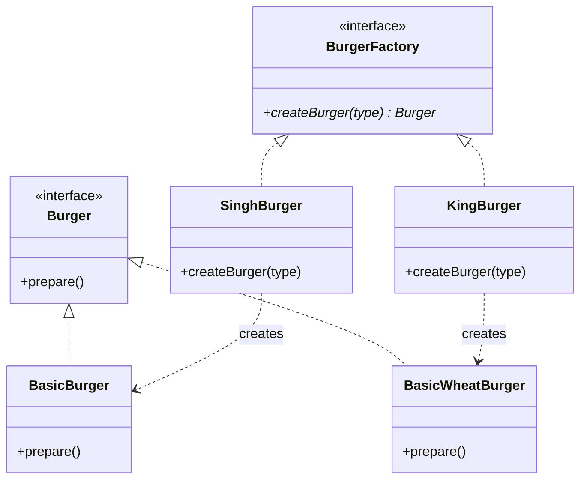
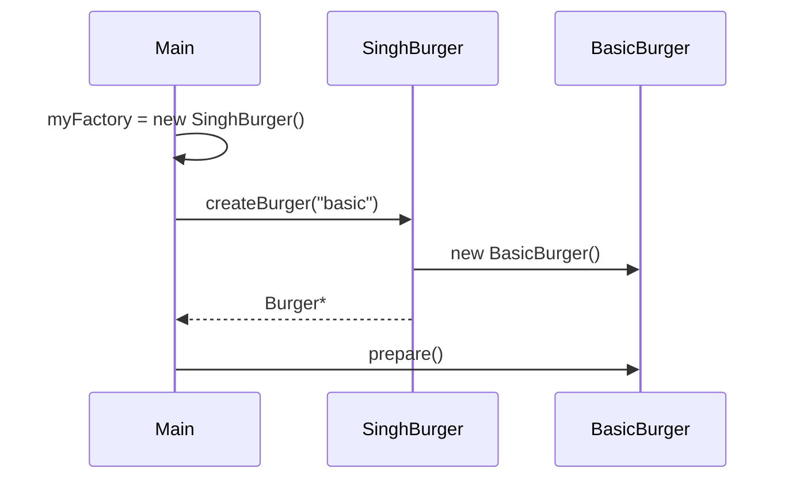

# Factory Method — Detailed Notes

> **Intent:** Object creation ko **subclasses** decide karein — base factory interface, har brand apna burger banaye.  
> **Code:** [`FactoryMethod.cpp`](../C++%20Code/FactoryMethod.cpp)

---

## 1. Simple Factory se upgrade kyun?

Simple Factory me **ek class** me saare if-else:

```cpp
// BurgerFactory — sab brands ek jagah (bad for OCP)
if (type == "basic") return new BasicBurger();
```

Factory Method me:

- **Interface:** `BurgerFactory` with `virtual createBurger()`
- **SinghBurger** → normal bun burgers
- **KingBurger** → wheat bun burgers

Naya brand = **nayi factory class** — purani factory touch nahi.

---

## 2. Factory Method kya hai? (GoF)

> *"Define an interface for creating an object, but let **subclasses** decide which class to instantiate."*

```
                    BurgerFactory (Creator)
                           △
              ┌────────────┴────────────┐
        SinghBurger                  KingBurger
              │                            │
    BasicBurger, Standard...      BasicWheatBurger, ...
```

---

## 3. Participants

| GoF name | Is repo mein |
|----------|--------------|
| **Product** | `Burger` |
| **ConcreteProduct** | `BasicBurger`, `BasicWheatBurger`, … |
| **Creator** | `BurgerFactory` (abstract) |
| **ConcreteCreator** | `SinghBurger`, `KingBurger` |
| **Client** | `main` — factory pointer choose karta hai |

---

## 4. Class diagram



---

## 5. Code walkthrough

### Abstract creator

```cpp
class BurgerFactory {
public:
    virtual Burger* createBurger(string& type) = 0;
    virtual ~BurgerFactory() {}
};
```

**Virtual destructor** — `delete` through base pointer safe.

### Concrete creator — Singh (normal bun)

```cpp
class SinghBurger : public BurgerFactory {
public:
    Burger* createBurger(string& type) override {
        if (type == "basic")    return new BasicBurger();
        else if (type == "standard") return new StandardBurger();
        else if (type == "premium")  return new PremiumBurger();
        else { cout << "Invalid burger type! "; return nullptr; }
    }
};
```

### Concrete creator — King (wheat bun)

```cpp
class KingBurger : public BurgerFactory {
    Burger* createBurger(string& type) override {
        if (type == "basic")    return new BasicWheatBurger();
        // ...
    }
};
```

### Client — brand select karta hai

```cpp
string type = "basic";
BurgerFactory* myFactory = new SinghBurger();  // ya KingBurger()
Burger* burger = myFactory->createBurger(type);
burger->prepare();
delete burger;
delete myFactory;
```

**Runtime polymorphism:** `myFactory` ka actual type decide karta hai kaunsa burger bana.

---

## 6. Execution flow



| Factory choice | Output (basic) |
|----------------|----------------|
| `SinghBurger` | `Preparing Basic Burger with bun, patty, and ketchup!` |
| `KingBurger` | `Preparing Basic Wheat Burger with bun, patty, and ketchup!` |

---

## 7. SOLID analysis

| Principle | Factory Method |
|-----------|----------------|
| **OCP** | ✅ Naya product = nayi class; naya brand = nayi factory |
| **DIP** | ✅ Client `BurgerFactory*` + `Burger*` par depend |
| **SRP** | ✅ Singh sirf Singh burgers banata hai |
| **LSP** | ✅ Koi bhi `BurgerFactory` replace ho sakti hai |

---

## 8. Simple Factory vs Factory Method

| | Simple | Factory Method |
|---|--------|----------------|
| Creation logic | Ek class, if-else | Har subclass apna if-else |
| Extend brand | Edit central factory | Add `KingBurger` class |
| Client holds | `BurgerFactory` concrete | `BurgerFactory*` abstract |
| GoF official | Idiom | ✅ Yes |

---

## 9. Kab use karein

| Scenario | Example |
|----------|---------|
| Multiple vendors/brands | Singh vs King outlets |
| Framework extension points | Game: user-defined `MonsterFactory` |
| Product line varies by deployment | Cloud: AWS vs GCP resource factory |

---

## 10. Production-style improvements

```cpp
// Better: smart pointers
std::unique_ptr<Burger> createBurger(const std::string& type);

// Better: enum instead of string
enum class BurgerType { Basic, Standard, Premium };

// Registry: map<string, function<unique_ptr<Burger>()>>
```

Interview me bolo: *"Demo raw pointers + string for simplicity."*

---

## 11. Repo mein aur kahan?

| Project | Factory Method style |
|---------|---------------------|
| L11 Food Delivery | `NowOrderFactory`, `ScheduledOrderFactory` |
| L18 Spotify | Device factories per output type |
| Payment gateways | `PaytmFactory` vs `RazorpayFactory` style |

---

## 12. Build & run

```bash
cd "L9 Factory_Design_Pattern/C++ Code"
g++ -std=c++17 -o factory_method_demo FactoryMethod.cpp && ./factory_method_demo
```

---

## 13. Interview gold lines

1. *"Factory Method defers instantiation to subclasses — client uses abstract creator."*
2. *"Simple Factory centralizes; Factory Method **distributes** creation for OCP."*
3. *"Same `createBurger` API, different burgers based on `SinghBurger` vs `KingBurger`."*

---

**Prev:** [01 Simple Factory](./01_Simple_Factory.md)  
**Next:** [03 Abstract Factory](./03_Abstract_Factory.md) — burger **+** garlic bread families
