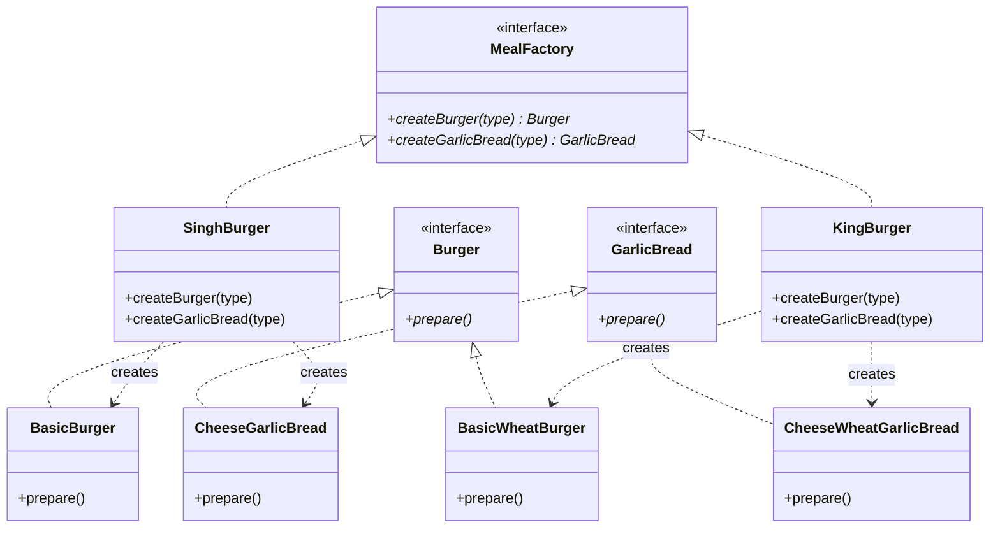
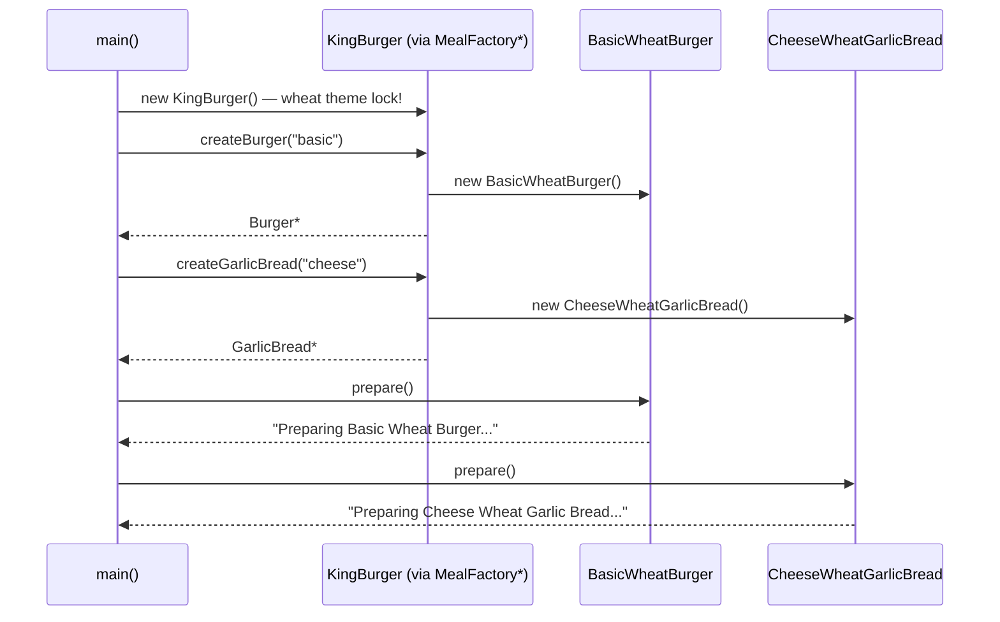

# Abstract Factory — Detailed Notes (Hinglish)

> **Intent (GoF):** *"Provide an interface for creating **families** of related or dependent objects without specifying their concrete classes."* — Ek factory se **related products ki poori family** lo — wheat burger ke saath wheat garlic bread hi milegi; mixing structurally impossible.
> **Code:** [`AbstractFactory.cpp`](../C++%20Code/AbstractFactory.cpp)

---

## 1. Factory Method ke baad ab kya problem bachi?

Factory Method **ek product line** handle karta hai — sirf `createBurger()`. Par real life me **combo** chahiye:

- Burger **+** Garlic Bread (meal!)
- Aur dono **same theme** ke hone chahiye — normal ya wheat

Agar do alag independent factories use karo to **consistency ka koi guarantee nahi**:

```cpp
// ❌ Do alag factories — mixing ka khatra!
BurgerFactory* bf   = new KingBurger();          // wheat burgers
BreadFactory* brf   = new NormalBreadFactory();  // normal bread — OOPS!

// Result: wheat burger + normal garlic bread = theme TOOT gayi
// Health-conscious customer ne wheat meal manga tha, aadha normal mil gaya!
```

Ye galti **compile ho jaati hai** — koi rok nahi sakta. Discipline pe depend karna design nahi hota.

**Abstract Factory ka fix:** Ek hi factory interface me **dono create methods** daal do. Ab jo concrete factory chunoge, **saare products usi ki family ke** milenge — galat combination banana **structurally impossible** ho jaata hai.

---

## 2. Abstract Factory kya hai — concept

```
MealFactory (Abstract Factory — ek interface, MULTIPLE create methods)
    ├── createBurger(type)        → Burger family member
    └── createGarlicBread(type)   → GarlicBread family member

SinghBurger (Concrete Factory)         KingBurger (Concrete Factory)
  NORMAL theme family:                   WHEAT theme family:
    ├── BasicBurger                        ├── BasicWheatBurger
    ├── StandardBurger                     ├── StandardWheatBurger
    ├── PremiumBurger                      ├── PremiumWheatBurger
    ├── BasicGarlicBread                   ├── BasicWheatGarlicBread
    └── CheeseGarlicBread                  └── CheeseWheatGarlicBread
```

**Interview nickname:** "Factory of factories" — technically ek factory hai jisme multiple factory methods hain, har method apni product type ke liye.

**Analogy #1 — Meal combo 🍔🍞:** "Wheat theme meal" order karo — burger aur bread **dono** wheat family se aayenge. Aadha wheat aadha normal impossible.

**Analogy #2 — UI Dark Mode 🌙:** `DarkThemeFactory` se button, checkbox, menu — **sab dark** milenge. Ek light-mode button galti se dark UI me nahi ghusega. Yahi classic GoF example hai (`WinFactory` vs `MacFactory`).

---

## 3. Product families (is repo me)

### Family A — Singh (Normal theme)

| Product type | Variants |
|---------|-------|
| Burger | `BasicBurger`, `StandardBurger`, `PremiumBurger` |
| Garlic Bread | `BasicGarlicBread`, `CheeseGarlicBread` |

### Family B — King (Wheat theme)

| Product type | Variants |
|---------|-------|
| Burger | `BasicWheatBurger`, `StandardWheatBurger`, `PremiumWheatBurger` |
| Garlic Bread | `BasicWheatGarlicBread`, `CheeseWheatGarlicBread` |

**Golden rule:** `KingBurger` factory se **jo bhi** lo — sab wheat family ka. Ek factory = ek theme = zero mixing.

**Do dimensions samjho:**
- **Family/theme** (rows): Singh vs King — ye **factory choose** karti hai
- **Variant** (columns): basic/standard/premium — ye **type string** choose karti hai

---

## 4. Class diagram



---

## 5. Code walkthrough — detail me

### 5.1 Dusra product interface — GarlicBread

```cpp
class GarlicBread {
public:
    virtual void prepare() = 0;
    virtual ~GarlicBread() {}   // base pointer se delete → virtual dtor must
};
```

**YAHI woh cheez hai jo Abstract Factory ko Factory Method se alag karti hai** — ek aur **product type**. Factory Method me sirf `Burger` tha; ab `Burger` + `GarlicBread` dono hain, aur dono ki normal/wheat families hain.

### 5.2 Abstract Factory interface — MealFactory

```cpp
class MealFactory {
public:
    virtual Burger* createBurger(string& type) = 0;            // factory method #1
    virtual GarlicBread* createGarlicBread(string& type) = 0;  // factory method #2
    virtual ~MealFactory() {}
};
```

**Do pure virtual create methods** — jo bhi concrete factory banegi, use **dono** products banane ka contract nibhana padega. Ek Abstract Factory ke andar essentially **multiple Factory Methods** hote hain — isliye kehte hain: *"Abstract Factory is often implemented using Factory Methods."*

### 5.3 Concrete Factory — KingBurger (wheat family specialist)

```cpp
class KingBurger : public MealFactory {
public:
    Burger* createBurger(string& type) override {
        if (type == "basic")         return new BasicWheatBurger();
        else if (type == "standard") return new StandardWheatBurger();
        else if (type == "premium")  return new PremiumWheatBurger();
        else { cout << "Invalid burger type! "; return nullptr; }
    }
    GarlicBread* createGarlicBread(string& type) override {
        if (type == "basic")        return new BasicWheatGarlicBread();
        else if (type == "cheese")  return new CheeseWheatGarlicBread();
        else { cout << "Invalid Garlic bread type! "; return nullptr; }
    }
};
```

Dekho — `KingBurger` ke andar **sirf wheat classes** ka naam hai. Normal product yahan se nikal hi nahi sakta. **Consistency code ke structure me baked hai**, programmer ki yaaddasht pe nahi. (`SinghBurger` bilkul same, bas normal classes ke saath.)

### 5.4 Client — theme ek baar, phir sab consistent

```cpp
string burgerType = "basic";
string garlicBreadType = "cheese";

MealFactory* mealFactory = new KingBurger();   // ← THEME DECISION (sirf yahan)

Burger* burger = mealFactory->createBurger(burgerType);              // wheat milega
GarlicBread* garlicBread = mealFactory->createGarlicBread(garlicBreadType); // wheat hi milega

burger->prepare();       // "Preparing Basic Wheat Burger..."
garlicBread->prepare();  // "Preparing Cheese Wheat Garlic Bread..."

delete burger; delete garlicBread; delete mealFactory;
```

**Ek word ka change** (`KingBurger` → `SinghBurger`) = **poora meal normal theme me switch**. Do products, ek switch — Factory Method me ye do jagah badalna padta aur galti ka chance hota.

---

## 6. Execution flow



**Expected output:**

```
Preparing Basic Wheat Burger with bun, patty, and ketchup!
Preparing Cheese Wheat Garlic Bread with extra cheese and butter!
```

Dono lines me "Wheat" — family consistent! ✅

---

## 7. Factory Method vs Abstract Factory — the classic question

| Sawal | Factory Method | Abstract Factory |
|----------|----------------|------------------|
| Kitne `create*` methods? | **Ek** (`createBurger`) | **Multiple** (`createBurger` + `createGarlicBread`) |
| Kitne product types? | Ek product line | **Related products ki family** |
| Main focus | Kaunsa **subclass** instantiate ho | Kaunsi **family/theme** use ho |
| Consistency guarantee | ❌ Nahi (ek hi product hai) | ✅ Built-in — ek factory ek family |
| Classic example | Document creator per app type | OS widget set (button+checkbox+menu) |
| Relation | — | AF ke har method ko FM se implement karte hain |

**Interview one-liner:**

> *"Factory Method creates ONE product — inheritance decides which. Abstract Factory creates a FAMILY of related products — and guarantees they match."*

---

## 8. SOLID analysis

| Principle | Abstract Factory | Kaise |
|-----------|------------------|-------|
| **OCP (nayi family)** | ✅ | Nayi theme (jaise `VeganFactory`) = nayi `MealFactory` subclass — purana code untouched |
| **OCP (naya product type)** | ⚠️ | `createDrink()` add karna ho to **interface + saari factories** edit — ye AF ka known weakness hai! |
| **DIP** | ✅ | Client sirf `MealFactory*`, `Burger*`, `GarlicBread*` — teeno abstractions |
| **SRP** | ✅ | King factory sirf King family jaanti hai |
| **LSP** | ✅ | Koi bhi `MealFactory` subclass substitute ho sakti hai |

**⚠️ wala point interview me bolo to impress ho jaayenge:** *"Abstract Factory me nayi FAMILY add karna easy hai, par naya PRODUCT TYPE add karna costly — interface change hota hai."*

---

## 9. Real-world examples

| System | Families |
|--------|----------|
| **UI toolkit (GoF classic)** | `WinFactory` → WinButton + WinCheckbox; `MacFactory` → MacButton + MacCheckbox |
| **Dark/Light mode** | `DarkThemeFactory` — saare widgets dark; `LightThemeFactory` — saare light |
| **DB drivers** | MySQL family: `MySQLConnection` + `MySQLCommand`; Postgres family: `PgConnection` + `PgCommand` |
| **Game assets** | `LowPolyAssetsFactory` vs `RealisticAssetsFactory` — models + textures + sounds match |
| **Cloud SDKs** | AWS family: S3 + EC2 + SQS clients; GCP family: GCS + GCE + PubSub clients |

---

## 10. Kab use / kab avoid

| ✅ Use karo jab | ❌ Avoid karo jab |
|--------|----------|
| Products **must match** (theme/OS/brand) — mixing bug hai | Sirf **ek product type** hai → Factory Method kaafi |
| Cross-platform kits — pura widget set ek saath switch | Products **unrelated** hain — family force-fit mat karo |
| Consistent bundles (meal combos, asset packs) | Naye product types frequently add honge (interface baar-baar badlega) |
| Client ko family ke implementation se poori tarah insulate karna hai | Chhota app — Simple Factory se kaam chal jayega |

---

## 11. Common mistakes (interview me pakde jaate hain)

1. **"Abstract Factory = Factory Method with 2 methods"** — ❌ Nahi! Intent alag hai: FM ka point *subclass decides*, AF ka point *family consistency*. Methods ginna nahi, **purpose** batana.
2. **Client do alag concrete factories mix kar raha hai** — `SinghBurger` se burger, `KingBurger` se bread — pura point defeat! Client ko **ek hi factory instance** use karna chahiye.
3. **God abstract factory** — 50 `create*` methods ek interface me. Families ko logically **split** karo.
4. **Har jagah AF thopna** — jab family consistency ka requirement hi nahi, AF sirf complexity add karta hai.

---

## 12. Extension ideas (practice ke liye)

- `createDrink()` add karo — dekho kitni jagah change karna padta hai (AF ka weakness khud feel karo!)
- `enum class Theme { Singh, King }` + ek helper: `MealFactory* getFactory(Theme t)` — Simple Factory se Abstract Factory create karo (patterns ka combo!)
- `unique_ptr<Burger>` returns — memory safety
- Ek `Meal` class banao jo burger + bread dono hold kare — factory se `createMeal()` full combo de

---

## 13. Build & run

```bash
cd "L9 Factory_Design_Pattern/C++ Code"
g++ -std=c++17 -o abstract_factory_demo AbstractFactory.cpp && ./abstract_factory_demo
```

---

## 14. Family consistency — ek nazar me

```
        Client
           │  (ek baar theme choose)
           ▼
    ┌──────────────┐
    │ MealFactory* │
    └──────┬───────┘
           │
     ┌─────┴──────┐
     ▼            ▼
 SinghBurger   KingBurger
     │            │
 ┌───┴───┐    ┌───┴───┐
 Normal  Normal  Wheat  Wheat
 Burger  Bread   Burger Bread
 └───┬───┘    └───┬───┘
     ▼            ▼
 SAME THEME    SAME THEME
 guaranteed    guaranteed
```

---

**Prev:** [02 Factory Method](./02_Factory_Method.md)
**Next:** [04 Comparison + SOLID + Interview](./04_Comparison_SOLID_Interview.md) — teeno patterns ka final revision pack
