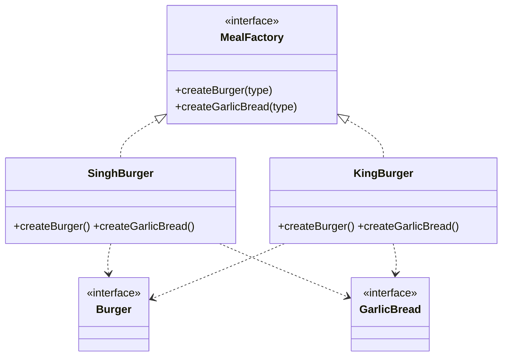
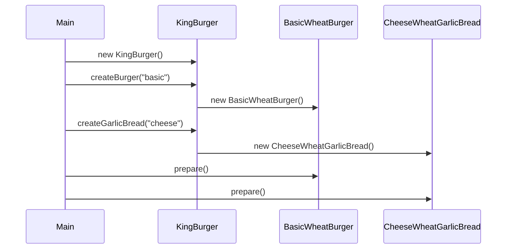

# Abstract Factory — Detailed Notes

> **Intent:** **Related products ki poori family** ek saath — wheat burger ke saath wheat garlic bread; mix na ho.  
> **Code:** [`AbstractFactory.cpp`](../C++%20Code/AbstractFactory.cpp)

---

## 1. Factory Method se aage kya problem?

Factory Method **ek product line** handle karta hai (`createBurger`).

Agar client ko **combo** chahiye:

- Burger + Garlic Bread
- Dono **same theme** (normal vs wheat)

Toh do alag factories risk:

```cpp
BurgerFactory* bf = new KingBurger();
SomeOtherBreadFactory* breadF = new NormalBreadFactory(); // ❌ wheat burger + normal bread
```

**Abstract Factory** ek interface se **coordinated** family deta hai.

---

## 2. Abstract Factory kya hai? (GoF)

> *"Provide an interface for creating **families** of related objects without specifying their concrete classes."*

```
MealFactory (Abstract Factory)
    ├── createBurger(type)
    └── createGarlicBread(type)

SinghBurger (Concrete Factory)     KingBurger (Concrete Factory)
    ├── BasicBurger                      ├── BasicWheatBurger
    ├── BasicGarlicBread                 ├── CheeseWheatGarlicBread
    └── ...                              └── ...
```

**"Factory of factories"** — interview nickname (technically: one factory, multiple product methods).

---

## 3. Product families (is repo)

### Family A — Singh (Normal theme)

| Product | Types |
|---------|-------|
| Burger | `BasicBurger`, `StandardBurger`, `PremiumBurger` |
| Garlic Bread | `BasicGarlicBread`, `CheeseGarlicBread` |

### Family B — King (Wheat theme)

| Product | Types |
|---------|-------|
| Burger | `BasicWheatBurger`, `StandardWheatBurger`, `PremiumWheatBurger` |
| Garlic Bread | `BasicWheatGarlicBread`, `CheeseWheatGarlicBread` |

**Rule:** `KingBurger` factory se jo bhi lo — sab **wheat** family.

---

## 4. Class diagram



---

## 5. Code walkthrough

### Second product — GarlicBread

```cpp
class GarlicBread {
public:
    virtual void prepare() = 0;
    virtual ~GarlicBread() {}
};
```

Abstract Factory = **multiple product interfaces**.

### Abstract factory interface

```cpp
class MealFactory {
public:
    virtual Burger* createBurger(string& type) = 0;
    virtual GarlicBread* createGarlicBread(string& type) = 0;
    virtual ~MealFactory() {}
};
```

### Concrete factory — King (wheat family)

```cpp
class KingBurger : public MealFactory {
    Burger* createBurger(string& type) override {
        if (type == "basic") return new BasicWheatBurger();
        // ...
    }
    GarlicBread* createGarlicBread(string& type) override {
        if (type == "cheese") return new CheeseWheatGarlicBread();
        // ...
    }
};
```

### Client — theme pick, phir combo

```cpp
MealFactory* mealFactory = new KingBurger();
Burger* burger = mealFactory->createBurger("basic");
GarlicBread* garlicBread = mealFactory->createGarlicBread("cheese");
burger->prepare();
garlicBread->prepare();
```

Client **kabhi** `BasicBurger` + `CheeseWheatGarlicBread` mix nahi karega agar sirf `KingBurger` use kare.

---

## 6. Execution flow



**Expected output:**

```
Preparing Basic Wheat Burger with bun, patty, and ketchup!
Preparing Cheese Wheat Garlic Bread with extra cheese and butter!
```

---

## 7. Factory Method vs Abstract Factory

| Question | Factory Method | Abstract Factory |
|----------|----------------|------------------|
| Kitne `create*` methods? | Usually **one** product | **Multiple** related products |
| Focus | Kaunsa **subclass** banaye | Kaunsi **family** banaye |
| Example | `createBurger` only | `createBurger` + `createGarlicBread` |
| Classic UI | One widget type | Button + Checkbox + Dialog same OS look |

**Interview one-liner:**

> *"Factory Method = one product, inheritance decides. Abstract Factory = **family** of products, composition of factories."*

---

## 8. SOLID

| Principle | Abstract Factory |
|-----------|------------------|
| **OCP** | ✅ Nayi family = `MealFactory` subclass |
| **DIP** | ✅ Client `MealFactory*` only |
| **SRP** | ✅ King factory sirf King meal banata hai |
| **Consistency** | ✅ Family constraint enforced |

---

## 9. Real-world examples

| System | Families |
|--------|----------|
| **UI toolkit** | WinButton + WinCheckbox vs MacButton + MacCheckbox |
| **Dark/Light mode** | DarkThemeFactory — sab widgets dark |
| **DB drivers** | MySQLConnection + MySQLCommand vs Postgres* |
| **Cross-platform games** | LowPolyAssetsFactory vs RealisticAssetsFactory |

---

## 10. Kab use / kab avoid

| ✅ Use | ❌ Avoid |
|--------|----------|
| Products **must match** (theme/OS) | Sirf ek product type |
| Platform kits | Unrelated products force-fit |
| Consistent UX bundles | Simple static creation enough |

---

## 11. Common mistakes (interview)

1. **Abstract Factory ≠ Factory Method with 2 methods** — intent family consistency hai.
2. **Client mixing factories** — do alag concrete factories call karke family tod dena.
3. **God abstract factory** — 50 `create*` methods — split families.

---

## 12. Extension ideas (practice)

- `createDrink()` add — same family (Singh cola vs King wheat smoothie)
- `enum class Theme { Singh, King }` + `MealFactory* getFactory(Theme)`
- `unique_ptr` + factory registry

---

## 13. Build & run

```bash
cd "L9 Factory_Design_Pattern/C++ Code"
g++ -std=c++17 -o abstract_factory_demo AbstractFactory.cpp && ./abstract_factory_demo
```

---

## 14. Diagram — family consistency

```
        Client
           │
           ▼
    ┌──────────────┐
    │ MealFactory*│
    └──────┬───────┘
           │
     ┌─────┴─────┐
     ▼           ▼
 SinghBurger   KingBurger
     │           │
  Normal      Wheat
  Burger      Burger
  +           +
  Normal      Wheat
  Bread       Bread
```

---

**Prev:** [02 Factory Method](./02_Factory_Method.md)  
**Next:** [04 Comparison + SOLID](./04_Comparison_SOLID_Interview.md)
