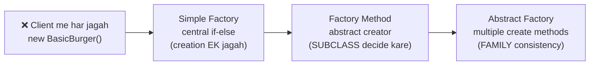

# Factory Family — Comparison, SOLID & Interview Pack (Hinglish)

> Teeno patterns ek saath — final revision sheet + interview answers. Ye file tab kholo jab teeno notes ([01](./01_Simple_Factory.md), [02](./02_Factory_Method.md), [03](./03_Abstract_Factory.md)) padh chuke ho.

---

## 1. Master comparison table (sabse important table — screenshot le lo 📸)

| Feature | **Simple Factory** | **Factory Method** | **Abstract Factory** |
|---------|-------------------|--------------------|-----------------------|
| **GoF catalog me?** | ❌ Idiom hai | ✅ Official | ✅ Official |
| **Kya banata hai** | Ek product type | Ek product type (per brand) | **Multiple related** products (family) |
| **Class decide kaun karta hai** | Central if-else | **Subclass** override | Concrete factory (poori family ek saath) |
| **Factory ka roop** | Ek **concrete** class | **Abstract** creator + concrete creators | Abstract factory with **multiple** `create*` methods |
| **Main mechanism** | `createBurger(type)` — non-virtual | `virtual createBurger()` — override | `createBurger()` + `createGarlicBread()` |
| **OCP (naya product/variant)** | ❌ Factory edit | ✅ Nayi product class + factory | ✅ Nayi classes |
| **OCP (naya brand/family)** | ❌ Factory edit | ✅ Nayi factory subclass | ✅ Nayi `MealFactory` subclass |
| **OCP (naya product TYPE, e.g. Drink)** | Factory edit | N/A (single product) | ⚠️ Interface + saari factories edit — known weakness! |
| **Client depend karta hai** | Concrete `BurgerFactory` | Abstract `BurgerFactory*` | Abstract `MealFactory*` |
| **Family consistency** | ❌ Concept hi nahi | ❌ Single product | ✅ **Built-in guarantee** |
| **Complexity** | Low | Medium | Higher |
| **Repo file** | [`SimpleFactory.cpp`](../C++%20Code/SimpleFactory.cpp) | [`FactoryMethod.cpp`](../C++%20Code/FactoryMethod.cpp) | [`AbstractFactory.cpp`](../C++%20Code/AbstractFactory.cpp) |

---

## 2. Evolution story (is course ki journey)



**Har arrow ek problem solve karta hai:**
1. `new` everywhere → **Simple Factory**: creation centralize hui, client decouple hua
2. Central if-else har naye brand pe edit → **Factory Method**: brands apni-apni factory subclass me gaye (OCP fix)
3. Do products ki theme mix ho sakti thi → **Abstract Factory**: ek factory poori matching family degi

**Yaad rakhne ka shortcut:**
- Simple = **"kahan** banau?" → ek jagah
- Method = **"kaun** banaye?" → subclass
- Abstract = **"kya-kya saath** banau?" → family

---

## 3. SOLID — pattern-wise deep dive

### Open/Closed Principle (OCP)

> *Open for extension, closed for modification* — naya feature purane code ko bina chhede aana chahiye.

| Pattern | Naya `VeggieBurger` add karna hai | Verdict |
|---------|---------------------|---------|
| Simple | `BurgerFactory::createBurger` me naya `else if` likhna padega | ❌ **Modify** |
| Factory Method | `class VeggieBurger : public Burger` + jis factory me chahiye wahan case | ✅ Mostly **extend** |
| Abstract Factory | Nayi product class + relevant factory me case | ✅ Mostly **extend** |

**Par ulta case bhi socho** — naya product TYPE (`Drink`) add karna hai:
- Simple/Method: naya factory ya method — theek hai
- Abstract Factory: `MealFactory` **interface** badlega → **saari** concrete factories tootengi ⚠️

**Lesson:** koi pattern har direction me OCP nahi deta — konsi cheez zyada badalti hai, uske hisaab se pattern chuno. Families badalti hain → AF. Product types badalte hain → AF se bacho.

### Dependency Inversion Principle (DIP)

> High-level modules abstractions pe depend karein, concretions pe nahi.

```cpp
// ✅ Client sirf abstractions dekh raha hai
BurgerFactory* factory = new SinghBurger();   // abstract factory pointer
Burger* b = factory->createBurger(type);      // abstract product pointer
b->prepare();                                 // virtual dispatch
```

| Pattern | DIP strength | Kyun |
|---------|--------------|------|
| Simple | ⚠️ Medium | Products abstract (`Burger*`) ✅, par factory **concrete** ❌ |
| Factory Method | ✅ Strong | Factory bhi abstract, product bhi abstract |
| Abstract Factory | ✅ Strong | Sab kuch abstract — client concrete naam sirf ek line me likhta hai (`new KingBurger()`) |

### Single Responsibility Principle (SRP)

Teeno patterns me responsibilities alag ho jaati hain:

| Responsibility | Kahan gayi |
|----------------|------------|
| **Creation** (kaunsa object, kaise) | Factory classes |
| **Behavior** (`prepare()`) | Product classes |
| **Orchestration** (kya order me kya karna) | Client (`main`) |

Fat `main()` — jisme creation + business logic sab tha — ab teen clean layers me bat gaya.

### Liskov Substitution Principle (LSP)

Koi bhi `BurgerFactory`/`MealFactory` subclass client ke liye **interchangeable** — `SinghBurger` hatao, `KingBurger` lagao, client code ek character nahi badalta. Same products ke liye — koi bhi `Burger` subclass `prepare()` contract nibhata hai.

### Interface Segregation Principle (ISP)

`Burger` aur `GarlicBread` **alag thin interfaces** hain — ek fat `IMealItem` nahi banaya jisme dono ke methods ho. Client ko jo chahiye sirf wahi interface dikhe.

---

## 4. Workflow — teeno ka code flow ek nazar me

```
SIMPLE FACTORY:
main → BurgerFactory.createBurger("standard") → [if-else] → new StandardBurger → prepare()

FACTORY METHOD:
main → new SinghBurger() → [virtual dispatch] createBurger("basic") → new BasicBurger → prepare()

ABSTRACT FACTORY:
main → new KingBurger() → createBurger("basic")      → new BasicWheatBurger      ┐
                        → createGarlicBread("cheese") → new CheeseWheatGarlicBread ┘→ dono prepare()
                                                        (dono GUARANTEED wheat family)
```

---

## 5. Decision guide — kab kaunsa pattern?

| Situation | Pattern | Kyun |
|-----------|---------|------|
| 2–5 fixed types, internal tool, prototype | **Simple Factory** | Simplicity > purity; OCP ka dard abhi hai hi nahi |
| Multiple brands/vendors/plugins — har ek ki apni creation | **Factory Method** | Naya brand = nayi subclass, zero edit |
| UI theme, OS widget set, meal combo — products **match** hone chahiye | **Abstract Factory** | Family consistency structurally guaranteed |
| Sirf 1 concrete class, kabhi badlegi nahi | **Koi pattern nahi** — direct `new` | YAGNI — over-engineering mat karo |
| Object complex hai, step-by-step banta hai (10 optional params) | **Builder** | Factory single-shot creation ke liye hai |
| Existing object ki copy chahiye | **Prototype** | Clone karo, naya mat banao |

---

## 6. Factory vs other creational patterns

| Pattern | Ek line me purpose | Factory se farq |
|---------|---------|-----------------|
| **Factory family** | *Kaunsi class* instantiate karni hai — ye decision encapsulate | — |
| **Builder** | Complex object *step-by-step assemble* (optional parts ke saath) | Factory one-shot deta hai; Builder `.setBun().setPatty().build()` |
| **Prototype** | Existing instance ko *clone* karke naya object | Factory scratch se banata hai; Prototype copy karta hai |
| **Singleton** | Class ka *sirf ek* instance guarantee | Factory kitne bhi bana sakta hai; Singleton exactly ek |

**Combo alert 🔗:** Patterns aksar saath dikhte hain — Factory jo Singleton ho (`getInstance()` wali factory), Factory jo Strategy banaye (L8 wale robots ke behaviors!), Builder jo Factory ke andar use ho.

---

## 7. Interview question bank (answers ke saath)

### Q1: Factory pattern kya problem solve karta hai?

**A:** Client ko concrete classes se **decouple** karta hai. Creation logic factory me centralize/distribute hota hai; client sirf abstraction (`Burger*`) use karta hai. Naya product aane pe client code nahi badalta.

### Q2: Simple Factory GoF me hai?

**A:** Nahi — ye **idiom** hai, official pattern nahi. GoF me Factory Method aur Abstract Factory hain. Par interview me Simple Factory se hi warm-up hota hai, isliye teeno aane chahiye.

### Q3: Factory Method vs Abstract Factory? (SABSE common question)

**A:** *"Factory Method creates ONE product — inheritance decides which subclass. Abstract Factory creates a FAMILY of related products — one factory interface with multiple create methods, guaranteeing the products match."* Burger example: FM me sirf `createBurger()`; AF me `createBurger()` + `createGarlicBread()` — dono same theme ke.

### Q4: Abstract Factory ka weakness?

**A:** Naya **product type** (jaise `Drink`) add karna costly — abstract interface badlega, saari concrete factories update hongi. Nayi **family** add karna easy hai, naya **product type** add karna mushkil. Ye trade-off interview me bolo — senior-level answer hai.

### Q5: OCP kaun break karta hai?

**A:** Simple Factory — har naya type central if-else me edit maangta hai. Factory Method/Abstract Factory subclassing se extend karte hain.

### Q6: Real-world example do?

**A:** UI toolkit — `WinFactory` → Windows button + checkbox; `MacFactory` → Mac button + checkbox. Dark/Light theme bhi perfect example: `DarkThemeFactory` se saare widgets dark milenge.

### Q7: Factory vs Strategy?

**A:** Factory = **creation** ("object kaise bane"); Strategy = **behavior** ("bana hua object kaam kaise kare"). Aksar saath use hote hain — Factory strategy object banata hai, Context use karta hai. (L8 notes dekho!)

### Q8: DI container Factory ko replace karta hai?

**A:** Kaafi had tak haan — Spring ka `ApplicationContext.getBean()` ek giant configurable factory hi hai. Par pattern samajhna zaroori hai kyunki container **andar** yahi kar raha hota hai.

### Q9: Memory/pointer follow-up (C++ specific)?

**A:** Teen cheezein bolo: (1) **virtual destructor** product aur factory dono interfaces me — base pointer se delete hota hai; (2) production me `unique_ptr<Burger>` return karo — ownership explicit, leak impossible; (3) string types ki jagah `enum class` — compile-time safety.

### Q10: Is repo ka burger example 30 second me explain karo

**A:** *"Products: basic/standard/premium burgers, normal aur wheat versions. Simple Factory — ek class if-else se banati hai. Factory Method — SinghBurger factory normal banati hai, KingBurger wheat; naya brand = nayi factory. Abstract Factory — factory burger KE SAATH garlic bread bhi deti hai, dono guaranteed same theme (normal ya wheat) — meal consistency."*

### Q11 (bonus): Factory method ko "method" kyun kehte hain?

**A:** Pattern ka naam us **virtual create method** se aaya hai jo subclasses override karti hain — wahi "factory method" hai. Poori class nahi, wo method pattern ka core hai.

### Q12 (bonus): Kya factory hamesha naya object banati hai?

**A:** Zaroori nahi! Factory **caching/pooling** bhi kar sakti hai — same object reuse (Flyweight combo), ya Singleton return kare. Client ko farq nahi padta — yahi to encapsulation ka fayda hai.

---

## 8. Whiteboard checklist (45-min LLD round me Factory aaye to)

1. **Problem establish karo** — "client `new` everywhere = tight coupling" (30 sec)
2. **Product interface draw karo** — `Burger` with virtual `prepare()`
3. **Simple Factory box** — bolo "chhote case me yahi kaafi hai" (YAGNI awareness dikhao)
4. **Brands aaye** → Factory Method hierarchy draw karo — abstract creator + 2 concrete
5. **Combo/theme aaya** → Abstract Factory — `createA()` + `createB()` ek interface me
6. **SOLID mention** — OCP (extend not modify) + DIP (abstractions) — ek-ek line
7. **Trade-offs bolo** — zyada classes vs flexibility; AF me naya product type costly
8. **C++ specifics** — virtual destructors, `unique_ptr`, `enum class` — bonus points

---

## 9. Repo cross-links (Factory kahan-kahan use hua)

| Lesson / Project | Factory usage |
|------------------|---------------|
| **L9 (ye folder)** | Burger shop — teeno variants ka evolution |
| **L11 Food Delivery** | `NowOrderFactory`, `ScheduledOrderFactory` |
| **L18 Spotify** | `DeviceFactory` — output device creation |
| **L23 Payment** | Payment gateway creation |
| **Ecommerce** | Payment rail factory |
| **L8 Strategy** | Factory + Strategy combo — factory strategies banaye |

---

## 10. Quick revision (exam/interview se 5 minute pehle) ⚡

```
Simple   = 1 concrete class, if-else, creation centralize    → OCP ❌, GoF ❌
Method   = abstract creator, virtual create, brand subclass  → OCP ✅, GoF ✅
Abstract = multiple create*, family/theme consistency        → OCP ✅, GoF ✅

Shortcut: kahan? → kaun? → kya-kya saath?

C++ musts: virtual destructor (base ptr delete), override keyword,
           production me unique_ptr + enum class

Killer line: "FM = one product via inheritance;
              AF = product family via one interface, consistency guaranteed"
```

---

**Index:** [00_INDEX.md](./00_INDEX.md) · **Full guide:** [../README.md](../README.md) · **Prev:** [03 Abstract Factory](./03_Abstract_Factory.md)
