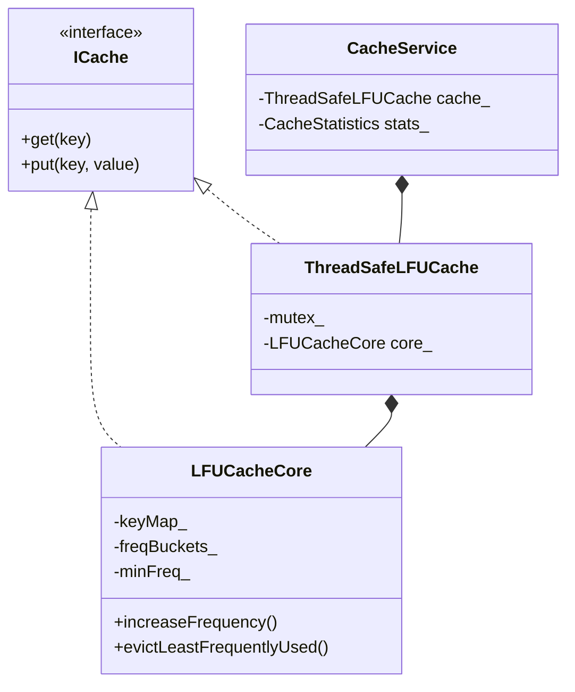

# Thread-Safe LFU Cache LLD

**Least Frequently Used (LFU)** cache in C++17 — O(1) average `get`/`put`, frequency buckets, thread-safe decorator, and stats.

> **Compare with:** [LRU Cache](../LRU_Cache_LLD/) (recency-based eviction)

---

## Folder Structure

```
LFU_Cache_LLD/
├── cache/
│   ├── ICache.h
│   ├── LFUCacheCore.h           # freq buckets + minFreq
│   └── ThreadSafeLFUCache.h
├── config/CacheConfig.h
├── core/CacheService.h
├── enums/
│   ├── CacheOperationType.h
│   └── EvictionPolicyType.h
├── models/LFUNode.h
├── stats/CacheStatistics.h
├── utils/ConcurrencyHelpers.h
├── .clangd
├── main.cpp
├── problem_statement.md
└── requirements.md
```

---

## LFU vs LRU

| Policy | Evicts | Best for |
|--------|--------|----------|
| **LRU** | Least recently used | Temporal locality |
| **LFU** | Least frequently used | Hot keys accessed often |

**Example (capacity 3):**  
Put `A,B,C` → Get `A` three times → Put `D`  
- **LFU** evicts `B` (lowest freq among `B,C`)  
- **LRU** might evict `C` (least recent if `B` was touched later)

---

## Architecture



---

## Internal Structure

```
freqBuckets_[1]  ->  [C] -> [B]     (front = MRU at freq 1)
freqBuckets_[4]  ->  [A]             (A accessed many times)

minFreq_ = 1  →  evict from back of freqBuckets_[1]  →  B
```

---

## C++17 Standard

This project **requires ISO C++17**. `config/CppStandard.h` fails the build if `__cplusplus < 201703L`.

| C++17 feature used | Where |
|--------------------|--------|
| `std::optional` | `ICache::get`, return types |
| `std::nullopt` | Cache miss |
| `std::make_unique` | `LFUCacheCore` node allocation |
| `[[nodiscard]]` | `get`, `contains`, `remove`, stats |
| Inline variables | `kCppStandardYear` in `CppStandard.h` |
| Structured bindings | `main.cpp` — `for (const auto &[path, payload] : entries)` |
| `if (const auto x = …)` | `CacheService::executeAndDescribe` |
| `constexpr` | Demo constants in `main.cpp` |
| `= delete` | Copy/move on cache classes (mutex safety) |
| Class member init `{0}` | `LFUNode`, `LFUCacheCore` |

## Build & Run

```bash
cd LFU_Cache_LLD
./compile.sh
# or
g++ -std=c++17 -Wall -Wextra -Wpedantic -pthread main.cpp -o lfu_cache_app
./lfu_cache_app
```

**CMake:**

```bash
cmake -S . -B build && cmake --build build && ./build/lfu_cache_app
```

---

## API Highlights

| Method | Behavior |
|--------|----------|
| `get(key)` | Hit → return value, **freq++** |
| `put(key, val)` | New → freq=1; update → **freq++** |
| `getFrequency(key)` | Current frequency (-1 if missing) |
| `executeAndDescribe()` | Demo logging with freq |

---

## Complexity

| Operation | Average |
|-----------|---------|
| `get` | O(1) |
| `put` | O(1) |
| `remove` | O(1) |

---

## Interview Talking Points

1. **Why two structures?** Map for lookup + freq buckets for O(1) min-freq eviction.
2. **Tie-break?** LRU within same frequency list (`pop_back`).
3. **`minFreq` maintenance** — increment when lowest bucket empties; rebalance after remove.
4. **LFU weakness** — old keys with high historical freq may stay (aging / window LFU fixes).
5. **Thread safety** — same as LRU: one mutex because `get` mutates frequency lists.

---

## Related

- [LRU_Cache_LLD](../LRU_Cache_LLD/)
- [Multi_threading_C++](../Multi_threading_C++/README.md)
