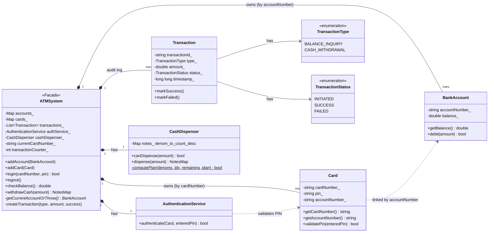
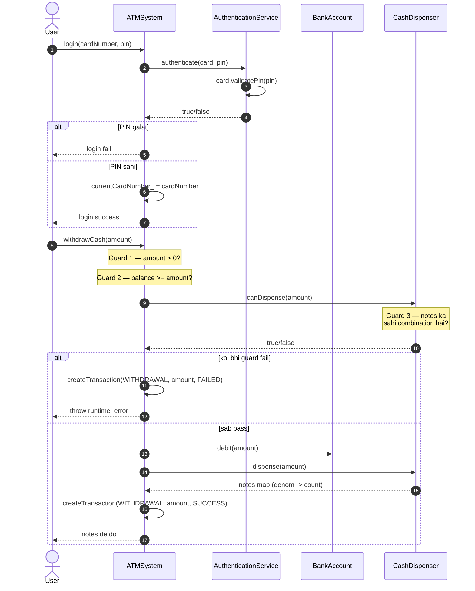
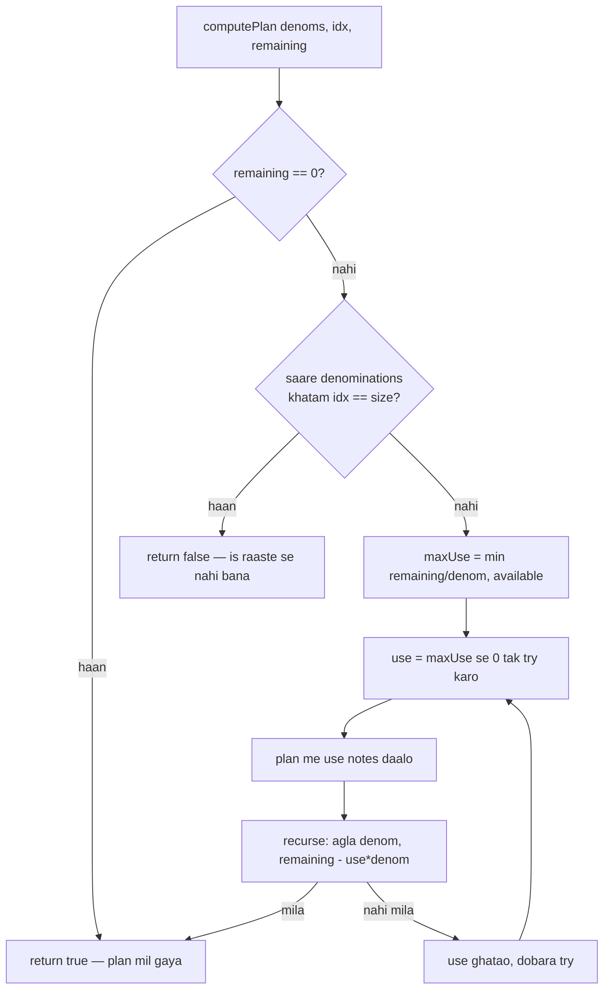

# ATM LLD — Design Diagrams

> Yeh file codebase padh ke banayi gayi hai. Mermaid diagrams GitHub pe seedha
> render hote hain (aur VS Code ke mermaid preview me bhi).

---

## 1. Class Diagram — poora structure ek nazar me

**Padhne ka tareeka:** `*--` = composition (ATMSystem in sab ka maalik hai, uske
marte hi sab khatam). `..>` = dependency/uses. `Card` sirf `accountNumber` string
rakhta hai — asli `BankAccount` object nahi — isliye wo association (by id) hai.

---

## 2. Sequence Diagram — Cash Withdrawal ka poora flow

Yeh diagram sabse important hai: dhyan do ki **paisa debit hone se PEHLE teen guard
checks** hote hain, aur har raaste pe ek Transaction record banta hai (fail bhi ho to).

---

## 3. Cash Dispenser — Denomination algorithm (backtracking)

`CashDispenser` sabse interesting logic hai. Simple greedy (bade note pehle) hamesha
kaam nahi karta, isliye ye **backtracking** karta hai:

> **Kyun greedy nahi?** Maan lo notes = {500, 300} aur amount = 600. Greedy 500 lega,
> phir 100 baaki — 300 se nahi banta → fail. Backtracking 500 chhod ke 300+300 try
> karta hai → ban gaya. Isliye `use` ko `maxUse` se `0` tak ghata ke har combination
> dekha jaata hai.

---

## 4. Design patterns is LLD me

| Pattern | Kahan | Kyun |
|---|---|---|
| **Facade** | `ATMSystem` | client ko ek hi darwaza — andar ke services chhupe |
| **Service layer / SRP** | `AuthenticationService`, `CashDispenser` | auth aur cash-logic alag, ek kaam ek class |
| **State (implicit)** | `currentCardNumber_` | login/logout se session state; khaali = koi session nahi |
| **Audit log** | `transactions_` vector | har action (success/fail) ka record |

**Note:** yeh L22 wale `ATM_Cash_Dispenser` (Chain of Responsibility) se alag hai —
wahan denomination chain-of-responsibility se dispense hoti hai, yahan backtracking se.
