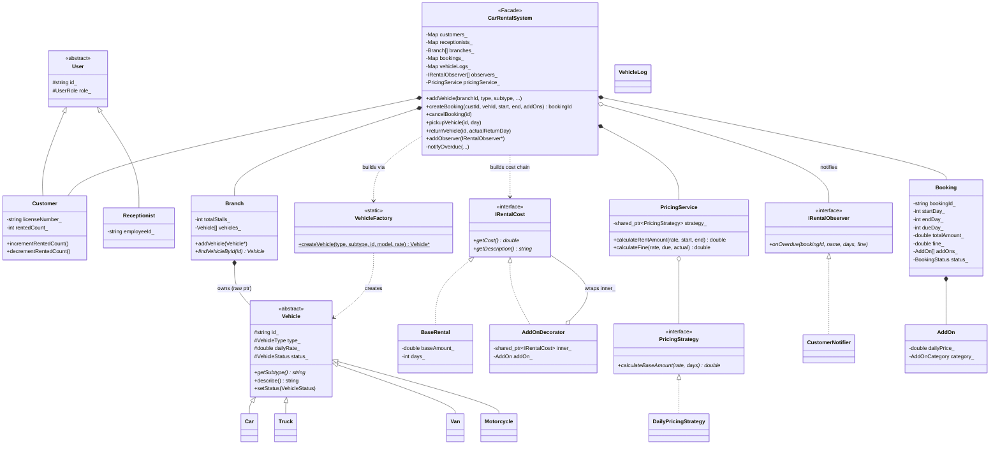
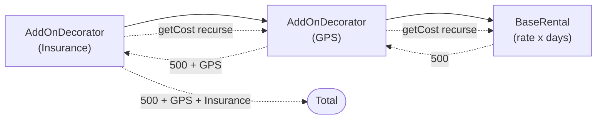
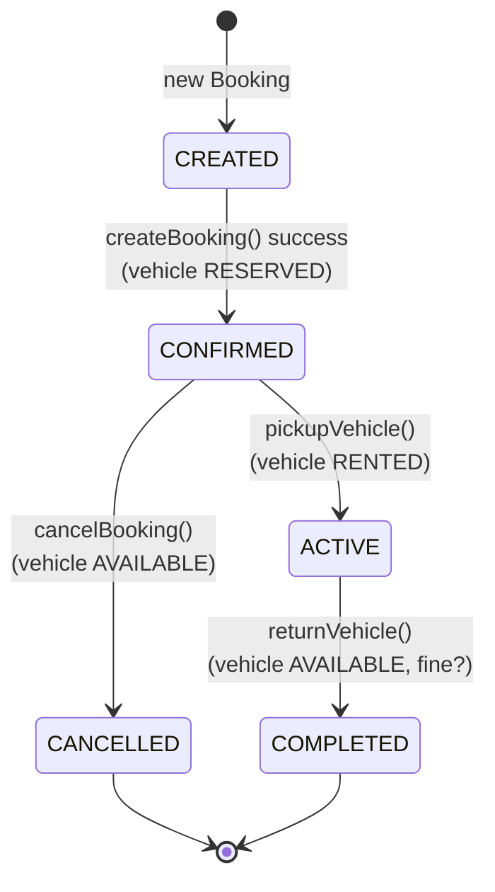
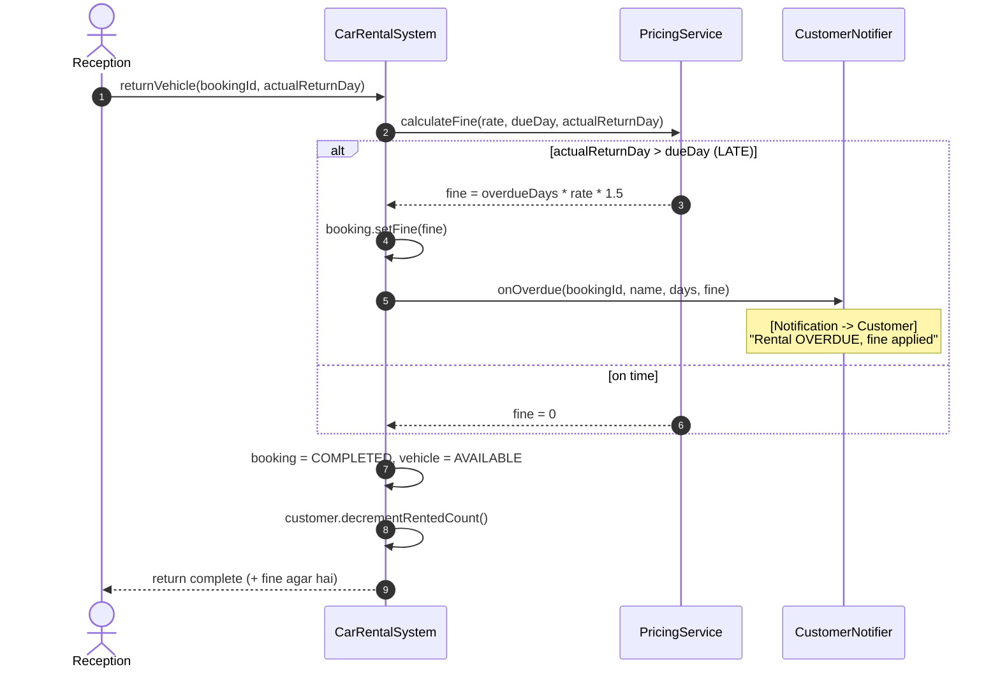

# Car Rental System LLD — Design Diagrams

> Codebase padh ke banaya. Yeh is repo ka **sabse pattern-rich** LLD hai — Decorator,
> Factory, Strategy, Observer, aur do inheritance hierarchies, sab ek jagah.

---

## 1. Class Diagram — poora structure



---

## 2. ⭐ Decorator Pattern — cost chain kaise banti hai

Base rent ke upar har add-on ek layer chadhaata hai. `createBooking` me:

```cpp
shared_ptr<IRentalCost> cost = make_shared<BaseRental>(baseAmount, days);
for (const AddOn& addOn : addOns)
    cost = make_shared<AddOnDecorator>(cost, addOn, days);   // ⭐ lapetta jaata hai
```



> **Kyun Decorator (na ki Booking me hardcoded fields)?** Add-ons runtime pe kitne bhi ho
> sakte hain, kisi bhi combination me. Har naya add-on ek object, aur `getCost()` recursively
> sab jod deta hai. Booking class ko har naye add-on ke liye badalna nahi padta. **Open/Closed.**

---

## 3. Booking lifecycle — State transitions



**Booking status aur Vehicle status saath-saath chalti hain:**

| Booking event | Booking status | Vehicle status |
|---|---|---|
| createBooking | CONFIRMED | RESERVED |
| pickupVehicle | ACTIVE | RENTED |
| returnVehicle | COMPLETED | AVAILABLE |
| cancelBooking | CANCELLED | AVAILABLE |

---

## 4. Sequence — returnVehicle with overdue (Observer trigger)



---

## 5. Design patterns summary

| Pattern | Kahan | Kyun |
|---|---|---|
| **Facade** | `CarRentalSystem` | ek darwaza, poora subsystem chhupa |
| **Factory** | `VehicleFactory` | `type + subtype` string se sahi Vehicle banao |
| **Decorator** | `IRentalCost` → `BaseRental` + `AddOnDecorator` | add-ons ki cost dynamically layer karo |
| **Strategy** | `PricingStrategy` → `DailyPricingStrategy` | pricing formula swappable (weekly/seasonal aa sakte) |
| **Observer** | `IRentalObserver` → `CustomerNotifier` | overdue pe notify (email/SMS observer add ho sakte) |
| **Template inheritance** | `Vehicle` / `User` abstract base | common data + `getSubtype()` polymorphic |
| **Service layer** | `PricingService`, `SearchService` | business logic alag |

> ⚠ **Note:** `Branch` aur `CarRentalSystem` raw pointers (`Vehicle*`, `Customer*`) own karte
> hain aur destructor me `delete` karte hain. Isliye copy/move ka dhyan rakhna padta hai
> (double-free se bachne ke liye) — ideal me `unique_ptr` behtar hota.
