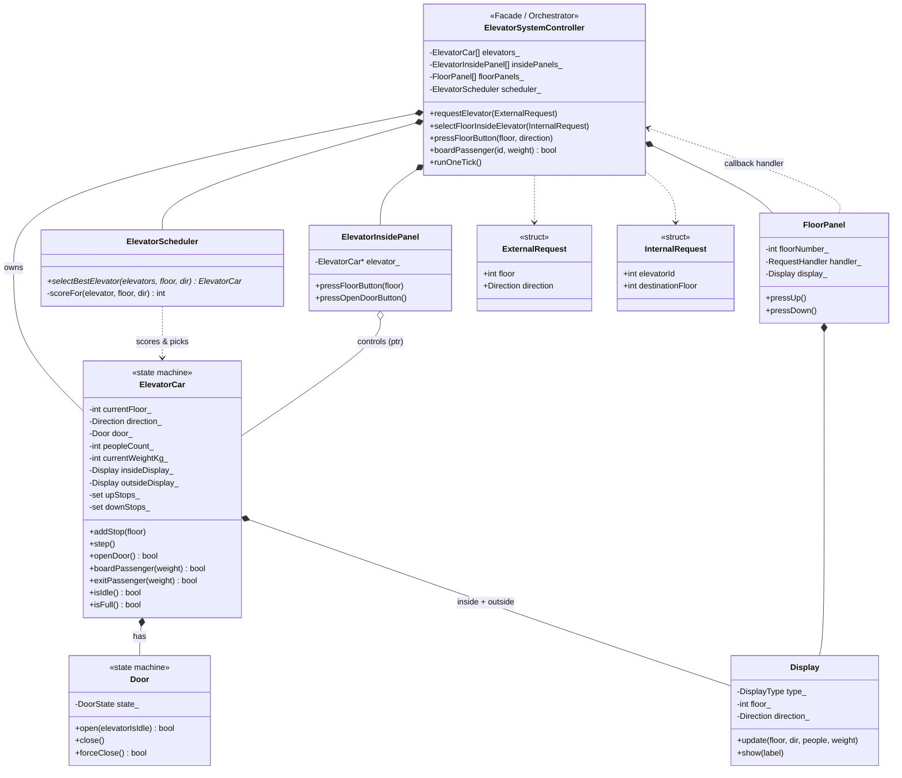
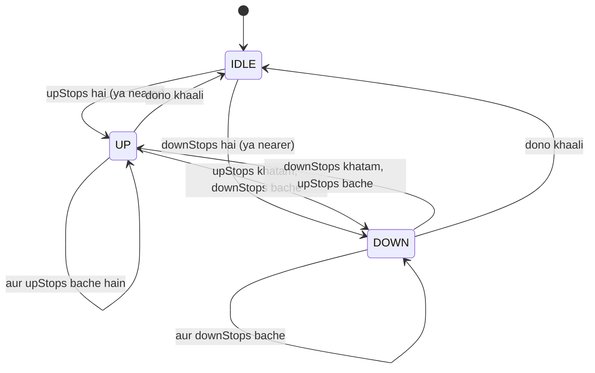
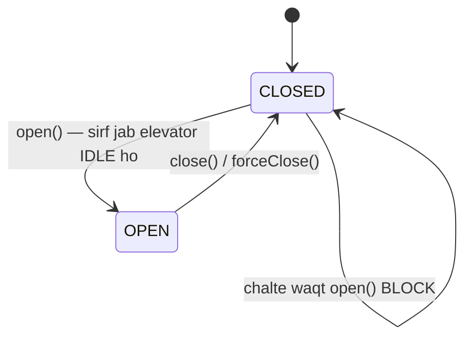
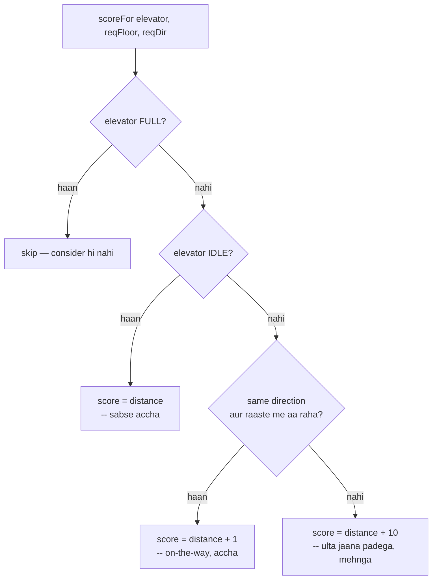
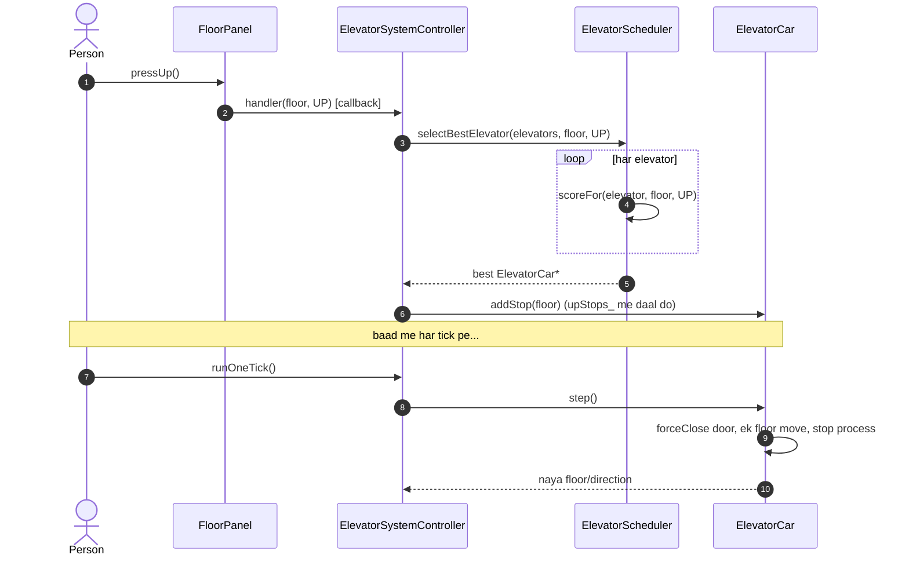

# Elevator System LLD — Design Diagrams

> Codebase padh ke banaya. Do dilchasp cheezein: **ElevatorCar ek state machine hai**
> (IDLE/UP/DOWN + door OPEN/CLOSED) aur **ElevatorScheduler** SCAN-jaisa scoring karke
> best elevator chunta hai.

---

## 1. Class Diagram

---

## 2. ⭐ ElevatorCar — Direction state machine (LOOK algorithm)

Elevator do sorted sets rakhta hai — `upStops_` (chhota→bada) aur `downStops_`
(bada→chhota). Har `step()` pe ek floor move karta hai aur direction manage karta hai:

> **LOOK algorithm:** elevator ek direction me tab tak jaata hai jab tak us taraf stops
> hain, phir doosri taraf mudta hai — bina building ke end tak gaye (wahi "LOOK" vs "SCAN").
> `pickInitialDirection()` IDLE se shuru hote waqt nearest stop wali taraf chunta hai.

---

## 3. ⭐ Door state machine (safety interlock)

> **Safety rule:** `door_.open(elevatorIsIdle)` — darwaza sirf tab khulta hai jab elevator
> **IDLE** ho (chal raha ho to `false`). Aur `step()` chalne se pehle `forceClose()` karta
> hai. Ye real elevator ka interlock hai — chalte elevator me darwaza nahi khul sakta.

---

## 4. ⭐ Scheduler scoring — best elevator kaise chunte hain

`ElevatorScheduler::scoreFor` har elevator ko ek score deta hai (kam = behtar):

| Elevator ki haalat | Score | Matlab |
|---|---|---|
| IDLE | `distance` | free hai, seedha aa jayega — best |
| Same dir, raaste me | `distance + 1` | waise bhi udhar jaa raha, pick up kar lega |
| Warna (ulta/opposite) | `distance + 10` | pehle apna kaam, phir mudega — penalty |

Sabse **kam score wala** elevator jeetta hai. Ye SCAN/LOOK disk-scheduling ki soch hai.

---

## 5. Sequence — external request se elevator movement tak

---

## 6. Design patterns summary

| Pattern | Kahan | Kyun |
|---|---|---|
| **State machine** | `ElevatorCar` (IDLE/UP/DOWN), `Door` (OPEN/CLOSED) | real elevator behavior + safety interlock |
| **Strategy (implicit)** | `ElevatorScheduler` | dispatch algorithm alag — FCFS/SCAN/ML se replace ho sakta |
| **Facade / Mediator** | `ElevatorSystemController` | panels, cars, scheduler ko jodta hai |
| **Callback / Observer-lite** | `FloorPanel::RequestHandler` (std::function) | panel controller ko loosely coupled call karta hai |
| **Command-lite** | `ExternalRequest` / `InternalRequest` structs | request ko object bana ke pass karna |

> ⚠ **Config:** `SystemLimits.h` me `MAX_FLOORS=15`, `MAX_ELEVATORS=3`, `MAX_PEOPLE=8`,
> `MAX_WEIGHT_KG=680` — capacity checks (`isFull`, `boardPassenger`) inhi pe based hain.
