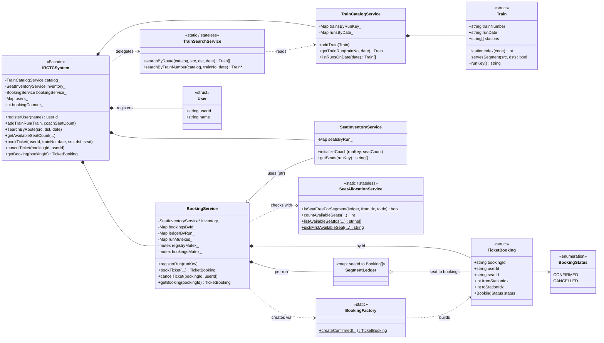
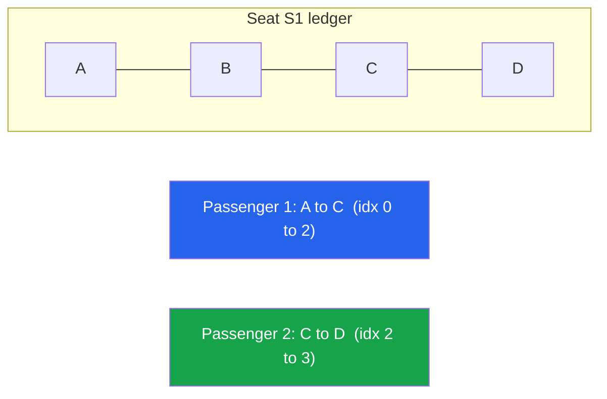
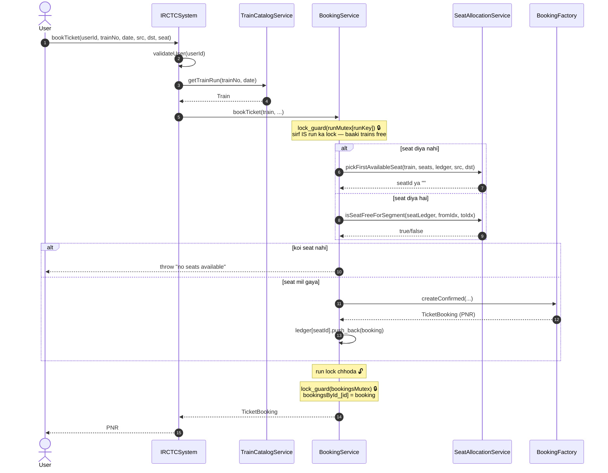
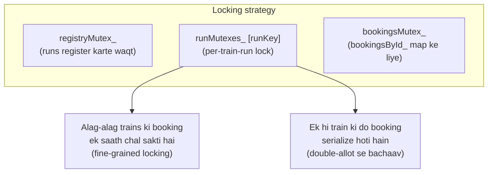

# IRCTC LLD — Design Diagrams

> Codebase padh ke banaya. Is LLD ki do khaas baatein: **segment-based seat booking**
> (ek seat ek run me alag-alag logon ko de sakte hain, jab tak safar overlap na kare)
> aur **per-run locking** (thread-safe booking).

---

## 1. Class Diagram



---

## 2. ⭐ Core idea — Segment-based seat sharing

Ek train A→B→C→D chalti hai. Ek hi seat `S1` do logon ko di ja sakti hai agar unke
safar **overlap na karein**:



**Overlap check** (`SegmentUtils::segmentsOverlap`) half-open interval `[from, to)` use
karta hai:

```
overlap(fromA, toA, fromB, toB) = (fromA < toB) && (fromB < toA)
```

| P1 segment | P2 segment | Overlap? | Same seat de sakte? |
|---|---|---|---|
| A→C `[0,2)` | C→D `[2,3)` | `0<3 && 2<2` = **false** | ✅ haan (C pe P1 utar gaya) |
| A→C `[0,2)` | B→D `[1,3)` | `0<3 && 1<2` = **true** | ❌ nahi (B–C dono chahiye) |

Isi wajah se seat ka data ek single `bool isBooked` nahi, balki **bookings ki list**
(`SegmentLedger[seatId] = vector<TicketBooking>`) hai — har booking apna segment rakhti hai.

---

## 3. Sequence — bookTicket (thread-safe)



---

## 4. ⭐ Concurrency design — teen alag locks



> **Bug jo fix hua tha:** pehle `runMutexes_[runKey]` (operator `[]`) lock ke andar map ko
> structurally modify kar deta tha — chicken-and-egg race. Fix: run ko setup ke waqt hi
> `registerRun()` se pre-create karo, aur booking me sirf `.at()` se dhoondo (map badalta
> nahi). TSan se verify kiya gaya tha.

---

## 5. Design patterns

| Pattern | Kahan | Kyun |
|---|---|---|
| **Facade** | `IRCTCSystem` | ek darwaza, andar 5 services |
| **Factory** | `BookingFactory` | PNR + booking banane ka ek jagah |
| **Service layer / SRP** | Catalog, Search, Inventory, Allocation, Booking | ek class ek kaam |
| **Stateless helper** | `TrainSearchService`, `SeatAllocationService` | pure functions, `static` |
| **Fine-grained locking** | `runMutexes_` per run | alag trains parallel, same train serialized |
| **Ledger / event-sourcing-lite** | `SegmentLedger` | seat ki state = bookings ki list se derive |
