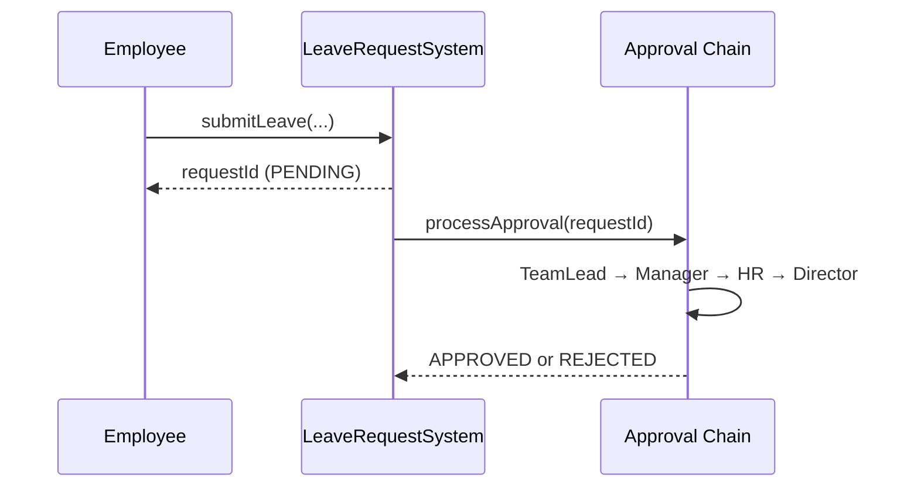

# Leave Request System LLD (C++17)

Employee **leave requests** with multi-level approval using the **Chain of Responsibility** pattern.

## Quick start

```bash
chmod +x compile.sh
./compile.sh
./leave_request_app
```

## Chain of Responsibility

Each handler has a **day limit**. If the request fits, it approves and **stops**; otherwise it **forwards** to the next handler.

```
TeamLead (≤1) → Manager (≤3) → HR (≤7) → Director (≤30)
```

| Days | Handler that approves |
|------|------------------------|
| 1    | Team Lead              |
| 2–3  | Manager                |
| 4–7  | HR                     |
| 8–30 | Director               |
| >30  | Rejected (chain exhausted) |

## Architecture

```
Leave_Request_System_LLD/
├── core/LeaveRequestSystem.h           # Facade
├── models/Employee.h, LeaveRequest.h
├── enums/LeaveType.h, LeaveStatus.h, ApproverRole.h
├── handlers/
│   ├── LeaveApprovalHandler.h          # Abstract handler (CoR base)
│   ├── TeamLeadHandler.h
│   ├── ManagerHandler.h
│   ├── HRHandler.h
│   └── DirectorHandler.h
├── managers/LeaveApprovalChainManager.h  # Wires handler chain
├── services/
│   ├── LeaveRegistryService.h
│   └── LeaveApprovalService.h
├── main.cpp
└── compile.sh
```

## Main APIs

| API | Description |
|-----|-------------|
| `registerEmployee(name, team)` | Register employee |
| `submitLeave(employeeId, type, start, end, days)` | Create `PENDING` request |
| `processApproval(requestId)` | Run CoR approval chain |
| `cancelLeave(requestId)` | Cancel while `PENDING` |
| `getLeaveRequest` / `listEmployeeLeaves` | Query |

## Request flow



## Design patterns

| Pattern | Where |
|---------|--------|
| **Chain of Responsibility** | `LeaveApprovalHandler` hierarchy + `LeaveApprovalChainManager` |
| **Facade** | `LeaveRequestSystem` |
| **Service layer** | Registry + approval services |

## Interview extensions

- Leave-type-specific chains (maternity → HR first)
- Dynamic chain from org chart
- Observer for email on status change
- Strategy for working-day calculation (holidays/weekends)
- Async approval with timeout escalation
