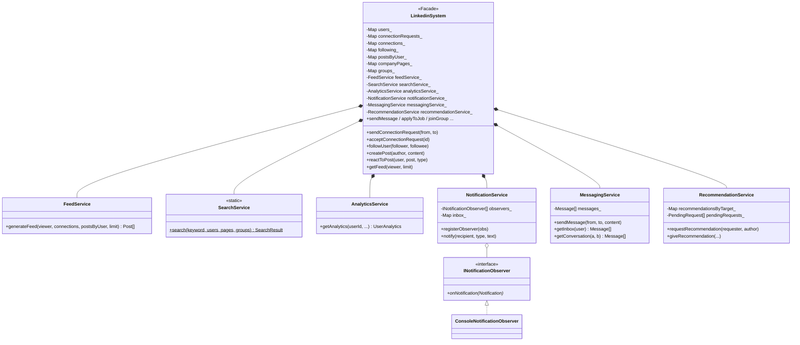
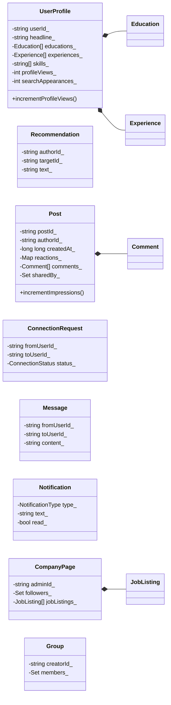
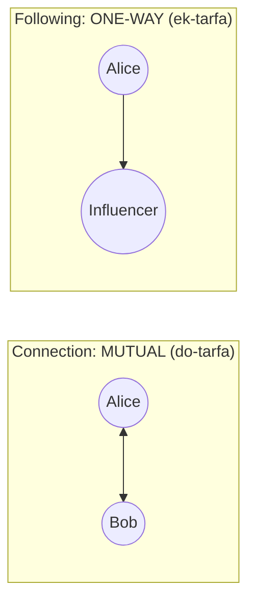
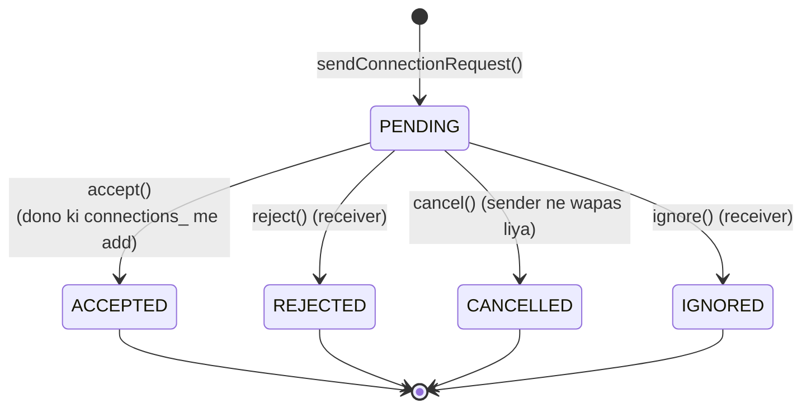
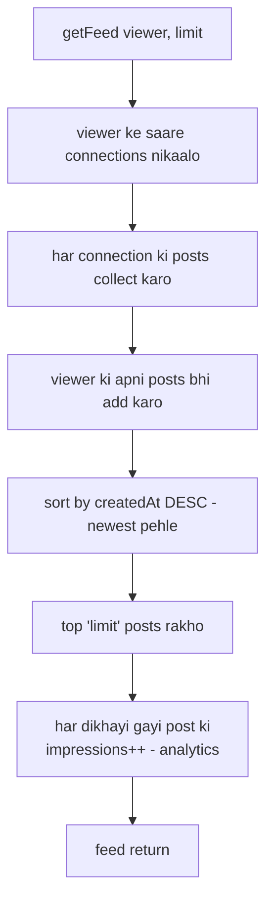
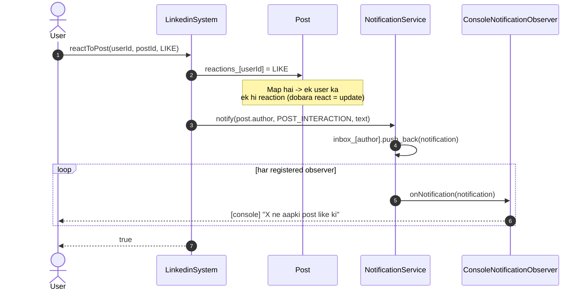

# LinkedIn LLD — Design Diagrams

> Codebase padh ke banaya. Yeh is repo ka **sabse bada** LLD hai — 16 models + 6 services.
> Isliye ek hi giant diagram ke bajaye **subsystem-wise** diagrams diye hain: connections,
> feed, notifications, aur ek high-level class map.

---

## 1. High-level Class Map — Facade + Services

---

## 2. Domain Models — subsystem-wise

---

## 3. ⭐ Connections vs Following — do alag rishte

LinkedIn me do tarah ke rishte hain, aur inka data structure alag hai:

| | Connection | Following |
|---|---|---|
| Data | `connections_[A].insert(B)` **aur** `connections_[B].insert(A)` | sirf `following_[A].insert(B)` |
| Nature | **do-tarfa** (dono ki set me) | **ek-tarfa** |
| Kaise bane | request → accept (dono ki marzi) | seedha follow (Bob ki marzi nahi chahiye) |
| Feed pe asar | connection ki posts feed me | (follow bhi feed me aa sakta) |

---

## 4. ⭐ Connection Request — State machine

> **Guards (`sendConnectionRequest`):** khud ko request nahi (`from == to`), pehle se connected
> nahi, aur beech me koi pending request nahi honi chahiye. Ye teen checks duplicate/spam
> requests rokte hain.

---

## 5. ⭐ Feed generation flow

> **Impressions:** feed me dikhne wali har post ka `incrementImpressions()` hota hai — yahi
> data baad me `AnalyticsService` (post impressions) me dikhta hai. View = signal.

---

## 6. Sequence — reactToPost (Observer notification)

> ⭐ **`reactions_` ek Map hai** (`userId → ReactionType`), set/list nahi — isliye ek user ka
> ek hi reaction rehta hai. Dobara react karne pe purana **update** hota hai (LIKE → LOVE),
> duplicate nahi banta. Yahi baat `sharedBy_` (Set) pe bhi lagti hai — ek user ek hi baar share.

---

## 7. Design patterns summary

| Pattern | Kahan | Kyun |
|---|---|---|
| **Facade** | `LinkedinSystem` | ek darwaza; 6 services + saara data andar |
| **Observer** | `INotificationObserver` → `ConsoleNotificationObserver` | notify pe broadcast; email/push observer add ho sakte |
| **Service layer / SRP** | Feed, Search, Analytics, Notification, Messaging, Recommendation | ek class ek feature |
| **Strategy-ready** | `FeedService` (feed ranking) | abhi chronological; ML ranking se replace ho sakta |
| **State machine** | `ConnectionRequest` (5 states) | request lifecycle clean |
| **Repository-lite** | facade ke `unordered_map`s | in-memory store, DB se replace ho sakta |

> ⚠ **Honest notes (interview me bolna):**
> - `MessagingService` saare messages ek flat `vector` me rakhta hai → inbox/conversation
>   O(N) scan. Real me `Map<conversationKey, Message[]>` chahiye.
> - `postsByUser_` `Post*` (raw pointers) rakhta hai → ownership/cleanup ka dhyan.
> - Feed abhi sirf **connections** ki posts leta hai; ranking pure chronological hai
>   (koi relevance/engagement score nahi) — production me yahi sabse bada difference hai.
