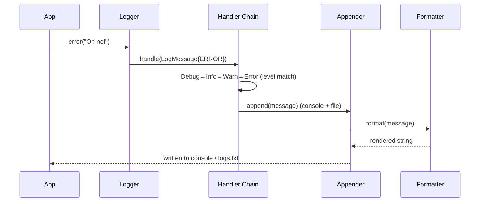

# Logging Framework LLD (Log4j-style)

Interview-grade **logging framework** in C++17 — severity-based routing through a **Chain of Responsibility**, per-level **appenders** (console / file), pluggable **formatters** (plain text / JSON), and a global **Singleton** logger.

> **UML diagrams:** [Class + Sequence diagrams (Section 8)](../docs/SYSTEM_CLASS_AND_SEQUENCE_DIAGRAMS.md#8-logger)

---

## Folder Structure

```
Logger_LLD/
├── Logger.h                       # Singleton entry point — debug/info/warn/error/fatal
├── LogHandlerConfiguration.h      # registers appenders per level
├── handlers/                      # Chain of Responsibility
│   ├── LogHandler.h               #   base handler
│   └── Debug / Info / Warn / Error / Fatal Handler.h
├── appenders/                     # output sinks
│   ├── LogAppender.h, ConsoleAppender.h, FileAppender.h
├── formatter/                     # Strategy
│   ├── LogFormatter.h, PlainTextFormatter.h, JsonFormatter.h
├── model/LogMessage.h             # level + text + timestamp
├── enums/LogLevel.h               # DEBUG < INFO < WARN < ERROR < FATAL
├── compile.sh
├── Main.cpp
├── problem_statement.md
└── requirements.md
```

---

## Design Patterns

| Pattern | Class | Why |
|---------|-------|-----|
| **Chain of Responsibility** | `handlers/` | Each handler processes its level or forwards down the chain |
| **Strategy** | `LogFormatter` (PlainText / JSON) | Same message, different rendering, no appender change |
| **Singleton** | `Logger` | One global, consistent logger instance |
| **Bridge-like** | `LogAppender` holds a `LogFormatter` | Output target decoupled from format |

---

## Logging Flow



---

## Build & Run

```bash
cd Logger_LLD
./compile.sh
./logger_app
```

The demo routes `INFO` → console and `ERROR` → console **and** `logs.txt`.

---

## Demo Scenarios (`Main.cpp`)

| Demo | What it shows |
|------|----------------|
| **Level routing** | `info()` → console only; `error()` → console + file |
| **Per-level appenders** | Multiple appenders registered for one level |
| **Formatter swap** | Plain text vs JSON rendering of the same message |

---

## Interview Talking Points

1. **Why Chain of Responsibility?** — Each level has a handler; a message flows until a handler with matching severity processes it.
2. **Why separate appender and formatter?** — *Where* a log goes (console/file) is independent of *how* it looks (text/JSON).
3. **Singleton trade-off** — Convenient global access, but global state; thread-safe access is the main extension point.
4. **Extensions** — Async/buffered logging, log rotation, network/syslog appender, XML formatter, per-module log levels.

---

## Related Docs

- [Problem Statement](./problem_statement.md) · [Requirements](./requirements.md)
- [L22 Chain of Responsibility](../L22%20Chain_of_responsiblity_patten(ATM_Cash_Dispenser%20LLD)/) · [Pattern map](../docs/PROJECT_DESIGN_PATTERNS.md)
- [All System Diagrams (§8)](../docs/SYSTEM_CLASS_AND_SEQUENCE_DIAGRAMS.md#8-logger)
