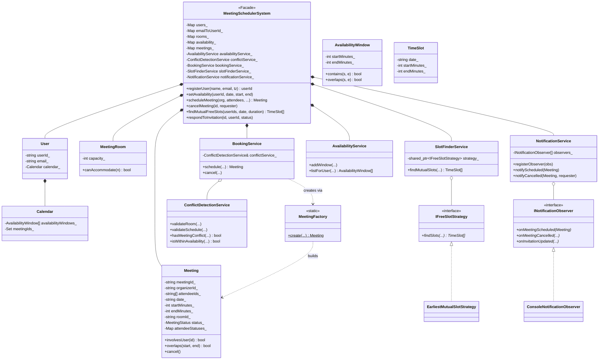
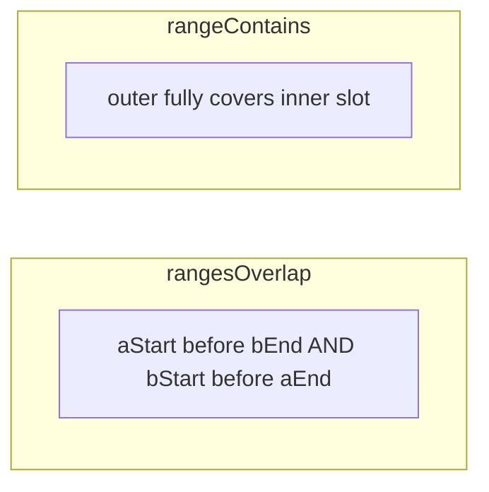
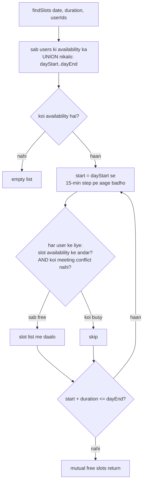
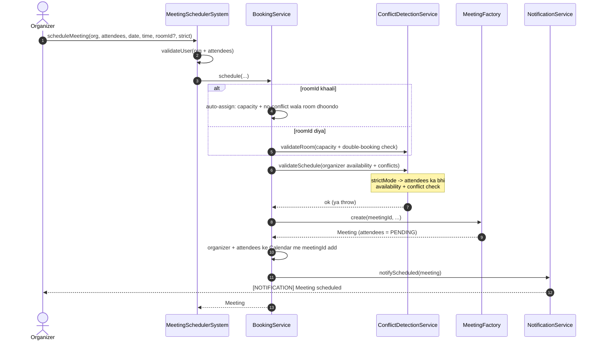
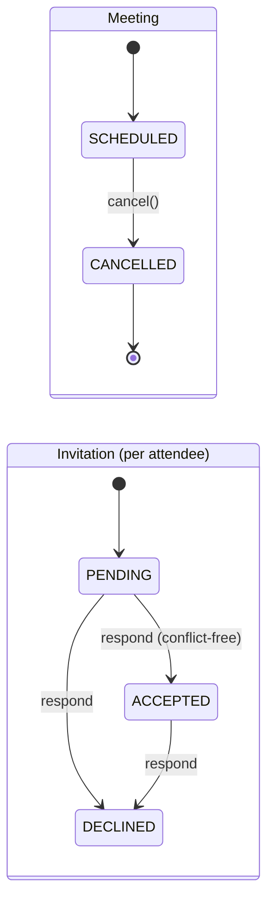

# Meeting Scheduler LLD — Design Diagrams

> Codebase padh ke banaya. Yeh ek rich system hai: **Strategy** (free-slot finding),
> **Observer** (notifications), **Factory** (meeting), aur 5 services — sab interval-overlap
> math ke upar khade hain.

---

## 1. Class Diagram



---

## 2. ⭐ Foundation — interval overlap math (TimeUtils)

Poora system in do functions pe khada hai (time = minutes-since-midnight, `[start, end)`):

```cpp
rangesOverlap(aStart, aEnd, bStart, bEnd) = aStart < bEnd && bStart < aEnd
rangeContains(outStart, outEnd, inStart, inEnd) = outStart <= inStart && inEnd <= outEnd
```



| Use | Function | Kahan |
|---|---|---|
| Do meeting takraati hain? | `rangesOverlap` | conflict detection, room booking |
| Slot availability window ke ANDAR hai? | `rangeContains` | `AvailabilityWindow::contains` |

> **Half-open `[start, end)`:** 10:00–11:00 aur 11:00–12:00 **takraati NAHI** (`11:00 < 11:00` = false).
> Yahi wajah hai `<` use hota hai `<=` nahi — back-to-back meetings valid hain.

---

## 3. ⭐ Free-slot finding (Strategy) — EarliestMutualSlot



> **Strategy kyun?** Abhi "earliest mutual slot" (15-min grid) hai. Kal ko "least fragmentation",
> "prefer mornings", ya "AI-optimized" chahiye to sirf nayi `IFreeSlotStrategy` class —
> `SlotFinderService` aur baaki system untouched.

---

## 4. Sequence — scheduleMeeting (poora flow)



---

## 5. State diagrams — Meeting & Invitation



> ⭐ **Accept pe conflict check:** invitation ACCEPT karte waqt bhi `hasMeetingConflict`
> chalta hai (current meeting ko skip karke) — taaki koi do overlapping meetings accept na kar le.
> DECLINE hamesha allowed hai. Aur **DECLINED attendee ko conflict-check me ignore** kiya jaata
> hai (usne mana kiya to us slot pe wo free maana jaata hai).

---

## 6. Design patterns summary

| Pattern | Kahan | Kyun |
|---|---|---|
| **Facade** | `MeetingSchedulerSystem` | ek darwaza, 5 services andar |
| **Strategy** | `IFreeSlotStrategy` → `EarliestMutualSlotStrategy` | slot-finding algorithm swappable |
| **Observer** | `INotificationObserver` → `ConsoleNotificationObserver` | schedule/cancel/response pe notify; email/SMS observer add ho sakte |
| **Factory** | `MeetingFactory` | Meeting banane ka ek jagah |
| **Service layer / SRP** | Availability, Conflict, SlotFinder, Booking, Notification | ek class ek zimmedari |
| **Dependency Injection** | `BookingService(conflictService)`, strategy inject | testable, loosely coupled |

> ⭐ **Data ownership:** saara state (`users_`, `rooms_`, `availability_`, `meetings_`) facade ke
> paas hai; services **stateless** hain aur data **parameters se** lete hain — isliye unhe test
> karna aasan aur inme koi hidden state nahi.
