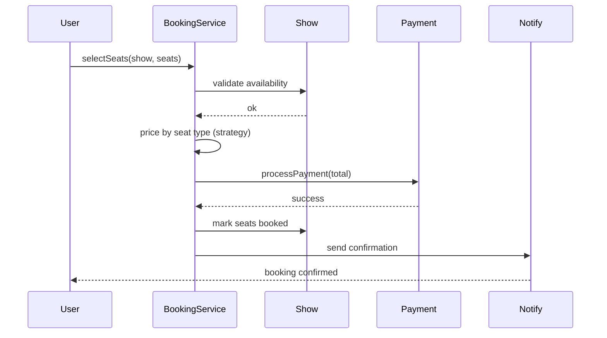

# Movie Ticket Booking System LLD (BookMyShow-style)

Interview-grade **movie ticket booking** system in C++17 — movie/show management, seat layout and availability, seat-type pricing, payment processing, and confirmation notifications — designed so locking, pricing, payment, and notifications evolve independently.

> **UML diagrams:** [Class + Sequence diagrams (Section 9)](../docs/SYSTEM_CLASS_AND_SEQUENCE_DIAGRAMS.md#9-movie-ticket-booking)

---

## Folder Structure

```
Movie_Ticket_Booking_System/
├── core/           # Booking orchestration / Facade
├── managers/       # Movie / Show / Booking managers
├── models/         # Movie, Show, Seat, Booking, Payment
├── strategies/     # Seat-type pricing strategy
├── factories/      # object creation
├── device/         # device abstractions
├── external/       # mocked external integrations (payment)
├── enums/          # SeatType, BookingStatus, etc.
├── compile.sh
├── main.cpp
├── problem_statement.md
└── requirements.md
```

---

## Design Patterns

| Pattern | Class | Why |
|---------|-------|-----|
| **Strategy** | seat-type pricing | Price by seat class without `if/else` in booking |
| **Factory** | model/object creation | Centralized construction |
| **Facade / Manager layer** | core + managers | One entry point over movies, shows, seats, payment |
| **Adapter (external)** | `external/` | Mocked payment integration kept behind an interface |

---

## Booking Flow



---

## Build & Run

```bash
cd Movie_Ticket_Booking_System
./compile.sh
./movie_ticket_app
```

---

## Demo Scenarios (`main.cpp`)

| Demo | What it shows |
|------|----------------|
| **Catalog** | Add movies and shows with seat maps |
| **Seat selection** | Availability validation before booking |
| **Pricing** | Total computed from seat types |
| **Payment + confirm** | Mocked payment → booking confirmed → notification |

---

## Interview Talking Points

1. **Seat locking** — Current scope is single-process; concurrent locking (optimistic/pessimistic) is the headline extension.
2. **Why decouple pricing/payment/notification?** — Each can change (dynamic pricing, new gateway, SMS) without touching `Booking`.
3. **Double-booking** — Discuss seat-hold timeouts and idempotent confirmation under load.
4. **Extensions** — Concurrency-safe holds, dynamic/surge pricing, real gateway ([L23](../L23%20Payment_gateway_system_LLD/)), refunds/cancellation.

---

## Related Docs

- [Problem Statement](./problem_statement.md) · [Requirements](./requirements.md)
- [All System Diagrams (§9)](../docs/SYSTEM_CLASS_AND_SEQUENCE_DIAGRAMS.md#9-movie-ticket-booking)
- [Pattern map](../docs/PROJECT_DESIGN_PATTERNS.md)
