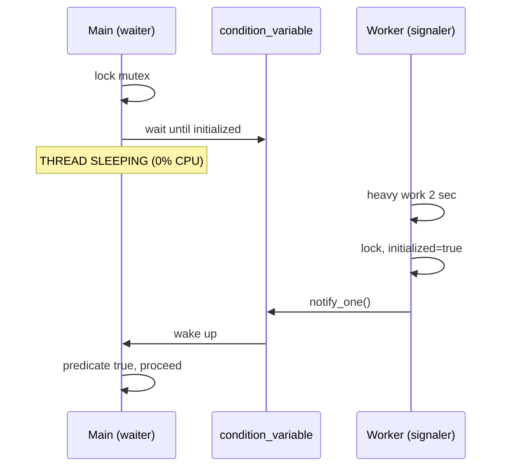

# Signaling Pattern — Complete Guide (C++17)

> **Pehle padho:** [`README.md`](./README.md) — quick index + demo list  
> **Yeh file:** poori theory, har demo ka deep dive, mistakes, interview  
> **Code run:** `./compile.sh` → `./bin/01_...`

---

## Table of contents

1. [Signaling kya hai — mental model](#1-signaling-kya-hai--mental-model)
2. [Polling vs signaling — kyun farq padta hai](#2-polling-vs-signaling--kyun-farq-padta-hai)
3. [Core primitives — mutex + condition_variable](#3-core-primitives--mutex--condition_variable)
4. [notify_one vs notify_all](#4-notify_one-vs-notify_all)
5. [Spurious wakeup & lost wakeup](#5-spurious-wakeup--lost-wakeup)
6. [Har demo — code mein exactly kya hota hai](#6-har-demo--code-mein-exactly-kya-hota-hai)
7. [Signaling vs mutex / semaphore / future](#7-signaling-vs-mutex--semaphore--future)
8. [Real systems mein kahan use hota hai](#8-real-systems-mein-kahan-use-hota-hai)
9. [Common bugs & fixes](#9-common-bugs--fixes)
10. [Interview Q&A (extended)](#10-interview-qa-extended)
11. [Patterns ka relation](#11-patterns-ka-relation)

---

## 1. Signaling kya hai — mental model

**Definition:** Ek thread (ya thread group) ko **explicitly batana** ki ab wait khatam karo — shared **predicate** true ho gaya.

| Term | Matlab |
|------|--------|
| **Waiter** | `cv.wait()` par soyi thread |
| **Signaler** | Kaam karke `notify` karne wali thread |
| **Predicate** | `ready`, `!queue.empty()`, `permits > 0` — boolean condition |

**Hinglish:** Dost ko bola "kaam ho jaye toh phone karna" — har minute "ho gaya?" mat pucho (polling).



### Signaling ke fayde (kyun seekhein)

| # | Fayda | Detail |
|---|-------|--------|
| 1 | **CPU efficiency** | Wait = OS block, no spin |
| 2 | **Correctness** | Event-driven — state + notify protocol |
| 3 | **Composable** | Pool, buffer, init — sab isi par |
| 4 | **Interview core** | Har concurrency round mein aata hai |

---

## 2. Polling vs signaling — kyun farq padta hai

### Polling (galat blocking wait ke liye)

```cpp
while (!ready.load()) {
    // CPU 100% ek core par
}
```

- Har iteration cache line, branch predictor, power waste
- 1000 waiters = disaster

### Signaling (sahi)

```cpp
unique_lock<mutex> lock(mtx);
cv.wait(lock, [] { return ready; });
```

- Thread **blocked state** — scheduler doosre kaam kare
- Demo `06_polling_vs_signaling.cpp` — millions spin vs ~0

**Rule:** Milliseconds+ wait → **never poll**. Nanosecond spin locks alag topic (atomics, expert).

---

## 3. Core primitives — mutex + condition_variable

### Kyun mutex + CV saath?

`condition_variable` **khud** shared data protect nahi karta. Predicate (`ready`, queue size) ko **mutex** se guard karna padta hai — warna data race.

### Standard pattern (yaad rakho)

```cpp
// WAITER
{
    unique_lock<mutex> lock(mtx);
    cv.wait(lock, predicate);  // unlock inside wait → sleep → lock → check pred
}

// SIGNALER
{
    lock_guard<mutex> lock(mtx);
    // change predicate state
}
cv.notify_one();  // usually AFTER releasing lock is OK; state already set under lock
```

### API table

| Function | Kaam |
|----------|------|
| `wait(lock)` | Wake on notify; **must** re-check condition in loop |
| `wait(lock, pred)` | `while (!pred()) wait` — **use this** |
| `wait_for(lock, dur, pred)` | Timeout — retry, fail, or proceed |
| `notify_one()` | 1 waiter wake (which one — OS pick) |
| `notify_all()` | Sab waiters wake — re-check predicate |

### `unique_lock` kyun, `lock_guard` nahi wait ke liye?

`wait()` internally mutex **unlock** karta hai taaki signaler lock le sake. `lock_guard` unlock support nahi karta.

---

## 4. notify_one vs notify_all

| Situation | Use | Kyun |
|-----------|-----|------|
| 1 item in queue, 1 worker enough | `notify_one` | Baaki workers phir sone chale jayen |
| Shutdown, all must check flag | `notify_all` | Har sleeper dekhe `stop==true` |
| Broadcast state change | `notify_all` | Sab waiters re-evaluate |

**Galat:** 10 tasks aaye, `notify_all` → 10 workers wake, 9 wapas so jayen — wasted context switch. Isliye normal enqueue → `notify_one`.

---

## 5. Spurious wakeup & lost wakeup

### Spurious wakeup

POSIX/Linux implementation detail: thread kabhi **bina notify** wake ho sakti hai.

```cpp
// WRONG
if (!ready) cv.wait(lock);
// RIGHT
cv.wait(lock, [] { return ready; });
```

### Lost wakeup (classic bug)

```cpp
// Thread A                    // Thread B
ready = true;  // NO LOCK!
notify_one();
                               lock(); wait(); // misses — sleeps forever
```

**Fix:** State change **mutex ke andar**, phir notify. Waiter predicate mutex ke saath check kare.

---

## 6. Har demo — code mein exactly kya hota hai

### Demo 01 — `01_condition_variable_basics.cpp`

**Scenario:** Server start — main tab tak wait jab tak config load na ho.

| Line-level flow | |
|-----------------|--|
| Global `initialized=false`, `mtx`, `cv` | Shared predicate |
| `worker()` | Sleep 2s → lock → `initialized=true` → `notify_one` |
| `main()` | `cv.wait` until true → continue startup |

**Advantage:** Main thread 2 sec ke liye CPU waste nahi karti.

**Interview draw:** 2 boxes Main/Worker, arrow notify after init.

---

### Demo 02 — `02_producer_consumer_signal.cpp`

**Scenario:** Bounded buffer — **do alag signals**.

| CV | Waiter | Predicate | Signaler after |
|----|--------|-----------|----------------|
| `cv_not_full` | Producer | `size < CAPACITY` | Consumer pop |
| `cv_not_empty` | Consumer | `!empty \|\| done` | Producer push |

**Kya seekha:** Ek CV se dono conditions handle karna messy — **2 CV = clean signaling**.

**End:** `producers_done` + `notify_all` — consumer stuck na rahe.

---

### Demo 03 — `03_semaphore_signaling.cpp`

**Scenario:** DB connection pool — max 3 connections.

- `acquire()` = "permit chahiye" → wait
- `release()` = "permit wapas" → `notify_one`

**Signaling view:** Semaphore = **count** as predicate; CV implements sleep queue.

**Advantage:** Generalize "N slots available" without manual reader count.

---

### Demo 04 — `04_future_promise_signal.cpp`

**Scenario:** Async result.

```cpp
promise<int> p;
future<int> f = p.get_future();
// worker: p.set_value(42);  ← signal + data
// main: f.get();            ← wait
```

**Difference from CV:** Type-safe one-shot; std lib manages wait queue.

**Advantage:** No manual `bool ready` + mutex for simple async result.

---

### Demo 05 — `05_shutdown_notify_all.cpp`

**Scenario:** 3 workers, task queue, graceful stop.

- `request_shutdown()` → `shutdown=true` + **`notify_all`**
- Har worker wake → empty queue + shutdown → exit

**Agar `notify_one` only?** Sirf 1 worker exit, baaki hamesha wait (bug).

---

### Demo 06 — `06_polling_vs_signaling.cpp`

**Pedagogical:** Same 500ms delay — polling millions iterations vs CV sleep.

**Takeaway message:** Signaling = production blocking wait.

---

## 7. Signaling vs mutex / semaphore / future

| Tool | Primary job | Signaling? |
|------|-------------|------------|
| `mutex` | Mutual exclusion | No — lock/unlock only |
| `condition_variable` | Wait for condition | **Yes** |
| `counting_semaphore` | Count permits | Yes (often CV inside) |
| `future/promise` | Async result channel | Yes (abstraction) |
| `atomic` + spin | Lock-free | Not CV signaling |

**Mutex alone** thread ko sleep nahi karata jab condition false ho — spin ya block elsewhere chahiye.

---

## 8. Real systems mein kahan use hota hai

| System | Signaling example |
|--------|-------------------|
| Thread pool | Task arrived → wake worker |
| Producer-consumer | Item in buffer / slot free |
| `pthread_cond` / Java `wait/notify` | Same pattern |
| GUI thread | Background work done → UI update |
| Server init | Dependencies ready |

---

## 9. Common bugs & fixes

| Bug | Symptom | Fix |
|-----|---------|-----|
| No predicate | Random progress / hang | `wait(lock, pred)` |
| Notify without lock on state | Lost wakeup | Set state under mutex |
| `notify_all` everywhere | Slow, thundering herd | `notify_one` when 1 enough |
| Hold mutex during slow work | Throughput dead | Unlock, then long work |
| Detach without shutdown | Use-after-free | Join + shutdown protocol |

---

## 10. Interview Q&A (extended)

**Q1: condition_variable kya karta hai?**  
Thread ko OS level par block karta hai jab tak notify na ho; mutex ke saath predicate check.

**Q2: mutex aur CV ka relation?**  
CV predicate ke liye mutex synchronize karta hai; CV replace nahi karta mutex.

**Q3: Spurious wakeup?**  
Fake wake — predicate loop se handle.

**Q4: Producer-consumer mein kitne CV?**  
Typically 2 — not full, not empty.

**Q5: Semaphore vs CV?**  
Semaphore = count + wait; implement often uses CV. CV = arbitrary predicate.

**Q6: future vs CV?**  
future = high-level one result; CV = low-level building block.

---

## 11. Patterns ka relation

```text
Signaling (foundation)
    ├── Producer-Consumer (buffer full/empty signals)
    ├── Thread Pool (task available signal)
    └── Reader-Writer custom lock (wait for readers==0)
```

- [`../Producer_Consumer_Pattern/PRODUCER_CONSUMER_PATTERN_COMPLETE.md`](../Producer_Consumer_Pattern/PRODUCER_CONSUMER_PATTERN_COMPLETE.md)
- [`../Thread_Pool_Pattern/THREAD_POOL_PATTERN_COMPLETE.md`](../Thread_Pool_Pattern/THREAD_POOL_PATTERN_COMPLETE.md)
- [`../Reader_Writer_Pattern/READER_WRITER_PATTERN_COMPLETE.md`](../Reader_Writer_Pattern/READER_WRITER_PATTERN_COMPLETE.md)

**Repo classics:** [`../../01_Fundamentals/lesson_3.cpp`](../../01_Fundamentals/lesson_3.cpp), [`../../05_Classic_Problems/Producer_Consumer_Legacy/producer_consumer.cpp`](../../05_Classic_Problems/Producer_Consumer_Legacy/producer_consumer.cpp), [`../../01_Fundamentals/semaphor.cpp`](../../01_Fundamentals/semaphor.cpp)
