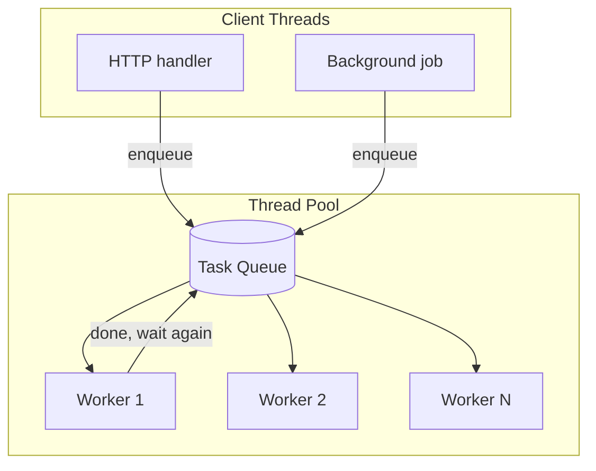

# Thread Pool Pattern — Complete Guide (C++17)

> **Pehle padho:** [`README.md`](./README.md)  
> **Implementation:** [`ThreadPool.h`](./ThreadPool.h)  
> **Run:** `./compile.sh` → `./bin/01_basic_thread_pool`

---

## Table of contents

1. [Thread pool kya hai](#1-thread-pool-kya-hai)
2. [Bina pool ke problems](#2-bina-pool-ke-problems)
3. [Core components — deep dive](#3-core-components--deep-dive)
4. [ThreadPool.h — line-by-line logic](#4-threadpoolh--line-by-line-logic)
5. [Worker loop & enqueue — signaling](#5-worker-loop--enqueue--signaling)
6. [submit() + future](#6-submit--future)
7. [Graceful shutdown](#7-graceful-shutdown)
8. [Har demo explained](#8-har-demo-explained)
9. [Thread count tuning](#9-thread-count-tuning)
10. [When to use / not use](#10-when-to-use--not-use)
11. [Bugs & deadlock](#11-bugs--deadlock)
12. [Interview Q&A](#12-interview-qa)
13. [Pattern relations](#13-pattern-relations)

---

## 1. Thread pool kya hai

**Definition:** Pehle se create kiye hue **N worker threads** + **shared task queue**. Client threads `enqueue(task)` karte hain; workers queue se uthake run karte hain; threads **mar nahi** har task ke baad.



**Hinglish:** Permanent staff + order line — har order par naya employee mat lao.

---

## 2. Bina pool ke problems

```cpp
for (int i = 0; i < 10000; i++) {
    thread t(doWork, i);
    t.detach();  // ya join — dono costly at scale
}
```

| Problem | Impact |
|---------|--------|
| Thread create ~10–100µs–ms | Har task par overhead |
| 10k threads | RAM (stack MB each), scheduler meltdown |
| No backpressure | System thrashing |
| Cache cold | New thread = cold cache |

**Pool fix:** 4–16 threads create **once**, 10k tasks **queue**.

---

## 3. Core components — deep dive

| # | Component | Type in repo | Responsibility |
|---|-----------|--------------|----------------|
| 1 | Workers | `vector<thread>` | Infinite loop: wait → pop → execute |
| 2 | Task queue | `queue<function<void()>>` | FIFO work items |
| 3 | Queue mutex | `mutex` | Push/pop atomic w.r.t. threads |
| 4 | CV | `condition_variable` | Workers sleep if queue empty |
| 5 | Stop flag | `atomic<bool> stop_` | Shutdown protocol |

**Task type `function<void()`:** Koi bhi callable — lambda, bind, packaged_task wrapper.

---

## 4. ThreadPool.h — line-by-line logic

### Constructor

```cpp
for (i = 0; i < num_threads; ++i)
    workers_.emplace_back([this, i] { worker_loop(i); });
```

- Har worker **turant** `worker_loop` mein jata hai
- Pool "hot" — pehla task aate hi kaam shuru, create delay nahi

### `enqueue(task)`

1. `lock_guard` — `stop_` check (shutdown ke baad task drop)
2. `tasks_.push(move(task))`
3. Unlock (guard destructor)
4. `cv_.notify_one()` — **ek** sleeper wake

**Kyun move?** `function` copy expensive ho sakta hai; move cheap.

### `worker_loop`

```text
LOOP:
  wait until tasks not empty OR stop_
  if stop_ AND empty → RETURN (thread exit)
  pop front task to local variable
  UNLOCK
  run task()  ← CRITICAL: outside mutex
```

**Agar `task()` lock ke andar?**  
Ek lambi task = poori queue locked = **serial execution** = pool meaningless.

### Destructor / `shutdown()`

```text
stop_ = true
notify_all  (sab workers check exit)
join every worker
clear vector
```

Idempotent `shutdown()` — double call safe ( `stop_` already true).

---

## 5. Worker loop & enqueue — signaling

Yeh pure **Signaling Pattern** hai:

| Event | Signal |
|-------|--------|
| Task enqueued | `notify_one` → "kaam hai" |
| Shutdown | `notify_all` → "sab check karo, exit ho sakta hai" |

Predicate worker side: `!tasks_.empty() || stop_`

Detail: [`../Signaling_Pattern/SIGNALING_PATTERN_COMPLETE.md`](../Signaling_Pattern/SIGNALING_PATTERN_COMPLETE.md)

---

## 6. submit() + future

```cpp
template<typename F, typename... Args>
auto submit(F&& f, Args&&... args) -> future<invoke_result_t<F, Args...>>;
```

**Steps:**

1. `bind` args → nullary callable
2. `packaged_task<Ret()>` on heap (`shared_ptr`)
3. `future` = `task.get_future()`
4. `enqueue([task_ptr]{ (*task_ptr)(); })`
5. Return `future` to caller

**Caller:** `int x = fut.get();` — blocks until worker runs task.

**Advantage:** Thread pool + async result without manual CV per task.

**Danger:** Worker thread `submit` + `get` on **same pool** with all workers busy → **deadlock**.

---

## 7. Graceful shutdown

### Wrong shutdown

- `~ThreadPool` without join → `std::terminate` if thread still running
- `stop` without draining → tasks lost mid-queue (if you exit early)

### Correct (repo)

1. `stop_ = true`
2. `notify_all` — blocked workers wake
3. Workers finish **current** task (already popped)
4. Workers see `stop_ && empty` → exit loop
5. `join()` all

Demo: `04_graceful_shutdown.cpp` — explicit `shutdown()` before scope end.

---

## 8. Har demo explained

### 01 — `01_basic_thread_pool.cpp`

| Step | Kya hota hai |
|------|--------------|
| `pool(3)` | 3 workers ready |
| 6× enqueue | Lambdas with sleep 150ms |
| Parallel | Max 3 tasks ek waqt |
| Destructor | Auto shutdown |

**Seekho:** Minimum API surface — `enqueue` only.

---

### 02 — `02_many_tasks_queued.cpp`

- 2 workers, 10 tasks
- `pending_tasks()` after each enqueue — backlog visible
- **Lesson:** Queue = buffer; workers = consumers (producer-consumer inside pool)

---

### 03 — `03_thread_reuse.cpp`

- 12 tasks, 3 workers
- Log `thread::id` → same 3 ids repeat
- **Proof:** Reuse, not recreate

**Economic argument:** Create 12 threads vs create 3 once.

---

### 04 — `04_graceful_shutdown.cpp`

- Explicit `pool.shutdown()` mid-program
- `worker_count()==0`, `is_stopped()==true`
- **Ops:** Deploy stop, drain work

---

### 05 — `05_per_task_thread_vs_pool.cpp`

- 40 light jobs
- Compare ms: 40 threads vs pool(4)
- **Not benchmark gospel** — trend on your machine matters

**Message:** Pool wins on **many short** tasks.

---

### 06 — `06_submit_with_future.cpp`

- 6× `submit(compute_square, i)`
- Collect `future::get()`
- Results 1,4,9,...,36

---

## 9. Thread count tuning

| Workload | Starting point | Reason |
|----------|----------------|--------|
| CPU-bound | `hardware_concurrency()` | Cores = parallel compute |
| I/O-bound | 2× cores or more | Threads block on I/O, CPU free |
| Mixed | Measure | Profile, don't guess |

Formula (rough):

```text
threads = cores × (1 + wait_time / service_time)
```

**Too many threads:** Context switch overhead > gain.

**Too few:** CPU idle, queue latency high.

---

## 10. When to use / not use

### Use ✅

- Web server request handlers (Apache worker pool model)
- Game engine job systems (physics, animation workers)
- Android `ExecutorService` style background work
- Batch image/video processing

### Avoid ❌

- One long computation — single thread OK
- Strict real-time — pool adds queue jitter
- Per-CPU-core affinity required — need custom pinning

### Extensions (production)

| Feature | Why |
|---------|-----|
| Bounded queue | Memory cap |
| Reject policy | CallerRuns, Abort when full |
| Work stealing | Per-core queues, less contention |
| `priority_queue` | Urgent tasks first |

---

## 11. Bugs & deadlock

| Bug | How |
|-----|-----|
| Run task under queue lock | Serial pool |
| `get()` inside pool task on same pool | Deadlock all workers blocked |
| Forget `notify` after push | Workers sleep forever |
| `notify_one` on shutdown only | Some workers never exit |
| Capture reference in enqueue lambda | Use-after-free if ref stack |

**Safe capture:** value capture, `shared_ptr`, move.

---

## 12. Interview Q&A

**Q: Thread pool vs spawning threads?**  
Amortized create, bounded parallelism, queue absorbs bursts.

**Q: FIFO guarantee?**  
Single consumer pop — yes per worker competition; overall FIFO from queue.

**Q: Exception in task?**  
`packaged_task` stores exception for `future::get`; raw `enqueue` — handle inside lambda.

**Q: Pool size 1?**  
Serial executor — valid, still useful for async API shape.

**Q: Relation producer-consumer?**  
Enqueue = producer, workers = consumers, queue = buffer.

---

## 13. Pattern relations

```text
Signaling (CV wait/notify)
    └── Thread Pool (this pattern)
            └── task queue = producer-consumer variant
```

- [`../Producer_Consumer_Pattern/PRODUCER_CONSUMER_PATTERN_COMPLETE.md`](../Producer_Consumer_Pattern/PRODUCER_CONSUMER_PATTERN_COMPLETE.md)
- [`../../05_Classic_Problems/Thread_Pool_Legacy/thread_pool.cpp`](../../05_Classic_Problems/Thread_Pool_Legacy/thread_pool.cpp) — original Hinglish comments
