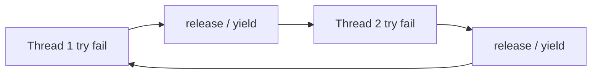

# Livelock — Complete Guide (C++17)

> **Code:** `01`–`06` — overview [`README.md`](./README.md)

---

## Table of contents

1. [Livelock kya hai](#1-livelock-kya-hai)
2. [Deadlock vs livelock](#2-deadlock-vs-livelock)
3. [Kyun hota hai](#3-kyun-hota-hai)
4. [Detect kaise karein](#4-detect-kaise-karein)
5. [Backoff strategies](#5-backoff-strategies)
6. [Prevention](#6-prevention)
7. [Har demo explained](#7-har-demo-explained)
8. [Interview Q&A](#8-interview-qa)
9. [Golden rules](#9-golden-rules)

---

## 1. Livelock kya hai

**Livelock** = threads **runnable** hain (CPU use ho rahi hai) par **useful progress** nahi ho rahi.

| | Deadlock | Livelock |
|--|----------|----------|
| Thread state | Blocked (`wait` on mutex) | Running (retry loop) |
| CPU usage | Kam | **Zyada** |
| Looks like hang? | Haan | Kabhi-kabhi nahi — program "busy" |
| Example | A waits B, B waits A | Both try_lock, both release, repeat |

**Corridor analogy:** Dono ek hi side hat te hain — dono move kar rahe hain, koi pass nahi hota.



---

## 2. Deadlock vs livelock

| Aspect | Deadlock | Livelock |
|--------|----------|----------|
| Progress | Stopped | Stuck in loop |
| Lock state | Holding + waiting | Often **not** holding (polite release) |
| Fix | Lock ordering, `scoped_lock` | **Backoff**, jitter |
| Coffman 4 conditions | All 4 | Not classic deadlock — no circular **block** |

**Important:** `try_lock` + instant retry **deadlock avoid** karta hai par **livelock invite** kar sakta hai.

---

## 3. Kyun hota hai

### Common causes

1. **Symmetric retry** — dono threads same schedule se retry  
2. **Polite release** — ek lock liya, doosra fail → pehla chhod do → doosra bhi chhod de  
3. **Zero backoff** — `yield()` only, no random delay  
4. **Priority inversion loops** — active switching, no forward work  

### Code pattern (risky)

```cpp
while (!done) {
    if (try_lock(A)) {
        if (try_lock(B)) { work(); return; }
        unlock(A);  // polite
    }
    yield();  // immediate retry — livelock risk
}
```

---

## 4. Detect kaise karein

| Signal | Meaning |
|--------|---------|
| CPU high, throughput zero | Livelock suspect |
| Attempt counters skyrocket | Retry storm |
| Threads not blocked in profiler | Unlike deadlock |
| TSan / gdb | Threads in tight retry loops |

**Demo 02:** `total_attempts` very high, `success` maybe false.

---

## 5. Backoff strategies

### Random backoff (demo 03)

```cpp
sleep(random(5ms, 80ms));
```

**Idea:** Threads desynchronize — ek pehle retry, doosra baad.

### Exponential backoff (demo 04)

```cpp
wait = min(cap, 2^attempt);
```

Ethernet/WiFi collision avoidance jaisa — load kam ho to fast retry, zyada ho to slow.

### Jitter

```cpp
sleep(base + random(0, jitter));
```

Spread retries — thundering herd avoid.

### Thread-id stagger

```cpp
sleep(id * 25ms);
```

Simple deterministic desync.

---

## 6. Prevention

| Strategy | When |
|----------|------|
| Random backoff | General try_lock retry |
| Exponential backoff | Network, lock contention |
| `scoped_lock` instead of try | Known 2 mutex — avoid try storm |
| Max retries + fail | Graceful degradation |
| Fair mutex queue | Starvation + livelock reduce |

**Rule:** Never tight loop on `try_lock` without delay.

---

## 7. Har demo explained

### 01 — `01_what_is_livelock.cpp`

Print-only: definition, corridor story, pointer to fixes.

### 02 — `02_polite_try_lock_livelock.cpp`

- 2 threads, `mtxA` + `mtxB`, polite partial release  
- **No sleep** between retries — only `yield()`  
- Max 50 attempts each — count `total_attempts`  
- Often high attempts — livelock **pattern**

### 03 — `03_random_backoff_fix.cpp`

- Same try pattern + **random 5–80ms** sleep  
- Usually one thread wins quickly  
- Attempt count much lower than 02

### 04 — `04_exponential_backoff.cpp`

- Single mutex contention  
- Backoff 1,2,4,8… ms capped 200  
- Shows growing wait on repeated failure

### 05 — `05_corridor_yield_simulation.cpp`

- Phase 1: both always move side `0` → 0 passes  
- Phase 2: random sides → many passes  
- Pure analogy — no mutex

### 06 — `06_compare_deadlock_livelock_starvation.cpp`

- Table print  
- Pointers to Deadlock folder  
- Mini starvation: high thread hogs mutex, low `try_lock` count low

---

## 8. Interview Q&A

**Q: Livelock vs deadlock?**  
Deadlock = blocked; livelock = active but no useful progress.

**Q: try_lock se livelock?**  
Haan, agar instant retry without backoff — polite release pattern.

**Q: Fix?**  
Random/exponential backoff, jitter, fair lock queue.

**Q: Livelock vs starvation?**  
Livelock = sab active, none finish; starvation = one thread deprived.

**Q: Real example?**  
WiFi CSMA backoff; lock-free retry with pause instruction.

**Q: `yield()` enough?**  
Often **nahi** — threads can stay in sync; need **random** delay.

---

## 9. Golden rules

1. `try_lock` fail → backoff, don't spin tight  
2. Release partial locks — good for deadlock, pair with delay for livelock  
3. Cap retries — fail gracefully  
4. Profile CPU vs work done  
5. Prefer `scoped_lock` when mutex set known  

---

**Related:** [`../Deadlock/DEADLOCK_COMPLETE.md`](../Deadlock/DEADLOCK_COMPLETE.md)
