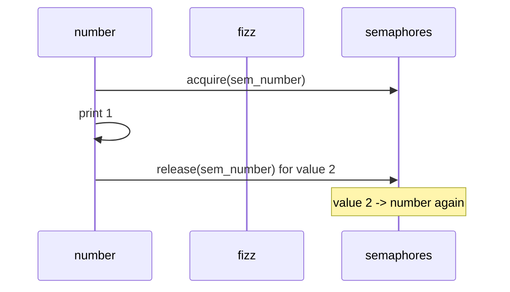

# Fizz Buzz Multithreaded — Complete Guide

## Problem

Print integers `1` to `n` using **four threads**:

| Thread | Prints when |
|--------|-------------|
| `fizz` | `i % 3 == 0` and `i % 5 != 0` |
| `buzz` | `i % 5 == 0` and `i % 3 != 0` |
| `fizzbuzz` | `i % 15 == 0` |
| `number` | otherwise |

**Constraint:** Output order must match single-threaded FizzBuzz.

---

## Shared state

```cpp
int current = 1;   // next value to print
const int n = 15;
```

All threads coordinate on `current` — only the thread whose rule matches `current` may print, then increment.

---

## Solution 1: Naive busy-wait (`02`)

```cpp
while (!done) {
    lock_guard<mutex> g(mtx);
    if (current > n) return;
    if (isMyTurn(current, role)) { print; ++current; done = true; }
}
// loop immediately retries — spins when not my turn
```

| Pros | Cons |
|------|------|
| Simple to explain | **100% CPU** while waiting |
| No CV/semaphore knowledge needed | Not production-safe |

---

## Solution 2: Semaphore controller (`03`)

- Four semaphores; **exactly one** has permit `1` at a time.
- Starting turn for `n=15`: value `1` → **number** semaphore.
- After print: `release()` on semaphore for `turnFor(current)`.



Uses `CountingSemaphore` (C++17) — same idea as `std::counting_semaphore` (C++20).

---

## Solution 3: Condition variable (`04`, `05`) — recommended

```cpp
cv.wait(lock, [&] {
    return current > n || turnFor(current) == MY_TURN;
});
if (current > n) return;
print();
++current;
cv.notify_all();
```

| Why `notify_all`? | Multiple threads may wait; one wake might miss the right predicate after `current++`. |
|-------------------|-------------------------------------------------------------------------------------|

`FizzBuzz.h` wraps this in LeetCode API — each method runs `while (runTurn(...))` until `current > n`.

---

## Comparison

| Approach | CPU while waiting | Interview score |
|----------|-------------------|-----------------|
| Busy-wait | High | Mention then reject |
| Semaphore | Low | Good |
| Condition variable | Low | **Best** |

---

## Interview Q&A

**Q: Why not one mutex + if-check without wait?**  
A: Busy spin (solution 1) or lost wakeups without proper `wait` predicate.

**Q: Can we use `notify_one`?**  
A: Possible if each thread has dedicated CV; `notify_all` is simpler and safe for 4-thread FizzBuzz.

**Q: What is `turnFor(i)`?**  
A: Maps `i` to which of the four roles may print — single source of truth for ordering.

**Q: Difference vs Print Zero Even Odd?**  
A: FizzBuzz has **four** roles with **modulo rules**; Zero/Even/Odd alternates two threads on every integer.

---

## Run

```bash
./compile.sh && ./bin/04_condition_variable
```
