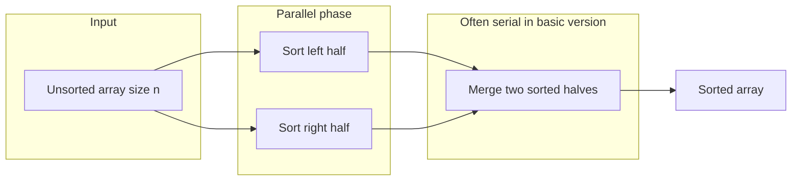
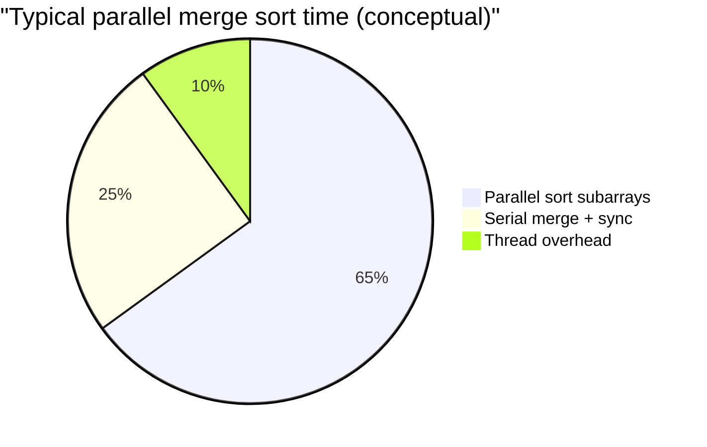
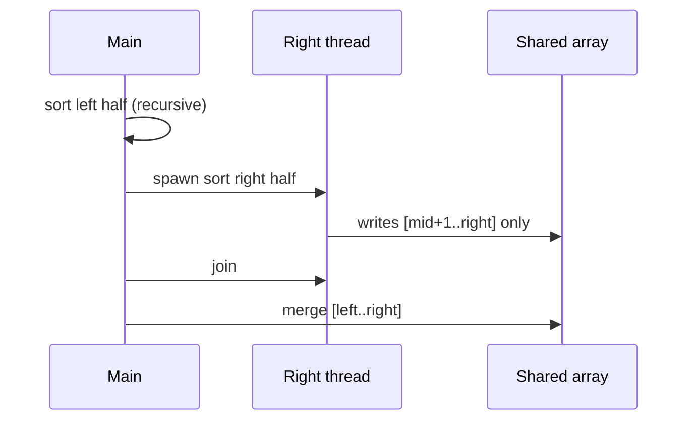
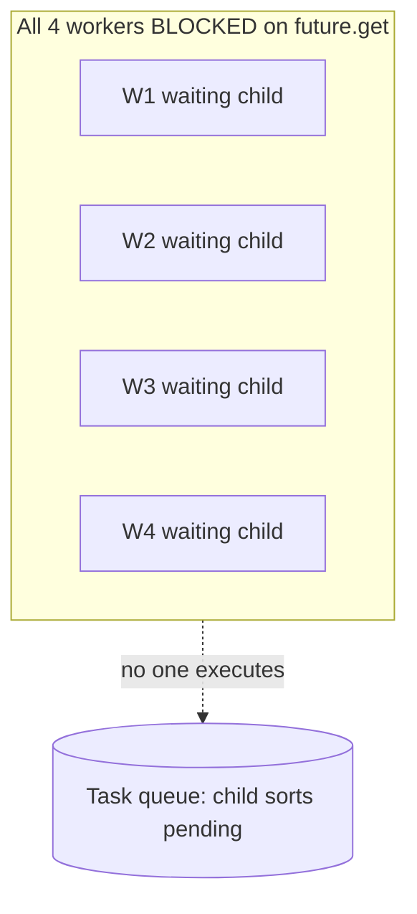

# Multi-threaded Merge Sort — Complete Guide (C++17)

> **Code:** `01`–`06` in this folder — quick index in [`README.md`](./README.md)  
> **Utils:** [`MergeSortUtils.h`](./MergeSortUtils.h) · **Pool:** [`SimpleThreadPool.h`](./SimpleThreadPool.h)  
> **Run:** `./compile.sh` → `./bin/06_compare_timings`

---

## Table of contents

1. [Problem kya hai](#1-problem-kya-hai)
2. [Sequential merge sort — full recap](#2-sequential-merge-sort--full-recap)
3. [Recursion tree & complexity](#3-recursion-tree--complexity)
4. [Parallelism analysis (Amdahl)](#4-parallelism-analysis-amdahl)
5. [Shared memory & correctness](#5-shared-memory--correctness)
6. [Threshold (cutoff) — deep dive](#6-threshold-cutoff--deep-dive)
7. [Approach 1: Thread-per-subtask](#7-approach-1-thread-per-subtask)
8. [Approach 2: Thread pool + threshold](#8-approach-2-thread-pool--threshold)
9. [Approach 3: Fork-join / std::async](#9-approach-3-fork-join--stdasync)
10. [Pool deadlock — kyun hota hai](#10-pool-deadlock--kyun-hota-hai)
11. [Advanced: Parallel merge](#11-advanced-parallel-merge)
12. [Performance pitfalls](#12-performance-pitfalls)
13. [Har demo explained](#13-har-demo-explained)
14. [Solution comparison matrix](#14-solution-comparison-matrix)
15. [Production systems](#15-production-systems)
16. [Interview Q&A (extended)](#16-interview-qa-extended)
17. [Golden rules & cheat sheet](#17-golden-rules--cheat-sheet)

---

## 1. Problem kya hai

**Goal:** `n` integers ko sort karo **merge sort algorithm** use karke, lekin **multiple CPU cores** utilize karo taaki wall-clock time kam ho.

**Interview framing:**

- Ye sirf "sort array" nahi — ye **divide-and-conquer + synchronization** problem hai.
- Core challenge: **kaun sa kaam parallel**, **kaun sa serial**, **kitne threads**, **deadlock avoid**.



**Real-world use:** Large in-memory datasets, external sort pipelines, GPU/CPU hybrid sorts (conceptually similar divide), batch analytics where `n` is millions+.

**Out of scope for this repo folder:**

- Distributed sort (MapReduce, shuffle across machines)
- GPU merge sort
- Stable sort requirements beyond merge sort's natural stability

---

## 2. Sequential merge sort — full recap

### 2.1 Algorithm

```text
mergeSort(arr, left, right):
  if left >= right:
    return
  mid = left + (right - left) / 2
  mergeSort(arr, left, mid)        // left subproblem
  mergeSort(arr, mid + 1, right)   // right subproblem
  merge(arr, left, mid, right)     // combine
```

**Demo:** `02_sequential_baseline.cpp` — `n=20`, before/after print.

### 2.2 Merge step (repo implementation)

[`MergeSortUtils.h`](./MergeSortUtils.h) me `merge()`:

1. Temp buffer `tmp` size `(right - left + 1)`.
2. Two pointers `i` (left half), `j` (right half).
3. Compare `arr[i]` vs `arr[j]`, smaller push to `tmp`.
4. Drain remaining elements from either half.
5. Copy `tmp` back into `arr[left..right]`.

```cpp
// Simplified from MergeSortUtils.h
while (i <= mid && j <= right) {
    if (arr[i] <= arr[j]) tmp[k++] = arr[i++];
    else                   tmp[k++] = arr[j++];
}
```

**Stability:** `<=` use kiya — equal elements ka relative order preserve (stable sort).

### 2.3 Complexity

| Metric | Value | Notes |
|--------|-------|-------|
| Time | **O(n log n)** | Always — unlike quicksort worst case |
| Extra space | **O(n)** | Per merge level temp buffer; overall O(n) with careful implementation |
| Recursion depth | **O(log n)** | `mid` splits roughly half |

### 2.4 Kyun merge sort parallel interviews me?

| Reason | Detail |
|--------|--------|
| Natural divide | Left/right **independent** until merge |
| Predictable | No pivot luck (quicksort) |
| Easy correctness story | Disjoint ranges → no cross-write during sort phase |

---

## 3. Recursion tree & complexity

### 3.1 Tree for n = 16

```text
                    [0..15]  merge cost 16
                   /        \
            [0..7]            [8..15]   merge cost 8 each
           /    \              /    \
      [0..3]  [4..7]      [8..11] [12..15]  merge cost 4 each
       ...     ...          ...      ...
    leaves: size 1 (trivially sorted)
```

**Work at each level:** Total merge work across all nodes at one level ≈ **O(n)**.  
**Number of levels:** **log₂ n** (approx).  
**Total:** O(n log n).

### 3.2 Parallel tree intuition

```text
Level 0 (root merge):     1 merge  → hard to parallelize (basic)
Level 1:                  2 merges → 1 could overlap sorts before merge
...
Bottom log n levels:      many independent subarrays of small size
```

**Maximum theoretical parallelism:** At the **bottom** of the tree you have `n` leaves — but creating `n` threads is insane. Hence **threshold**.

---

## 4. Parallelism analysis (Amdahl)

### 4.1 Serial fraction

Basic parallel merge sort me har level par **merge** often runs on **one thread**:

```text
Speedup ≤ 1 / (S + (1-S)/P)

S = serial fraction
P = processors
```

Agar ~30% work merge + synchronization me serial ho, **even infinite cores** → max ~3.3× speedup.

### 4.2 Diagram: where time goes



### 4.3 Interview one-liner

> "Hum divide phase parallelize karte hain; merge ko basic version me serial chhod dete hain — isliye linear speedup nahi milta. Advanced me parallel merge chahiye."

---

## 5. Shared memory & correctness

### 5.1 Single array `arr` — aliasing rules

| Phase | Index range | Writes |
|-------|-------------|--------|
| Sort left | `[left, mid]` | Only left thread / task |
| Sort right | `[mid+1, right]` | Only right thread / task |
| Merge | `[left, right]` | **One thread** after both halves done |

**Invariant:** Jab tak left/right sort complete na ho, **merge must not start** — enforced by `join()` / `future::get()`.

### 5.2 Happens-before chain

```text
Thread A finishes sort(left, mid)  ──┐
                                     ├── join/get ──► merge() safe
Thread B finishes sort(mid+1, right)┘
```

### 5.3 Data races to avoid

| Bug | Symptom |
|-----|---------|
| Merge before join | Corrupted array, flaky wrong order |
| Two threads merge same range | Race on writes |
| `mid` overflow | Use `left + (right-left)/2` not `(left+right)/2` for huge arrays |

### 5.4 `std::vector` growth

Repo me array **fixed size** — no reallocation during sort. Production me reallocation during parallel phase = disaster.

---

## 6. Threshold (cutoff) — deep dive

### 6.1 Rule

```cpp
if (right - left + 1 <= THRESHOLD) {
    sequentialMergeSort(arr, left, right);
    return;
}
// else spawn parallelism (thread / pool / async)
```

### 6.2 Kyun zaroori?

| Without threshold | With threshold |
|-------------------|----------------|
| ~2× subcalls per split → **O(n)** active threads peak | Threads bounded by tree depth + cutoff |
| Context switch storm | Leaf work = fast sequential sort |
| Stack overflow risk (deep recursion + threads) | Controlled depth |

### 6.3 Kitna threshold?

| n | Rough guidance |
|---|----------------|
| < 1,000 | Sequential only — parallelism not worth it |
| 10³ – 10⁵ | 256 – 2,048 typical in demos |
| 10⁶+ | Tune with benchmarks; consider `std::sort` on leaves (introsort) |

**Repo defaults:**

| File | n | THRESHOLD |
|------|---|-----------|
| `03_thread_per_subtask` | 200 | 64 |
| `04_thread_pool_threshold` | 50,000 | 256 |
| `06_compare_timings` | 40,000 | 512 |

### 6.4 Leaf optimization (interview bonus)

Production me leaf par:

```cpp
std::sort(arr.begin() + left, arr.begin() + right + 1);
```

Often **faster** than merge sort on tiny ranges (better cache, less allocation).

---

## 7. Approach 1: Thread-per-subtask

**File:** `03_thread_per_subtask.cpp`

### 7.1 Pattern (repo — one child thread)

```cpp
thread rightThread(parallelMergeSortThreaded, ref(arr), mid + 1, right, threshold);
parallelMergeSortThreaded(arr, left, mid, threshold);  // current thread
rightThread.join();
merge(arr, left, mid, right);
```

**Note:** Pehle version me **do** threads spawn ho rahe the (left + right) — zyada churn. Ab **ek** naya thread + current thread = binary tree of threads, still many but half of naive double-spawn.

### 7.2 Thread count estimate

Splits until size ≤ threshold.  
Approx levels: `log2(n / threshold)`.  
Peak concurrent threads ≈ **O(n / threshold)** in worst wave — still large if threshold chhota.

Example: `n=10⁶`, `threshold=64` → ~15,000 leaf segments → **thousands of threads** possible over time.

### 7.3 Pros & cons

| Pros | Cons |
|------|------|
| Simple to code & explain | Thread creation expensive |
| True parallelism on divide | OS scheduler pressure |
| Good for learning | Not production default |

### 7.4 Flow diagram



---

## 8. Approach 2: Thread pool + threshold

**File:** `04_thread_pool_threshold.cpp`  
**Pool:** [`SimpleThreadPool.h`](./SimpleThreadPool.h)

### 8.1 Hybrid design (repo)

```cpp
// Top-level parallel entry uses pool for RIGHT half
auto futRight = pool.submit([&]() {
    parallelMergeSortThreaded(arr, mid + 1, right, threshold);
});
parallelMergeSortThreaded(arr, left, mid, threshold);
futRight.get();
merge(arr, left, mid, right);
```

- **Pool** runs one branch.
- **Inside pool task** → further parallelism via `std::thread` (`parallelMergeSortThreaded`), **not** nested `pool.submit`.

### 8.2 Kyun hybrid?

Pure recursive `pool.submit` for **both** children → classic **pool deadlock** (Section 10).  
Isliye pool sirf **outer offload**; deeper levels threads use karte hain.

### 8.3 SimpleThreadPool internals (summary)

| Piece | Role |
|-------|------|
| `workers_` | N threads running `workerLoop` |
| `tasks_` queue | `function<void()>` FIFO |
| `submit()` | `packaged_task` + `future` return |
| `cv_` | Workers sleep when queue empty |

Related deep dive: [`../../02_Concurrency_Patterns/Thread_Pool_Pattern/THREAD_POOL_PATTERN_COMPLETE.md`](../../02_Concurrency_Patterns/Thread_Pool_Pattern/THREAD_POOL_PATTERN_COMPLETE.md)

### 8.4 Worker count tuning

| Workers | Effect |
|---------|--------|
| 1 | Little benefit |
| `hardware_concurrency()` | Often sweet spot for CPU-bound |
| >> cores | Context switching, cache thrash |

Demo uses **4 workers** on likely 8+ core Mac — conservative for teaching.

---

## 9. Approach 3: Fork-join / std::async

**File:** `05_fork_join_async.cpp`

### 9.1 Pattern

```cpp
auto futRight = async(launch::async, [&]() {
    parallelMergeSortAsync(arr, mid + 1, right, threshold);
});
parallelMergeSortAsync(arr, left, mid, threshold);
futRight.get();
merge(arr, left, mid, right);
```

### 9.2 Fork-join model

```text
        fork right task
       /              \
  sort left          sort right  (parallel)
       \              /
        join (get) + merge
```

**Java analogy:** `ForkJoinPool.invoke` / `RecursiveTask`  
**C++ analogy:** `std::async` + divide-and-conquer

### 9.3 `launch::async` vs `deferred`

| Policy | Behavior |
|--------|----------|
| `async` | New thread or pool thread (implementation-defined) |
| `deferred` | Lazy on `get()` — **no parallelism** |

Interview: hamesha `launch::async` bolo jab real overlap chahiye.

### 9.4 Pitfall: double `async` both children

Pehle repo version:

```cpp
async(left); async(right);  // BOTH async
```

Problem: **2× recursive tasks** per level → thread explosion + scheduler queue blowup.  
Fix: **one async child**, one on caller thread (same as thread approach).

---

## 10. Pool deadlock — kyun hota hai

### 10.1 Scenario (4 workers, bad code)

```cpp
void sort(l, r, Pool& pool) {
  auto f1 = pool.submit([&]{ sort(l, mid, pool); });
  auto f2 = pool.submit([&]{ sort(mid+1, r, pool); });
  f1.get(); f2.get();  // worker blocked here
}
```

```text
W1: running sort task → submit child → blocked on get()
W2: same
W3: same
W4: same
Queue: child tasks waiting
→ No free worker to run children → DEADLOCK
```



### 10.2 Fixes (ranked)

| # | Fix | Used in repo? |
|---|-----|--------------|
| 1 | **Never block pool worker on nested submit** | Yes — hybrid pool+thread |
| 2 | One child async, parent does other half | Yes — all approaches |
| 3 | Separate pools (parent/child) | Overkill for demo |
| 4 | Work-stealing fork-join (TBB, Java) | Production |
| 5 | `parallelMergeSort` only from **main** thread | Valid simplified API |

### 10.3 Interview story (30 sec)

> "Agar main pool worker ke andar `submit` karke `get` karun, to saare workers wait me lag sakte hain aur queue ki tasks execute hone wale thread bache hi nahi — isliye main ek side khud sort karta hoon, doosri side pool/thread par, ya pool ke andar sirf sequential/threads use karta hoon."

---

## 11. Advanced: Parallel merge

### 11.1 Problem

Basic sort: left & right parallel ✅  
**Merge:** single thread reads both halves → **O(n)** serial per level.

### 11.2 Ideas

| Technique | Idea |
|-----------|------|
| Parallel merge | Split `tmp` output ranges; two threads merge chunks |
| Ping-pong buffers | Double buffering to overlap merge levels |
| Co-merge with SIMD | Vectorized compare-copy |
| Sample sort / multi-way | Different algorithm family for extreme scale |

### 11.3 Simple parallel merge sketch

```text
Left sorted:  [1,5,9,20]
Right sorted: [2,6,7,15]

Thread 1: merge first half of output indices
Thread 2: merge second half
→ Need careful split point — not trivial without extra search (rank of element)
```

**Interview:** Name the issue — **splitting merge output** requires knowing partition point in both arrays (binary search on cross-rank). Libraries hide this complexity.

### 11.4 When worth it?

| n | Recommendation |
|---|----------------|
| < 100K | Serial merge fine |
| Millions+ | Consider TBB `parallel_sort` or parallel merge research |

---

## 12. Performance pitfalls

### 12.1 False sharing

Adjacent threads writing **different** indices but same **cache line** (64 bytes) → slowdown.

**Mitigation:** Padding, align subarrays to cache lines, per-thread local buffers.

### 12.2 Memory bandwidth

Merge is **memory-bound** — cores starve waiting for RAM.

### 12.3 Too many threads

| Symptom | Cause |
|---------|-------|
| Slower than sequential | Overhead > work |
| High sys CPU | Context switches |
| OOM | Stack × thread count |

### 12.4 Recursive depth + stack

`log n` depth OK for `n=10⁶`.  
Thread stacks **per thread** — another reason to limit thread count.

### 12.5 Demo `06_compare_timings` sample

Typical on laptop ( `-O2`, n=40k ):

```text
Sequential:      6 ms
Thread/subtask:  3 ms
Thread pool:     3 ms
std::async:      2 ms
```

**Not guaranteed** — measure on target hardware. Sometimes sequential wins for small `n`.

---

## 13. Har demo explained

### 13.1 `01_overview_parallelism.cpp`

- **No sort** — prints learning path, Amdahl hint, threshold idea.
- Run first in classroom order.

### 13.2 `02_sequential_baseline.cpp`

| Step | Action |
|------|--------|
| 1 | `makeRandomArray(20)` |
| 2 | Print before |
| 3 | `sequentialMergeSort(0, n-1)` |
| 4 | Verify `isSorted()` |

**Takeaway:** Golden reference output for correctness checks.

### 13.3 `03_thread_per_subtask.cpp`

| Parameter | Value |
|-----------|-------|
| n | 200 |
| threshold | 64 |

Measures `timeMs` wrapper — compare mentally with sequential for same n.

### 13.4 `04_thread_pool_threshold.cpp`

| Parameter | Value |
|-----------|-------|
| n | 50,000 |
| workers | 4 |
| threshold | 256 |

Shows pool + threaded recursion + deadlock-safe design.

### 13.5 `05_fork_join_async.cpp`

Same n/threshold as 04 — compare **async** vs pool on your machine.

### 13.6 `06_compare_timings.cpp`

**Same seed input** (`makeRandomArray(kN, 99)`) copied to 4 vectors — fair timing.

| Variant | Function |
|---------|----------|
| Sequential | `sequentialMergeSort` |
| Thread/subtask | `parallelThreaded` |
| Thread pool | `parallelPool` + `parallelThreadedInner` in worker |
| std::async | `parallelAsync` |

**Run:**

```bash
./compile.sh && ./bin/06_compare_timings
```

---

## 14. Solution comparison matrix

| Criteria | Sequential | Thread/subtask | Thread pool | std::async |
|----------|------------|----------------|-------------|------------|
| Code complexity | ★☆☆ | ★★☆ | ★★★ | ★★☆ |
| Thread control | N/A | Low | Medium | Low (OS/lib) |
| Deadlock risk | None | Low | High if naive | Medium if 2× async |
| Peak threads | 1 | Many | Moderate | Moderate |
| Production fit | Baseline | Rare | Common pattern | Task APIs |
| Interview favorite | Baseline | "naive" | "structured" | "fork-join" |

### When interviewer asks "best approach?"

```text
1. Threshold + sequential leaves
2. Fork-join (pool or async) with ONE child parallel branch
3. Avoid blocking pool workers on nested submits
4. Mention parallel merge / TBB for scale
```

---

## 15. Production systems

| System | Mechanism |
|--------|-----------|
| **C++ TBB** | `parallel_sort`, work-stealing |
| **OpenMP** | `#pragma omp parallel sections` on splits |
| **Java** | `ForkJoinPool`, `Arrays.parallelSort` |
| **Rust** | `rayon` parallel iterators |
| **std::execution::par** | Policy on algorithms (C++17/20 ecosystem) |

**Hinglish:** Interview me language-specific library naam bolna = maturity signal. Implementation khud likhne se zyada important hai **design constraints** samajhna.

---

## 16. Interview Q&A (extended)

### Basics

**Q1: Merge sort ko parallel kahan karte ho?**  
A: Left aur right recursive sort independent; merge tab jab dono sorted hon.

**Q2: Time complexity parallel version?**  
A: Still O(n log n) work; wall time ideally ↓ by cores (limited by Amdahl).

**Q3: Stable hai?**  
A: Haan, agar merge me `<=` use ho.

**Q4: Space complexity?**  
A: O(n) extra for merge buffers (per level allocation in our simple code).

### Threads & pools

**Q5: Threshold kyu?**  
A: Chhote subarrays par thread cost > benefit; thread count control.

**Q6: Pool vs new thread?**  
A: Pool amortizes creation; caps concurrency; better for many small tasks.

**Q7: Pool deadlock example?**  
A: Worker `submit` + `get` child while all workers busy waiting — Section 10.

**Q8: `join` vs `future::get`?**  
A: Dono synchronization hain — child complete hone ke baad parent aage.

### Correctness

**Q9: Same array pe race?**  
A: Sort phase me disjoint ranges; merge single thread after sync.

**Q10: `mid` calculation?**  
A: `left + (right-left)/2` overflow-safe.

### Performance

**Q11: Kab parallel slow ho sakta hai?**  
A: Small n, too many threads, false sharing, serial merge dominates.

**Q12: Linear speedup possible?**  
A: Rarely with basic merge sort — merge serial fraction + overhead.

**Q13: Quicksort vs merge sort parallel?**  
A: Quicksort in-place partition tricky to parallelize; merge sort divide cleaner.

### Advanced

**Q14: Parallel merge ka idea?**  
A: Partition output using rank/binary search; multi-thread copy merge.

**Q15: External sort connection?**  
A: Chunks sort parallel + k-way merge — merge phase still critical path.

**Q16: Distributed sort?**  
A: Shuffle by key range, local sort, global merge — network bound.

### Coding task tips

```text
- Start sequential merge sort working
- Add threshold
- Parallelize ONE child (thread or async)
- join/get before merge
- Test isSorted() on random + edge (0,1,2 elements)
- Mention pool deadlock if using thread pool
```

---

## 17. Golden rules & cheat sheet

### Golden rules

1. **Correctness first** — `join`/`get` before `merge`.
2. **Threshold always** — unless `n` tiny.
3. **One parallel child** per split (thread/async) unless using real fork-join framework.
4. **Pool workers** must not wait on nested tasks from same small pool.
5. **Measure** — don't assume parallel = faster.
6. **Leaves** — `std::sort` or insertion sort in production.

### One-page cheat sheet

```text
STRUCTURE:
  if size <= T: sequential sort
  else:
    mid = l + (r-l)/2
    parallel sort [l,mid]
    parallel sort [mid+1,r]   // or one side only + caller
    merge(l,mid,r)

SYNC:
  thread::join() OR future::get()

BOTTLENECK:
  serial merge → Amdahl limit

POOL:
  never submit+get recursively on same pool from worker

FILES:
  02 seq | 03 threads | 04 pool | 05 async | 06 bench
```

### Build & run all

```bash
./compile.sh
./run_all.sh
```

### Suggested study order

```text
01 overview → 02 sequential → 04 pool → 05 async → 06 timings
03 threads (see explosion risk) → read Section 10 deadlock
→ Section 11 parallel merge (bonus answer)
```

---

*End of guide — align code changes with [`MergeSortUtils.h`](./MergeSortUtils.h) and demos `01`–`06`.*
