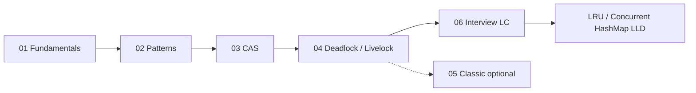
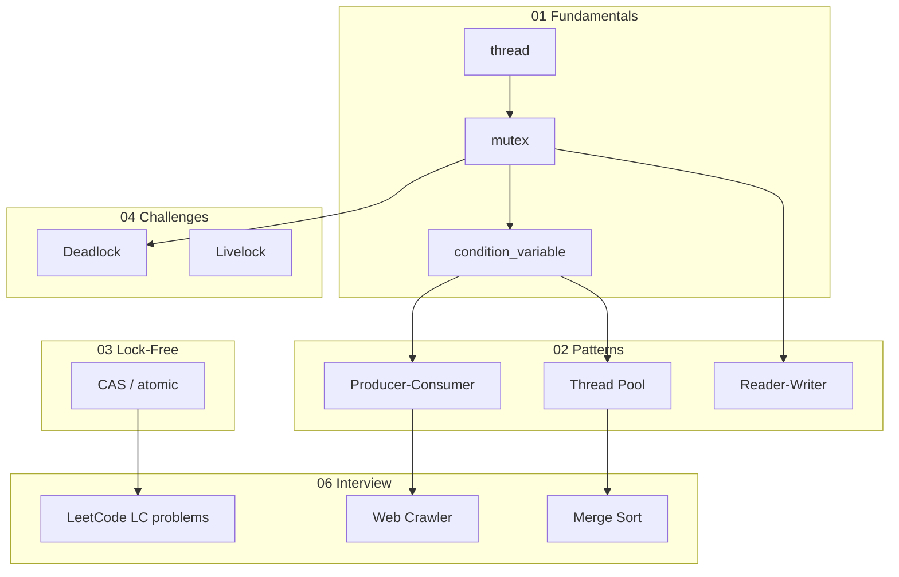

# Multi-Threading C++ — Learning Module

Educational C++ concurrency — **numbered folders** (01→06), har topic alag module, `compile.sh` + detailed docs.

> **Related LLD:** [LRU Cache](../LRU_Cache_LLD/) · [Concurrent HashMap](../Concurrent_HashMap_LLD/) · [TTL Cache](../Thread_Safe_Cache_with_TTL_LLD/) · [Rate Limiter](../Rate_Limiter_LLD/) · [Root README](../README.md#multi-threading-module)

---

## Module at a glance

| Tier | Folders | Kya cover hota hai |
|------|---------|------------------|
| **01** | Fundamentals | `thread`, mutex, locks, CV, semaphore |
| **02** | Concurrency Patterns | Signaling, thread pool, producer-consumer, RW lock |
| **03** | Lock-Free | Compare-and-swap, ABA, memory orders |
| **04** | Challenges | Deadlock, livelock |
| **05** | Classic Problems | Legacy single-file demos |
| **06** | Interview Problems | **10 LeetCode / interview modules** |

**Cheat sheet:** [`assets/imp_multi_threading_concepts.png`](./assets/imp_multi_threading_concepts.png)

---

## Folder structure

```
Multi_threading_C++/
├── README.md
├── .clangd
├── assets/
│   └── imp_multi_threading_concepts.png
├── scripts/
│   ├── build_all.sh                 # poore module ka build
│   └── build_interview_problems.sh  # sirf 06_Interview_Problems
│
├── 01_Fundamentals/                 # 9 × .cpp
├── 02_Concurrency_Patterns/
│   ├── Signaling_Pattern/
│   ├── Thread_Pool_Pattern/
│   ├── Producer_Consumer_Pattern/
│   └── Reader_Writer_Pattern/
├── 03_Lock_Free/
│   └── Compare_And_Swap/              # 6 demos + COMPLETE.md
├── 04_Concurrency_Challenges/
│   ├── Deadlock/                      # 7 demos
│   └── Livelock/                      # 6 demos
├── 05_Classic_Problems/
│   ├── Dining_Philosophers/
│   ├── Producer_Consumer_Legacy/
│   ├── Thread_Pool_Legacy/
│   ├── Deadlock_Legacy/
│   └── Double_Checked_Locking/
└── 06_Interview_Problems/             # INDEX: INTERVIEW_PROBLEMS_COMPLETE.md
    ├── common/CountingSemaphore.h
    ├── Print_in_Order/                # LC 1114
    ├── Print_FooBar_Alternately/      # LC 1115
    ├── Print_Zero_Even_Odd/           # LC 1116
    ├── Fizz_Buzz/                     # LC 411
    ├── Building_H2O/                 # LC 1117
    ├── Dining_Philosophers_LC1226/    # LC 1226
    ├── Web_Crawler_Multithreaded_LC1242/  # LC 1242
    ├── Barrier_Synchronization/
    ├── Bounded_Blocking_Queue/
    └── Merge_Sort/
```

---

## Quick navigation (01 → 06)

| Step | Folder | README | Deep guide |
|------|--------|--------|------------|
| **01** | [`01_Fundamentals/`](./01_Fundamentals/) | [README](./01_Fundamentals/README.md) | 9 starter `.cpp` files |
| **02** | [`02_Concurrency_Patterns/`](./02_Concurrency_Patterns/) | [README](./02_Concurrency_Patterns/README.md) | — |
| → | [`Signaling_Pattern/`](./02_Concurrency_Patterns/Signaling_Pattern/) | [README](./02_Concurrency_Patterns/Signaling_Pattern/README.md) | [COMPLETE](./02_Concurrency_Patterns/Signaling_Pattern/SIGNALING_PATTERN_COMPLETE.md) |
| → | [`Thread_Pool_Pattern/`](./02_Concurrency_Patterns/Thread_Pool_Pattern/) | [README](./02_Concurrency_Patterns/Thread_Pool_Pattern/README.md) | [COMPLETE](./02_Concurrency_Patterns/Thread_Pool_Pattern/THREAD_POOL_PATTERN_COMPLETE.md) |
| → | [`Producer_Consumer_Pattern/`](./02_Concurrency_Patterns/Producer_Consumer_Pattern/) | [README](./02_Concurrency_Patterns/Producer_Consumer_Pattern/README.md) | [COMPLETE](./02_Concurrency_Patterns/Producer_Consumer_Pattern/PRODUCER_CONSUMER_PATTERN_COMPLETE.md) |
| → | [`Reader_Writer_Pattern/`](./02_Concurrency_Patterns/Reader_Writer_Pattern/) | [README](./02_Concurrency_Patterns/Reader_Writer_Pattern/README.md) | [COMPLETE](./02_Concurrency_Patterns/Reader_Writer_Pattern/READER_WRITER_PATTERN_COMPLETE.md) |
| **03** | [`03_Lock_Free/`](./03_Lock_Free/) | [README](./03_Lock_Free/README.md) | [CAS COMPLETE](./03_Lock_Free/Compare_And_Swap/COMPARE_AND_SWAP_COMPLETE.md) |
| **04** | [`04_Concurrency_Challenges/`](./04_Concurrency_Challenges/) | [README](./04_Concurrency_Challenges/README.md) | [Deadlock](./04_Concurrency_Challenges/Deadlock/DEADLOCK_COMPLETE.md) · [Livelock](./04_Concurrency_Challenges/Livelock/LIVELOCK_COMPLETE.md) |
| **05** | [`05_Classic_Problems/`](./05_Classic_Problems/) | [README](./05_Classic_Problems/README.md) | legacy monoliths |
| **06** | [`06_Interview_Problems/`](./06_Interview_Problems/) | [README](./06_Interview_Problems/README.md) | [**FULL INDEX**](./06_Interview_Problems/INTERVIEW_PROBLEMS_COMPLETE.md) |

---

## 06 — Interview problems (complete list)

| LC # | Problem | Folder | Quick run |
|------|---------|--------|-----------|
| 1114 | Print in Order | [`Print_in_Order/`](./06_Interview_Problems/Print_in_Order/) | `./bin/01_problem_overview` |
| 1115 | Print FooBar Alternately | [`Print_FooBar_Alternately/`](./06_Interview_Problems/Print_FooBar_Alternately/) | `./bin/01_semaphore_solution` |
| 1116 | Print Zero Even Odd | [`Print_Zero_Even_Odd/`](./06_Interview_Problems/Print_Zero_Even_Odd/) | `./bin/01_condition_variable` |
| 411 | Fizz Buzz Multithreaded | [`Fizz_Buzz/`](./06_Interview_Problems/Fizz_Buzz/) | `./bin/04_condition_variable` |
| 1117 | Building H2O | [`Building_H2O/`](./06_Interview_Problems/Building_H2O/) | `./bin/01_bond_molecules` |
| 1226 | Dining Philosophers | [`Dining_Philosophers_LC1226/`](./06_Interview_Problems/Dining_Philosophers_LC1226/) | `./bin/01_problem_overview` |
| 1242 | Web Crawler Multithreaded | [`Web_Crawler_Multithreaded_LC1242/`](./06_Interview_Problems/Web_Crawler_Multithreaded_LC1242/) | `./bin/03_multithreaded_crawl` |
| — | Barrier + CountDownLatch | [`Barrier_Synchronization/`](./06_Interview_Problems/Barrier_Synchronization/) | `./bin/01_barrier_demo` |
| — | Bounded blocking queue | [`Bounded_Blocking_Queue/`](./06_Interview_Problems/Bounded_Blocking_Queue/) | `./bin/01_producer_consumer_demo` |
| — | Multi-threaded merge sort | [`Merge_Sort/`](./06_Interview_Problems/Merge_Sort/) | `./bin/06_compare_timings` |

Har folder mein: `compile.sh`, `README.md`, numbered `0*.cpp` demos.

---

## Build

### Poora module

```bash
cd Multi_threading_C++
./scripts/build_all.sh
```

### Sirf interview problems (06)

```bash
./scripts/build_interview_problems.sh
```

### Manual highlights

```bash
# Foundations
cd 01_Fundamentals && ./compile.sh && ./bin/lessson_1_join

# Patterns
cd 02_Concurrency_Patterns/Signaling_Pattern && ./compile.sh && ./bin/01_condition_variable_basics
cd 02_Concurrency_Patterns/Producer_Consumer_Pattern && ./compile.sh && ./bin/01_single_producer_single_consumer

# Lock-free
cd 03_Lock_Free/Compare_And_Swap && ./compile.sh && ./bin/01_what_is_cas

# Challenges
cd 04_Concurrency_Challenges/Deadlock && ./compile.sh && ./bin/01_coffman_four_conditions
cd 04_Concurrency_Challenges/Livelock && ./compile.sh && ./bin/01_what_is_livelock

# Interview (pick any)
cd 06_Interview_Problems/Fizz_Buzz && ./compile.sh && ./bin/04_condition_variable
cd 06_Interview_Problems/Dining_Philosophers_LC1226 && ./compile.sh && ./bin/01_problem_overview
cd 06_Interview_Problems/Web_Crawler_Multithreaded_LC1242 && ./compile.sh && ./bin/03_multithreaded_crawl
cd 06_Interview_Problems/Merge_Sort && ./compile.sh && ./bin/06_compare_timings
```

**Prerequisites:** C++17, `-pthread`

```bash
g++ -std=c++17 -pthread file.cpp -o out && ./out
```

---

## Recommended learning path



| Phase | Path | Focus |
|-------|------|-------|
| 1 | `01_Fundamentals/` | thread, race, mutex, CV, semaphore |
| 2 | `02_Concurrency_Patterns/` | Signaling → Producer-Consumer → Thread Pool → RW |
| 3 | `03_Lock_Free/Compare_And_Swap/` | `compare_exchange`, ABA, memory order |
| 4 | `04_Concurrency_Challenges/` | Coffman, `std::lock`, livelock backoff |
| 5 | `06_Interview_Problems/` | LC 1114 → 1115 → 1116 → 411 → 1117 → 1226 → 1242 |
| 6 | LLD projects | [LRU](../LRU_Cache_LLD/), [Concurrent HashMap](../Concurrent_HashMap_LLD/) |

**06 interview order (detail):**

```
Print_in_Order → Print_FooBar → Zero_Even_Odd → Fizz_Buzz → Building_H2O
    → Bounded_Queue → Barrier → Dining_Philosophers_LC1226 → Web_Crawler → Merge_Sort
```

**05 optional:** purane single-file demos — compare with 02/04/06 modular code.

---

## 01 — Fundamentals (file index)

| # | File | Topic |
|---|------|-------|
| 1 | `lessson_1_join.cpp` | `std::thread`, `join`, `detach` |
| 2 | `race_condition_and_synchronization.cpp` | data race → mutex |
| 3 | `lesson_2_locks_and_mutex.cpp` | basic mutex |
| 4 | `types_of_locks.cpp` | `lock_guard`, `unique_lock`, `try_lock` |
| 5 | `lock_mechanism.cpp` | RAII, `std::lock()` |
| 6 | `lesson_3.cpp` | `condition_variable` |
| 7 | `semaphor.cpp` | semaphore, connection pool |
| 8 | `execution_time_of_code.cpp` | `chrono` benchmark |
| 9 | `Thread_Safe_Injection.cpp` | thread-safe DI |

---

## Interview checklist

- [ ] Race condition vs data race vs deadlock vs livelock
- [ ] `lock_guard` vs `unique_lock` — kab kaunsa?
- [ ] `condition_variable` — kyun `unique_lock`? `notify_one` vs `notify_all`
- [ ] Producer–consumer — bounded buffer, backpressure
- [ ] Thread pool — thread reuse vs per-task thread
- [ ] CAS — `compare_exchange` strong/weak, ABA, version stamp
- [ ] `memory_order` — relaxed / acquire-release / seq_cst
- [ ] Ordered printing — LC 1114, 1115, 1116, 411 (semaphore vs CV)
- [ ] Building H2O — resource bonding (LC 1117)
- [ ] Dining philosophers — ordered forks, N−1 seats, try_lock (LC 1226)
- [ ] Web crawler — BFS + `visited` mutex + worker pool (LC 1242)
- [ ] Barrier vs CountDownLatch
- [ ] Apply: LRU `get()` mutex, lock striping in Concurrent HashMap

---

## Concept map



---

## Notes

- Filename typo `lessson_1_join.cpp` (double **s**) — intentional, `01_Fundamentals/` mein hai.
- `05_Classic_Problems/` = purane monolith `.cpp`; naya code `02_*`, `04_*`, `06_*` mein.
- `06` mein **Dining Philosophers LC1226** = LeetCode API; lamba demo `05_Classic_Problems/Dining_Philosophers/`.
- Yeh module **LLD systems nahi** — concurrency interview labs; production LLD ke liye root repo projects dekho.

---

## Future (optional)

- `std::async` / `future` / `promise` dedicated folder
- Lock-free Michael-Scott queue full implementation
