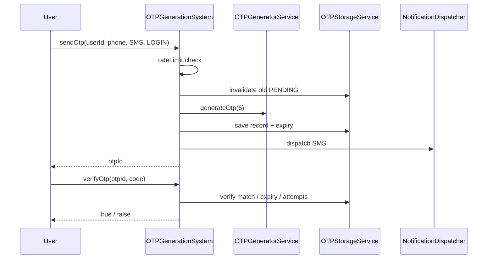

# OTP Generation System LLD

Generate, send, verify, and resend OTPs with expiry, retry limits, and rate limiting — common **auth / payment** interview problem.

## Quick run

```bash
cd OTP_Generation_System_LLD
./compile.sh
./otp_app
```

## Structure

```
OTP_Generation_System_LLD/
├── core/OTPGenerationSystem.h       # Facade
├── models/OTPRecord.h
├── enums/OTPChannel, OTPStatus, OTPPurpose
├── strategies/                      # Numeric / Alphanumeric OTP
├── channels/                        # SMS / Email (mock)
├── services/
│   ├── OTPGeneratorService
│   ├── OTPStorageService
│   ├── OTPVerificationService
│   ├── RateLimitService
│   └── NotificationDispatcher
├── main.cpp
└── problem_statement.md
```

## Flow



## Patterns

| Pattern | Class |
|---------|--------|
| Facade | `OTPGenerationSystem` |
| Strategy | `IOTPGeneratorStrategy`, `INotificationChannel` |
| Service | Storage, Verification, RateLimit |

## Interview extensions

- Hash OTP at rest (`SHA-256`)
- Redis + TTL
- OTP length / TTL per purpose
- Fraud detection on resend

## Related

- [`Rate_Limiter_LLD`](../Rate_Limiter_LLD/) — rate limiting deep dive
- [`Exception_Handling`](../Exception_Handling/) — `invalid_argument`, `runtime_error`
