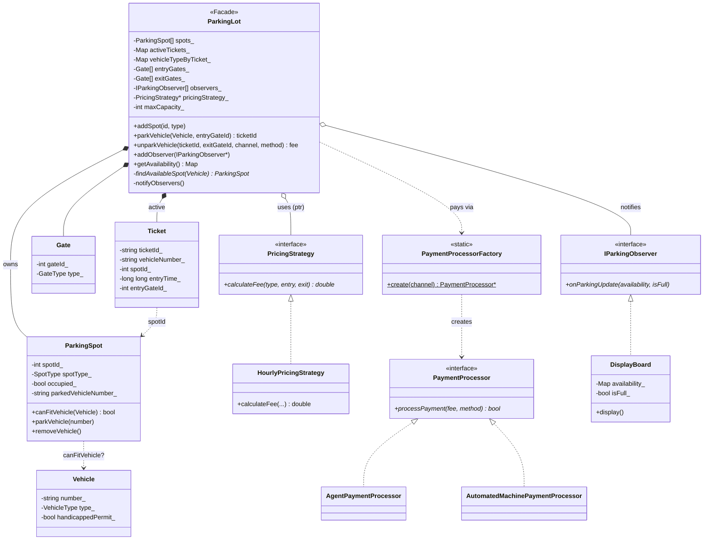
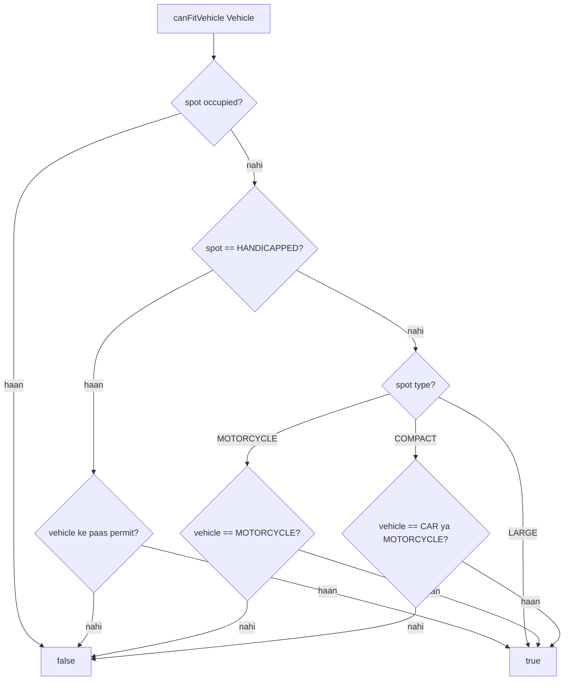
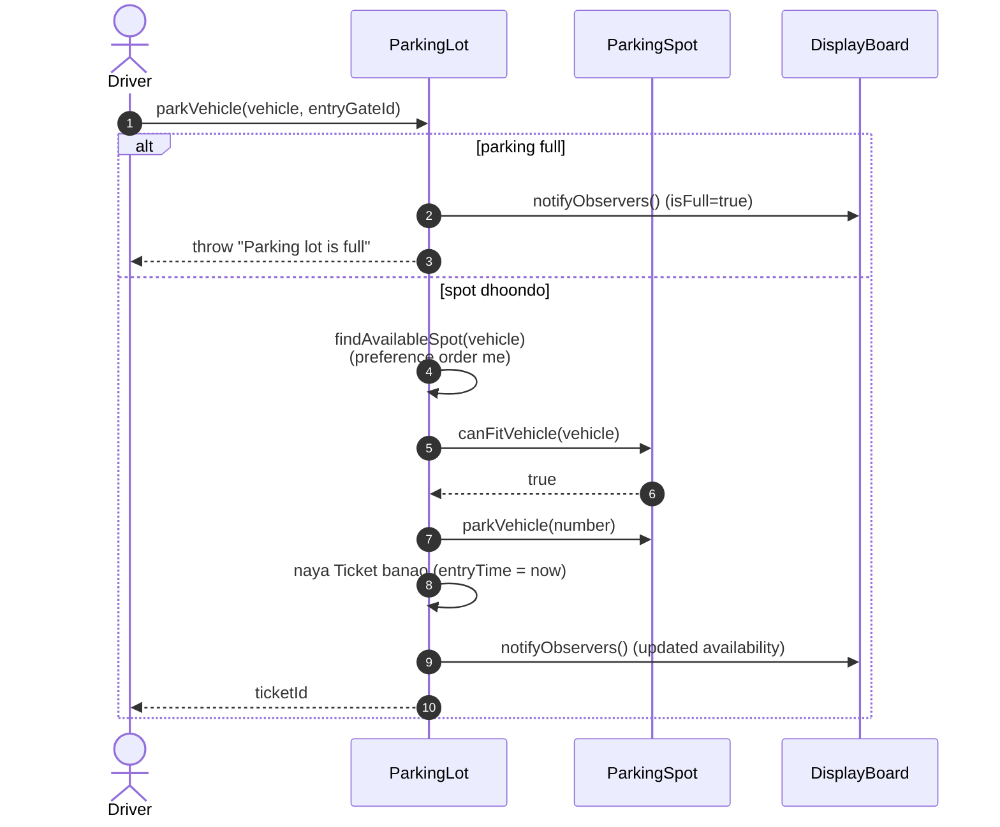
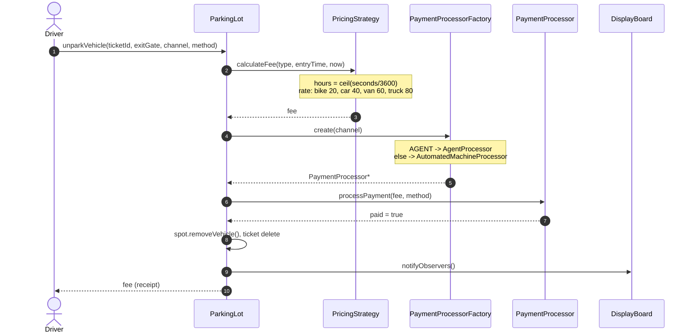

# Parking Lot System LLD — Design Diagrams

> Codebase padh ke banaya. Char patterns yahan ek saath: **Strategy** (pricing),
> **Factory** (payment processor), **Observer** (display board), aur **Facade** (ParkingLot).

---

## 1. Class Diagram

---

## 2. ⭐ Spot-fit matching — kaunsa vehicle kis spot me?

`ParkingSpot::canFitVehicle` decide karta hai. Handicapped spot ke liye permit chahiye,
warna vehicle type dekhta hai:

> **LARGE spot sab ko fit karta hai** (truck, van, car, bike). MOTORCYCLE spot sirf bike.
> COMPACT me car ya bike. Isliye `findAvailableSpot` ek **preference order** (`getSpotPreference`)
> follow karta hai — chhota vehicle pehle chhote spot me daalne ki koshish, taaki LARGE spot
> trucks ke liye bache rahein.

---

## 3. Sequence — parkVehicle (entry)

---

## 4. Sequence — unparkVehicle (exit + payment)

Yahan **Strategy + Factory dono** ek saath dikhte hain:

---

## 5. Design patterns summary

| Pattern | Kahan | Kyun |
|---|---|---|
| **Facade** | `ParkingLot` | ek darwaza; spots/tickets/gates/payment andar |
| **Strategy** | `PricingStrategy` → `HourlyPricingStrategy` | pricing formula swappable (flat/tiered/weekend aa sakte) |
| **Strategy** | `PaymentProcessor` → Agent / AutomatedMachine | payment channel ka apna behavior |
| **Factory** | `PaymentProcessorFactory` | `channel` enum → sahi processor, `new` ek jagah |
| **Observer** | `IParkingObserver` → `DisplayBoard` | availability badle to boards auto-update |
| **Service/SRP** | Spot, Ticket, Gate alag models | ek class ek kaam |

> ⚠ **Note:** `ParkingLot` raw pointers (`ParkingSpot*`, `Ticket*`, `Gate*`, `PricingStrategy*`)
> own karta hai aur destructor me `delete` karta hai. `PaymentProcessor` factory se `new` hota
> hai aur use ke turant baad `delete` — short-lived object. `unique_ptr` se ye safer ho sakta hai.
