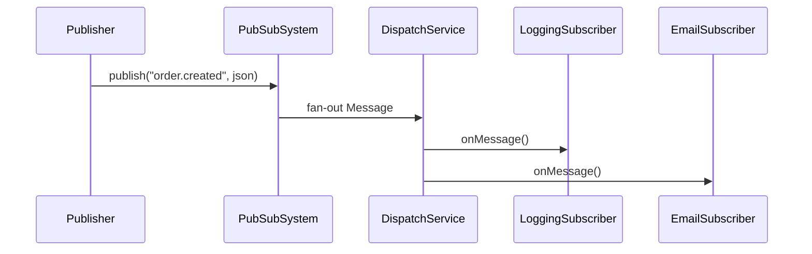

# Pub-Sub System LLD

In-memory **Publish–Subscribe** broker — topics, fan-out delivery, pluggable subscribers. Common interview + real-world pattern (Kafka, SNS, event-driven apps).

## Quick run (C++17)

```bash
cd Pub_Sub_System_LLD
./compile.sh
./pubsub_app
```

## Architecture

```
Publisher  -->  DispatchService  -->  ISubscriber (N)
                    ^
            SubscriptionService (topic -> subscribers)
```

## Structure

```
Pub_Sub_System_LLD/
├── core/PubSubSystem.h      # Facade
├── core/Publisher.h
├── core/ISubscriber.h
├── services/SubscriptionService.h
├── services/DispatchService.h
├── subscribers/Logging, EmailAlert, Analytics
├── models/Message.h
└── main.cpp
```

## Patterns

| Pattern | Usage |
|---------|--------|
| **Observer** | Subscribers notified on publish |
| **Facade** | `PubSubSystem` single entry |
| **Broker** | Decouples publisher from consumers |

## Flow



## Interview extensions

- Message queue + worker threads (true ASYNC)
- Dead letter queue on handler failure
- Partitioned topics, consumer groups
- At-least-once vs exactly-once delivery

## Related

- [`L12 Observer`](../L12%20Observer_Design_Pattern/) — pattern lesson
- [`OTP_Generation_System_LLD`](../OTP_Generation_System_LLD/) — notification fan-out idea
