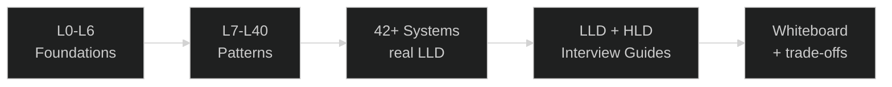

# 🎯 Low-Level Design (LLD) — Master Repository

<p align="center">
  
</p>

<p align="center">
  
  
  
  
  
</p>

> **Hinglish** me likha, **runnable C++17** pe focus. Theory se zyada working code — har system
> ka `main.cpp` demo, har folder me detailed comments, aur ab **poore LLD + HLD interview guides**.

---

## 🔥 Naya kya hai (Highlights)

| 🆕 | Kya | Kahan |
|---|---|---|
| 📘 **LLD Interview Guide** | 3000+ lines — OOP, SOLID, saare 23 GoF patterns (code ke saath), C++ deep dive, concurrency, 15+ classic problems, worked examples, 100+ Q&A | [`LLD_Interview.md`](./LLD_Interview.md) |
| 📕 **HLD Interview Guide** | 3800+ lines — RESHADED framework, scalability, DB/caching/sharding, CAP, 20+ system designs + **PART II advanced** (consensus, replication, geo, streaming...) | [`HLD_Interview.md`](../HLD/HLD_Interview.md) |
| 📐 **UML design diagrams** | 8 systems me `design_diagram.md` — Mermaid class + sequence + state diagrams (GitHub pe render hote) | [ATM](./ATM_LLD/design_diagram.md) · [Parking](./Parking_lot_system_LLD/design_diagram.md) · [Elevator](./Elevator_System_LLD/design_diagram.md) · [IRCTC](./IRCTC_LLD/design_diagram.md) · [Vending](./vending_machine_LLD/design_diagram.md) · [Car Rental](./Car_Rental_System_LLD/design_diagram.md) · [Meeting](./Meeting_Scheduler_LLD/design_diagram.md) · [LinkedIn](./Linkedin_LLD/design_diagram.md) |
| 📝 **Pattern breakdowns** | 38 projects me `design_patterns_used.md` — kaunsa pattern kyun, trade-offs, extensions | har major system folder me |

---

## 🧭 Quick Navigation

| Jao yahan | Kyun |
|---|---|
| [📘 LLD Interview Guide](./LLD_Interview.md) | patterns + OOP + C++ + classic problems — **interview prep** |
| [📕 HLD Interview Guide](../HLD/HLD_Interview.md) | system design — scalability, DB, distributed systems |
| [Quick Start](#-quick-start-5-min) | pehla compile 5 minute me |
| [Learning Paths](#-learning-paths) | fresher 8-week + full roadmap |
| [Lessons L0–L40](#-lessons--l0-to-l40) | structured course (foundations → patterns) |
| [System Projects](#-standalone-system-projects) | 42+ real LLD implementations |
| [Pattern Matrix](#-design-pattern-coverage-matrix) | kaunsa pattern kahan |
| [Compile & Run](#-compile--run-guide) | build instructions |
| [UML Hub](./docs/SYSTEM_CLASS_AND_SEQUENCE_DIAGRAMS.md) | class + sequence diagrams (docs) |
| [SOLID deep dive](./SOLID_HIGH_LOW_MODULES_DETAILED.md) | high/low modules, OCP, DIP |
| [Concurrency module](./Multi_threading_C++/README.md) | threads, pools, LC problems |



---

## ⚡ Quick Start (5 min)

```bash
# koi bhi system project uthao
cd Parking_lot_system_LLD
./compile.sh          # C++17 + -I. (har project me hai)
./parking_app         # demo chalao
```

| Step | Kaam | Time |
|---|---|---|
| 1 | Repo clone, VS Code / Cursor me kholo | 2 min |
| 2 | `cd Parking_lot_system_LLD && ./compile.sh && ./parking_app` | 1 min |
| 3 | `problem_statement.md` → `design_diagram.md` → `core/ParkingLot.h` padho | 5 min |
| 4 | Khud ek feature add karo (e.g. VIP spot, monthly pass) | 30–60 min |

> **Har major system me:** `problem_statement.md` (kya banana), `design_patterns_used.md`
> (patterns kyun), `design_diagram.md` (UML — kuch me), detailed Hinglish-commented code.

---

## 📊 Repository At A Glance

| Metric | Value |
|---|---|
| Lesson modules | **L0 – L40** (41 folders — foundations → patterns → hybrid LLDs) |
| Standalone system projects | **42+** |
| GoF design patterns covered | **23** (+ Null Object) |
| Projects with `design_patterns_used.md` | **38** |
| Projects with UML `design_diagram.md` | **8** (Mermaid) |
| Projects with `compile.sh` | **74** |
| Interview guides | **2** (`LLD_Interview.md` + `HLD_Interview.md`, 6800+ lines combined) |
| Primary language | **C++17** (header-heavy, in-memory, `main.cpp` demos) |
| Concurrency module | `Multi_threading_C++/` (threads, pools, LC 1114–1242) |

**Core philosophy:** problem statement padho → requirements → classes/interfaces design → code
→ phir 2–3 extensions khud try karo.

---

## 🎓 Interview Prep — Start Here

Do complete guides banaye gaye hain (web research + is repo ke code se linked):

### 📘 [`LLD_Interview.md`](./LLD_Interview.md) — Low-Level Design (3000+ lines)
- 7-step framework, OOP fundamentals (code ke saath), **SOLID** (bad vs good code)
- **Saare 23 GoF patterns** — creational/structural/behavioral, har ek: intent + C++ code + repo mapping
- Pattern comparisons (Strategy vs State, Factory vs Abstract Factory, Decorator vs Inheritance...)
- **C++ deep dive** (vtable, virtual dtor, RAII, smart pointers, Rule of 0/3/5, move semantics)
- **Concurrency** (mutex, deadlock, atomic, condition_variable, optimistic vs pessimistic)
- 15+ classic problems + **full worked examples** (Parking Lot + Splitwise complete code)
- 100+ rapid-fire Q&A, anti-patterns, cheat sheet, glossary, **mock interview transcript**

### 📕 [`HLD_Interview.md`](../HLD/HLD_Interview.md) — High-Level Design (3800+ lines)
- **RESHADED framework**, back-of-envelope estimation (latency numbers, formulas)
- Scalability, load balancing, **caching** (strategies, eviction, thundering herd, CDN)
- **Databases** (SQL/NoSQL, indexing, sharding, replication), **CAP + consistency**, message queues
- 20+ full system designs — TinyURL, Twitter, WhatsApp, Uber, YouTube, Dropbox, Payment...
- **PART II Advanced:** sharding deep, replication + conflict resolution, consensus (Raft),
  distributed transactions (2PC/Saga/TCC), probabilistic structures, geo-indexing, streaming,
  CDC, multi-region, security, SRE (SLO/error budget), NoSQL modeling, and more

> 💡 **Combine dono:** LLD = ek component ke andar ka design, HLD = poore system ka. Dono FAANG
> interviews me aate hain.

---

## 🛣️ Learning Paths

### Fresher Interview Path (8 weeks — curated minimum)
Repo me 40+ lessons + 42+ systems hain — **sab ek saath nahi karna**. Ye focused set follow karo:

| Week | Focus | Folders |
|---|---|---|
| 1 | OOP + UML | [L2 OOPS_1](./L2%20OOPS_1/), [L3 OOPS_2](./L3%20OOPS_2/), [L4 UML](./L4%20UML_Diagrams/) |
| 2 | SOLID + core patterns | [L5 SOLID_1](./L5%20SOLID_1/), [L6 SOLID_2](./L6%20SOLID_2/), [L8 Strategy](./L8%20Strategy_Design_Patterns/), [L9 Factory](./L9%20Factory_Design_Pattern/) |
| 3 | Classic LLD #1 | [Parking Lot](./Parking_lot_system_LLD/), [LRU Cache](./LRU_Cache_LLD/) |
| 4 | Classic LLD #2 | [Elevator](./Elevator_System_LLD/), [Rate Limiter](./Rate_Limiter_LLD/), [Vending](./vending_machine_LLD/) |
| 5 | Payments | [L23 Payment Gateway](./L23%20Payment_gateway_system_LLD/), [GPay](./GPay_LLD/), [Razorpay](./Razorpay_LLD/) |
| 6 | Coupon + split | [L24 Discount Coupon](./L24%20Discount_coupon_engine_LLD/), [Splitwise L31](./L31%20Splitwise_LLD/) |
| 7 | Patterns depth | [L10 Singleton](./L10%20Singleton_Design_Pattern/), [L12 Observer](./L12%20Observer_Design_Pattern/), [L13 Decorator](./L13%20Decorator_Design_Pattern/) |
| 8 | Mock + guides | 3 systems whiteboard + [`LLD_Interview.md`](./LLD_Interview.md) revise |

### Full roadmap (4 phases)
```
Phase 1 (Wk 1-2): Foundations  -> L0-L6 (OOP, UML, SOLID)
Phase 2 (Wk 3-5): Core patterns-> L7-L20 (Strategy, Factory, Singleton, Observer, Decorator...)
Phase 3 (Wk 6-8): Adv patterns -> L21-L40 (Proxy, Bridge, State, Composite, Command...)
Phase 4 (Wk 9-12): Systems     -> 42+ projects + LLD/HLD interview guides
```

---

## 🗂️ Folder Layout

Repo do halves me bata hua hai — `LLD/` (ye folder) aur `HLD/` (bhai folder). HLD prep ke liye
[`../HLD/`](../HLD/) dekho.

```
<repo root>/
├── README.md                    # repo hub (LLD + HLD dono ka intro)
├── LLD/                         # ← You are here
│   ├── README.md                # is LLD folder ka guide
│   ├── LLD_Interview.md         # 📘 LLD interview guide (3000+ lines)
│   ├── SOLID_HIGH_LOW_MODULES_DETAILED.md
│   ├── docs/                    # UML hub, pattern maps, SOLID, taxonomy
│   ├── books/  assets/  scripts/
│   ├── L0 Introduction/ … L40/  # 41 lesson folders
│   ├── ATM_LLD/ … WhatsApp_LLD/ # 42+ standalone system projects
│   └── Multi_threading_C++/     # concurrency labs + LC problems
└── HLD/                         # 📕 High-Level Design (system design)
    ├── README.md
    ├── HLD_Interview.md         # HLD interview guide (3800+ lines)
    └── 01..21 topic .md files   # per-topic deep dives with diagrams
```

---

## 📚 Lessons — L0 to L40

Structured course: **foundations → design patterns → hybrid LLD projects**. `🔷` = pattern demo,
`🏗️` = full LLD project, `📖` = theory.

| # | Module | Type | Focus |
|---|---|---|---|
| L0 | [Introduction](./L0%20Introduction/) | 📖 | LLD mindset, interview expectations |
| L1 | [Composition](./%20L1%20Composition/) | 📖 | Association → Aggregation → Composition → Dependency |
| L2 | [OOPS_1](./L2%20OOPS_1/) | 📖 | Encapsulation, Abstraction, RAII, smart pointers |
| L3 | [OOPS_2](./L3%20OOPS_2/) | 📖 | Inheritance, Polymorphism, virtual, diamond |
| L4 | [UML_Diagrams](./L4%20UML_Diagrams/) | 📖 | Class + sequence diagrams, Is-A vs Has-A |
| L5 | [SOLID_1](./L5%20SOLID_1/) | 📖 | SRP, OCP, LSP (violated vs fixed) |
| L6 | [SOLID_2](./L6%20SOLID_2/) | 📖 | ISP, DIP, LSP formal rules |
| L7 | [Document_Editor_LLD](./L7%20Document_Editor_LLD/) | 🏗️ | Strategy + Composite (Bad vs Good design) |
| L8 | [Strategy](./L8%20Strategy_Design_Patterns/) | 🔷 | Strategy — pluggable robot behaviors |
| L9 | [Factory](./L9%20Factory_Design_Pattern/) | 🔷 | Simple / Factory Method / Abstract Factory |
| L10 | [Singleton](./L10%20Singleton_Design_Pattern/) | 🔷 | Eager, locking, double-checked (thread-safe) |
| L11 | [Food_Delivery_LLD](./L11%20Food_Delivery_LLD/) | 🏗️ | Facade + Factory + Strategy (Tomato app) |
| L12 | [Observer](./L12%20Observer_Design_Pattern/) | 🔷 | YouTube channel subscribe/notify |
| L13 | [Decorator](./L13%20Decorator_Design_Pattern/) | 🔷 | Mario power-ups (stack behaviors) |
| L14 | [Notification_Engine_LLD](./L14%20Notification_Engine_LLD/) | 🏗️ | Singleton + Decorator + Observer + Strategy |
| L15 | [Command](./L15%20Command_Design_Pattern/) | 🔷 | Remote control, undo/redo |
| L16 | [Adapter](./L16%20Adapter_Design_Pattern/) | 🔷 | XML → JSON legacy adapter |
| L17 | [Facade](./L17%20Facade_Design_Pattern/) | 🔷 | Computer boot + Law of Demeter |
| L18 | [Spotify_LLD](./L18%20Spotify_LLD/) | 🏗️ | Facade + Singleton + Strategy + Adapter + Factory |
| L19 | [Composite](./L19%20Composite_Design_Pattern/) | 🔷 | File system (File leaf, Folder composite) |
| L20 | [Template_Method](./L20%20Template_Method_Pattern/) | 🔷 | ML training pipeline skeleton |
| L21 | [Proxy](./L21%20Proxy_Design_Pattern/) | 🔷 | Virtual / Protection / Remote proxy |
| L22 | [Chain of Responsibility (ATM Cash)](./L22%20Chain_of_responsiblity_patten%28ATM_Cash_Dispenser%20LLD%29/) | 🔷 | Note dispensing chain (₹500→200→100) |
| L23 | [Payment_gateway_system_LLD](./L23%20Payment_gateway_system_LLD/) | 🏗️ | Template Method + Strategy + Proxy + Factory |
| L24 | [Discount_coupon_engine_LLD](./L24%20Discount_coupon_engine_LLD/) | 🏗️ | Strategy + CoR + Singleton |
| L25 | [Bridge](./L25%20Bridge_design_pattern/) | 🔷 | Car × Engine (avoid class explosion) |
| L26 | [Blinkit/Zepto Inventory](./L26%20Blinkit_or_Zepto_%28Inventory_Management%29_LLD/) | 🏗️ | Quick-commerce inventory + cart |
| L27 | [Tinder_LLD](./L27%20Tinder_LLD/) | 🏗️ | Matching, swipes, chat |
| L28 | [Builder](./L28%20Builder_design_pattern/) | 🔷 | Fluent + Director + Step builder |
| L29 | [Iterator](./L29%20Iterator_design_pattern/) | 🔷 | Custom iterators (list, tree, playlist) |
| L30 | [Flyweight](./L30%20Flyweight_design_pattern/) | 🔷 | Asteroids shared intrinsic state |
| L31 | [Splitwise_LLD](./L31%20Splitwise_LLD/) | 🏗️ | Facade + Strategy + debt simplification |
| L32 | [State](./L32%20State_design_pattern/) | 🔷 | Vending machine state machine |
| L33 | [Tic_Tac_Toe_LLD](./L33%20Tic_Tac_Toe_LLD/) | 🏗️ | Strategy + Observer + Factory |
| L34 | [Snake_ladder_LLD](./L34%20Snake_ladder_LLD/) | 🏗️ | Strategy + Bridge + Factory + Observer |
| L35 | [Mediator](./L35%20Mediator_design_pattern/) | 🔷 | Chat room mediator |
| L36 | [Prototype](./L36%20Prototype_design_pattern/) | 🔷 | Clone expensive NPC templates |
| L37 | [Chess_LLD](./L37%20Chess_LLD/) | 🏗️ | Singleton + Strategy + Mediator + Factory |
| L38 | [Visitor](./L38%20Visitor_design_pattern/) | 🔷 | File system operations (add ops, not classes) |
| L39 | [Memento](./L39%20Memento_design_pattern/) | 🔷 | DB transaction commit/rollback |
| L40 | [Null Object & Antipatterns](./L40%20Null_object_pattern_and_Antipatterns/) | 📖 | Null Object + common antipatterns |

---

## 🏗️ Standalone System Projects

42+ real LLD implementations. `📐` = has UML `design_diagram.md`, `📝` = has `design_patterns_used.md`.

### 💳 Payments & Fintech
| System | Patterns | Docs | Build |
|---|---|---|---|
| [GPay_LLD](./GPay_LLD/) 📝 | Facade, Strategy (bank/wallet rail), Factory, compensating txn | UPI P2P, QR, request money | `./compile.sh && ./gpay_app` |
| [Razorpay_LLD](./Razorpay_LLD/) 📝 | Facade, Template Method, Strategy, idempotency | order→capture→webhook→refund | `./compile.sh && ./razorpay_app` |
| [Ecommerce_Cart_Checkout_LLD](./Ecommerce_Cart_Checkout_LLD/) 📝 | Facade, Strategy, Factory, reservation saga | cart→coupon→pay→order | `./compile.sh && ./ecommerce_checkout_app` |
| [Stock_Exchange_LLD](./Stock_Exchange_LLD/) 📝 | Facade, Factory, matching engine | order book, price-time match | `./compile.sh && ./stock_exchange_app` |

### 🎫 Booking & Scheduling
| System | Patterns | Notes | Build |
|---|---|---|---|
| [IRCTC_LLD](./IRCTC_LLD/) 📐📝 | Facade, Factory, per-run mutex | segment seat reuse, concurrency | `./compile.sh && ./irctc_app` |
| [Movie_Ticket_Booking_System](./Movie_Ticket_Booking_System/) 📝 | Facade, Strategy, Factory | BookMyShow-style | `g++ -std=c++17 main.cpp -o movie_ticket_app` |
| [OYO_Hotel_Booking_LLD](./OYO_Hotel_Booking_LLD/) 📝 | Facade, Strategy | date-range availability | `./compile.sh && ./oyo_hotel_app` |
| [Meeting_Scheduler_LLD](./Meeting_Scheduler_LLD/) 📐📝 | Facade, Strategy, Observer | mutual free slots, conflict | `./compile.sh && ./meeting_scheduler_app` |
| [Airline_Management_System_LLD](./Airline_Management_System_LLD/) 📝 | Facade, Strategy, mutex | search/book/crew/refund | `./compile.sh && ./airline_app` |
| [Task_Scheduler_LLD](./Task_Scheduler_LLD/) 📝 | Facade, Strategy, Observer | delayed queue, worker pool, retry | `./compile.sh && ./task_scheduler_app` |

### 🚗 Marketplace & Location
| System | Patterns | Notes | Build |
|---|---|---|---|
| [Uber_LLD](./Uber_LLD/) | matching, fare, OTP, payment | richer ride flow | `g++ -std=c++17 main.cpp -o uber_app` |
| [Ride_sharing_app_LLD](./Ride_sharing_app_LLD/) | matching, pricing, GeoUtils | Uber/Ola-lite | `g++ -std=c++17 main.cpp -o ride_app` |
| [Car_Rental_System_LLD](./Car_Rental_System_LLD/) 📐📝 | Decorator, Factory, Observer, Strategy | vehicle lifecycle + add-ons | `g++ -std=c++17 main.cpp -o car_rental_app` |
| [Amazon_Locker_Service_LLD](./Amazon_Locker_Service_LLD/) 📝 | Facade, Strategy | deposit→OTP→pickup | `./compile.sh && ./amazon_locker_app` |
| [Parking_lot_system_LLD](./Parking_lot_system_LLD/) 📐📝 | Strategy, Factory, Observer | spot-fit, hourly pricing | `g++ -std=c++17 main.cpp -o parking_app` |

### 📱 Social & Communication
| System | Patterns | Notes | Build |
|---|---|---|---|
| [WhatsApp_LLD](./WhatsApp_LLD/) 📝 | Strategy (encryption), Decorator, Observer | 1:1+group, delete-for-everyone | `./compile.sh && ./whatsapp_app` |
| [Linkedin_LLD](./Linkedin_LLD/) 📐📝 | Facade, Observer, services | connections, feed, messaging | `g++ -std=c++17 main.cpp -o linkedin_app` |
| [Truecaller_LLD](./Truecaller_LLD/) 📐📝 | Facade, Strategy (spam scoring) | caller ID, spam, block | `./compile.sh && ./truecaller_app` |
| [Insta_reel_LLD](./Insta_reel_LLD/) 📝 | Facade, feed ranking | short video, follow graph | `cd "Insta_reel_LLD/yt reel architecture" && g++ -std=c++17 main.cpp -o reels_app` |
| [Pub_Sub_System_LLD](./Pub_Sub_System_LLD/) 📝 | Observer, broker (topic fan-out) | publish/subscribe | `./compile.sh && ./pubsub_app` |
| [Google_Docs_Collaborative_Editor_LLD](./Google_Docs_Collaborative_Editor_LLD/) 📝 | Facade, Observer, Memento | revisions, undo, live edit | `./compile.sh && ./collab_editor_app` |
| [OTP_Generation_System_LLD](./OTP_Generation_System_LLD/) 📝 | Facade, Strategy | SMS/Email, rate limit, expiry | `./compile.sh && ./otp_app` |

### 🗃️ Caches, Storage & Data
| System | Patterns | Notes | Build |
|---|---|---|---|
| [LRU_Cache_LLD](./LRU_Cache_LLD/) 📝 | Facade, Decorator (thread-safe) | map + list, O(1) | `g++ -std=c++17 -pthread main.cpp -o lru_cache_app` |
| [LFU_Cache_LLD](./LFU_Cache_LLD/) 📝 | Facade, Decorator | frequency buckets + minFreq | `./compile.sh && ./lfu_cache_app` |
| [Thread_Safe_Cache_with_TTL_LLD](./Thread_Safe_Cache_with_TTL_LLD/) 📝 | Reader-Writer lock (`shared_mutex`) | lazy expiry, eviction | `./compile.sh && ./cache_ttl_app` |
| [Concurrent_HashMap_LLD](./Concurrent_HashMap_LLD/) 📝 | Lock striping | parallel put/get | `./compile.sh && ./concurrent_hashmap_app` |
| [In_Memory_SQL_Database_LLD](./In_Memory_SQL_Database_LLD/) 📝 | Facade, service layer, validators | createTable/insert/query | `./compile.sh && ./sql_database_app` |
| [JSON_Parser_LLD](./JSON_Parser_LLD/) 📝 | Composite, recursive descent | parse → tree → print | `g++ -std=c++17 main.cpp -o json_parser_app` |
| [File_Manager_LLD](./File_Manager_LLD/) 📝 | Composite, Facade | mkdir/ls/cat/mv/cp/find | `./compile.sh && ./file_manager_app` |
| [Folder_File_System_LLD](./Folder_File_System_LLD/) | Composite | file/folder tree | `./compile.sh` |

### 🛠️ Infra & Utilities
| System | Patterns | Notes | Build |
|---|---|---|---|
| [Rate_Limiter_LLD](./Rate_Limiter_LLD/) 📝 | Strategy, Factory | token bucket, sliding window | `g++ -std=c++17 Main.cpp -o rate_limiter_app` |
| [LoadBalancer_LLD](./LoadBalancer_LLD/) 📝 | Strategy | round robin, least connections | `g++ -std=c++17 main.cpp -o load_balancer_app` |
| [Logger_LLD](./Logger_LLD/) 📝 | Singleton, CoR, Observer, Strategy | levels chain, appenders | `g++ -std=c++17 Main.cpp -o logger_app` |
| [URL_Shortner_LLD](./URL_Shortner_LLD/) 📝 | Strategy, Base62 encoding | shorten, resolve, analytics | `g++ -std=c++17 main.cpp -o url_shortner_app` |
| [ATM_LLD](./ATM_LLD/) 📐📝 | Facade, service layer, backtracking dispense | login→balance→withdraw | `g++ -std=c++17 main.cpp -o atm_app` |
| [Elevator_System_LLD](./Elevator_System_LLD/) 📐📝 | State machine, Strategy (scheduler) | LOOK algorithm, door safety | `g++ -std=c++17 main.cpp -o elevator_app` |
| [vending_machine_LLD](./vending_machine_LLD/) 📐📝 | State pattern | insert→select→dispense/refund | `g++ -std=c++17 main.cpp -o vending_app` |
| [Leave_Request_System_LLD](./Leave_Request_System_LLD/) 📝 | Chain of Responsibility | TL→Manager→HR→Director | `./compile.sh && ./leave_request_app` |

### 🎮 Games, Domain & Misc
| System | Patterns | Notes | Build |
|---|---|---|---|
| [CricBuzz_LLD](./CricBuzz_LLD/) 📝 | Facade, Strategy (commentary) | live scoreboard, chase | `./compile.sh && ./cricbuzz_app` |
| [LeetCode_LLD](./LeetCode_LLD/) 📝 | Facade, Strategy (code runner) | submit→judge→leaderboard | `./compile.sh && ./leetcode_app` |
| [Library_Management_System_LLD](./Library_Management_System_LLD/) 📝 | service layer, FineService | issue/return, fines | `g++ -std=c++17 main.cpp -o library_app` |
| [Exception_Handling](./Exception_Handling/) | C++ exceptions guide | [complete guide](./Exception_Handling/EXCEPTION_HANDLING_COMPLETE.md) + 14 demos | per-file |

---

## 🧩 Design Pattern Coverage Matrix

| Pattern | Category | Lessons | System projects |
|---|---|---|---|
| **Singleton** | Creational | L10, L14, L23 | Logger |
| **Factory Method** | Creational | L9, L11, L23, L33–34, L37 | GPay, Movie Ticket, Rate Limiter, IRCTC, Stock Exchange |
| **Abstract Factory** | Creational | L9 | — |
| **Builder** | Creational | L28 | — |
| **Prototype** | Creational | L36 | — |
| **Adapter** | Structural | L16, L18 | — |
| **Bridge** | Structural | L25, L34 | Logger (level × appender) |
| **Composite** | Structural | L7, L19 | JSON Parser, File Manager, Folder/File System |
| **Decorator** | Structural | L13, L14 | Car Rental (add-ons), WhatsApp, LRU |
| **Facade** | Structural | L11, L17, L18, L27, L31 | almost every `core/` (GPay, Truecaller, Ecommerce...) |
| **Flyweight** | Structural | L30 | — |
| **Proxy** | Structural | L21, L23 | — |
| **Chain of Responsibility** | Behavioral | L22, L24 | Logger, Leave Request |
| **Command** | Behavioral | L15 | — |
| **Iterator** | Behavioral | L29 | (STL) |
| **Mediator** | Behavioral | L35, L37 | Elevator (controller) |
| **Memento** | Behavioral | L39 | Google Docs (undo) |
| **Observer** | Behavioral | L12, L14, L31, L33–34 | Parking, Meeting, LinkedIn, Logger, Pub-Sub |
| **State** | Behavioral | L32 | Vending Machine, Elevator |
| **Strategy** | Behavioral | L8, L11, L18, L24, L31, L33 | Parking, Load Balancer, Rate Limiter, GPay, Truecaller, Pricing (many) |
| **Template Method** | Behavioral | L20, L23 | Razorpay |
| **Visitor** | Behavioral | L38 | — |
| **Null Object** | — | L40 | WhatsApp (`NoOpEncryptionService`) |

> Detailed pattern-per-project map: [`docs/PROJECT_DESIGN_PATTERNS.md`](./docs/PROJECT_DESIGN_PATTERNS.md)

---

## 📐 UML Diagrams

### In-repo Mermaid diagrams (GitHub pe render hote)
8 systems me `design_diagram.md` — class + sequence + state diagrams:

[ATM](./ATM_LLD/design_diagram.md) · [Parking Lot](./Parking_lot_system_LLD/design_diagram.md) ·
[Elevator](./Elevator_System_LLD/design_diagram.md) · [IRCTC](./IRCTC_LLD/design_diagram.md) ·
[Vending Machine](./vending_machine_LLD/design_diagram.md) · [Car Rental](./Car_Rental_System_LLD/design_diagram.md) ·
[Meeting Scheduler](./Meeting_Scheduler_LLD/design_diagram.md) · [LinkedIn](./Linkedin_LLD/design_diagram.md)

### Docs UML hub
[`docs/SYSTEM_CLASS_AND_SEQUENCE_DIAGRAMS.md`](./docs/SYSTEM_CLASS_AND_SEQUENCE_DIAGRAMS.md) —
multi-system class + sequence diagrams collection.

---

## ⚙️ Compile & Run Guide

### Prerequisites
- **Compiler:** `g++` / `clang++` with **C++17** (`-std=c++17`)
- **OS:** macOS, Linux, Windows (WSL recommended)
- **Threading:** `-pthread` for `Multi_threading_C++`, `LRU_Cache_LLD`, `LFU_Cache_LLD`, etc.

### Per-project (recommended)
```bash
cd <ProjectName>
./compile.sh        # har standalone project me hai — C++17 + -Wall -Wextra -I.
./<app_name>
```

### Manual
```bash
g++ -std=c++17 -Wall -Wextra -pthread -I. main.cpp -o app && ./app
```

### Build all systems
```bash
chmod +x scripts/build_all_systems.sh && ./scripts/build_all_systems.sh
```

### Non-standard entry files (dhyan do)
| Project | Entry | Binary |
|---|---|---|
| Logger_LLD | `Main.cpp` | `logger_app` |
| Rate_Limiter_LLD | `Main.cpp` | `rate_limiter_app` |
| Insta_reel_LLD | `yt reel architecture/main.cpp` | `reels_app` |
| LRU/LFU Cache | `main.cpp` (`-pthread`) | `lru_cache_app` / `lfu_cache_app` |

> Lesson folders (`L*`) me aksar header-only demos hain — specific `.cpp` compile karo `-std=c++17` se.

---

## 📁 Standard Project Structure

```
<ProjectName>/
├── core/              # Facade / orchestrator (client ka single entry)
├── models/            # domain objects (User, Order, ...)
├── services/          # business logic
├── enums/             # type-safe constants
├── strategies/        # (optional) pluggable algorithms
├── factories/         # (optional) object creation
├── observers/         # (optional) event listeners
├── utils/             # helpers (GeoUtils, Base62Encoder, ...)
├── main.cpp           # runnable demo (NOT production entry)
├── compile.sh         # one-command build
├── problem_statement.md      # kya banana hai
├── requirements.md           # FR + NFR
├── design_patterns_used.md   # patterns kyun + trade-offs
└── design_diagram.md         # UML (kuch projects me)
```

**Naming:** Classes PascalCase, interfaces `I` prefix, enums PascalCase type + UPPER_SNAKE values.

---

## 🎤 Interview Playbook (quick)

### 5-minute pitch template (har project)
```
1. Problem (30s)     — "Design X with features A, B, C"
2. Entities (1m)     — User, Order... + key enums
3. APIs (1m)         — 4-5 main facade methods
4. Patterns (1m)     — "Strategy for pricing because..."
5. Extensions (1m)   — "Repository pattern for persistence"
6. Trade-offs (30s)  — in-memory vs DB, consistency, scale
```

### High-frequency systems
⭐⭐⭐ Parking Lot · BookMyShow · Ecommerce Checkout · Splitwise · LRU Cache · Rate Limiter
⭐⭐ Elevator · Chess/Tic-Tac-Toe · Uber · WhatsApp · Load Balancer · Logger

### SOLID recall
**S** one class one job · **O** extend not modify · **L** child works where parent works ·
**I** small interfaces · **D** depend on abstractions

> **Full prep:** [`LLD_Interview.md`](./LLD_Interview.md) + [`HLD_Interview.md`](../HLD/HLD_Interview.md)

---

## 📖 Reference Materials

| Resource | Purpose |
|---|---|
| [`docs/Design_Patterns.md`](./docs/Design_Patterns.md) | GoF complete guide + repo links |
| [`docs/Design_Pattern_types.md`](./docs/Design_Pattern_types.md) | Creational/Structural/Behavioral taxonomy |
| [`docs/SOLID.md`](./docs/SOLID.md) | SOLID principles + violated vs fixed |
| [`docs/PROJECT_DESIGN_PATTERNS.md`](./docs/PROJECT_DESIGN_PATTERNS.md) | pattern-per-project map |
| [`docs/SYSTEM_CLASS_AND_SEQUENCE_DIAGRAMS.md`](./docs/SYSTEM_CLASS_AND_SEQUENCE_DIAGRAMS.md) | UML hub |
| [`SOLID_HIGH_LOW_MODULES_DETAILED.md`](./SOLID_HIGH_LOW_MODULES_DETAILED.md) | SRP/OCP/DIP deep dive |
| [`System_Design_theory.md`](../HLD/System_Design_theory.md) | HLD theory notes |
| [`Multi_threading_C++/README.md`](./Multi_threading_C++/README.md) | concurrency: threads, pools, LC 1114–1242 |
| [`books/`](./books/) | Gang of Four, DDIA PDFs |
| [`Exception_Handling/`](./Exception_Handling/) | C++ exception handling complete guide |

---

## 🧭 How To Use This Repo

1. **Naye ho?** → L0–L6 foundations, phir [`LLD_Interview.md`](./LLD_Interview.md) skim
2. **Pattern seekhna?** → relevant `L*` folder + `design_patterns_used.md`
3. **Interview prep?** → [`LLD_Interview.md`](./LLD_Interview.md) + [`HLD_Interview.md`](../HLD/HLD_Interview.md) + 5-7 systems ka code
4. **Ek system samajhna?** → `problem_statement.md` → `design_diagram.md` → `core/` → `main.cpp` run

**Per-project workflow:** `problem_statement.md` padho → classes whiteboard → `./compile.sh` →
3 interview Q khud answer karo (assumptions? best pattern? 10x scale pe kya toota?).

---

<p align="center">
  <b>C++17 · in-memory by design · Hinglish comments · interview-ready</b><br/>
  <i>Theory yahan, practice folders me. Ja ke crack kar de! 🚀</i>
</p>
