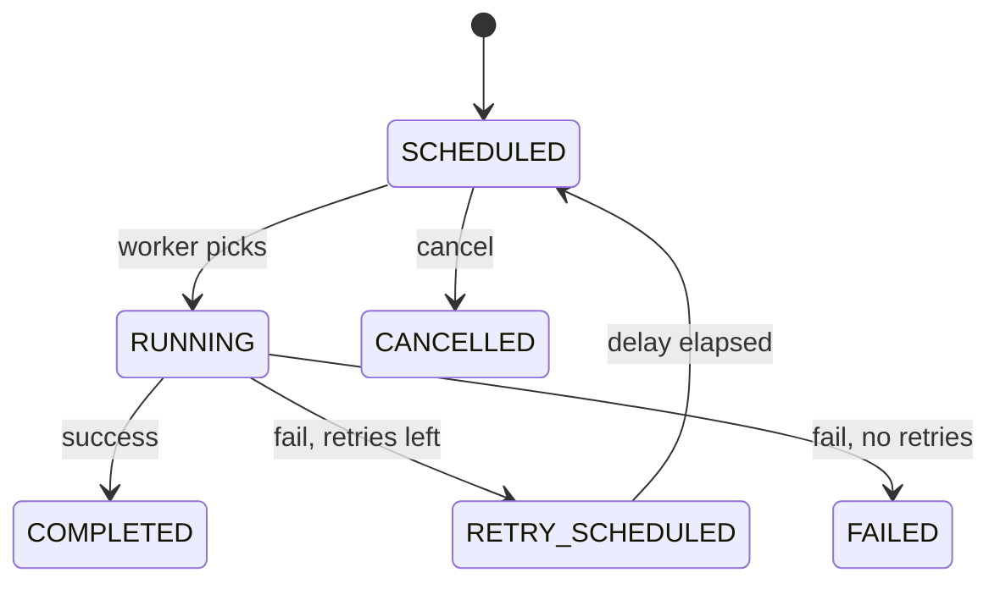

# Task / Job Scheduler LLD (C++17)

Background **job scheduler** with worker pool, delayed execution, priority scheduling, retries, and cancellation.

## Quick start

```bash
chmod +x compile.sh
./compile.sh
./task_scheduler_app
```

## Architecture

```
Task_Scheduler_LLD/
├── core/TaskSchedulerSystem.h      # Facade
├── models/Job.h
├── enums/JobStatus.h, JobPriority.h
├── services/
│   ├── JobRegistryService.h
│   ├── SchedulerService.h        # delayed min-heap → ready queue
│   ├── WorkerPoolService.h       # N threads + condition variable
│   └── RetryService.h
├── strategies/
│   ├── ISchedulingStrategy.h
│   ├── PrioritySchedulingStrategy.h
│   └── FifoSchedulingStrategy.h
├── observers/IJobObserver.h, ConsoleJobObserver.h
├── factories/JobFactory.h
├── utils/Clock.h                   # System + Simulated
└── main.cpp
```

## Main APIs

| API | Description |
|-----|-------------|
| `submitJob(name, task, priority, delayMs, maxRetries, retryDelayMs)` | Register + schedule |
| `start(workerCount)` | Start thread pool |
| `stop()` | Graceful shutdown |
| `cancelJob(jobId)` | Cancel if not terminal |
| `getJobStatus` / `getJob` | Inspect state |
| `advanceSimulatedTime(ms)` | Demo: fire delayed/retry jobs |
| `addObserver` | Lifecycle notifications |

## Job lifecycle



## Interview extensions

- Cron expression strategy (`0 */6 * * *`)
- Dead-letter queue for permanent failures
- Job dependencies (DAG executor)
- Persistence + at-least-once delivery
- Rate limit per job type
- Leader election for multi-node scheduler
