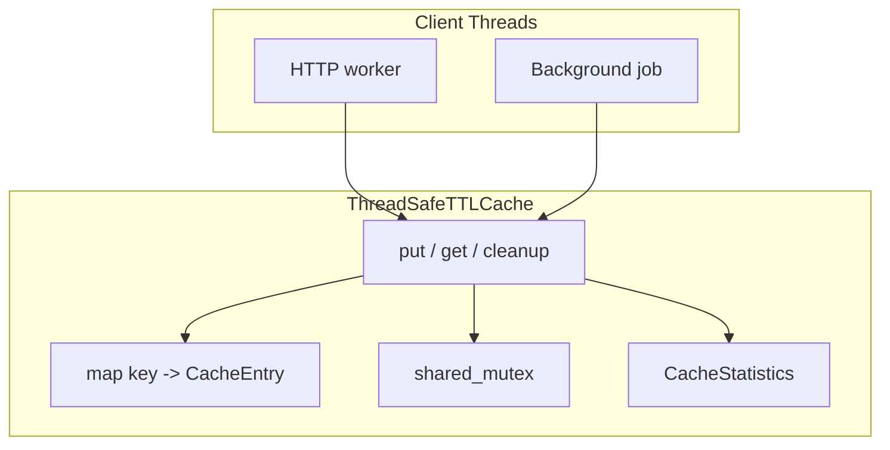
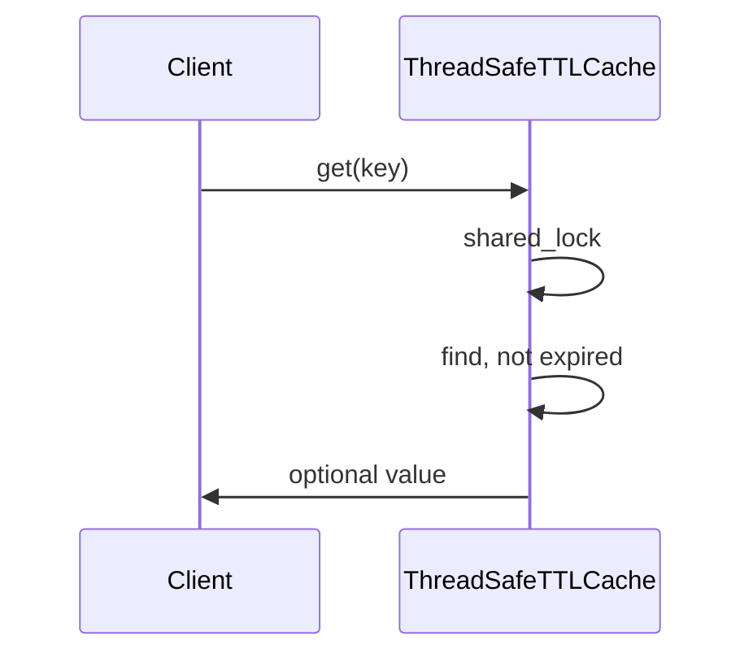
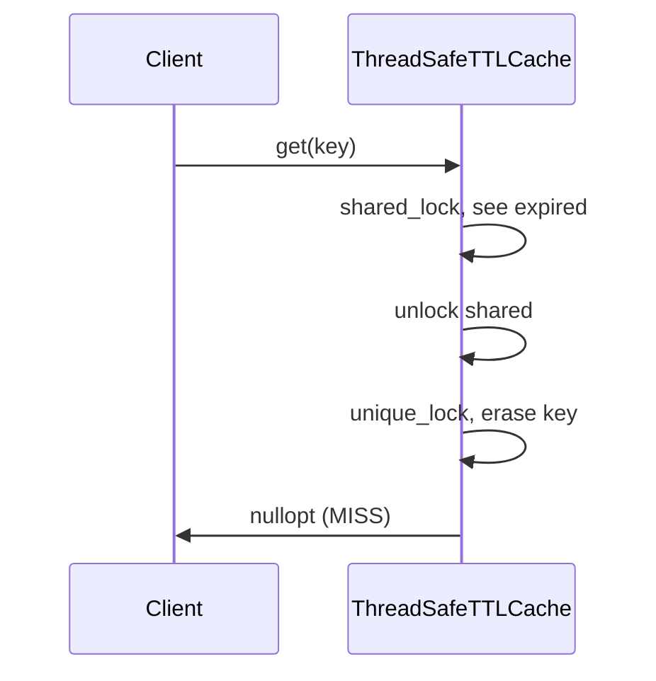

# Thread-Safe Cache with TTL — Complete Design (C++17)

> **Code:** [`core/ThreadSafeTTLCache.h`](./core/ThreadSafeTTLCache.h) · **Run:** `./cache_ttl_app`

---

## 1. Problem definition

Build a **process-local cache**:

- Keys map to string values (generalize to template later).
- Each key has **TTL** — automatic invalidation after `ttl_seconds`.
- **Many threads** call `get` / `put` without data races.
- Optional **capacity limit** — evict when full.

**Not in scope (v1):** Distributed cache (Redis), persistence to disk, serialization over network.

---

## 2. System overview



### `CacheEntry`

| Field | Type | Meaning |
|-------|------|---------|
| `value` | `string` | Cached payload |
| `expires_at` | `time_point` | Absolute expiry (steady_clock) |

`isExpired()` = `now >= expires_at`

---

## 3. Concurrency challenges (detailed)

### Challenge 1: Stale read race

**Problem:** Thread A reads after TTL passed but before entry removed — returns stale value?

**Fix:**

```cpp
shared_lock lock(mtx);
if (!entry.isExpired()) return entry.value;
// else treat as miss
```

Clock read under same lock as value read → **consistent snapshot**.

---

### Challenge 2: Put–cleanup race

**Problem:** Cleanup erases key while another thread `put` same key.

**Fix:** Both use **`unique_lock`** for map mutation — serialized.

Order preserved: either cleanup then put, or put then cleanup — no corrupt map structure.

---

### Challenge 3: Concurrent put race

**Problem:** Two threads `put("k", ...)` — lost update?

**Fix:** `put` holds `unique_lock` entire upsert — last writer wins (defined behavior).

---

### Challenge 4: Read during modification

**Problem:** `get` while `put` resizes map?

**Fix:**

- Valid reads: `shared_lock` (multiple concurrent).
- Writes: `unique_lock` blocks new shared locks until done.

**Lazy erase path:** `get` sees expired under shared lock → release → `unique_lock` re-check + erase (double-checked pattern).

```text
shared: find key, expired?
  yes -> unlock shared
  unique: find again, still expired? erase, return miss
```

Prevents erase under shared lock (undefined with `std::map`).

---

## 4. State machine (per key)

```text
MISSING --put--> ACTIVE --time--> EXPIRED --get/cleanup--> REMOVED
                    ^                    |
                    +-------put----------+ (refresh TTL + value)
```

---

## 5. Synchronization strategies (comparison)

| Approach | Pros | Cons |
|----------|------|------|
| **Coarse `mutex`** | Simple | Reads serialized |
| **`shared_mutex` (chosen)** | Parallel reads | Writer blocks all readers |
| **Striped locks** | Higher throughput | Complex key→shard hash |
| **ConcurrentHashMap + lazy cleanup** | Java style | C++ no std concurrent map |

**This repo:** Approach 1 upgraded to **`shared_mutex`** (reader-writer).

---

## 6. Eviction policy

When `store_.size() >= max_entries_`:

1. `cleanupExpiredLocked()` — free dead slots.
2. If still full → evict key with **earliest** `expires_at` (approximate LRU by expiry).

**Interview:** Can swap for true LRU list like [`LRU_Cache_LLD`](../LRU_Cache_LLD/).

---

## 7. API walkthrough

### `put(key, value, ttl_seconds)`

```text
unique_lock
evictIfNeededLocked()
store_[key] = { value, now + ttl }
stats.put++
```

### `get(key)`

```text
shared_lock -> find -> not expired? return value (HIT)
              -> expired? stats.expired_on_get, unlock
unique_lock -> lazy erase if still expired (MISS)
```

### `cleanupExpired()`

```text
unique_lock
scan map, erase expired
return count removed
```

---

## 8. Sequence diagrams

### Successful get (hit)



### Expired get (lazy removal)



---

## 9. `main.cpp` demos

| Demo | Proves |
|------|--------|
| 1 Basic TTL | Expiry after sleep |
| 2 Concurrent reads | `shared_lock` parallel |
| 3 Concurrent puts | Write serialization |
| 4 cleanup vs get | No crash under races |
| 5 Capacity | Eviction when full |

---

## 10. Interview Q&A

**Q: Why `steady_clock` not `system_clock`?**  
TTL durations immune to wall-clock adjustments (NTP jump).

**Q: Lazy vs proactive cleanup?**  
Lazy = less CPU, memory holds expired until touch. Proactive = bounded memory, background cost.

**Q: Thundering herd on expiry?**  
Many threads miss together → recompute once with `singleflight` pattern (extension).

**Q: `shared_mutex` downside?**  
Writer starvation possible — reader-heavy caches OK.

**Q: Distributed TTL cache?**  
Add version vector, Redis `SETEX`, or Hazelcast; this LLD is single-process.

---

## 11. Extensions

- Background `jthread` / thread periodic `cleanupExpired()`
- Sliding TTL on access (`get` refreshes expiry)
- Sharded `unordered_map` + per-shard mutex
- Record `last_access` for true LRU + TTL combined
- Interface `ICache` for testing mocks

---

## 12. Related study

- [`../Multi_threading_C++/Concurrency_Patterns/Reader_Writer_Pattern/`](../Multi_threading_C++/Concurrency_Patterns/Reader_Writer_Pattern/)
- [`../LRU_Cache_LLD/`](../LRU_Cache_LLD/)
- [`../Rate_Limiter_LLD/`](../Rate_Limiter_LLD/)
