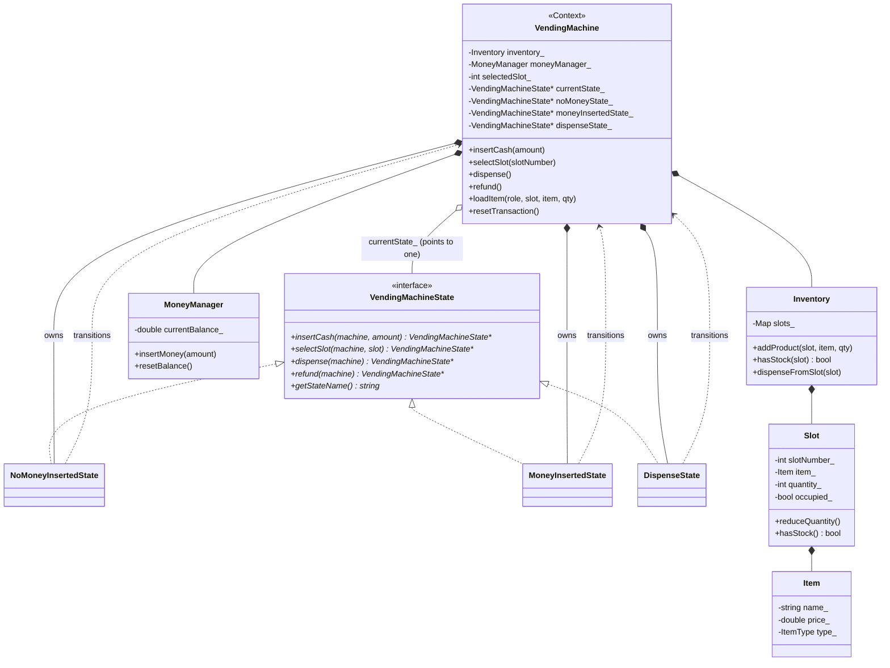
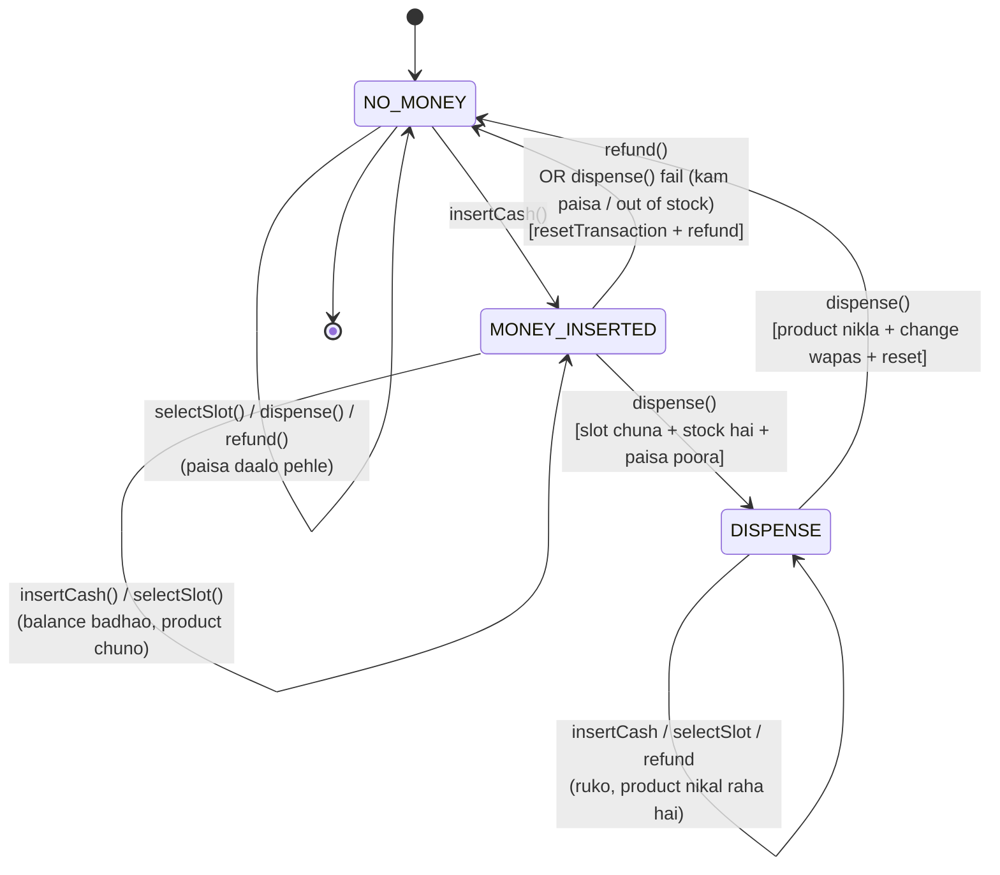
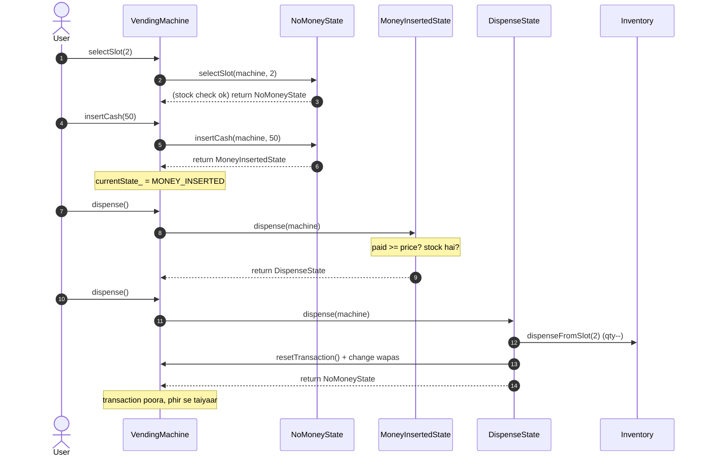
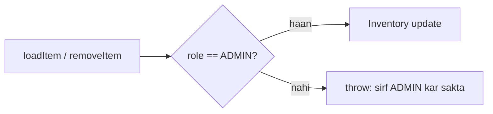

# Vending Machine LLD — Design Diagrams

> Codebase padh ke banaya. Yeh **State Design Pattern** ka textbook example hai — machine
> ka behavior uske current state pe depend karta hai, aur har action machine ko agle state
> me le jaa sakti hai.

---

## 1. Class Diagram — State pattern structure

> **State pattern ka core:** har state ki 4 methods return type `VendingMachineState*` hai —
> yaani har action **agla state** lauta ti hai. `VendingMachine` bas
> `currentState_ = currentState_->action(this, ...)` karta hai. Machine ko `if (state == X)`
> jaisa koi bada switch likhne ki zaroorat nahi — behavior state object me hi hai.

---

## 2. ⭐⭐ State Transition Diagram — machine ka dil

**Har state ka har action pe response:**

| State \ Action | insertCash | selectSlot | dispense | refund |
|---|---|---|---|---|
| **NO_MONEY** | → MONEY_INSERTED | slot yaad, rahe NO_MONEY | ❌ "paisa daalo" | ❌ kuch nahi |
| **MONEY_INSERTED** | balance+, rahe | slot set, rahe | ✅ → DISPENSE / ❌ refund → NO_MONEY | 💵 → NO_MONEY |
| **DISPENSE** | ❌ ruko | ❌ ruko | 📦 nikalo → NO_MONEY | ❌ ab nahi |

---

## 3. Sequence — successful purchase

---

## 4. ⭐ Admin vs User — role guard

Product bharna/nikaalna sirf ADMIN kar sakta hai (paisa/dispense USER ke liye):

---

## 5. Design patterns summary

| Pattern | Kahan | Kyun |
|---|---|---|
| **State** | `VendingMachineState` → NoMoney / MoneyInserted / Dispense | behavior state pe depend; naya state add karna aasan, koi bada switch nahi |
| **Facade / Context** | `VendingMachine` | client sirf 4 actions jaanta hai; states andar |
| **Service layer** | `Inventory`, `MoneyManager` | stock aur paisa alag-alag zimmedari |
| **Role guard** | `requireAdmin()` | authorization ek jagah |

> ⭐ **State objects ek baar bante hain** (constructor me `new`, destructor me `delete`),
> aur reuse hote hain — har transition pe naya object nahi banta, bas pointer badalta hai.
> Isi liye states **stateless** hain (saara data `VendingMachine` context me).
> `VendingMachine` ki copy `= delete` hai (raw state pointers own karta hai — double-free se bachaav).
