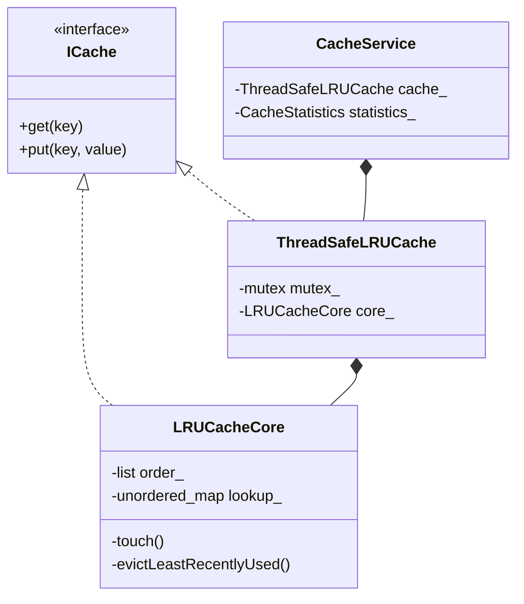
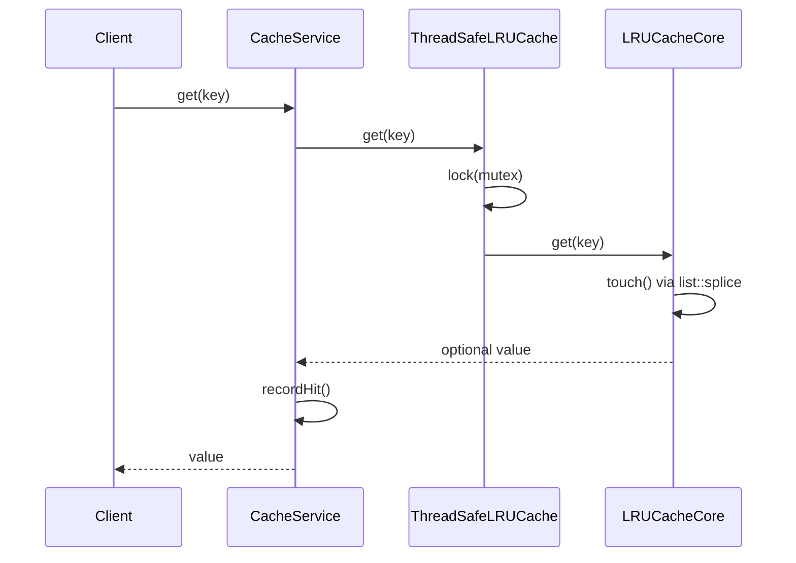

# Thread-Safe LRU Cache LLD

Interview-grade **Least Recently Used (LRU) cache** in C++17 — modular headers, mutex-based thread safety, hit/miss statistics, and concurrency stress demo.

> **UML diagrams:** [Class + Sequence diagrams (Section 18)](../SYSTEM_CLASS_AND_SEQUENCE_DIAGRAMS.md#18-thread-safe-lru-cache)

---

## Folder Structure

```
LRU_Cache_LLD/
├── cache/
│   ├── ICache.h                 # Cache interface
│   ├── LRUCacheCore.h           # O(1) LRU — hash map + std::list
│   └── ThreadSafeLRUCache.h     # Mutex decorator
├── config/
│   └── CacheConfig.h            # Capacity validation
├── core/
│   └── CacheService.h           # Facade + statistics
├── enums/
│   └── CacheOperationType.h
├── models/
│   └── CacheEntry.h
├── stats/
│   └── CacheStatistics.h        # Atomic hit/miss/eviction counters
├── utils/
│   └── ConcurrencyHelpers.h     # CyclicBarrier + CountDownLatch
├── .clangd                      # IDE: -std=c++17
├── main.cpp
├── problem_statement.md
└── requirements.md
```

---

## Architecture



---

## Key Sequence — Get (hit)



---

## Design Patterns

| Pattern | Class | Why |
|---------|-------|-----|
| **Facade** | `CacheService` | Single API + stats for clients |
| **Decorator** | `ThreadSafeLRUCache` | Adds locking without changing core LRU |
| **Interface** | `ICache` | Swap eviction policy later (LFU, TTL) |

---

## Data Structures

| Structure | Role | Complexity |
|-----------|------|------------|
| `std::unordered_map<Key, list::iterator>` | Key → node in O(1) | Average O(1) lookup |
| `std::list<CacheEntry>` | Recency order (front = MRU) | O(1) splice on access |
| `std::mutex` | Exclusive lock for all ops | Required because `get` mutates order |

---

## Build & Run

**Requires C++17** (`std::optional`).

```bash
cd LRU_Cache_LLD
g++ -std=c++17 -pthread main.cpp -o lru_cache_app
./lru_cache_app
```

---

## Demo Scenarios (`main.cpp`)

| Demo | What it shows |
|------|----------------|
| **Basic LRU** | Eviction when capacity exceeded, hit/miss |
| **Deterministic concurrency** | Two threads, interleaved put/get |
| **Stress test** | 16 threads × 500 ops, atomic stats |

---

## API Summary

| Method | Behavior |
|--------|----------|
| `get(key)` | Returns value; promotes key to MRU; records hit/miss |
| `put(key, value)` | Insert/update; evicts LRU if over capacity |
| `contains(key)` | Check existence (no recency change) |
| `remove(key)` | Delete entry |
| `clear()` | Empty cache |
| `getStatistics()` | Hits, misses, evictions, hit ratio |

---

## Complexity

| Operation | Average time |
|-----------|--------------|
| `get` | O(1) |
| `put` | O(1) |
| `remove` | O(1) |

---

## Interview Talking Points

1. **Why one mutex?** — `get()` updates recency (`list::splice`), so read-only shared lock is unsafe.
2. **Why not `shared_mutex`?** — Every `get` is a write to the list order.
3. **`list::splice`** — Moves node to front in O(1) without reallocation.
4. **Eviction** — Always `order_.back()` (least recently used).
5. **Extensions** — TTL per key, sharded locks, distributed cache (Redis).

---

## Related Docs

- [Problem Statement](./problem_statement.md)
- [Requirements](./requirements.md)
- [All System Diagrams](../SYSTEM_CLASS_AND_SEQUENCE_DIAGRAMS.md#18-thread-safe-lru-cache)
