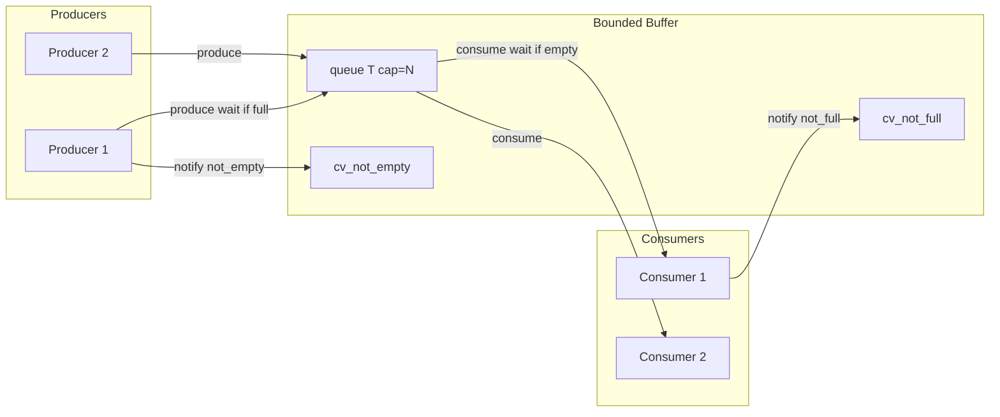

# Producer-Consumer Pattern — Complete Guide (C++17)

> **Pehle padho:** [`README.md`](./README.md)  
> **Core class:** [`BoundedBuffer.h`](./BoundedBuffer.h)  
> **Run:** `./compile.sh` → `./bin/01_single_producer_single_consumer`

---

## Table of contents

1. [Pattern kya hai](#1-pattern-kya-hai)
2. [Kyun chahiye — advantages](#2-kyun-chahiye--advantages)
3. [Architecture diagram](#3-architecture-diagram)
4. [BoundedBuffer.h — poora flow](#4-boundedbufferh--poora-flow)
5. [Teen zaroori conditions](#5-teen-zaroori-conditions)
6. [Signaling — 2 condition variables](#6-signaling--2-condition-variables)
7. [Variants SPSC / MPSC / SPMC / MPMC](#7-variants-spsc--mpsc--spmc--mpmc)
8. [Har demo — deep dive](#8-har-demo--deep-dive)
9. [Backpressure](#9-backpressure)
10. [Shutdown protocol](#10-shutdown-protocol)
11. [Manual vs class implementation](#11-manual-vs-class-implementation)
12. [vs Thread pool & Signaling](#12-vs-thread-pool--signaling)
13. [Bugs & mistakes](#13-bugs--mistakes)
14. [Interview Q&A](#14-interview-qa)

---

## 1. Pattern kya hai

**Producer** = data generate karke shared buffer mein daalta hai.  
**Consumer** = buffer se nikal kar process karta hai.  
**Bounded** = max size fixed — overflow par producer **wait** (block), underflow par consumer **wait**.

**Core idea:** Do stages ki **speed alag** ho sakti hai — buffer beech mein **shock absorber**.

---

## 2. Kyun chahiye — advantages

| # | Advantage | Example |
|---|-----------|---------|
| 1 | **Decouple rates** | Fast network download, slow disk write |
| 2 | **Burst handling** | 1000 requests/sec spike, consumer 200/sec — buffer soak |
| 3 | **Backpressure** | Buffer full → producer slow — system stable |
| 4 | **Parallel pipeline** | Stage1 produce + Stage2 consume overlap |
| 5 | **Memory bound** | Capacity × item size = max RAM |

**Bina buffer:** Producer ko consumer ka wait karna padta (tight coupling) ya data drop.

---

## 3. Architecture diagram



---

## 4. BoundedBuffer.h — poora flow

### `produce(T item)`

```text
1. unique_lock(mtx_)
2. cv_not_full_.wait until size < capacity_ OR shutdown_
3. if shutdown_ → return (no push)
4. push(move(item))
5. unlock (destructor)
6. cv_not_empty_.notify_one()
```

### `consume() → optional<T>`

```text
1. unique_lock(mtx_)
2. cv_not_empty_.wait until !empty OR shutdown_
3. if empty → return nullopt
4. pop front, move to local
5. cv_not_full_.notify_one()
6. return item
```

### `signal_shutdown()`

```text
shutdown_ = true
notify_all on BOTH CVs
```

Blocked producers/consumers wake, check shutdown, exit safely.

### Kyun `optional<T>`?

Consumer loop clean:

```cpp
while (auto x = buf.consume()) {
    use(*x);
}
// auto exit when shutdown + empty
```

---

## 5. Teen zaroori conditions

| # | Condition | Kaun wait | Predicate |
|---|-----------|-----------|-----------|
| 1 | **Full** | Producer | `size < capacity` |
| 2 | **Empty** | Consumer | `!empty` (or shutdown) |
| 3 | **Done** | Consumer exit | `empty && shutdown` |

Agar 3 handle nahi kiya → deadlock, busy-wait, ya infinite loop.

---

## 6. Signaling — 2 condition variables

### Kyun 1 CV kaafi nahi?

Ek CV par alag predicates confuse karte hain — kaun wake hua, kya check karna hai. **2 CV = 2 clear meanings:**

| CV | Meaning |
|----|---------|
| `cv_not_full` | "Producer, ab push kar sakte ho" |
| `cv_not_empty` | "Consumer, ab pop kar sakte ho" |

Har successful `produce` → `notify` **not_empty**  
Har successful `consume` → `notify` **not_full**

Full signaling guide: [`../Signaling_Pattern/SIGNALING_PATTERN_COMPLETE.md`](../Signaling_Pattern/SIGNALING_PATTERN_COMPLETE.md)

---

## 7. Variants SPSC / MPSC / SPMC / MPMC

| Variant | Producers | Consumers | Repo demo | Typical use |
|---------|-----------|-----------|-----------|-------------|
| **SPSC** | 1 | 1 | 01 | Simple pipeline |
| **MPSC** | Many | 1 | 02 | Log aggregation |
| **SPMC** | 1 | Many | 03 | Job queue workers |
| **MPMC** | Many | Many | (extend) | General queue |

**Thread safety:** Saari `produce`/`consume` same mutex — correctness easy, contention possible at high rate (then lock-free ring buffer advanced topic).

---

## 8. Har demo — deep dive

### 01 — SPSC (`01_single_producer_single_consumer.cpp`)

- Buffer cap 5, 10 items
- Consumer slower (150ms vs 100ms) → buffer kabhi 2–4 size
- Producer `signal_shutdown()` end

**Invariant:** At most 1 producer + 1 consumer touch buffer — simplest correctness proof.

---

### 02 — MPSC (`02_multiple_producers_one_consumer.cpp`)

- 2 producers × 5 items
- Mutex serializes pushes — **no lost items**
- Consumer until `nullopt`
- Order: interleaved IDs (101, 201, 102...)

**Advantage:** Many sources, one sink (logging).

---

### 03 — SPMC (`03_one_producer_multiple_consumers.cpp`)

- 12 items, 3 consumers
- `notify_one` per item — one consumer wins pop
- `atomic total_consumed` == 12 verify

**Advantage:** Parallel processing team.

**Note:** Same as thread pool workers eating from queue — different abstraction same sync.

---

### 04 — Backpressure (`04_buffer_full_and_empty_wait.cpp`)

- Cap **3**, consumer **late** (600ms)
- Producer prints "trying to produce" then **blocks** on full

**Lesson:** Bounded buffer = automatic throttle — no separate rate limiter code.

---

### 05 — Shutdown (`05_graceful_shutdown.cpp`)

- `string` jobs in buffer
- `signal_shutdown` after all produced
- Consumer drains — no orphan items

**Production:** Poison pill / sentinel value alternative to `optional` — same idea.

---

### 06 — Manual (`06_manual_dual_cv.cpp`)

Globals: `queue`, `cv_not_full`, `cv_not_empty`, `done`.

**Interview:** Whiteboard yahi likho — class optional.

Map to `BoundedBuffer` line-by-line for revision.

---

## 9. Backpressure

**Definition:** Downstream slow → upstream forced slow.

```text
Producer rate > Consumer rate
→ buffer fills
→ producer blocks on cv_not_full
→ effective producer rate ≤ consumer rate (average)
```

**Fayda:** OOM prevention, stable latency under load.

**Tune:** Capacity chhota = more backpressure, less buffering delay.

---

## 10. Shutdown protocol

### Correct order (repo 02, 05)

```text
1. Producers finish producing
2. producer join() threads
3. signal_shutdown()
4. consumer join() — drains optional nullopt exit
```

### Wrong

- Shutdown while producers still running → consumers exit early, items stuck
- Never shutdown → consumer infinite wait on empty

### `notify_all` on shutdown

Saare blocked consumers/producers wake to see `shutdown_`.

---

## 11. Manual vs class implementation

| Aspect | Manual (06) | BoundedBuffer class |
|--------|-------------|---------------------|
| Interview | Easy draw | Template syntax |
| Reuse | Copy-paste risk | One header |
| Type safety | Fixed `int` | Template `T` |
| Shutdown | `done` flag | `signal_shutdown()` |

Same logic — class = encapsulation + fewer globals.

---

## 12. vs Thread pool & Signaling

| Pattern | Focus |
|---------|-------|
| **Producer-Consumer** | **Data** buffer between stages |
| **Thread Pool** | **Execution** reuse; queue holds `function` |
| **Signaling** | **Mechanism** (CV) inside both |

Thread pool = producers enqueue, workers consume tasks.

---

## 13. Bugs & mistakes

| Bug | Result |
|-----|--------|
| Pop without wait on empty | Race, crash |
| Single CV both sides | Confusing wakeups |
| Forget notify after push/pop | Deadlock |
| Unbounded `queue` no wait | Memory blowup |
| Hold lock long in consumer | Producer starved |

---

## 14. Interview Q&A

**Q: Difference producer-consumer vs message queue?**  
Often same architecture; MQ adds persistence, network, routing.

**Q: Bounded vs unbounded queue?**  
Bounded = backpressure; unbounded needs memory monitoring.

**Q: Fake wake / spurious?**  
Always wait with predicate on size/empty.

**Q: Multiple consumers safe?**  
Yes if pop under one mutex — one item one consumer.

**Q: Lock-free ring buffer?**  
SPSC can be lock-free; MPMC harder — interview bonus topic.

---

**Related:** [`../../producer_consumer.cpp`](../../producer_consumer.cpp), [`../Signaling_Pattern/02_producer_consumer_signal.cpp`](../Signaling_Pattern/02_producer_consumer_signal.cpp)
